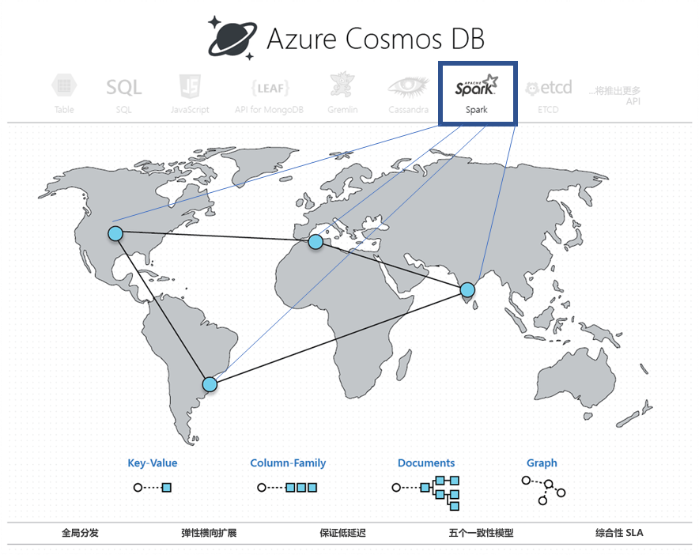

# Azure Cosmos DB Spark API（预览版）简介 

使用 Azure Cosmos DB 中的 Spark API 可以从 Apache Spark 针对 Azure Cosmos 帐户中存储的数据运行分析。

Azure Cosmos DB 中的 Spark API 原生支持在全局分布式 Cosmos 数据库中直接执行 Apache Spark 作业。 借助这些功能，开发人员、数据工程师和数据科学家可以使用 Azure Cosmos DB 作为灵活、可缩放且高效的数据平台来运行 **OLTP 和 OLAP/HTAP** 工作负荷。 

> [!NOTE]
> Azure Cosmos DB Spark API 目前以受限预览版提供。 若要注册预览版，请导航到[注册预览版](https://aka.ms/cosmos-spark-preview)页。 

Azure Cosmos DB 中的 Spark API 提供以下优势：

* 可以最快地获取有关分布在各地的用户和数据的见解。

* 可以简化解决方案的体系结构并降低[总拥有成本](total-cost-ownership.md) (TCO)。 只需在系统中安装最少量的数据处理组件，并可避免在不同的组件之间进行任何不必要的数据移动。

* 创建[安全性](secure-access-to-data.md)、[合规性](compliance.md)和审核边界以将所有数据纳入管理。

* 提供“始终启用”或[高度可用](high-availability.md)的且享有严格 SLA 保障的最终用户分析功能。

 
使用 Azure Cosmos DB Spark API，可以生成和部署 AI 与深度学习模型、预测分析、建议、IoT、Customer 360、欺诈检测、文本情绪、点击流分析等解决方案。 可以直接针对 Azure Cosmos DB 数据运行这些解决方案。

可以在 Azure Cosmos DB 中设置批处理与流式处理 ETL 作业，而无需用到数据库服务以外的功能，或额外添加计算服务。 需要执行 ETL 作业并在作业完成后复原时，可以灵活缩放计算环境。

Azure Cosmos DB 中的 Spark API 支持 Apache Spark 运行时中的内置机器学习支持。 运行时包括 Spark MLLib、适用于 Spark 的 Microsoft 机器学习、Azure 机器学习和认知服务。 借助这些功能，数据科学家、数据工程师和数据分析师可以在短时间内以较低的成本直接在 Azure Cosmos DB 中生成和操作化机器学习模型。

## 主要优点

### 全局分布式低延迟运营分析和 AI

针对全局分布式 Azure Cosmos 数据库使用 Apache Spark，可以在全球各地快速获取实时见解。 Azure Cosmos DB 使用三项关键技术来实现支持弹性缩放的**全局分布式低延迟运营分析**：

* 由于 Azure Cosmos 数据库是全局分布式的，将在数据生成者（例如用户）所在位置的本地引入所有数据。 无论数据生成者和使用者位于全球的哪个位置，都会针对最靠近他们的本地副本提供查询服务。 

* 所有分析查询将会直接针对数据分区中存储的索引数据执行，而无需进行任何不必要的数据移动。 

* 由于 Spark 与 Azure Cosmos DB 共置在一起，只会发生极少量的中间转换和数据移动，因此可以提高性能和可伸缩性。

### 适用于 Apache Spark 的统一无服务器体验

作为一种多模型数据库，Azure Cosmos DB 现已扩展了它对 OSS API 的支持，因为它可以提供包含键-值、文档、图形、列系列数据模型的**适用于 Apache Spark 的统一无服务器体验**。 使用 MongoDB、Cassandra、Gremlin、Etcd 和 SQL API 可以支持不同的数据模型 - 所有这些模型都是基于相同的底层数据运行。 

Spark API 原生支持以 Scala、Python、Java 编写的应用程序，你可以使用适用于 SQL 的多个紧密集成库。 这些库包括 [Spark SQL](https://spark.apache.org/sql/)、机器学习 (Spark [MLlib](https://spark.apache.org/mllib/))、流处理（[Spark 结构化流](https://spark.apache.org/streaming/)）和图形处理 (Spark [GraphFrames]( https://docs.databricks.com/spark/latest/graph-analysis/graphframes/user-guide-python.html))。 使用这些工具可在各种用例中更轻松地利用 Spark API。 无需管理 Spark 或 Spark 群集。 可以使用熟悉的 Apache Spark API 和 **Jupyter Notebooks** 进行分析，并同时使用 SQL API 或任何 OSS NoSQL API（例如 Cassandra）基于相同的底层数据进行事务处理。

### 无需架构或索引管理

与传统的分析数据库不同，使用 Azure Cosmos DB 时，数据工程师和数据科学家不再需要处理繁琐的架构和索引管理。 Azure Cosmos DB 中的数据库引擎不需要任何明确的架构或索引管理，并可以自动为引入的所有数据编制索引，以快速地为 Apache Spark 查询提供服务。 

### 一致性选项

由于 Apache Spark 作业是在 Azure Cosmos 数据库的数据分区中执行的，因此查询可以获得[五个妥善定义的一致性选项](consistency-levels.md)。 这些一致性模型允许灵活选择严格的一致性，以便为机器学习算法提供最准确的结果，且不会影响延迟和高可用性。 

### SLA

Apache Spark 作业将会利用 Azure Cosmos DB 的优势，例如，行业领先的综合性 [SLA](https://azure.microsoft.com/support/legal/sla/documentdb/v1_1/) (99.999)，且可以避免单独管理各个 Apache Spark 群集所造成的开销。 这些 SLA 涵盖了吞吐量、99% 时间内的延迟、一致性和高可用性。 

### 混合工作负荷

将 Apache Spark 集成到 Azure Cosmos DB 可以弥补事务与分析功能的隔离状态，而这种隔离是客户在生成全球规模的云原生应用程序时面临的主要痛点之一。 

## 后续步骤

* 若要了解 Azure Cosmos DB 的优势，请参阅[概述](introduction.md)文章。
* [Azure Cosmos DB 的用于 MongoDB 的 API 入门](mongodb-introduction.md)
* [Azure Cosmos DB Cassandra API 入门](cassandra-introduction.md)
* [Azure Cosmos DB Gremlin API 入门](graph-introduction.md)
* [Azure Cosmos DB 表 API 入门](table-introduction.md)

