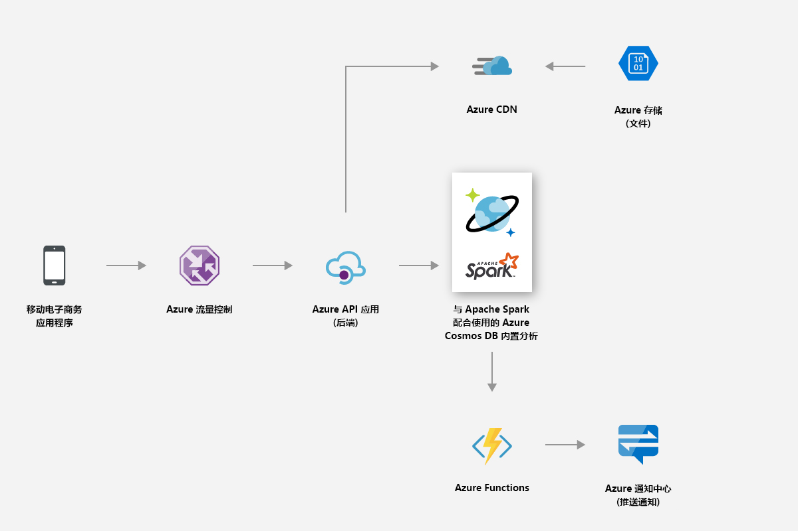
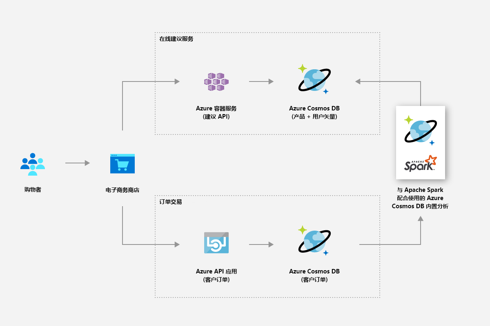
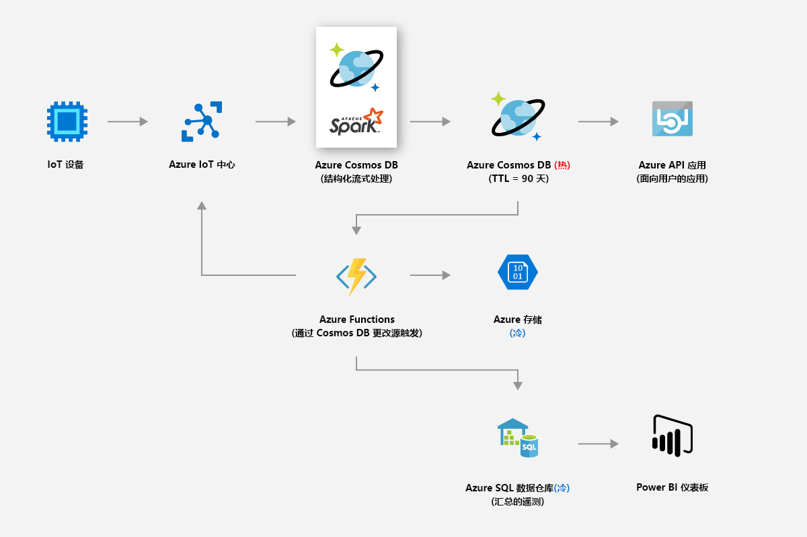
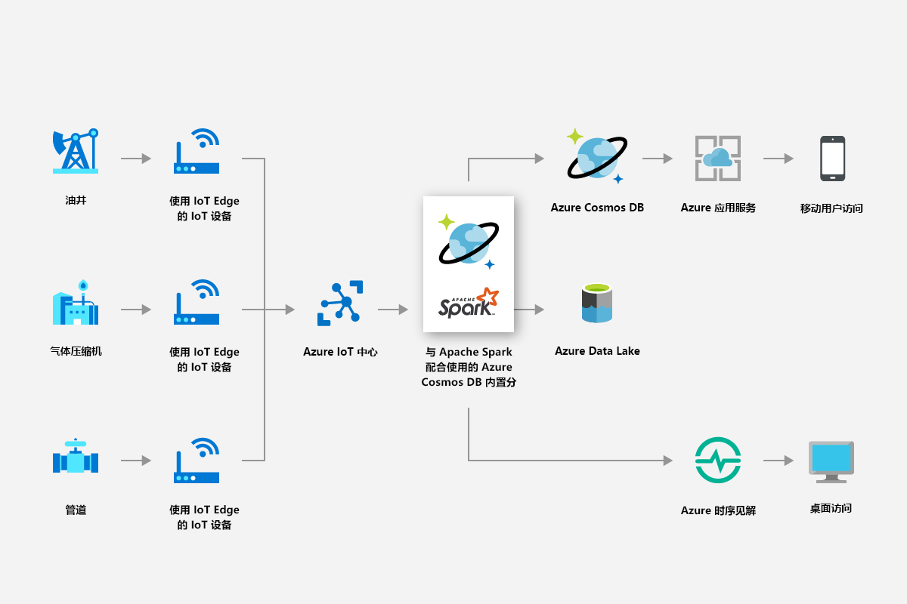
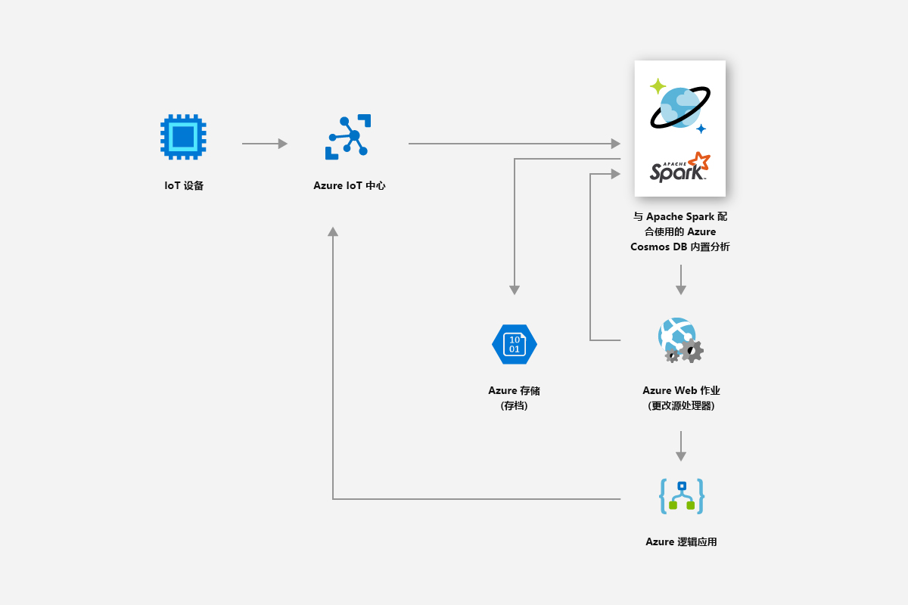

# Azure Cosmos DB with Apache Spark 中的内置运营分析（预览版） 

使用 Azure Cosmos DB 中的内置 Apache Spark 支持可以通过 Apache Spark 针对 Azure Cosmos 帐户中存储的数据运行分析。 Azure Cosmos DB 原生支持在全局分布式 Cosmos 数据库中直接执行 Apache Spark 作业。 借助这些功能，开发人员、数据工程师和数据科学家可以使用 Azure Cosmos DB 作为灵活、可缩放且高效的数据平台来运行 **OLTP 和 OLAP/HTAP** 工作负荷。 

Spark 计算在与你的 Azure Cosmos 帐户关联的 Azure 区域中自动可用。 Spark 作业使用 Azure Cosmos DB 的多主数据库功能，并且它们可以针对每个区域中的本地副本进行写入或查询。 

> [!NOTE]
> Azure Cosmos DB 中的内置 Apache Spark 支持目前以受限预览版提供。 若要注册预览版，请导航到[“注册预览版”页](https://portal.azure.com/?feature.customportal=false#create/Microsoft.DocumentDB)。 

Azure Cosmos DB 中的 Apache Spark 支持提供以下优势：

* 可以最快地获取有关分布在各地的用户和数据的见解。

* 可以简化解决方案的体系结构并降低[总拥有成本](total-cost-ownership.md) (TCO)。 只需在系统中安装最少量的数据处理组件，并可避免在不同的组件之间进行任何不必要的数据移动。

* 创建[安全性](secure-access-to-data.md)、[合规性](compliance.md)和审核边界以将所有数据纳入管理。

* 提供“始终启用”或[高度可用](high-availability.md)的且享有严格 SLA 保障的最终用户分析功能。

 
使用 Azure Cosmos DB 中的 Apache Spark 支持，可以生成和部署 AI 与深度学习模型、预测分析、建议、IoT、Customer 360、欺诈检测、文本情绪、点击流分析等解决方案。 可以直接针对 Azure Cosmos DB 数据运行这些解决方案。

可以在 Azure Cosmos DB 中设置批处理与流式处理 ETL 作业，而无需用到数据库服务以外的功能，或额外添加计算服务。 需要执行 ETL 作业并在作业完成后复原时，可以灵活缩放计算环境。

Azure Cosmos DB 中的 Apache Spark 支持在 Apache Spark 运行时中提供内置的机器学习支持。 运行时包括 Spark MLLib、适用于 Spark 的 Microsoft 机器学习、Azure 机器学习和认知服务。 借助这些功能，数据科学家、数据工程师和数据分析师可以在短时间内以较低的成本直接在 Azure Cosmos DB 中生成和操作化机器学习模型。

## 主要优点

### 全局分布式低延迟运营分析和 AI

针对全局分布式 Azure Cosmos 数据库使用 Apache Spark，可以在全球各地快速获取实时见解。 Azure Cosmos DB 使用三项关键技术来实现支持弹性缩放的**全局分布式低延迟运营分析**：

* 由于 Azure Cosmos 数据库是全局分布式的，将在数据生成者（例如用户）所在位置的本地引入所有数据。 无论数据生成者和使用者位于全球的哪个位置，都会针对最靠近他们的本地副本提供查询服务。 

* 所有分析查询将会直接针对数据分区中存储的索引数据执行，而无需进行任何不必要的数据移动。 

* 由于 Spark 与 Azure Cosmos DB 共置在一起，只会发生极少量的中间转换和数据移动，因此可以提高性能和可伸缩性。

### 适用于 Apache Spark 的统一无服务器体验

作为一种多模型数据库，Azure Cosmos DB 现已扩展了它对 OSS API 的支持，因为它可以提供包含键-值、文档、图形、列系列数据模型的**适用于 Apache Spark 的统一无服务器体验**。 使用 MongoDB、Cassandra、Gremlin、Etcd 和 SQL API 可以支持不同的数据模型 - 所有这些模型都是基于相同的底层数据运行。 

使用 Azure Cosmos DB 中的 Apache Spark 支持，可以原生支持以 Scala、Python、Java 编写的应用程序，并使用适用于 SQL 的多个紧密集成库。 这些库包括 [Spark SQL](https://spark.apache.org/sql/)、机器学习 (Spark [MLlib](https://spark.apache.org/mllib/))、流处理（[Spark 结构化流](https://spark.apache.org/streaming/)）和图形处理 (Spark [GraphFrames]( https://docs.databricks.com/spark/latest/graph-analysis/graphframes/user-guide-python.html))。 可以借助这些工具在各种用例中更轻松地使用 Apache Spark。 无需管理 Spark 或 Spark 群集。 可以使用熟悉的 Apache Spark API 和 **Jupyter Notebooks** 进行分析，并同时使用 SQL API 或任何 OSS NoSQL API（例如 Cassandra）基于相同的底层数据进行事务处理。

### 无需架构或索引管理

与传统的分析数据库不同，使用 Azure Cosmos DB 时，数据工程师和数据科学家不再需要处理繁琐的架构和索引管理。 Azure Cosmos DB 中的数据库引擎不需要任何明确的架构或索引管理，并可以自动为引入的所有数据编制索引，以快速地为 Apache Spark 查询提供服务。 

### 一致性选项

由于 Apache Spark 作业是在 Azure Cosmos 数据库的数据分区中执行的，因此查询可以获得[五个妥善定义的一致性选项](consistency-levels.md)。 这些一致性模型允许灵活选择严格的一致性，以便为机器学习算法提供最准确的结果，且不会影响延迟和高可用性。 

### 综合 SLA

Apache Spark 作业将会利用 Azure Cosmos DB 的优势，例如，行业领先的综合性 [SLA](https://azure.microsoft.com/support/legal/sla/documentdb/v1_1/) (99.999)，且可以避免单独管理各个 Apache Spark 群集所造成的开销。 这些 SLA 涵盖了吞吐量、99% 时间内的延迟、一致性和高可用性。 

### 混合工作负荷

将 Apache Spark 集成到 Azure Cosmos DB 可以弥补事务与分析功能的隔离状态，而这种隔离是客户在生成全球规模的云原生应用程序时面临的主要痛点之一。 

## Azure Cosmos DB Spark 支持的使用场合

### 零售和日用消费品

可以使用 Azure Cosmos DB 中的 Spark 支持提供实时建议和套餐。 可以通过实时个性化和产品建议帮助客户发现所需商品。

* 可以使用 Apache Spark 运行时提供的内置机器学习支持跨产品目录生成实时建议。

* 可以通过挖掘点击流数据、购买数据和客户数据，提供可以提高顾客终生价值的针对性建议。

* 可以利用 Azure Cosmos DB 的全球分布特性，在数毫秒内分析完大量分布在多个区域的产品数据。

* 可以快速获取分布在各地的用户和数据的见解。 可以在正确的时间为正确的用户提供正确的广告，提高促销转化率。

* 可以利用内置的 Spark 流式处理功能，将其与静态客户数据组合使用，以便丰富实时数据。 这样就可以根据客户当前的操作提供更个性化且更具针对性的实时广告。

下图显示了如何使用 Azure Cosmos DB Spark 支持来优化定价和促销：

下图显示了如何在实时建议引擎中使用 Azure Cosmos DB Spark 支持：

### 制造和 IoT

可以通过 Azure Cosmos DB 的内置分析平台对来自全球数百万台设备的 IoT 数据进行实时分析。 可以进行各种现代创新，例如天气模式预测、预测分析、能源优化。

* 可以使用 Azure Cosmos DB 来挖掘数据（例如实时资产指标和天气因素），然后应用智能电网分析来优化现场连接设备的性能。 智能电网分析是控制运营成本、提高电网可靠性以及向使用者提供个性化能源服务的关键。

下图显示了如何使用 Azure Cosmos DB 的 Spark 支持，以便从 IoT 设备读取指标并应用智能电网分析：

### 预见性维护

* 维护资产（例如在从小型钻井平台到深水平台中使用的压缩机）是一项复杂的工作。 这些资产位于全球，生成数 PB 的数据。 可以使用 Azure Cosmos DB 构建端到端预测性数据管道，该管道使用 Spark 流式处理来处理大量的传感器遥测数据、存储资产部件以及传感器映射数据。

* 可以构建并部署机器学习模型，以便在资产故障发生之前预测它们，以及在故障发生之前发出维护工作订单。

下图显示了如何使用 Azure Cosmos DB 的 Spark 支持来构建预测性维护系统：

下图显示了如何使用 Azure Cosmos DB 的 Spark 支持来构建实时车辆诊断系统：

### 游戏

* Azure Cosmos DB 内置了 Spark 支持，可以用来轻松地快速构建、缩放和部署高级分析和机器学习模型，尽可能构建最佳游戏体验。

* 你可以分析玩家、购买和行为数据，创建相关的个性化套餐，以便获得高转化率。

* 可以使用 Spark 机器学习分析游戏遥测数据并获得相关见解。 可以诊断和预防加载时间过长的问题以及游戏中的问题。

下图显示了如何在游戏分析中使用 Azure Cosmos DB 的 Spark 支持：

## 内置的 Jupyter 笔记本支持

Azure Cosmos DB 为所有 API（例如 Cassandra、MongoDB、SQL、Gremlin 和表）提供了内置 Jupyter Notebook 支持。 Jupyter Notebook 在 Azure Cosmos 帐户中运行，它们增强了开发人员体验。 对所有 Azure Cosmos DB API 和数据模型的内置笔记本支持允许你以交互方式运行查询。 你还可以执行机器学习模型，分析存储在 Azure Cosmos 数据库中的数据。 通过使用 Jupyter 笔记本体验，你可以在 Azure 门户中分析存储的数据，构建并训练机器学习模型，以及对数据进行推断：

## 后续步骤

* 若要了解 Azure Cosmos DB 的优势，请参阅[概述](introduction.md)文章。
* [Azure Cosmos DB API for MongoDB 入门](mongodb-introduction.md)
* [Azure Cosmos DB Cassandra API 入门](cassandra-introduction.md)
* [Azure Cosmos DB Gremlin API 入门](graph-introduction.md)
* [Azure Cosmos DB 表 API 入门](table-introduction.md)

