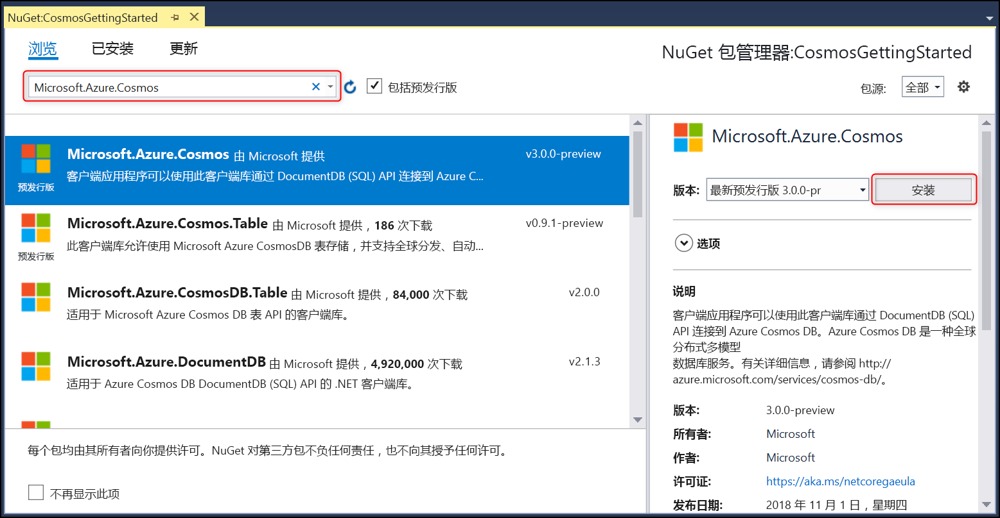

# <a name="build-a-net-console-app-to-manage-data-in-azure-cosmos-db-sql-api-account-sdk-version-3-preview"></a>生成一个用于在 Azure Cosmos DB SQL API 帐户中管理数据的 .NET 控制台应用（SDK 版本 3 预览）

> [!div class="op_single_selector"]
> * [.NET（预览版）](sql-api-dotnet-get-started-preview.md)
> * [.NET](sql-api-get-started.md)
> * [.NET Core](sql-api-dotnetcore-get-started.md)
> * [.NET Core（预览版）](sql-api-dotnet-core-get-started-preview.md)
> * [Java](sql-api-java-get-started.md)
> * [异步 Java](sql-api-async-java-get-started.md)
> * [Node.js](sql-api-nodejs-get-started.md)
> 

欢迎使用 Azure Cosmos DB SQL API 入门教程！ 学习本教程后，将拥有一个可创建并查询 Azure Cosmos DB 资源的控制台应用程序。 本教程使用 [3.0+ 版](https://www.nuget.org/packages/Microsoft.Azure.Cosmos) Azure Cosmos DB .NET SDK，后者以 [.NET Standard 2.0](https://docs.microsoft.com/dotnet/standard/net-standard) 为目标。

本教程涉及：

> [!div class="checklist"]
> * 创建并连接到 Azure Cosmos 帐户
> * 在 Visual Studio 中配置项目
> * 创建数据库和容器
> * 向容器添加项
> * 查询容器
> * 针对项的 CRUD 操作
> * 删除数据库

没有时间？ 不必担心！ 可在 [GitHub](https://github.com/Azure-Samples/cosmos-dotnet-getting-started)上获取完整的解决方案。 有关快速说明，请转到[“获取完整的教程解决方案”部分](#GetSolution)。

现在，让我们开始吧！

## <a name="prerequisites"></a>先决条件

* 有效的 Azure 帐户。 如果没有，可以注册 [免费帐户](https://azure.microsoft.com/free/)。 

  [!INCLUDE [cosmos-db-emulator-docdb-api](../../includes/cosmos-db-emulator-docdb-api.md)]

* [!INCLUDE [cosmos-db-emulator-vs](../../includes/cosmos-db-emulator-vs.md)]

## <a name="step-1-create-an-azure-cosmos-db-account"></a>步骤 1：创建 Azure Cosmos DB 帐户
让我们创建一个 Azure Cosmos DB 帐户。 如果已经有一个想要使用的帐户，可以跳到 [设置 Visual Studio 解决方案](#SetupVS)。 如果使用 Azure Cosmos DB 模拟器，请遵循 [Azure Cosmos DB 模拟器](local-emulator.md)中的步骤设置该模拟器，并直接跳到[设置 Visual Studio 项目](#SetupVS)。

[!INCLUDE [create-dbaccount-preview](../../includes/cosmos-db-create-dbaccount-preview.md)]

## <a id="SetupVS"></a>步骤 2：设置 Visual Studio 项目
1. 在计算机上打开 **Visual Studio 2017**。
1. 在“文件”菜单中，选择“新建”，并选择“项目”。
1. 在“新建项目”对话框中，选择“Visual C#” / “控制台应用(.NET Framework)”，为项目命名，并单击“确定”。
    
1. 在“解决方案资源管理器”中，右键单击 Visual Studio 解决方案下方的新控制台应用程序，并单击“管理 NuGet 包...”
    
    
1. 在“NuGet”选项卡上，单击“浏览”，并在搜索框中键入 **Microsoft.Azure.Cosmos**。 请务必选中“包括预发行版”，以便查找预览版。
1. 在结果中找到“Microsoft.Azure.Cosmos”，并单击“安装”。
   Azure Cosmos DB SQL API 客户端库的程序包 ID 是 [Microsoft Azure Cosmos DB 客户端库](https://www.nuget.org/packages/Microsoft.Azure.Cosmos/)。
   

    如果获得有关查看解决方案更改的消息，请单击“确定”。 如果获得有关接受许可证的消息，请单击“我接受”。

很好！ 现在，我们已完成安装，让我们开始编写一些代码。 可以在 [GitHub](https://github.com/Azure-Samples/cosmos-dotnet-getting-started)上找到本教程的完整代码项目。

## <a id="Connect"></a>步骤 3：连接到 Azure Cosmos DB 帐户
1. 首先，将 **Program.cs** 文件中 C# 应用程序开头的引用替换为以下引用：
    ```csharp
    using System;
    using System.Threading.Tasks;
    using System.Configuration;
    using Microsoft.Azure.Cosmos;
    using System.Collections.Generic;
    using System.Net;
    ```
1. 现在，请将这些常量和变量添加到公共类 ``Program`` 中。
    ```csharp
    public class Program
    {
        // ADD THIS PART TO YOUR CODE

        // The Azure Cosmos DB endpoint for running this sample.
        private static readonly string EndpointUri = "<your endpoint here>";
        // The primary key for the Azure Cosmos account.
        private static readonly string PrimaryKey = "<your primary key>";

        // The Cosmos client instance
        private CosmosClient cosmosClient;

        // The database we will create
        private CosmosDatabase database;

        // The container we will create.
        private CosmosContainer container;

        // The name of the database and container we will create
        private string databaseId = "FamilyDatabase";
        private string containerId = "FamilyContainer";
    }
    ```
    注意，如果你熟悉旧版 .NET SDK，则可能已看惯了术语“集合”和“文档”。 由于 Azure Cosmos DB 支持多 API 模型，因此 3.0+ 版的 .NET SDK 使用通用术语“容器”和“项”。 容器可以是集合、图或表。 项可以是文档、边缘/顶点或行，是容器中的内容。 [详细了解数据库、容器和项。](databases-containers-items.md)

1. 从 [Azure 门户](https://portal.azure.com)检索终结点 URL 和主密钥。

    在 Azure 门户中，导航到 Azure Cosmos DB 帐户，然后单击“密钥”。

    从门户中复制该 URI 并将它粘贴到 ```Program.cs``` 文件中的 `<your endpoint URL>`。 从门户中复制“主密钥”并将它粘贴到 `<your primary key>`。

   

1. 接下来，我们将创建 ```CosmosClient``` 的新实例并为程序设置一些基架。

    在 **Main** 方法下面，添加名为 **GetStartedDemoAsync** 的新异步任务，将新的 ```CosmosClient``` 实例化。 我们将使用 **GetStartedDemoAsync** 作为入口点，该入口点调用在 Azure Cosmos DB 资源上运行的方法。

    ```csharp
    public static async Task Main(string[] args)
    {
    }

    // ADD THIS PART TO YOUR CODE
    /*
        Entry point to call methods that operate on Azure Cosmos DB resources in this sample
    */   
    public async Task GetStartedDemoAsync()
    {
        // Create a new instance of the Cosmos Client
        this.cosmosClient = new CosmosClient(EndpointUri, PrimaryKey);
    }
    ```

1. 添加以下代码，从 **Main** 方法中运行 **GetStartedDemoAsync** 异步任务。 **Main** 方法将捕获异常并将它们写到控制台上。
    ```csharp
    public static async Task Main(string[] args)
    {
        // ADD THIS PART TO YOUR CODE
        try
        {
            Console.WriteLine("Beginning operations...\n");
            Program p = new Program();
            await p.GetStartedDemoAsync();
        }
        catch (CosmosException de)
        {
            Exception baseException = de.GetBaseException();
            Console.WriteLine("{0} error occurred: {1}\n", de.StatusCode, de);
        }
        catch (Exception e)
        {
            Console.WriteLine("Error: {0}\n", e);
        }
        finally
        {
            Console.WriteLine("End of demo, press any key to exit.");
            Console.ReadKey();
        }
    }
    ```

1. 选择 **F5** 来运行应用程序。 控制台窗口输出会显示消息`End of demo, press any key to exit.`，确认已建立到 Azure Cosmos DB 的连接。 然后即可关闭控制台窗口。 

祝贺你！ 已成功连接到 Azure Cosmos DB 帐户。 

## <a name="step-4-create-a-database"></a>第 4 步：创建数据库
可以使用 ``CosmosDatabases`` 类的 [**CreateDatabaseIfNotExistsAsync**](https://docs.microsoft.com/en-us/dotnet/api/microsoft.azure.cosmos.cosmosdatabases) 或 [**CreateDatabaseAsync**](https://docs.microsoft.com/en-us/dotnet/api/microsoft.azure.cosmos.cosmosdatabases) 函数创建一个数据库。 数据库是跨容器分区的项的逻辑容器。
    
1. 将 **CreateDatabase** 方法复制并粘贴到 **GetStartedDemoAsync** 方法下面。 **createDatabase** 会使用通过 ``databaseId`` 字段指定的 ID ``FamilyDatabase`` 来创建新数据库（如果不存在）。 

    ```csharp
    /*
        Create the database if it does not exist
    */    
    private async Task CreateDatabase()
    {
        // Create a new database
        this.database = await this.cosmosClient.Databases.CreateDatabaseIfNotExistsAsync(databaseId);
        Console.WriteLine("Created Database: {0}\n", this.database.Id);
    }
    ```

1. 复制并粘贴以下代码，其中实例化了 CosmosClient 来调用刚添加的 **CreateDatabase** 方法。

    ```csharp
    public async Task GetStartedDemoAsync()
    {
        // Create a new instance of the Cosmos Client
        this.cosmosClient = new CosmosClient(EndpointUri, PrimaryKey);

        //ADD THIS PART TO YOUR CODE
        await this.CreateDatabase(); 
    }
    ```

    目前的代码应如下所示，其中填充了终结点和主密钥。
    ```csharp
    using System;
    using System.Threading.Tasks;
    using System.Configuration;
    using Microsoft.Azure.Cosmos;
    using System.Collections.Generic;
    using System.Net;

    namespace CosmosGettingStarted
    {
        class Program
        {
            // The Azure Cosmos DB endpoint for running this sample.
            private static readonly string EndpointUri = "<your endpoint here>";
            // The primary key for the Azure Cosmos account.
            private static readonly string PrimaryKey = "<your primary key>";

            // The Cosmos client instance
            private CosmosClient cosmosClient;
        
            // The database we will create
            private CosmosDatabase database;

            // The container we will create.
            private CosmosContainer container;

            // The name of the database and container we will create
            private string databaseId = "FamilyDatabase";
            private string containerId = "FamilyContainer";

            public static async Task Main(string[] args)
            {
                try
                {
                    Console.WriteLine("Beginning operations...");
                    Program p = new Program();
                    await p.GetStartedDemoAsync();
                }
                catch (CosmosException de)
                {
                    Exception baseException = de.GetBaseException();
                    Console.WriteLine("{0} error occurred: {1}\n", de.StatusCode, de);
                }
                catch (Exception e)
                {
                    Console.WriteLine("Error: {0}\n", e);
                }
                finally
                {
                    Console.WriteLine("End of demo, press any key to exit.");
                    Console.ReadKey();
                }
            }

            /*
                Entry point to call methods that operate on Azure Cosmos DB resources in this sample
            */
            public async Task GetStartedDemoAsync()
            {
                // Create a new instance of the Cosmos Client
                this.cosmosClient = new CosmosClient(EndpointUri, PrimaryKey);
                await this.CreateDatabase();
            }

            /*
                Create the database if it does not exist
            */    
            private async Task CreateDatabase()
            {
                // Create a new database
                this.database = await this.cosmosClient.Databases.CreateDatabaseIfNotExistsAsync(databaseId);
                Console.WriteLine("Created Database: {0}\n", this.database.Id);
            }
        }
    }
    ```

选择 **F5** 来运行应用程序。

祝贺你！ 已成功创建了 Azure Cosmos DB 数据库。  

## <a id="CreateColl"></a>步骤 5：创建容器
> [!WARNING]
> 调用方法 **CreateContainerIfNotExistsAsync** 会创建新的容器，牵涉到定价。 有关详细信息，请访问 [定价页](https://azure.microsoft.com/pricing/details/cosmos-db/)。
> 
> 

可以使用 **CosmosContainers** 类中的 [**CreateContainerIfNotExistsAsync**](https://docs.microsoft.com/en-us/dotnet/api/microsoft.azure.cosmos.cosmoscontainers) 或 [**CreateContainerAsync**](https://docs.microsoft.com/en-us/dotnet/api/microsoft.azure.cosmos.cosmoscontainers) 函数创建容器。 容器包含项（在使用 SQL API 的情况下为 JSON 文档）和关联的 JavaScript 服务器端应用程序逻辑，例如存储过程、用户定义的函数以及触发器。

1. 将 **CreateContainer** 方法复制并粘贴到 **CreateDatabase** 方法下面。 **CreateContainer** 会使用通过 ``containerId`` 字段指定的 ID ``FamilyContainer`` 来创建新容器（如果不存在）。 

    ```csharp
    /*
        Create the container if it does not exist. 
        Specifiy "/LastName" as the partition key since we're storing family information, to ensure good distribution of requests and storage.
    */
    private async Task CreateContainer()
    {
        // Create a new container
        this.container = await this.database.Containers.CreateContainerIfNotExistsAsync(containerId, "/LastName");
        Console.WriteLine("Created Container: {0}\n", this.container.Id);
    }
    ```

1. 复制并粘贴以下代码，其中实例化了 CosmosClient 来调用刚添加的 **CreateContainer** 方法。

    ```csharp
    public async Task GetStartedDemoAsync()
    {
        // Create a new instance of the Cosmos Client
        this.cosmosClient = new CosmosClient(EndpointUri, PrimaryKey);
        await this.CreateDatabase(); 

        //ADD THIS PART TO YOUR CODE
        await this.CreateContainer();
    }

Select **F5** to run your application.

Congratulations! You have successfully created an Azure Cosmos DB container.  

## <a id="CreateDoc"></a>Step 6: Add items to the container
An item can be created by using the [**CreateItemAsync**](https://docs.microsoft.com/en-us/dotnet/api/microsoft.azure.cosmos.cosmositems) function of the **CosmosItems** class. When using the SQL API, items are projected as documents, which are user-defined (arbitrary) JSON content. You can now insert an item into your Azure Cosmos DB container.

First, we need to create a **Family** class that will represent objects stored within Azure Cosmos DB in this sample. We will also create **Parent**, **Child**, **Pet**, **Address** subclasses that are used within **Family**. Note that documents must have an **Id** property serialized as **id** in JSON. 
1. Select **Ctrl+Shift+A** to open the **Add New Item** dialog. Add a new class **Family.cs** to your project. 

    

1. Copy and paste the **Family**, **Parent**, **Child**, **Pet**, and **Address** class into **Family.cs**. 
    ```csharp
    using Newtonsoft.Json;

    namespace CosmosGettingStarted
    {
        public class Family
        {
            [JsonProperty(PropertyName = "id")]
            public string Id { get; set; }
            public string LastName { get; set; }
            public Parent[] Parents { get; set; }
            public Child[] Children { get; set; }
            public Address Address { get; set; }
            public bool IsRegistered { get; set; }
            public override string ToString()
            {
                return JsonConvert.SerializeObject(this);
            }
        }

        public class Parent
        {
            public string FamilyName { get; set; }
            public string FirstName { get; set; }
        }

        public class Child
        {
            public string FamilyName { get; set; }
            public string FirstName { get; set; }
            public string Gender { get; set; }
            public int Grade { get; set; }
            public Pet[] Pets { get; set; }
        }

        public class Pet
        {
            public string GivenName { get; set; }
        }

        public class Address
        {
            public string State { get; set; }
            public string County { get; set; }
            public string City { get; set; }
        }
    }
    ```
1. 导航回 **Program.cs**，将 **AddItemsToContainer** 方法添加到 **CreateContainer** 方法下。 代码会进行检查，确保在创建项之前不存在具有相同 ID 的项。 我们会插入两个项，Andersen Family 和 Wakefield Family 各一个。

    ```csharp
    /*
        Add Family items to the container
    */
    private async Task AddItemsToContainer()
    {
        // Create a family object for the Andersen family
        Family andersenFamily = new Family
        {
            Id = "Andersen.1",
            LastName = "Andersen",
            Parents = new Parent[]
            {
                new Parent { FirstName = "Thomas" },
                new Parent { FirstName = "Mary Kay" }
            },
            Children = new Child[]
            {
                new Child
                {
                    FirstName = "Henriette Thaulow",
                    Gender = "female",
                    Grade = 5,
                    Pets = new Pet[]
                    {
                        new Pet { GivenName = "Fluffy" }
                    }
                }
            },
            Address = new Address { State = "WA", County = "King", City = "Seattle" },
            IsRegistered = true
        };

        // Read the item to see if it exists. Note ReadItemAsync will not throw an exception if an item does not exist. Instead, we check the StatusCode property off the response object. 
        CosmosItemResponse<Family> andersenFamilyResponse = await this.container.Items.ReadItemAsync<Family>(andersenFamily.LastName, andersenFamily.Id);

        if (andersenFamilyResponse.StatusCode == HttpStatusCode.NotFound)
        {
            // Create an item in the container representing the Andersen family. Note we provide the value of the partition key for this item, which is "Andersen"
            andersenFamilyResponse = await this.container.Items.CreateItemAsync<Family>(andersenFamily.LastName, andersenFamily);

            // Note that after creating the item, we can access the body of the item with the Resource property off the CosmosItemResponse. 
            //We can also access the RequestCharge property to see the amount of RUs consumed on this request.
            Console.WriteLine("Created item in database with id: {0} Operation consumed {1} RUs.\n", andersenFamilyResponse.Resource.Id, andersenFamilyResponse.RequestCharge);
        }
        else
        {
            Console.WriteLine("Item in database with id: {0} already exists\n", andersenFamilyResponse.Resource.Id);
        }

        // Create a family object for the Wakefield family
        Family wakefieldFamily = new Family
        {
            Id = "Wakefield.7",
            LastName = "Wakefield",
            Parents = new Parent[]
            {
                new Parent { FamilyName = "Wakefield", FirstName = "Robin" },
                new Parent { FamilyName = "Miller", FirstName = "Ben" }
            },
            Children = new Child[]
            {
                new Child
                {
                    FamilyName = "Merriam",
                    FirstName = "Jesse",
                    Gender = "female",
                    Grade = 8,
                    Pets = new Pet[]
                    {
                        new Pet { GivenName = "Goofy" },
                        new Pet { GivenName = "Shadow" }
                    }
                },
                new Child
                {
                    FamilyName = "Miller",
                    FirstName = "Lisa",
                    Gender = "female",
                    Grade = 1
                }
            },
            Address = new Address { State = "NY", County = "Manhattan", City = "NY" },
            IsRegistered = false
        };

        // Read the item to see if it exists
        CosmosItemResponse<Family> wakefieldFamilyResponse = await this.container.Items.ReadItemAsync<Family>(wakefieldFamily.LastName, wakefieldFamily.Id);

        if (wakefieldFamilyResponse.StatusCode == HttpStatusCode.NotFound)
        {
            // Create an item in the container representing the Wakefield family. Note we provide the value of the partition key for this item, which is "Wakefield"
            wakefieldFamilyResponse = await this.container.Items.CreateItemAsync<Family>(wakefieldFamily.LastName, wakefieldFamily);

            // Note that after creating the item, we can access the body of the item with the Resource property off the CosmosItemResponse. 
            //We can also access the RequestCharge property to see the amount of RUs consumed on this request.
            Console.WriteLine("Created item in database with id: {0} Operation consumed {1} RUs.\n", wakefieldFamilyResponse.Resource.Id, wakefieldFamilyResponse.RequestCharge);
        }
        else
        {
            Console.WriteLine("Item in database with id: {0} already exists\n", wakefieldFamilyResponse.Resource.Id);
        }
    }
    ```
1. 在 ``GetStartedDemoAsync`` 方法中添加对 ``AddItemsToContainer`` 的调用。

    ```csharp
    public async Task GetStartedDemoAsync()
    {
        // Create a new instance of the Cosmos Client
        this.cosmosClient = new CosmosClient(EndpointUri, PrimaryKey);
        await this.CreateDatabase(); 
        await this.CreateContainer();

        //ADD THIS PART TO YOUR CODE
        await this.AddItemsToContainer();
    }
    ```

选择 **F5** 来运行应用程序。

祝贺你！ 已成功创建了两个 Azure Cosmos DB 项。  


## <a id="Query"></a>步骤 7：查询 Azure Cosmos DB 资源
Azure Cosmos DB 支持对存储在每个集合中的 JSON 文档进行[各种查询](sql-api-sql-query.md)。 以下示例代码演示了如何针对我们在上一步插入的项来运行查询。

1. 将 **RunQuery** 方法复制并粘贴到 **AddItemsToContainer** 方法下面。

    ```csharp
    /*
        Run a query (using Azure Cosmos DB SQL syntax) against the container
    */
    private async Task RunQuery()
    {
        var sqlQueryText = "SELECT * FROM c WHERE c.LastName = 'Andersen'";
        var partitionKeyValue = "Andersen";

        Console.WriteLine("Running query: {0}\n", sqlQueryText);

        CosmosSqlQueryDefinition queryDefinition = new CosmosSqlQueryDefinition(sqlQueryText);
        CosmosResultSetIterator<Family> queryResultSetIterator = this.container.Items.CreateItemQuery<Family>(queryDefinition, partitionKeyValue);

        List<Family> families = new List<Family>();

        while (queryResultSetIterator.HasMoreResults)
        {
            CosmosQueryResponse<Family> currentResultSet = await queryResultSetIterator.FetchNextSetAsync();
            foreach (Family family in currentResultSet)
            {
                families.Add(family);
                Console.WriteLine("\tRead {0}\n", family);
            }
        }
    }
    ```
1. 在 ``GetStartedDemoAsync`` 方法中添加对 ``RunQuery`` 的调用。

    ```csharp
    public async Task GetStartedDemoAsync()
    {
        // Create a new instance of the Cosmos Client
        this.cosmosClient = new CosmosClient(EndpointUri, PrimaryKey);
        await this.CreateDatabase(); 
        await this.CreateContainer();
        await this.AddItemsToContainer();

        //ADD THIS PART TO YOUR CODE
        await this.RunQuery();
    }
    ```

选择 **F5** 来运行应用程序。

祝贺你！ 已成功完成了对 Azure Cosmos DB 容器的查询。

## <a id="ReplaceItem"></a>步骤 8：替换 JSON 项
现在，我们将更新 Azure Cosmos DB 中的一个项。

1. 将 **ReplaceFamilyItem** 方法复制并粘贴到 **RunQuery** 方法下面。 请注意，我们要更改 Family 的 ``IsRegistered`` 属性以及某个子项的 ``Grade``。
    ```csharp
    /*
    Update an item in the container
    */
    private async Task ReplaceFamilyItem()
    {
        CosmosItemResponse<Family> wakefieldFamilyResponse = await this.container.Items.ReadItemAsync<Family>("Wakefield", "Wakefield.7");
        var itemBody = wakefieldFamilyResponse.Resource;
        
        // update registration status from false to true
        itemBody.IsRegistered = true;
        // update grade of child
        itemBody.Children[0].Grade = 6;

        // replace the item with the updated content
        wakefieldFamilyResponse = await this.container.Items.ReplaceItemAsync<Family>(itemBody.LastName, itemBody.Id, itemBody);
        Console.WriteLine("Updated Family [{0},{1}]\n. Body is now: {2}\n", itemBody.LastName, itemBody.Id, wakefieldFamilyResponse.Resource);
    }
    ```
1. 在 ``GetStartedDemo`` 方法中添加对 ``ReplaceFamilyItem`` 的调用。

    ```csharp
    public async Task GetStartedDemoAsync()
    {
        // Create a new instance of the Cosmos Client
        this.cosmosClient = new CosmosClient(EndpointUri, PrimaryKey);
        await this.CreateDatabase(); 
        await this.CreateContainer();
        await this.AddItemsToContainer();
        await this.RunQuery();

        //ADD THIS PART TO YOUR CODE
        await this.ReplaceFamilyItem();
    }

Select **F5** to run your application.

Congratulations! You have successfully replaced an Azure Cosmos DB item.

## <a id="DeleteDocument"></a>Step 9: Delete item
Now, we will delete an item in Azure Cosmos DB.

1. Copy and paste the **DeleteFamilyItem** method below your **ReplaceFamilyItem** method.
    ```csharp
    /*
    Delete an item in the container
    */
    private async Task DeleteFamilyItem()
    {
        var partitionKeyValue = "Wakefield";
        var familyId = "Wakefield.7";

        // Delete an item. Note we must provide the partition key value and id of the item to delete
        CosmosItemResponse<Family> wakefieldFamilyResponse = await this.container.Items.DeleteItemAsync<Family>(partitionKeyValue, familyId);
        Console.WriteLine("Deleted Family [{0},{1}]\n", partitionKeyValue, familyId);
    }
    ```
1. 在 ``GetStartedDemo`` 方法中添加对 ``DeleteFamilyItem`` 的调用。

    ```csharp
    public async Task GetStartedDemoAsync()
    {
        // Create a new instance of the Cosmos Client
        this.cosmosClient = new CosmosClient(EndpointUri, PrimaryKey);
        await this.CreateDatabase(); 
        await this.CreateContainer();
        await this.AddItemsToContainer();
        await this.RunQuery();
        await this.ReplaceFamilyItem();

        //ADD THIS PART TO YOUR CODE
        await this.DeleteFamilyItem();
    }
    ```

选择 **F5** 来运行应用程序。

祝贺你！ 已成功删除了 Azure Cosmos DB 项。

## <a id="DeleteDatabase"></a>步骤 10：删除数据库
现在，我们将删除数据库。 删除已创建的数据库会删除该数据库及其所有子资源（容器、项以及任何存储过程、用户定义的函数、触发器）。 我们还会释放 **CosmosClient** 实例。

1. 将 **DeleteDatabaseAndCleanup** 方法复制并粘贴到 **DeleteFamilyItem** 方法下面。
    ```csharp
    /*
    Delete the database and dispose of the Cosmos Client instance
    */
    private async Task DeleteDatabaseAndCleanup()
    {
        CosmosDatabaseResponse databaseResourceResponse = await this.database.DeleteAsync();
        // Also valid: await this.cosmosClient.Databases["FamilyDatabase"].DeleteAsync();

        Console.WriteLine("Deleted Database: {0}\n", this.databaseId);

        //Dispose of CosmosClient
        this.cosmosClient.Dispose();
    }
    ```
1. 在 ``GetStartedDemo`` 方法中添加对 ``DeleteDatabaseAndCleanup`` 的调用。
    
    ```csharp
    public async Task GetStartedDemoAsync()
    {
        // Create a new instance of the Cosmos Client
        this.cosmosClient = new CosmosClient(EndpointUri, PrimaryKey);
        await this.CreateDatabase(); 
        await this.CreateContainer();
        await this.AddItemsToContainer();
        await this.RunQuery();
        await this.ReplaceFamilyItem();
        await this.DeleteFamilyItem();

        //ADD THIS PART TO YOUR CODE        
        await this.DeleteDatabaseAndCleanup();
    }
    ```

选择 **F5** 来运行应用程序。

祝贺你！ 已成功删除了 Azure Cosmos DB 数据库。

## <a id="Run"></a>步骤 11：一起运行 C# 控制台应用程序！
在 Visual Studio 中选择 F5，即可在调试模式下生成并运行应用程序。

应会在控制台窗口中看到整个应用的输出。 输出会显示我们所添加的查询的结果，并且应与下面的示例文本相匹配。

```
Beginning operations...

Created Database: FamilyDatabase

Created Container: FamilyContainer

Created item in database with id: Andersen.1 Operation consumed 11.43 RUs.

Created item in database with id: Wakefield.7 Operation consumed 14.29 RUs.

Running query: SELECT * FROM c WHERE c.LastName = 'Andersen'

        Read {"id":"Andersen.1","LastName":"Andersen","Parents":[{"FamilyName":null,"FirstName":"Thomas"},{"FamilyName":null,"FirstName":"Mary Kay"}],"Children":[{"FamilyName":null,"FirstName":"Henriette Thaulow","Gender":"female","Grade":5,"Pets":[{"GivenName":"Fluffy"}]}],"Address":{"State":"WA","County":"King","City":"Seattle"},"IsRegistered":false}

Updated Family [Wakefield,Wakefield.7].
        Body is now: {"id":"Wakefield.7","LastName":"Wakefield","Parents":[{"FamilyName":"Wakefield","FirstName":"Robin"},{"FamilyName":"Miller","FirstName":"Ben"}],"Children":[{"FamilyName":"Merriam","FirstName":"Jesse","Gender":"female","Grade":6,"Pets":[{"GivenName":"Goofy"},{"GivenName":"Shadow"}]},{"FamilyName":"Miller","FirstName":"Lisa","Gender":"female","Grade":1,"Pets":null}],"Address":{"State":"NY","County":"Manhattan","City":"NY"},"IsRegistered":true}

Deleted Family [Wakefield,Wakefield.7]

Deleted Database: FamilyDatabase

End of demo, press any key to exit.
```

祝贺你！ 已经完成了本教程，并且获得了一个正常工作的 C# 控制台应用程序！

## <a id="GetSolution"></a>获取完整的教程解决方案
如果没有时间完成本教程中的步骤，或者只需下载代码示例，则可从 [GitHub](https://github.com/Azure-Samples/cosmos-dotnet-getting-started) 获取。 

若要生成 GetStarted 解决方案，需备齐以下各项：

* 有效的 Azure 帐户。 如果没有，可以注册 [免费帐户](https://azure.microsoft.com/free/)。
* 一个 [Azure Cosmos DB 帐户][cosmos-db-create-account]。
* GitHub 上提供的 [GetStarted](https://github.com/Azure-Samples/cosmos-dotnet-getting-started) 解决方案。

若要在 Visual Studio 中还原 Azure Cosmos DB .NET SDK 的引用，请在解决方案资源管理器中右键单击“GetStarted”解决方案，并单击“还原 NuGet 包”。 接下来，按照[连接到 Azure Cosmos DB 帐户](#Connect)中所述的方法在 App.config 文件中更新 EndPointUri 和 PrimaryKey 值。

就这么简单，生成以后即可开始操作！


## <a name="next-steps"></a>后续步骤
* 需要更复杂的 ASP.NET MVC 教程？ 请参阅 [ASP.NET MVC 教程：使用 Azure Cosmos DB 开发 Web 应用程序](sql-api-dotnet-application-preview.md)。
* 希望使用 Azure Cosmos DB 执行规模和性能测试？ 请参阅[使用 Azure Cosmos DB 执行性能和扩展测试](performance-testing.md)
* 了解如何[监视 Azure Cosmos DB 请求、使用情况和存储](monitor-accounts.md)。
* 在 [Query Playground](https://www.documentdb.com/sql/demo)中对示例数据集运行查询。
* 若要了解有关 Azure Cosmos DB 的详细信息，请参阅[欢迎使用 Azure Cosmos DB](https://docs.microsoft.com/azure/cosmos-db/introduction)。

[cosmos-db-create-account]: create-sql-api-dotnet-preview.md#create-account
