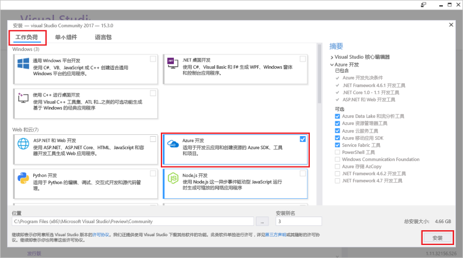

# <a name="create-an-azure-functions-http-trigger-with-an-azure-cosmos-db-input-binding"></a>使用 Azure Cosmos DB 输入绑定创建 Azure Functions HTTP 触发器

Azure Cosmos DB 是无架构、无服务器的全球分布式多模型数据库。 Azure Functions 是一种无服务器计算服务，可用于按需运行代码。 将这两个 Azure 服务搭配使用可以建立无服务器体系结构的基础，专注于生成完美的应用，无需考虑如何根据计算与数据库需求预配和维护服务器。

本教程基于[适用于 .NET 的图形 API 快速入门](create-graph-dotnet.md)中创建的代码。 本教程将添加一个包含 [HTTP 触发器](https://github.com/MicrosoftDocs/azure-docs-pr/azure-functions/functions-bindings-http-webhook.md#http-trigger)的 Azure 函数。 该 HTTP 触发器使用 Azure Cosmos DB [输入绑定](https://github.com/MicrosoftDocs/azure-docs-pr/azure-functions/functions-triggers-bindings.md)从快速入门中创建的图形数据库检索数据。 此特定 HTTP 触发器会在 Azure Cosmos DB 中查询数据，但可以使用 Azure Cosmos DB 中的输入绑定来检索函数所需的任何项的数据输入值。

本教程涵盖以下任务：

> [!div class="checklist"]
> * 创建 Azure 函数项目 
> * 创建 HTTP 触发器
> * 发布 Azure 函数
> * 将 Azure 函数连接到 Azure Cosmos DB 数据库

## <a name="prerequisites"></a>先决条件

- [Visual Studio 2017 版本 15.3](https://www.visualstudio.com/vs/preview/)，包括 **Azure 开发**工作负荷。

    
    
- 安装或升级到 Visual Studio 2017 15.3 版后，必须手动更新用于 Azure Functions 的 Visual Studio 2017 工具。 可以在“扩展和更新...” > “更新” > “Visual Studio Marketplace” > “Azure Functions 和 Web 作业工具” > “更新”下的“工具”中更新工具。

- 完成[使用图形 API 生成 .NET 应用程序](tutorial-develop-graph-dotnet.md)教程，或者从 [azure-cosmos-db-graph-dotnet-getting-started](https://github.com/Azure-Samples/azure-cosmos-db-graph-dotnet-getting-started) GitHub 存储库获取示例代码并生成项目。
 
## <a name="build-a-function-in-visual-studio"></a>在 Visual Studio 中生成函数

1. 在“解决方案资源管理器”中右键单击解决方案节点，选择“添加” > “新建项目”，将一个 **Azure Functions** 项目添加到解决方案。 从对话框框中选择“Azure Functions”，并将其命名为 **PeopleDataFunctions**。

   

2. 创建 Azure Functions 项目后，需要执行几项与 NuGet 相关的更新和安装。 

    a. 为确保使用最新的 Functions SDK，请使用 NuGet 管理器更新 **Microsoft.NET.Sdk.Functions** 包。 在“解决方案资源管理器”中，右键单击项目，然后选择“管理 NuGet 包”。 在“已安装”选项卡中选择“Microsoft.NET.Sdk.Functions”，单击“更新”。

   

    b. 在“浏览”选项卡中，输入 **azure.graphs** 以查找 **Microsoft.Azure.Graphs**，并单击“安装”。 此包包含图形 API .NET 客户端 SDK。

   

    c. 在“浏览”选项卡中，输入 **mono.csharp** 以查找 **Mono.CSharp** 包，并单击“安装”。

   

3. 解决方案资源管理器现应包含所安装的包，如下所示。 
   
   接下来需要编写一些代码，因此要将一个新的 **Azure 函数**项添加到项目。 

    a. 在解决方案资源管理器中右键单击项目节点，然后选择“添加” > “新建项”。   
    b. 在“添加新项”对话框中，依次选择“Visual C# 项”、“Azure 函数”，键入 **Search** 作为项目的名称，单击“添加”。  
 
   

4. Azure 函数会响应 HTTP 请求，因此 Http 触发器模板在此处适用。
   
   在“新建 Azure 函数”框中，选择“Http 触发器”。 我们希望此 Azure 函数也是“敞开式”的，因此可将“访问权限”设置为“匿名”，使任何人都能访问它。 单击 **“确定”**。

   

5. 将 Search.cs 添加到 Azure 函数项目后，请复制以下 **using** 语句并覆盖现有的 using 语句：

   ```csharp
   using Microsoft.Azure.Documents;
   using Microsoft.Azure.Documents.Client;
   using Microsoft.Azure.Documents.Linq;
   using Microsoft.Azure.Graphs;
   using Microsoft.Azure.WebJobs;
   using Microsoft.Azure.WebJobs.Extensions.Http;
   using Microsoft.Azure.WebJobs.Host;
   using System;
   using System.Collections.Generic;
   using System.Configuration;
   using System.Linq;
   using System.Net;
   using System.Net.Http;
   using System.Threading.Tasks;
   ```

6. 接下来，将 Azure 函数的类代码替换为以下代码。 该代码会使用图形 API 搜索所有人或者 `name` 查询字符串参数指定的特定人员的 Azure Cosmos DB 数据库。

   ```csharp
   public static class Search
   {
       static string endpoint = ConfigurationManager.AppSettings["Endpoint"];
       static string authKey = ConfigurationManager.AppSettings["AuthKey"];

       [FunctionName("Search")]
       public static async Task<HttpResponseMessage> Run(
           [HttpTrigger(AuthorizationLevel.Anonymous, "get", "post", Route = null)]HttpRequestMessage req,
           TraceWriter log)
       {
           log.Info("C# HTTP trigger function processed a request.");

           // the person objects are free-form in structure
           List<dynamic> results = new List<dynamic>();

           // open the client's connection
           using (DocumentClient client = new DocumentClient(
               new Uri(endpoint),
               authKey,
               new ConnectionPolicy
               {
                   ConnectionMode = ConnectionMode.Direct,
                   ConnectionProtocol = Protocol.Tcp
               }))
           {
               // get a reference to the database the console app created
               Database database = await client.CreateDatabaseIfNotExistsAsync(
                   new Database
                   {
                       Id = "graphdb"
                   });

               // get an instance of the database's graph
               DocumentCollection graph = await client.CreateDocumentCollectionIfNotExistsAsync(
                   UriFactory.CreateDatabaseUri("graphdb"),
                   new DocumentCollection { Id = "graphcollz" },
                   new RequestOptions { OfferThroughput = 1000 });

               // build a gremlin query based on the existence of a name parameter
               string name = req.GetQueryNameValuePairs()
                   .FirstOrDefault(q => string.Compare(q.Key, "name", true) == 0)
                   .Value;

               IDocumentQuery<dynamic> query = (!String.IsNullOrEmpty(name))
                   ? client.CreateGremlinQuery<dynamic>(graph, string.Format("g.V('{0}')", name))
                   : client.CreateGremlinQuery<dynamic>(graph, "g.V()");

               // iterate over all the results and add them to the list
               while (query.HasMoreResults)
                   foreach (dynamic result in await query.ExecuteNextAsync())
                       results.Add(result);
           }

           // return the list with an OK response
           return req.CreateResponse<List<dynamic>>(HttpStatusCode.OK, results);
       }
   }
   ```

   该代码的连接逻辑基本上与设定数据库种子的原始控制台应用程序相同，包含一个简单的查询用于检索匹配的记录。

## <a name="debug-the-azure-function-locally"></a>在本地调试 Azure 函数

完成代码后，可以使用 Azure 函数的本地调试工具和仿真器在本地运行该代码，以进行测试。

1. 在代码正常运行之前，必须使用 Azure Cosmos DB 连接信息将代码配置为在本地执行。 可以使用 local.settings.json 文件将 Azure 函数配置为在本地执行，配置方法非常类似于使用 App.config 文件配置原始控制台应用程序的执行。

    为此，请将以下代码行添加到 local.settings.json，并从 GraphGetStarted 项目中的 App.Config 文件复制 Endpoint 和 AuthKey，如下图所示。

   ```json
    "Endpoint": "",
    "AuthKey": ""
    ```

   

2. 将启动项目更改为新的函数应用。 在“解决方案资源管理器”中右键单击“PeopleDataFunctions”，选择“设为启动项目”。

3. 在“解决方案资源管理器”中，右键单击“PeopleDataFunctions”项目中的“依赖项”，并单击“添加引用”。 在列表中选择“System.Configuration”，单击“确定”。

3. 现在运行该应用。 按 F5 启动本地调试工具 func.exe，并加载托管的、随时可供使用的 Azure 函数代码。

   在 func.exe 初始输出的末尾，可以看到 Azure 函数托管在 localhost:7071 位置。 此信息可以帮助在客户端中进行测试。

   

4. 若要测试 Azure 函数，请配合 Huachao Mao 的扩展 [REST 客户端](https://marketplace.visualstudio.com/items?itemName=humao.rest-client)使用 [Visual Studio Code](http://code.visualstudio.com/)。 REST 客户端提供单键式本地或远程 HTTP 请求功能。 

    为此，请创建名为 test-function-locally.http 的新文件并添加以下代码：

    ```http
    get http://localhost:7071/api/Search

    get http://localhost:7071/api/Search?name=ben
   ```

    现在，右键单击第一行代码，并选择“发送请求”，如下图所示。

   

   随后会显示来自本地运行的 Azure 函数的原始 HTTP 响应标头、JSON 正文内容，等等。

   

5. 现在请选择第二行代码，再选择“发送请求”。 通过添加一个包含已知在数据库中的值的 `name` 查询字符串参数，可以筛选 Azure 函数返回的结果。

   

验证 Azure 函数并且它看上去正常运行后，最后一步是将其发布到 Azure 应用服务，并将其配置为在云中运行。

## <a name="publish-the-azure-function"></a>发布 Azure 函数

1. 在“解决方案资源管理器”中右键单击项目，选择“发布”。

   

2. 现在，可将此项目发布到云中，以便在公开的场景中对其进行测试。 在“发布”选项卡中选择“Azure 函数应用”，选择“新建”以便在 Azure 订阅中创建 Azure 函数，并单击“发布”。

   

3. 在“发布”对话框中执行以下操作：
   
    a. 在“应用名称”中，为函数提供唯一的名称。

    b. 在“订阅”中，选择要使用的 Azure 订阅。
   
    c. 在“资源组”中创建新的资源组，并使用与应用名称相同的名称。
   
    d.单击“下一步”。 对于“应用服务计划”，请单击“新建”创建基于消耗量的新应用服务计划，因为我们打算对无服务器 Azure 函数使用按用量付费的计费方法。 在“配置应用服务计划”页上使用默认值，单击“确定”。
   
    e.在“新建 MySQL 数据库”边栏选项卡中，接受法律条款，并单击“确定”。 对于“存储帐户”，同样请单击“新建”创建用于 Azure 函数的新存储帐户，以便到时能够支持使用 Blob、表或队列来触发其他功能的执行。 在“存储帐户”页上使用默认值，单击“确定”。

    f. 在对话框中单击“创建”按钮，以创建 Azure 订阅中的所有资源。 Visual Studio 会下载发布配置文件（一个简单的 XML 文件），下一次发布 Azure 函数代码时，Visual Studio 会使用该配置文件。

   

    Visual Studio 随后会显示一个“发布”页，如果对函数做了更改并需要将其重新发布，可以使用该页。 暂时不需要在该页上执行任何操作。

4. 发布 Azure 函数后，可以转到 Azure 函数的 [Azure 门户](https://portal.azure.com/)页。 在该页上，可以看到 Azure 函数的“应用程序设置”链接。 打开此链接可以配置实时 Azure 函数，以便与包含个人数据的 Azure Cosmos DB 数据库建立连接。

   

5. 如同前面在控制台应用程序的 App.config 文件以及 Azure 函数应用的 local.settings.json 文件中所做的那样，需要将 Endpoint 和 AuthKey 添加到发布的函数的 Azure Cosmos DB 数据库。 这样，就永远不需要签入包含密钥的配置代码 - 可以在门户中配置凭据，请确保不要将凭据存储在源代码管理中。 若要添加每个值，请单击“添加新设置”按钮，从 app.config 添加 **Endpoint** 和自己的值，再次单击“添加新设置”并添加 **AuthKey** 和自己的自定义值。 添加并保存这些值后，设置应如下所示。

   

6. 在 Azure 订阅中正确配置 Azure 函数后，可以再次使用 Visual Studio Code REST 客户端扩展来查询公开的 Azure 函数 URL。 将这两行代码添加到 test-function-locally.http，并运行每行代码来测试此函数。 将 URL 中的函数名称替换为自己的函数名称。

    ```json
    get https://peoplesearchfunction.azurewebsites.net/api/Search

    get https://peoplesearchfunction.azurewebsites.net/api/Search?name=thomas
    ```

    该函数会使用从 Azure Cosmos DB 检索到的数据做出响应。

    


## <a name="next-steps"></a>后续步骤

在本教程中，已完成以下内容：

> [!div class="checklist"]
> * 已创建 Azure 函数项目 
> * 已创建 HTTP 触发器
> * 已发布 Azure 函数
> * 已将函数连接到 Azure Cosmos DB 数据库

现在可以转到“概念”部分详细了解 Cosmos DB。

> [!div class="nextstepaction"]
> [全局分发](distribute-data-globally.md) 

本文基于 [Brady Gaster 的“Schemaless & Serverless”（无架构，无服务器）](http://www.bradygaster.com/category/%20Serverless%20&%20Schemaless)博客连载中的一篇文章。 请访问他的博客，阅读连载中的其他文章。
