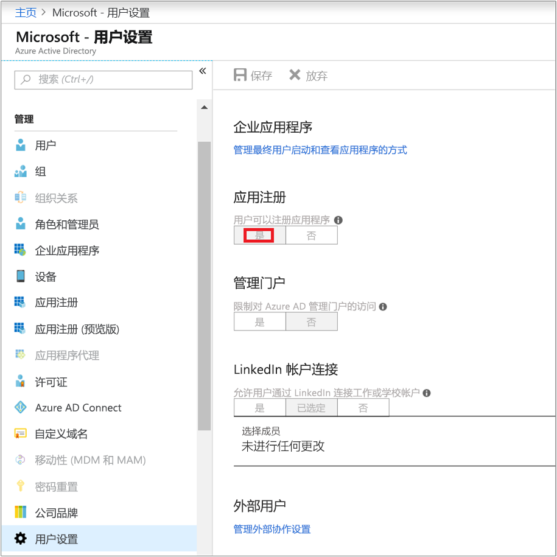
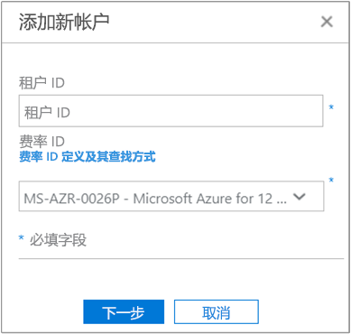
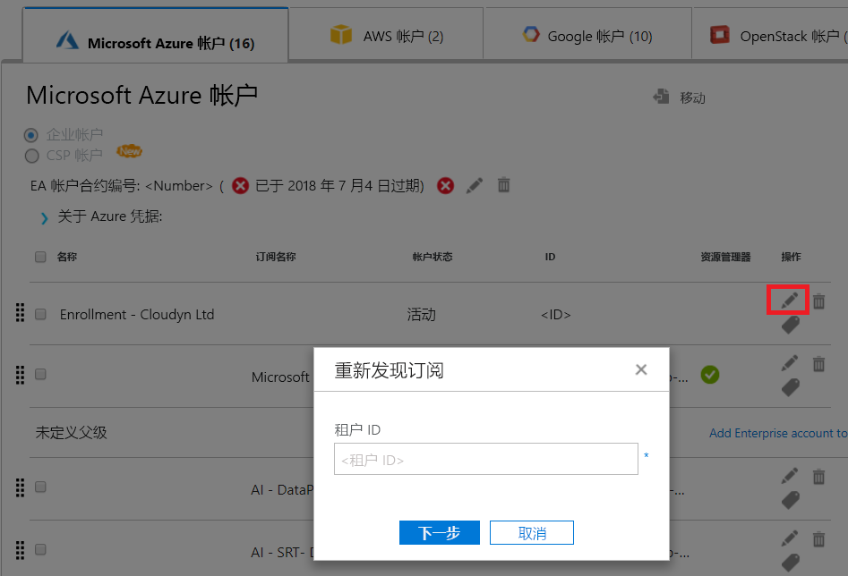

# 使用 Azure 成本管理激活 Azure 订阅和帐户

添加或更新 Azure 资源管理器凭据可让 Azure 成本管理发现 Azure 租户中的所有帐户和订阅。 如果还在虚拟机上启用了 Azure 诊断扩展，则 Azure 成本管理可以收集 CPU 和内存等扩展指标。 本文介绍如何使用适用于新帐户和现有帐户的 Azure 资源管理器 API 实现访问。 此外，还介绍如何解决常见的帐户问题。

当订阅处于未激活状态时，Azure 成本管理无法访问大多数 Azure 订阅数据。 必须编辑未激活的帐户，以便 Azure 成本管理可以访问它们。

## 所需的 Azure 权限

完成本文中的过程需要特定的权限。 你或你的租户管理员必须拥有以下两种权限：

- 在 Azure AD 租户中注册 CloudynCollector 应用程序的权限。
- 能够将应用程序分配到 Azure 订阅中的某个角色。

在 Azure 订阅中，你的帐户必须拥有 `Microsoft.Authorization/*/Write` 访问权限，可以分配 CloudynCollector 应用程序。 通过[所有者](../active-directory/role-based-access-built-in-roles.md#owner)角色或[用户访问管理员](../active-directory/role-based-access-built-in-roles.md#user-access-administrator)角色授权此操作。

如果你的帐户只是分配有“参与者”角色，则没有足够权限来分配应用程序。 尝试将 CloudynCollector 应用程序分配到 Azure 订阅时，会收到错误。

### 检查 Azure Active Directory 权限

1. 登录到 [Azure 门户](https://portal.azure.com)。
2. 在 Azure 门户中，选择“Azure Active Directory”。
3. 在 Azure Active Directory 中，选择“用户设置”。
4. 检查“应用注册”选项。
    - 如果该选项设置为“是”，则非管理员用户可以注册 AD 应用。 此设置意味着 Active AD 租户中的任何用户都可以注册应用。 可以转到“所需的 Azure 订阅权限”。  
    
    - 如果“应用注册”选项设置为“否”，则只有租户管理用户才能注册 Azure Active Directory 应用。 租户管理员必须注册 CloudynCollector 应用程序。

## 添加帐户或更新订阅

添加帐户或更新订阅时，需授予 Azure 成本管理对你的 Azure 数据的访问权限。

### 添加新帐户（订阅）

1. 在 Azure 成本管理门户中，单击右上方的齿轮符号，然后选择“云帐户”。
2. 单击“添加新帐户”，随即会显示“添加新帐户”框。 输入所需的信息。  
    

### 更新订阅

1. 若要在“帐户管理”中更新 Azure 成本管理中已存在的未激活订阅，请单击“租户 GUID”右侧的编辑铅笔符号。
    
2. 根据必要输入租户 ID。 如果不知道自己的租户 ID，可使用以下步骤找到它：
    1. 登录到 [Azure 门户](https://portal.azure.com)。
    2. 在 Azure 门户中，选择“Azure Active Directory”。
    3. 若要获取租户 ID，请选择 Azure AD 租户的“属性”。
    4. 复制目录 ID GUID。 此值即为租户 ID。
    有关详细信息，请参阅[获取租户 ID](../azure-resource-manager/resource-group-create-service-principal-portal.md#get-tenant-id)。
3. 根据选择费率 ID。 如果不知道自己的费率 ID，可以使用以下步骤找到它。
    1. 在 Azure 门户的右上角，单击自己的用户信息，然后单击“查看我的帐单”。
    2. 在“计费帐户”下，单击“订阅”。
    3. 在“我的订阅”下选择订阅。
    4. 费率 ID 显示在“产品/服务 ID”下。 复制订阅的产品/服务 ID。
4. 在“添加新帐户”（或“编辑订阅”）框中，单击“保存”（或“下一步”）。 随后将重定向到 Azure 门户。
5. 登录到门户。 单击“接受”授权 Azure 成本管理收集器访问你的 Azure 帐户。

    随后会重定向到 Azure 成本管理的帐户管理页，订阅中的帐户状态已更新为“活动”。 “资源管理器”列下应会显示一个绿色的勾选标记符号。

    如果有一个或多个订阅未显示绿色勾选标记符号，则表示你无权为订阅创建读取器应用 (CloudynCollector)。 具有更高订阅权限的用户需要重复此过程。

观看[使用 Cloudyn 提供的 Azure 成本管理连接到 Azure 资源管理器](https://youtu.be/oCIwvfBB6kk)视频，其中逐步演示了该过程。

>[!VIDEO https://www.youtube.com/embed/oCIwvfBB6kk?ecver=1]

## 解决常见的间接企业设置问题

首次使用 Azure 成本管理门户时，企业协议或云解决方案提供商 (CSP) 用户可能会看到以下消息：

- “设置 Azure 成本管理”向导中显示“指定的 API 密钥不是顶级登记密钥”。
- 企业协议门户中显示“直接登记 - 否”。
- Cloudyn 门户中显示“找不到过去 30 天的使用情况数据。请与分发商联系，确保为 Azure 成本管理门户中显示的 Azure 帐户启用了标记。

上面的错误消息表示 Azure 企业协议是通过经销商或 CSP 购买的。 经销商或 CSP 需为你的 Azure 帐户启用标记，这样，你才能在 Azure 成本管理中查看自己的数据。

下面是修复问题的方法：

1. 经销商需为你的帐户启用标记。 有关说明，请参阅[间接客户加入指南](https://ea.azure.com/api/v3Help/v2IndirectCustomerOnboardingGuide)。
2. 生成要在 Azure 成本管理中使用的 Azure 企业协议密钥。 有关说明，请参阅[注册 Azure 企业协议并查看成本数据](https://docs.microsoft.com/en-us/azure/cost-management/quick-register-ea)。

只有 Azure 服务管理员可以启用成本管理。 协同管理员的权限不足。

在生成用于设置 Azure 成本管理的 Azure 企业协议 API 密钥之前，必须遵照以下主题中的说明启用 Azure 计费 API：

- [面向企业客户的报告 API 概述](../billing/billing-enterprise-api.md)
- **实现对 API 的数据访问**中的 [Microsoft Azure Enterprise Portal 报告 API](https://ea.azure.com/helpdocs/reportingAPI)

可能还需要向部门管理员、帐户所有者和企业管理员授予使用计费 API 查看费用的权限。

## 后续步骤

- 如果尚未完成有关成本管理的第一本教程，请阅读[查看使用情况和成本](tutorial-review-usage.md)。
