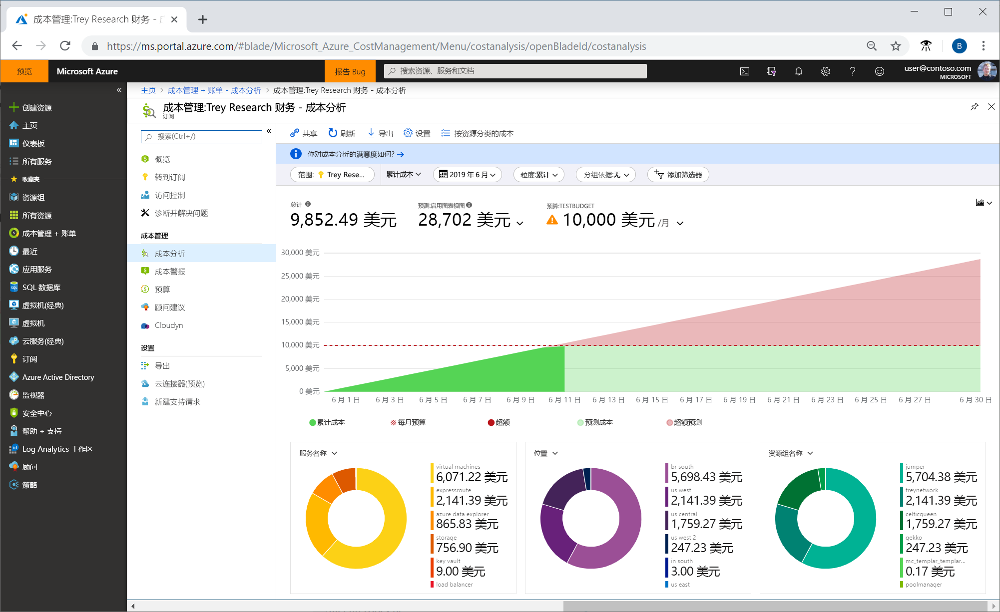
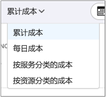
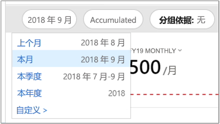
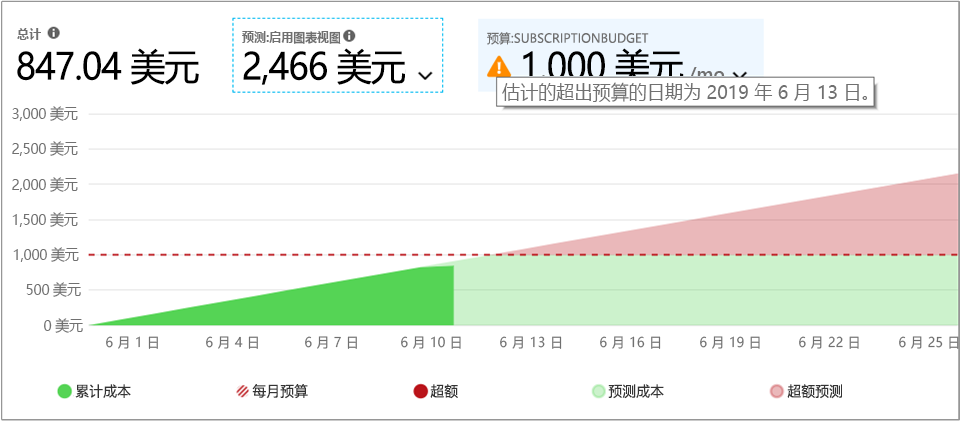
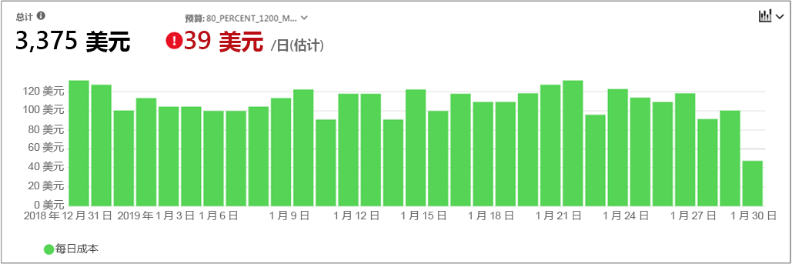
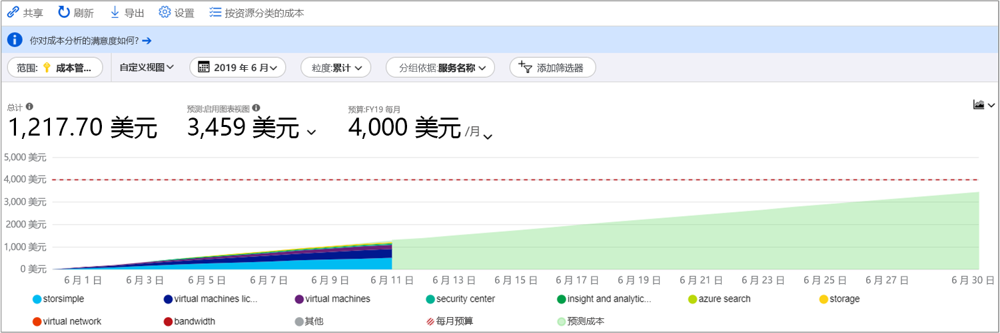
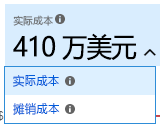
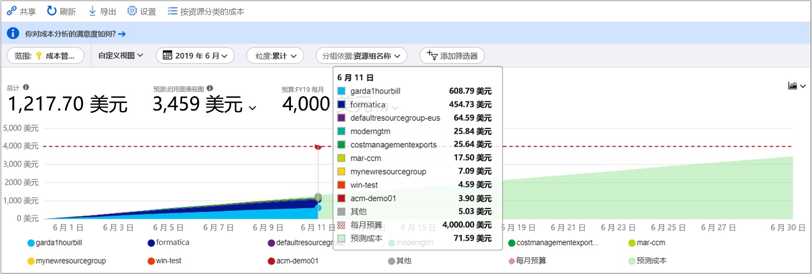
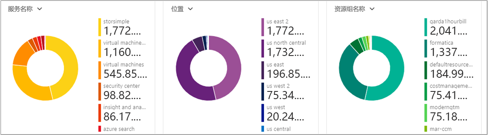
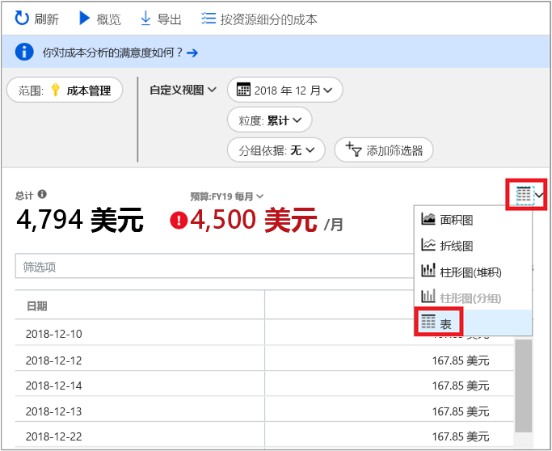

# <a name="quickstart-explore-and-analyze-costs-with-cost-analysis"></a>快速入门：通过成本分析了解和分析成本

需要知道你组织中哪些方面产生了成本，然后才能正确地控制和优化 Azure 成本。 这还有助于了解你服务的成本及其支持哪些环境和系统。 要准确地了解组织的支出模式，必须了解成本的方方面面。 在强制实施成本控制机制（如预算）时可使用支出模式。

在本快速入门中，你将通过成本分析了解和分析组织成本。 可以按组织查看合计成本，了解哪些方面持续产生成本并确定支出趋势。 可以查看一段时间的累计成本，根据预算预估每月、每季度甚至每年的成本趋势。 预算可帮助你遵守财务约束。 并且预算用于查看每日或每月成本，以隔离异常支出行为。 你还可下载当前报表的数据进行深入分析或在外部系统中使用。

此快速入门介绍如何：

- 通过成本分析查看成本
- 自定义成本视图
- 下载成本分析数据


## <a name="prerequisites"></a>先决条件

成本分析支持各种 Azure 帐户类型。 若要查看支持的帐户类型的完整列表，请参阅[了解成本管理数据](understand-cost-mgt-data.md)。 若要查看成本数据，你至少需要对 Azure 帐户具有读取访问权限。

对于[企业协议 (EA)](https://azure.microsoft.com/pricing/enterprise-agreement/) 客户，必须至少对以下一个或多个范围具有读取权限才能查看成本数据。

- 计费帐户
- 部门
- 注册帐户
- 管理组
- 订阅
- 资源组

若要详细了解如何分配对成本管理数据的访问权限，请参阅[分配对数据的访问权限](assign-access-acm-data.md)。

## <a name="sign-in-to-azure"></a>登录 Azure

- 通过 https://portal.azure.com 登录到 Azure 门户。

## <a name="review-costs-in-cost-analysis"></a>通过成本分析查看成本

若要通过成本分析查看成本，请在 Azure 门户打开范围并在菜单中选择“成本分析”  。 例如，导航到“订阅”，从列表中选择订阅，然后在菜单中选择“成本分析”   。 使用“范围”  框可在成本分析中切换到不同的范围。 有关范围的详细信息，请参阅[了解并使用范围](understand-work-scopes.md)。

所选的范围将用于整个成本管理，以提供数据整合和控制对成本信息的访问。 使用范围时，不要多选它们。 而应先选择一个汇总了其他范围的较大范围，然后筛选出所需的嵌套范围。 了解此方法很重要，因为某些用户可能无法访问单个涵盖多个嵌套范围的父范围。

初始成本分析视图包括以下方面：

**聚合成本视图** - 表示预定义的成本分析视图配置。 每个视图包含日期范围、粒度、分组依据和筛选器设置。 默认视图显示当前计费周期的聚合成本，但可以更改为其他内置视图。 有关详细信息，请参阅[自定义成本视图](#customize-cost-views)。

**实际成本** - 显示当前月份的总使用量和购买成本。这些购买成本是应记成本，会显示在账单上。

**预测** - 显示所选时间段的预测成本总计（预测为预览版）。

预算 - 显示所选范围的计划支出限额（如可用）  。

**累计粒度** - 显示从计费周期开始算起的累计每日成本总额。 为计费帐户或订阅[创建预算](tutorial-acm-create-budgets.md)后，可快速查看对预算而言的支出趋势。 将鼠标悬停某个日期上以查看该天的累计成本。

透视图（圆环图）  – 提供动态透视，按一组常见标准属性分解总成本。 它们显示当月的最高成本至最低成本。 通过选择不同的透视，可以随时更改透视图。 成本按以下类别分类：服务（计量类别）、位置（区域）和子范围（默认）。 例如，注册帐户在计费帐户之下，资源组在订阅之下，资源在资源组之下。



## <a name="customize-cost-views"></a>自定义成本视图

成本分析有四个内置视图，这些视图已针对最常见的目标进行优化：

查看 | 回答各种问题，例如...
--- | ---
累计成本 | 这个月目前的支出是多少？ 在预算范围内吗？
每日成本 | 过去 30 天的每日成本是否有增加？
按服务划分的成本 | 过去 3 张发票的每月使用情况是否有变化？
按资源划分的成本 | 从这个月目前的情况来看，哪些资源的成本最高？



但是，在很多情况下需要更深入的分析。 在页面顶部通过数据选择进行自定义。

默认情况下，成本分析显示当前月份的数据。 使用日期选择器，快速切换到常用的日期范围。 例如：过去七天、上个月、本年度或自定义日期范围。 即用即付订阅还包括基于计费周期的日期范围，该周期并未与日历月绑定，例如当前的计费周期或上一张发票。 使用菜单顶部的 **<上一周期** 和 **下一周期>** 链接分别跳至上一周期或下一周期。 例如， **<上一周期** 会从过去七天切换到 8-14 天之前，然后切换到 15-21 天之前。



默认情况下，成本分析显示“累计”成本  。 累计成本显示包括前几天在内的每日费用总额，显示每日应计成本不断变化的情况。 此视图已进行优化，可显示对预算而言所选日期范围的支出趋势。

使用预测图表视图时，可以确定潜在的预算违规情况。 如果有可能的预算违规情况，则会以红色显示预计的超支。 另外还会在图表中显示一个指示符。 将鼠标悬停在该符号上会显示估计的预算违规日期。



此外，还有每日  视图显示每日成本。 每日视图不会显示增长趋势。 该视图旨在显示异常，如每日的成本峰值或 dip。 如果选择了预算，则每日视图还会显示每日预算的估算值。 如果你的每日成本不断高于估算的每日预算，则可能会超出每月预算。 估算的每日预算只是一种可在较浅显的层面上帮助你直观查看预算的方式。 如果每日成本出现波动，则与每月预算比较，估算的每日预算不太准确。

下面是一个已启用支出预测功能的每日视图，显示了最近的支出。


关闭支出预测功能以后，会看不到将来日期的预计支出。 另外，当你查看过去时间段的成本时，成本预测不显示成本。

通常情况下，有望在 8-12 小时内看到所用资源的数据或者通知。


 “分组依据”通用属性，用于细分成本并确定排名靠前的贡献因素。 例如，若要按资源标记分组，请选择要按其分组的标记键。 成本按每个标记值进行细分，并且有一个额外的段，用于未应用该标记的资源。

大多数 [Azure 资源支持标记](../azure-resource-manager/tag-support.md)，但某些标记在“成本管理”和“计费”中不可用。 此外，不支持资源组标记。 成本管理仅自标记直接应用到资源之日起支持资源标记。 观看 [How to review tag policies with Azure Cost Management](https://www.youtube.com/watch?v=nHQYcYGKuyw)（如何通过 Azure 成本管理查看标记策略）视频，了解如何使用 Azure 标记策略来改进成本数据可见性。

下面是当前月份的 Azure 服务成本视图。



默认情况下，成本分析会显示所有使用情况和应记购买成本（也称“实际成本”），并会将其显示在发票上。  查看实际成本适用于发票对帐；但是，在观察成本中的支出异常和其他变化时，需警觉成本中的购买峰值。 若要抹平因预留购买成本导致的峰值，请切换到“摊销成本”。  



摊销成本会将预留购买细分成每日区块，将其平摊到整个预留期间。 例如，你会看到从 1 月 1 日到 12 月 31 日这段时间每天都有一个 1 美元的购买项，而不是在 1 月 1 日有一个 365 美元的购买项。 除了基本摊销，系统还会将这些成本重新分配并与使用了预留的特定资源相关联。 例如，如果将那个 1 美元的每日费用分摊到两个虚拟机，则会看到该日有两个 0.50 美元的费用。 如果该日的部分预留未使用，则会看到一个与相应的虚拟机关联的 0.50 美元费用，以及另一个费用类型为 `UnusedReservation` 的 0.50 美元费用。 请注意，未使用的预留成本只能在查看摊销成本时看到。

必须指出，由于成本表示方式的变化，实际成本和摊销成本视图会显示不同的总计数字。 通常情况下，在查看摊销成本时，有预留购买的月份的总成本会下降，而预留购买之后的月份的总成本会上升。 目前，摊销仅适用于预留购买，不适用于 Azure 市场购买。

下图显示了资源组名称。 可以按标记分组，以便按标记查看总成本；也可以使用“按资源分类的成本”视图，查看特定资源的所有标记的总成本。 



当按特定的属性对成本进行分组时，将按从最高到最低的顺序显示排名前 10 的成本贡献因素。 如果有 10 个以上的组，则会显示排名前九的组和一个“其他”  组，该组包括了剩余的所有组。 按标记分组时，也可能会看到成本的“非标记”组，这是一个未应用标记键的组。  **非标记**总是位于最后，即使非标记成本高于标记成本。 如果存在 10 个或更多个标记值，则非标记成本将会列在“其他”中。 

“经典”  虚拟机、网络和存储资源不共享详细的计费数据。 当对成本进行分组时，它们合并为**经典服务**。

主图下的透视图显示了不同的分组，让你在更大范围内了解所选时段和筛选器对应的总体成本。 选择一个属性或标记即可按任意维度查看聚合的成本。



你可以查看任何视图的完整数据集。 你应用的选择或筛选器会影响所显示的数据。 若要查看完整的数据集，请单击“图表类型”  列表，然后单击“表”  视图。




## <a name="understanding-grouping-and-filtering-options"></a>了解分组和筛选选项

下表列出了一些最常见的分组和筛选选项以及应该何时使用它们。

| 属性 | 使用时机 |
| --- | --- |
| **计费周期** | 按发票月份细分成本。 对于未绑定到日历月份的即用即付和开发/测试订阅很重要。 EA/MCA 帐户可以使用日期选取器中的日历月份和/或每月粒度来完成同一目标。 |
| **费用类型** | 细分使用量、购买、退款和未使用预留成本。 只有在使用操作成本而不使用摊销成本时，预留购买和退款才适用。 只有在查看摊销成本时，未使用预留成本才适用。 |
| **云** | 按 AWS 和 Azure 细分成本。 仅管理组、外部计费帐户和外部订阅提供 AWS 成本。 |
| **部门** / **发票部分** | 按 EA 部门或 MCA 发票部分细分成本。 仅适用于 EA/MCA 计费帐户和 MCA 计费对象信息。 |
| **注册帐户** | 按 EA 帐户所有者细分成本。 仅适用于 EA 计费帐户和部门。 |
| **频率** | 细分基于使用情况的一次性定期成本。 |
| **计量** | 按 Azure 使用情况计量细分成本。 仅适用于 Azure 使用情况。 所有购买和 Azure 市场使用情况会显示“未指定”或“未分配”。 |
| **发布者类型** | 细分 AWS、Azure 和 Azure 市场成本。 |
| **预留** | 按预留细分成本。 任何不包含预留的使用情况会显示为“未指定”。 |
| **资源** | 按资源细分成本。 所有购买都会显示为“未指定”，因为它们是在 EA/PAYG 计费帐户或 MCA 计费对象信息级别应用的。  |
| **资源组** | 按资源组细分成本。 仅适用于非经典使用情况。 经典资源使用情况会显示“其他”，购买会显示“未指定”。 |
| **资源类型** | 按资源类型细分成本。 仅适用于非经典使用情况。 经典资源使用情况会显示“其他”，购买会显示“未指定”。 |
| **服务名称**或**计量类别** | 按 Azure 服务细分成本。 仅适用于 Azure 使用情况。 所有购买和 Azure 市场使用情况会显示“未指定”或“未分配”。 |
| **服务层级**或**计量子类别** | 按 Azure 使用情况计量子分类细分成本。 仅适用于 Azure 使用情况。 所有购买和 Azure 市场使用情况会显示“未指定”或“未分配”。 |
| **订阅** | 按订阅细分成本。 所有购买显示“未指定”。 |
| **标记** | 按特定标记键的标记值细分成本。 |

有关术语的详细信息，请参阅[了解在 Azure 使用情况和费用文件中使用的术语](../billing/billing-understand-your-usage.md)。


## <a name="saving-and-sharing-customized-views"></a>保存和共享自定义视图

保存自定义视图并将其与他人共享，方法是将成本分析固定到 Azure 门户仪表板或复制成本分析的链接。 

若要固定成本分析，请单击右上角的图钉图标。 固定成本分析只会保存主图表或表视图（如果已选中）。 共享仪表板，允许他人访问此磁贴。 请注意，这只共享仪表板配置，并不授予他人访问基础数据的权限。 如果某人没有成本访问权限但有共享仪表板的访问权限，则会看到“拒绝访问”消息。

若要共享成本分析链接，请单击边栏选项卡顶部的“共享”命令。  将会显示一个自定义 URL，该 URL 会打开这个针对此特定范围的特定视图。 如果没有成本访问权限的某人获得了此 URL，则会在访问时看到“拒绝访问”消息。 

若要详细了解如何针对每个受支持的范围授予成本访问权限，请参阅[了解并使用范围](understand-work-scopes.md)。

## <a name="automation-and-offline-analysis"></a>自动化和脱机分析

有时候，需要下载数据进行进一步的分析、将其与你自己的数据合并，或者将其集成到你自己的系统中。 成本管理提供下面的一些选项。 刚开始的时候，如果需要临时的概略性摘要（类似于在成本分析中获得的摘要），则请构建所需的视图，然后进行下载，方法是：单击“导出”，选择“将数据下载到 CSV”或“将数据下载到 Excel”。    Excel 下载提供用于生成下载的视图的其他上下文，例如范围、查询配置、总计以及生成日期。

如果需要完整的非聚合数据集，请从计费帐户下载。 从门户左侧导航栏的服务列表中，转到“成本管理 + 计费”>（根据情况选择计费帐户）>“使用情况 + 费用”，然后单击与所需计费周期相对应的“下载”图标。

如需自动获取成本数据，可以使用类似的方法：使用[查询 API](/rest/api/cost-management/query) 进行较丰富的分析，包括动态筛选、分组和聚合，或者使用 [UsageDetails API](/rest/api/consumption/usageDetails) 获取完整的非聚合数据集。 这些 API 的 GA 版为 2019-01-01。 使用 **2019-04-01-preview** 可以在这些 API 中访问预览版预留和 Azure 市场购买。 

例如，我们可以获取一个按费用类型（使用情况、购买或退款）、发布者类型（Azure 或 Azure 市场）、资源组（如果是购买，则此项为空）和预留（如果不适用，则此项为空）细分的摊销成本的聚合视图。

```
POST https://management.azure.com/{scope}/providers/Microsoft.CostManagement/query?api-version=2019-04-01-preview
Content-Type: application/json
 
{
  "type": "AmortizedCost",
  "timeframe": "Custom",
  "timePeriod": { "from": "2019-04-01", "to": "2019-04-30" },
  "dataset": {
    "granularity": "None",
    "aggregation": {
      "totalCost": { "name": "PreTaxCost", "function": "Sum" }
    },
    "grouping": [
      { "type": "dimension", "name": "ChargeType" },
      { "type": "dimension", "name": "PublisherType" },
      { "type": "dimension", "name": "Frequency" },
      { "type": "dimension", "name": "ResourceGroup" },
      { "type": "dimension", "name": "SubscriptionName" },
      { "type": "dimension", "name": "SubscriptionId" },
      { "type": "dimension", "name": "ReservationName" },
      { "type": "dimension", "name": "ReservationId" },
    ]
  },
}
```

如果不需聚合而首选完整的原始数据集，则请执行以下操作：

```
GET https://management.azure.com/{scope}/providers/Microsoft.Consumption/usageDetails?metric=AmortizedCost&$filter=properties/usageStart+ge+'2019-04-01'+AND+properties/usageEnd+le+'2019-04-30'&api-version=2019-04-01-preview
```

如果需要实际成本，以便将购买显示为应记项，则请将 **type**/**metric** 更改为 **ActualCost**。 有关这些 API 的详细信息，请参阅[查询](/rest/api/cost-management/query)和 [UsageDetails](/rest/api/consumption/usageDetails) API 文档。 请注意，这两个已发布的文档均适用于 GA 版本，但也适用于新的 type/metric 特性和已更改属性名称范围之外的 2019-04-01-preview API 版本。 （下面提供有关属性名称的更多内容。）
 
成本管理 API 适用于基于资源的所有范围。 即，通过 Azure RBAC 访问权限获取的资源组、订阅和管理组，通过 EA 门户访问权限获取的 EA 计费帐户（注册）、部门和注册帐户，等等。 在[了解并使用范围](understand-work-scopes.md)中详细了解范围，包括如何确定范围 ID 以及/或者如何管理访问权限。

## <a name="next-steps"></a>后续步骤

转到第一个教程，了解如何创建并管理预算。

> [!div class="nextstepaction"]
> [创建并管理预算](tutorial-acm-create-budgets.md)
