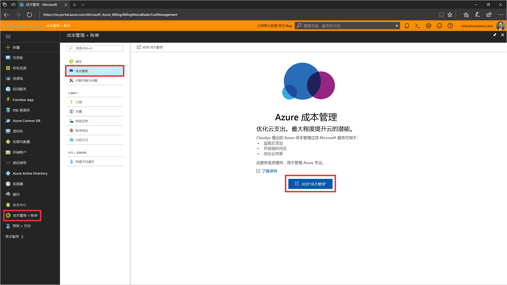
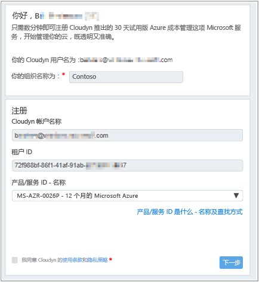
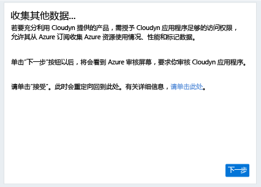
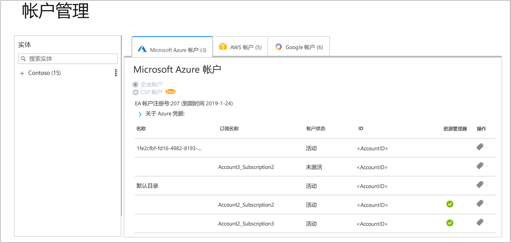

# 注册一个单独的 Azure 订阅并查看成本数据

使用 Azure 订阅在 Azure 成本管理中注册。 注册后可以访问 Cloudyn 门户。 本快速入门将详细介绍创建 Cloudyn 试用订阅和登录到 Cloudyn 门户所需的注册过程。 此外，还将演示如何立即开始查看成本数据。

## 登录 Azure

- 通过 http://portal.azure.com 登录到 Azure 门户。

## 向 Azure 成本管理注册

1. 在 Azure 门户中，单击服务列表中的“成本管理 + 计费”。
2. 在“概览”下，单击“成本管理”  
    
3. 在“成本管理”页上，单击“转到成本管理”，以在新窗口中打开 Cloudyn 注册页。
4. 在 Cloudyn 门户试用注册页上，键入公司名称，然后选择“Azure 个人订阅所有者”，然后单击“下一步”。 你的帐户名称和租户 ID 被自动添加到窗体。  
    
5. 选择与你的订阅相关联的“产品/服务 ID - 名称”。 如果不确定你的订阅的费率 ID，可以查看 Azure 账单或查找“产品/服务 ID”。
6. 同意“使用条款”，并验证相关信息，然后单击“下一步”。
7. 在“获取其他数据”页，单击“下一步”，以授权 Cloudyn 收集 Azure 资源数据。 收集的数据包括订阅的使用情况、性能、计费和标记数据。  
    
8. 你的浏览器会将你转到 Cloudyn 的登录页。 使用 Azure 订阅凭据登录。
9. 单击“转到 Cloudyn”，以打开 Cloudyn 门户，然后在“帐户管理”页，应该可以看到你的 Azure 订阅帐户信息。  
    

若要观看有关如何注册 Azure 订阅的视频教程，请参阅[在 Azure 成本管理中查找要使用的目录 GUID 和费率 ID](https://youtu.be/PaRjnyaNGMI)。

[!INCLUDE [cost-management-create-account-view-data](../../includes/cost-management-create-account-view-data.md)]

## 后续步骤

在快速入门中，使用你的 Azure 订阅信息注册成本管理。 此外，还会登录到 Cloudyn 门户并开始查看成本数据。 若要详细了解 Azure 成本管理，请继续学习成本管理教程。

> [!div class="nextstepaction"]
> [查看使用情况和成本](./tutorial-review-usage.md)
