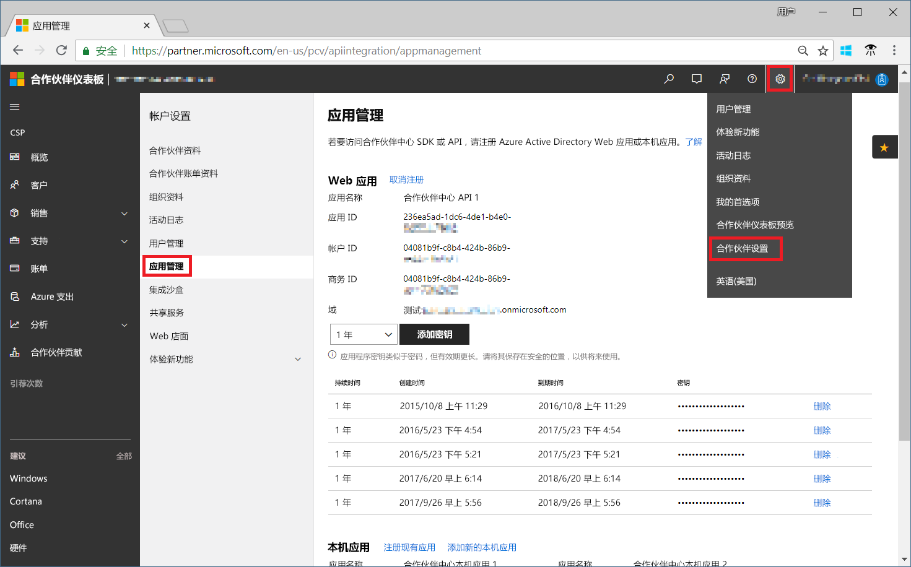
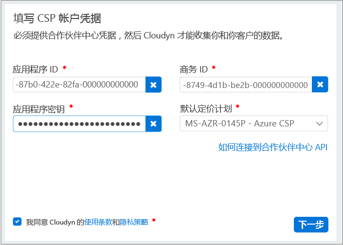

# 注册 CSP 合作伙伴计划并查看成本数据

作为 CSP 合作伙伴，可以注册由 Cloudyn 提供的 Azure 成本管理。 注册后可以访问 Cloudyn 门户。 本快速入门详细介绍创建 Cloudyn 试用订阅和登录到 Cloudyn 门户所需的注册过程。 它还演示如何立即开始查看成本数据。

若要完成注册，必须是有权访问合作伙伴中心 API 的合作伙伴计划管理员。 需要配置合作伙伴中心 API 才能进行身份验证和数据访问。 有关详细信息，请参阅“连接到合作伙伴中心 API”。

## 登录 Azure

- 通过 http://portal.azure.com 登录到 Azure 门户。

## 创建试用注册

1. 在 Azure 门户中，单击服务列表中的“成本管理 + 计费”。
2. 在“概述”下，单击“成本管理”  
    
3. 在“成本管理”页上，单击“转到成本管理”，在新窗口中打开“Cloudyn 注册”页。
4. 在 Cloudyn 门户试用注册页上，键入公司名称，选择“Microsoft CSP 合作伙伴计划管理员”，然后单击“下一步”。  
5. 输入 **应用程序 ID**、**商务 ID**、**应用程序密钥**，然后选择“默认定价计划”。 如果手边没有相关信息，请使用主管理员帐户登录到合作伙伴中心门户（[https://partnercenter.microsoft.com](https://partnercenter.microsoft.com)）并执行以下步骤：
  1. 转到“仪表板” > “帐户设置” > “应用管理”。
  2. 如果之前已创建 Web 应用，请跳过此步骤。 否则，请单击“Web 应用”部分中的“添加新 Web 应用”。
  3. 从 Web 应用程序复制“应用程序 ID”GUID。
  4. 根据需要将密钥有效期选为一年或两年。 选择“添加密钥”，然后复制并保存密钥值。  
    
  5. 返回到注册页并粘贴相应信息。  
      
6. 同意“使用条款”，并验证相关信息。 单击“下一步”，授权 Cloudyn 收集 Azure 资源数据。 收集的数据包括订阅的使用情况、性能、计费和标记数据。  
7. 在“邀请其他利益干系人”下，可以通过键入其电子邮件地址来添加用户。 完成后，单击“下一步”。 将所有计费数据添加到 Cloudyn 大约需要两个小时。
8. 单击“转到 Cloudyn”打开 Cloudyn 门户，然后在“云帐户管理”页上，应看到已注册的 CSP 帐户信息。

[!INCLUDE [cost-management-create-account-view-data](../../includes/cost-management-create-account-view-data.md)]

## 后续步骤

在本快速入门中，使用 CSP 信息注册了成本管理。 还登录到了 Cloudyn 门户并开始查看成本数据。 若要了解有关 Cloudyn 提供的 Azure 成本管理的详细信息，请继续学习成本管理教程。

> [!div class="nextstepaction"]
> [查看成本数据](./tutorial-review-usage.md)

