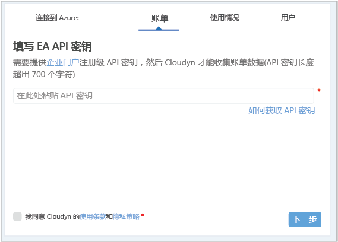
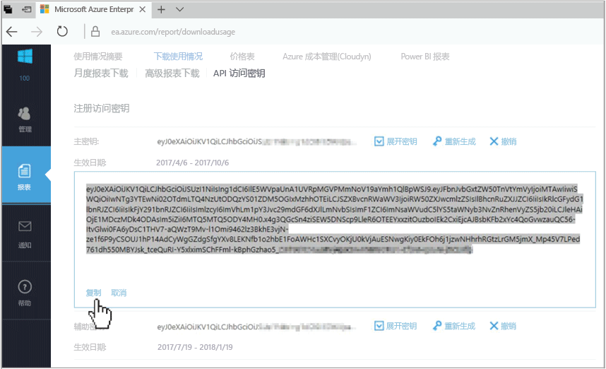
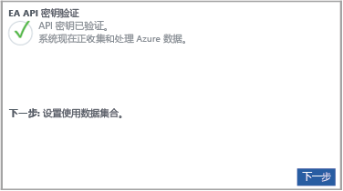

# 注册 Azure 企业协议并查看成本数据

可使用 Azure 企业协议注册由 Cloudyn 提供的 Azure 成本管理。 注册后可以访问 Cloudyn 门户。 本快速入门将详细介绍创建 Cloudyn 试用订阅和登录到 Cloudyn 门户所需的注册过程。 此外，还将演示如何立即开始查看成本数据。

## 登录 Azure

- 通过 http://portal.azure.com 登录到 Azure 门户。

## 创建试用注册

1. 在 Azure 门户中，单击服务列表中的“成本管理 + 计费”。
2. 在“概览”下，单击“成本管理”  
    
3. 在“成本管理”页上，单击“转到成本管理”，在新窗口中打开“Cloudyn 注册”页。
4. 在 Cloudyn 门户试用注册页上，键入公司名称，然后选择“Azure 企业合约管理员”。  
    
5. 输入企业门户注册 API 密钥。 如果手边没有密钥，请单击[企业门户](https://ea.azure.com)链接并执行以下步骤：
  1. 登录 Azure Enterprise 网站并单击“报告”，单击“API 访问密钥”，然后复制主密钥。  
    
  3. 返回到注册页并粘贴 API 密钥。
6. 同意“使用条款”，并验证密钥。 单击“下一步”，授权 Cloudyn 收集 Azure 资源数据。 收集的数据包括订阅的使用情况、性能、计费和标记数据。  
    
7. 在“邀请其他利益干系人”下，可以通过键入其电子邮件地址来添加用户。 完成后，单击“下一步”。 将所有计费数据添加到 Cloudyn 大约需要两个小时。
8. 单击“转到 Cloudyn”打开 Cloudyn 门户，然后在“云帐户管理”页上，应看到已注册的 EA 帐户信息。

[!INCLUDE [cost-management-create-account-view-data](../../includes/cost-management-create-account-view-data.md)]

## 后续步骤

在本快速入门中，使用 Azure 企业协议信息注册了成本管理。 还登录到了 Cloudyn 门户并开始查看成本数据。 若要了解有关 Cloudyn 提供的 Azure 成本管理的详细信息，请继续学习成本管理教程。

> [!div class="nextstepaction"]
> [查看成本数据](./tutorial-review-usage.md)
