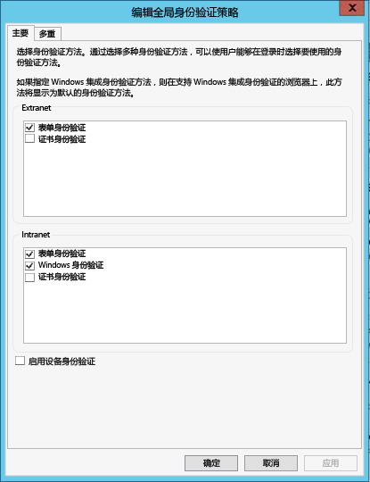
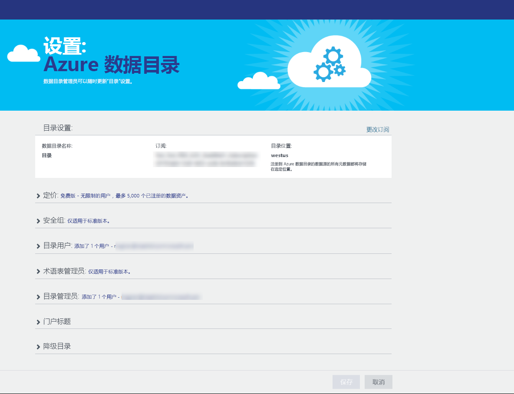
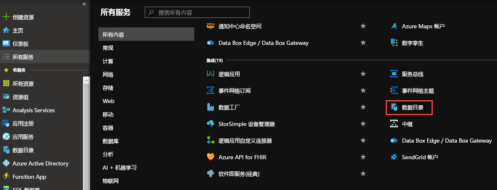
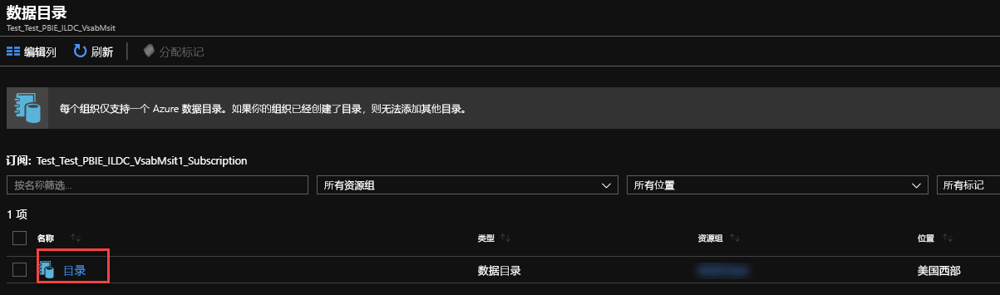
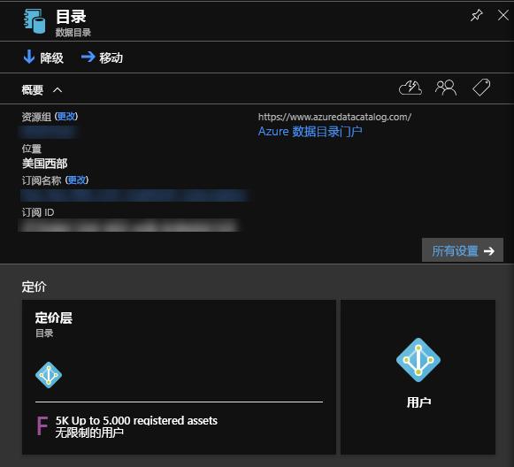
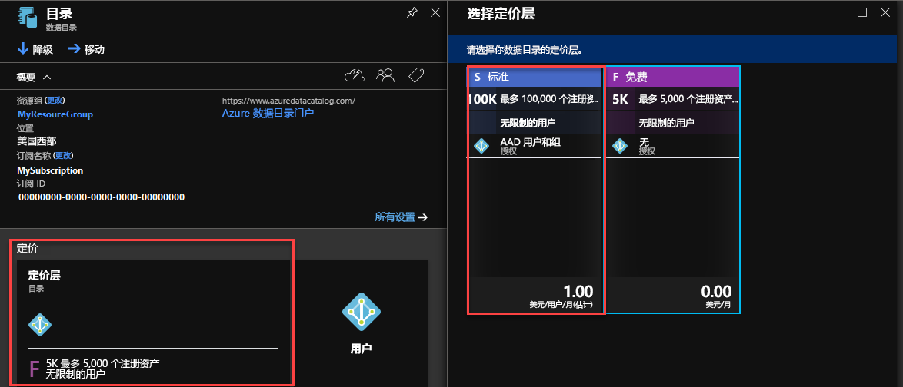

# Azure 数据目录入门
Azure 数据目录是一个完全托管的云服务，具有企业数据资产的注册系统和发现系统的功能。 有关详细的概述，请参阅 [What is Azure Data Catalog](data-catalog-what-is-data-catalog.md)（什么是 Azure 数据目录）。

本教程帮助用户开始使用 Azure 数据目录。 将在本教程中执行以下过程：

| 过程 | 说明 |
|:--- |:--- |
| [预配数据目录](#provision-data-catalog) |在此过程中预配或设置 Azure 数据目录。 仅当以前尚未设置目录时才执行此步骤。 即使有多个订阅与 Azure 帐户关联，每个组织也只能有一个数据目录（Microsoft Azure Active Directory 域）。 |
| [注册数据资产](#register-data-assets) |在此过程中，将 AdventureWorks2014 示例数据库中的数据资产注册到数据目录。 注册是从数据源提取关键结构元数据（例如名称、类型和位置）并将该元数据复制到目录的过程。 数据源与数据资产保留在原地，但目录使用元数据，使数据源及其数据更容易发现和识别。 |
| [发现数据资产](#discover-data-assets) |在此过程中，使用 Azure 数据目录门户发现上一步骤注册的数据资产。 将数据源注册到 Azure 数据目录之后，其元数据将由此服务编制索引，使用户可以轻松搜索所需的数据。 |
| [批注数据资产](#annotate-data-assets) |在此过程中，为数据资产提供注释（描述、标记、文档或专家等信息）。 这些信息可以补充从数据源提取的元数据，使更多人可以更轻松识别数据源。 |
| [连接到数据资产](#connect-to-data-assets) |在此过程中，通过集成式客户端工具（例如 Excel 和 SQL Server 数据工具）和非集成式工具（SQL Server Management Studio）打开数据资产。 |
| [管理数据资产](#manage-data-assets) |在此过程中，设置数据资产的安全性。 数据目录不允许用户访问数据本身。 数据源的所有者将控制数据访问权限。    使用数据目录可以发现数据源，以及查看与目录中注册的源相关的 **元数据** 。 但在某些情况下，只有特定用户或特定组的成员才能看到数据源。 对于这种情况，可以使用数据目录获取目录中已注册数据资产的所有权，以及控制拥有的资产的可见性。 |
| [删除数据资产](#remove-data-assets) |在此程序中，了解如何删除数据目录中的数据资产。 |

## 教程先决条件
### Azure 订阅
只有 Azure 订阅的所有者或共同所有者才可以设置 Azure 数据目录。

Azure 订阅可帮助组织云服务资源的访问权限，例如 Azure 数据目录。 它们还可帮助控制如何根据资源使用量生成报告、计费及付费。 每一个订阅可以有不同的计费和付款设置，因此，根据部门、项目、区域办事处等，可以有不同的订阅和不同的计划。 每个云服务属于某个订阅，在设置 Azure 数据目录之前，必须先有订阅。 有关详细信息，请参阅 [Manage accounts, subscriptions, and administrative roles](../active-directory/active-directory-how-subscriptions-associated-directory.md)（管理帐户、订阅和管理角色）。

如果没有订阅，只需花费几分钟就能创建一个免费试用帐户。 有关详细信息，请参阅 [Free Trial](https://azure.microsoft.com/pricing/free-trial/) （免费试用）。

### Azure Active Directory
若要设置 Azure 数据目录，必须使用 Azure Active Directory (Azure AD) 用户帐户登录。 必须是 Azure 订阅的所有者或共同所有者。  

Azure AD 为企业提供在云中和本地轻松管理标识与访问权限的方式。 可以使用单个公司帐户或学校帐户登录到任何云或本地 Web 应用程序。 Azure 数据目录使用 Azure AD 对登录进行身份验证。 有关详细信息，请参阅 [What is Azure Active Directory](../active-directory/active-directory-whatis.md)（什么是 Azure Active Directory）。

### Azure Active Directory 策略配置
可能会遇到这种情况：可以登录 Azure 数据目录门户，但在尝试登录数据源注册工具时出现错误消息，导致无法登录。 在公司网络中操作或者从公司网络外部连接时，可能会发生这种情况。

注册工具使用 *窗体身份验证* 针对 Azure Active Directory 验证用户登录。 若要成功登录，Azure Active Directory 管理员必须在 *全局身份验证策略*中启用窗体验证。

使用全局验证策略，可以单独为 Intranet 和 Extranet 连接启用身份验证，如下图所示。 如果从中连接的网络未启用窗体身份验证，可能会发生登录错误。

 

有关详细信息，请参阅 [Configuring authentication policies](https://technet.microsoft.com/library/dn486781.aspx)（配置身份验证策略）。

## 预配数据目录
每个组织只能预配一个数据目录（Azure Active Directory 域）。 因此，如果属于此 Azure Active Directory 域的 Azure 订阅所有者或共同所有者已创建目录，则即使有多个 Azure 订阅，也无法再次创建目录。 若要测试 Azure Active Directory 域中的用户是否已创建数据目录，请转到 [Azure 数据目录主页](http://azuredatacatalog.com) 并确认是否看到了目录。 如果目录已创建，请跳过以下过程并转到下一部分。    

1. 转到[数据目录服务页](https://azure.microsoft.com/services/data-catalog)并单击“开始使用”。
   
    
2. 使用属于 Azure 订阅所有者或共同所有者的用户帐户登录。 登录后将看到以下页。
   
    
3. 指定数据目录的**名称**、要使用的**订阅**和目录的**位置**。
4. 展开“定价”，选择 Azure 数据目录的**版本**（“免费”或“标准”）。
    
5. 展开“目录用户”，然后单击“添加”添加数据目录的用户。 用户将自动添加到此组。
    
6. 展开“目录管理员”，然后单击“添加”添加数据目录的其他管理员。 用户将自动添加到此组。
    
7. 单击“创建目录”创建组织的数据目录。 创建数据目录后，将看到其主页。
        

### 在 Azure 门户中查找数据目录
1. 在Web 浏览器的另一个选项卡中或在不同的Web 浏览器窗口中，转到 [Azure 门户](https://portal.azure.com) ，然后使用上一步骤中用于创建数据目录的同一个帐户登录。
2. 选择“浏览”，然后单击“数据目录”。
   
     将看到所创建的数据目录。
   
    
3. 单击创建的目录。 门户中会出现“数据目录”边栏选项卡。
   
   
4. 可以查看数据目录的属性并进行更新。 例如，单击“定价层”并更改版本。
   
    

### Adventure Works 示例数据库
本教程将注册 AdventureWorks2014 示例数据库中用于 SQL Server Database Engine 的数据资产（表），但如果想使用熟悉且与角色相关的数据，也可以使用任何支持的数据源。 有关支持的数据源列表，请参阅 [Supported data sources](data-catalog-dsr.md)（支持的数据源）。

### 安装 Adventure Works 2014 OLTP 数据库
Adventure Works 数据库支持一家虚构自行车制造商 (Adventure Works Cycles) 的标准在线事务处理方案，包括产品、销售和采购。 本教程将在 Azure 数据目录中注册产品信息。

安装 Adventure Works 示例数据库：

1. 下载 CodePlex 上的 [Adventure Works 2014 Full Database Backup.zip](https://msftdbprodsamples.codeplex.com/downloads/get/880661) 。
2. 若要在计算机上还原数据库，请遵循 [Restore a Database Backup by using SQL Server Management Studio](http://msdn.microsoft.com/library/ms177429.aspx)（使用 SQL Server Management Studio 还原数据库备份）中的说明，或遵循以下步骤：
   1. 打开 SQL Server Management Studio，然后连接到 SQL Server 数据库引擎。
   2. 右键单击“数据库”，然后单击“还原数据库”。
   3. 在“还原数据库”下面，单击“源”对应的“设备”选项，然后单击“浏览”。
   4. 在“选择备份设备”下面，单击“添加”。
   5. 转到包含 **AdventureWorks2014.bak** 文件的文件夹，选择该文件，然后单击“确定”关闭“查找备份文件”对话框。
   6. 单击“确定”关闭“选择备份设备”对话框。    
   7. 单击“确定”关闭“还原数据库”对话框。

现在可以使用 Azure 数据目录注册 Adventure Works 示例数据库中的数据资产。

## 注册数据资产
在本练习中，可以使用注册工具将 Adventure Works 数据库中的数据资产注册到目录。 注册是从数据源及其包含的资产中提取关键结构元数据（例如名称、类型和位置），并将该元数据复制到目录的过程。 数据源与数据资产保留在原地，但目录使用元数据，使数据源及其数据更容易发现和识别。

### 注册数据源
1. 转到 [Azure 数据目录主页](https://azuredatacatalog.com)，单击“发布数据”。
   
   
2. 单击“启动应用程序”，在计算机上下载、安装并运行注册工具。
   
   
3. 在“欢迎”页上，单击“登录”并输入凭据。     
   
    
4. 在“Microsoft Azure 数据目录”页上，依次单击“SQL Server”和“下一步”。
   
    
5. 输入 **AdventureWorks2014** 的 SQL Server 连接属性（参阅以下示例），然后单击“连接”。
   
   
6. 注册数据资产的元数据。 在本示例中，将注册 AdventureWorks Production 命名空间中的 **Production/Product** 对象：
   
   1. 在“服务器层次结构”树中展开“AdventureWorks2014”，然后单击“Production”。
   2. 按住 Ctrl 键的同时单击鼠标，选择“Product”、“ProductCategory”、“ProductDescription”和“ProductPhoto”。
   3. 单击“移动所选箭头”(**>**)。 此操作将所有选定的对象移到“要注册的对象”列表中。
      
      
   4. 选择“包括预览”以包含数据的快照预览。 快照中包含最多 20 条来自各个表的记录，并且会复制到目录。
   5. 选择“包括数据配置文件”以包含数据配置文件的对象统计信息快照（例如：列的最小值、最大值和平均值以及行数）。
   6. 在“添加标签”字段中输入 **adventure works, cycles**。 此操作添加这些数据资产的搜索标记。 标记可帮助用户查找已注册的数据源，非常有用。
   7. 指定此数据的 **专家** 名称（可选）。
      
      
   8. 单击“注册”。 Azure 数据目录将注册选定的对象。 本练习将注册 Adventure Works 中的选定对象。 注册工具从数据资产提取元数据，将该数据复制到 Azure 数据目录服务。 数据将保留在其当前位置，仍受当前系统的管理员和策略的控制。
      
      
   9. 若要查看注册的数据源对象，请单击“查看门户”。 在 Azure 数据目录门户中，确认可在网格视图中看到所有四个表和数据库。
      
      

本练习已注册 Adventure Works 示例数据库中的对象，使整个组织中的用户可以轻松找到它们。 下一个练习介绍如何发现已注册的数据资产。

## 发现数据资产
Azure 数据目录中的发现使用两个主要机制：搜索和筛选。

搜索机制直截了当且功能强大。 默认情况下，将会根据目录中的任何属性（包括用户提供的批注）来匹配搜索词。

筛选是对搜索的补充。 可以选择特定特征，例如专家、数据源类型、对象类型和标记，来查看匹配的数据资产并将搜索结果限制为匹配的资产。

将搜索与筛选结合使用，可以快速导航已向 Azure 数据目录注册的数据源，发现所需的数据资产。

本练习使用 Azure 数据目录门户发现上一练习中注册的数据资产。 有关搜索语法的详细信息，请参阅 [Data Catalog Search syntax reference](https://msdn.microsoft.com/library/azure/mt267594.aspx) （数据目录搜索语法参考）。

下面是发现目录中数据资产的几个示例。  

### 使用基本搜索发现数据资产
基本搜索可帮助使用一个或多个搜索词搜索目录。 结果是与一个或多个指定搜索词的属性匹配的所有资产。

1. 在 Azure 数据目录门户中单击“主页”。 如果已关闭 Web 浏览器，请转到 [Azure 数据目录主页](https://www.azuredatacatalog.com)。
2. 在搜索框中输入 `cycles` ，然后按 **ENTER**。
   
    
3. 确认是否在结果中看到全部四个表和数据库 (AdventureWorks2014)。 可以单击工具栏上的按钮切换**网格视图**和**列表视图**，如下图所示。 请注意，由于“突出显示”选项为“打开”，因此搜索结果中突出显示了搜索关键字。 **每页显示的结果数** 。
   
    
   
    “搜索”面板位于左侧，“属性”面板位于右侧。 在“搜索”面板中，可以更改搜索条件和筛选结果。 “属性”面板显示网格或列表中所选对象的属性。
4. 单击搜索结果中的“Product”。 单击“预览”、“列”、“数据配置文件”和“文档”选项卡，或单击箭头展开底部窗格。  
   
    
   
    在“预览”选项卡上，可以看到 **Product** 表中数据的预览。  
5. 单击“列”选项卡查找有关数据资产列的详细信息（例如**名称**和**数据类型**）。
6. 单击“数据配置文件”选项卡查看数据资产中数据的分析（例如：行数、数据大小或列中的最小值）。
7. 使用左侧的“筛选器”筛选结果。 例如，单击“对象类型”对应的“表”，将只看到四个表，而看不到数据库。
   
    

### 使用属性范围发现数据资产
属性范围可帮助发现搜索词符合指定属性的数据资产。

1. 清除“筛选器”中“对象类型”下面的“表”筛选器。  
2. 在搜索框中输入 `tags:cycles` ，然后按 **ENTER**。 有关可用于搜索数据目录的所有属性，请参阅 [Data Catalog Search syntax reference](https://msdn.microsoft.com/library/azure/mt267594.aspx) （数据目录搜索语法参考）。
3. 确认是否在结果中看到全部四个表和数据库 (AdventureWorks2014)。  
   
    

### 保存搜索
1. 在“当前搜索”部分的“搜索”窗格中，输入搜索的名称并单击“保存”。
   
    
2. 确认已保存的搜索显示在“已保存的搜索”下面。
   
    
3. 选择可对已保存的搜索执行的操作（“重命名”、“删除”、“设为默认值”搜索）。
   
    

### 布尔运算符
可以使用布尔运算符来扩大或缩小搜索范围。

1. 在搜索框中输入 `tags:cycles AND objectType:table`，然后按 **ENTER**。
2. 确认结果中只显示了表，而未显示数据库。  
   
    

### 使用括号分组
使用括号分组可将一部分查询分组以实现逻辑隔离，尤其是与布尔运算符结合使用时。

1. 在搜索框中输入 `name:product AND (tags:cycles AND objectType:table)` ，然后按 **ENTER**。
2. 确认搜索结果中只显示了 **Product** 表。
   
       

### 比较运算符
使用比较运算符可以针对具有数字和日期数据类型的属性使用比较而非相等。

1. 在搜索框中输入 `lastRegisteredTime:>"06/09/2016"`。
2. 清除“对象类型”下面的“表”筛选器。
3. 按 **ENTER**。
4. 确认搜索结果中显示了 **Product**、**ProductCategory**、**ProductDescription** 和 **ProductPhoto** 表以及注册的 AdventureWorks2014 数据库。
   
    

有关发现数据资产的详细信息，请参阅[如何发现数据资产](data-catalog-how-to-discover.md)；有关搜索语法，请参阅[数据目录搜索语法参考](https://msdn.microsoft.com/library/azure/mt267594.aspx)。

## 批注数据资产
本练习使用 Azure 数据目录门户来批注前面在目录中注册的数据资产（添加描述、标记或专家等信息）。 提供的批注可以补充并增强在注册期间从数据源提取的结构元数据，方便发现和识别数据资产。

本练习将批注一个数据资产 (ProductPhoto)。 为 ProductPhoto 数据资产添加友好名称和描述。  

1. 转到 [Azure 数据目录主页](https://www.azuredatacatalog.com)，使用 `tags:cycles` 进行搜索，查找已注册的数据资产。  
2. 在搜索结果中单击“ProductPhoto”。  
3. 在“友好名称”中输入“产品图像”，在“描述”中输入“市场营销材料的产品照片”。
   
    
   
    “描述”可帮助其他人发现并识别为何及如何使用选定的数据资产。 还可以添加更多标记和查看列。 现在，可以使用已添加到目录的描述性元数据尝试，执行搜索和筛选来发现数据资产。

还可以在此页上执行以下操作：

* 添加数据资产的专家。 在“专家”区域中单击“添加”。
* 添加数据集级别的标记。 在“标记”区域中单击“添加”。 标记可以是用户标记或词汇标记。 标准版的数据目录包包含帮助目录管理员定义中心业务分类的业务词汇。 然后，目录用户可以使用词汇中的术语来批注数据资产。 有关详细信息，请参阅 [How to set up the Business Glossary for Governed Tagging](data-catalog-how-to-business-glossary.md)
* 添加列级别的标记。 针对想要批注的列，单击“标记”下面的“添加”。
* 添加列级别的描述。 输入列的 **描述** 。 还可以查看从数据源提取的描述元数据。
* 添加“请求访问”信息，向用户显示如何请求对数据资产的访问权限。
  
    
* 选择“文档”选项卡并提供数据资产的文档。 通过 Azure 数据目录文档，可以使用数据目录作为内容存储库，创建完整的数据资产叙述。
  
    

也可以针对多个数据资产添加一个批注。 例如，可以选择已注册的所有数据资产，以及指定这些资产的专家。

Azure 数据目录支持众包批注方式。 Azure 数据目录用户可以添加标记（用户或词汇）、描述和其他元数据，任何对数据资产及其用法有所见解的用户都能将此见解记录下来分享给其他用户。

有关批注数据资产的详细信息，请参阅 [How to annotate data assets](data-catalog-how-to-annotate.md) （如何批注数据资产）。

## 连接到数据资产
本练习使用连接信息在集成式客户端工具 (Excel) 和非集成式工具 (SQL Server Management Studio) 中打开数据资产。

> [!NOTE]
> 请务必记住，Azure 数据目录不允许访问实际数据源，它只能方便发现和识别数据源。 连接到数据源时，选择的客户端应用程序使用 Windows 凭据，或在必要时提示提供凭据。 如果以前未获得数据源的访问权限，则必须先获得授权才能连接。
> 
> 

### 从 Excel 连接到数据资产
1. 在搜索结果中选择“Product”。 单击工具栏上的“打开方式”，然后单击“Excel”。
   
    
2. 在下载弹出窗口中单击“打开”。 这种体验根据浏览器而有所不同。
   
    
3. 在“Microsoft Excel 安全声明”窗口中，单击“启用”。
   
    
4. 保留“导入数据”对话框中的默认值，然后单击“确定”。
   
    
5. 在 Excel 中查看数据源。
   
    

在本练习中，已连接到使用 Azure 数据目录发现的数据资产。 在 Azure 数据目录门户中，可以使用已集成到“打开方式”菜单中的客户端应用程序来直接建立连接。 也可以使用资产元数据中包含的连接位置信息来与选择的任何应用程序建立连接。 例如，可以使用 SQL Server Management Studio 连接到 AdventureWorks2014 数据库，访问本教程中注册的数据资产中的数据。

1. 打开 **SQL Server Management Studio**。
2. 在“连接到服务器”对话框中，输入 Azure 数据目录门户的“属性”窗格中显示的服务器名称。
3. 使用适当的身份验证和凭据访问数据资产。 如果没有访问权限，请使用“请求访问”字段中的信息来获取访问权限。
   
    

单击“查看连接字符串”查看 ADF.NET、ODBC 和 OLEDB 连接字符串，并将这些字符串复制到剪贴板，以便在应用程序中使用。

## 管理数据资产
在此步骤中了解如何设置数据资产的安全性。 数据目录不允许用户访问数据本身。 数据源的所有者将控制数据访问权限。

使用数据目录可以发现数据源，以及查看与目录中注册的源相关的元数据。 但在某些情况下，只有特定用户或特定组的成员才能看到数据源。 对于这种情况，可以使用数据目录获取目录中已注册数据资产的所有权，然后控制拥有的资产的可见性。

> [!NOTE]
> 本练习所述的管理功能只在标准版 Azure 数据目录中提供，免费版本不提供。
> 在 Azure 数据目录中，可以获取数据资产的所有权、添加数据资产的共同所有者，以及设置数据资产的可见性。
> 
> 

### 获取数据资产的所有权和限制可见性
1. 转到 [Azure 数据目录主页](https://www.azuredatacatalog.com)。 在“搜索”文本框中输入 `tags:cycles`，然后按 **ENTER**。
2. 在结果列表中单击某个项，然后单击工具栏上的“取得所有权”。
3. 在“属性”面板的“管理”部分中，单击“取得所有权”。
   
    
4. 若要限制可见性，请选择“可见性”部分的“所有者和这些用户”，然后单击“添加”。 **ENTER**。
   
    

## 删除数据资产
本练习使用 Azure 数据目录门户从已注册的数据资产中删除预览数据，然后从目录中删除数据资产。

在 Azure 数据目录中，可以删除单个资产或多个资产。

1. 转到 [Azure 数据目录主页](https://www.azuredatacatalog.com)。
2. 在“搜索”文本框中输入 `tags:cycles`，然后单击 **ENTER**。
3. 在结果列表中选择某个项，然后单击工具栏上的“删除”，如下图所示： 
   
    
   
    如果使用列表视图，此复选框将出现在项的左侧，如下图所示：
   
    
   
    也可以选择多个数据资产并将其删除，如下图所示：
   
    

> [!NOTE]
> 目录的默认行为是允许任何用户注册任何数据源，允许任何用户删除任何已注册的数据资产。 标准版 Azure 数据目录中包含的管理功能提供其他选项，用于取得资产所有权、限制谁可以发现资产，以及谁可以删除资产。
> 
> 

## 摘要
本教程介绍了 Azure 数据目录的基本功能，包括注册、批注、发现和管理企业数据资产。 完成本教程后，便可以开始使用此产品了。 一开始，可以注册自己和团队依赖的数据源，并邀请同事使用目录。

## 参考
* [How to register data assets](data-catalog-how-to-register.md)
* [How to discover data assets](data-catalog-how-to-discover.md)
* [How to annotate data assets](data-catalog-how-to-annotate.md)
* [How to document data assets](data-catalog-how-to-documentation.md)
* [How to connect to data assets](data-catalog-how-to-connect.md)
* [How to manage data assets](data-catalog-how-to-manage.md)

<!--HONumber=Nov16_HO2-->

