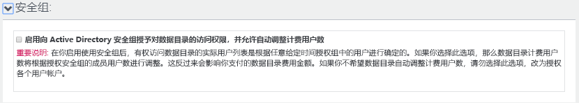
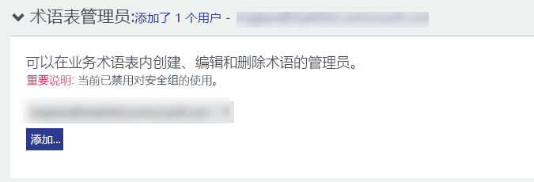
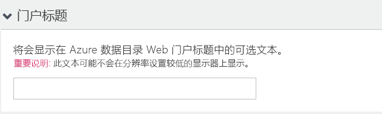

# 快速入门：创建 Azure 数据目录

Azure 数据目录是一个完全托管的云服务，具有企业数据资产的注册系统和发现系统的功能。 有关详细的概述，请参阅 [What is Azure Data Catalog](overview.md)（什么是 Azure 数据目录）。

本快速入门帮助你开始创建 Azure 数据目录。

如果还没有 Azure 订阅，可以在开始前创建一个[免费帐户](https://azure.microsoft.com/free/?WT.mc_id=A261C142F)。

## 先决条件

在开始之前，需要准备好以下各项：

* [Microsoft Azure](https://azure.microsoft.com/) 订阅。
* 需要有自己的 [Azure Active Directory 租户](../active-directory/fundamentals/active-directory-access-create-new-tenant.md)。

只有 Azure 订阅的所有者或共同所有者才可以设置数据目录。

## 创建数据目录

每个组织只能预配一个数据目录（Azure Active Directory 域）。 因此，如果属于此 Azure Active Directory 域的 Azure 订阅所有者或共同所有者已创建目录，则即使有多个 Azure 订阅，也无法再次创建目录。 若要测试 Azure Active Directory 域中的用户是否已创建数据目录，请转到 [Azure 数据目录主页](http://azuredatacatalog.com) 并确认是否看到了目录。 如果目录已创建，请跳过以下过程并转到下一部分。

1. 转到 [Azure 门户](https://portal.azure.com)， >  依次选择“创建资源”、“数据目录”。  

    

2. 指定数据目录的**名称**、要使用的**订阅**、目录的**位置**和**定价层**。 然后选择“创建”  。

3. 转到 [Azure 数据目录主页](http://azuredatacatalog.com)，单击“发布数据”。 

   

   也可以选择“开始”，通过[数据目录服务页](https://azure.microsoft.com/services/data-catalog)转到数据目录主页。 

   

4. 转到“设置”页。 

    

5. 展开“定价”，并检查 Azure 数据目录的**版本**（“免费”或“标准”）。 

    

6. 如果选择“标准”版作为定价层，则可以展开“安全组”，启用向 Active Directory 安全组授予对数据目录的访问权限，并启用自动调整计费。  

    

7. 展开“目录用户”，并单击“添加”添加数据目录的用户。   你将自动添加到此组。

    

8. 如果选择“标准”版作为定价层，则可以展开“术语表管理员”，然后单击“添加”以添加术语表管理员用户。    你将自动添加到此组。

    

9. 展开“目录管理员”，并单击“添加”添加数据目录的其他管理员。   你将自动添加到此组。

    

10. 展开“门户标题”，并添加要显示在门户标题中的其他文本。 

    

11. 完成“设置”页中的操作后，请导航到“发布”页。  

    

## 在 Azure 门户中查找数据目录

1. 在Web 浏览器的另一个选项卡中或在不同的Web 浏览器窗口中，转到 [Azure 门户](https://portal.azure.com) ，并使用上一步骤中用于创建数据目录的同一个帐户登录。

2. 选择“所有服务”，然后单击“数据目录”。  

    

    将看到所创建的数据目录。

    

3. 单击创建的目录。 门户中会出现“数据目录”边栏选项卡。 

   

4. 可以查看数据目录的属性并进行更新。 例如，单击“定价层”并更改版本。 

    

## 后续步骤

本快速入门已介绍如何为组织创建 Azure 数据目录。 现在，可以在数据目录中注册数据源。

> [!div class="nextstepaction"]
> [在 Azure 数据目录中注册数据源](data-catalog-how-to-register.md)
