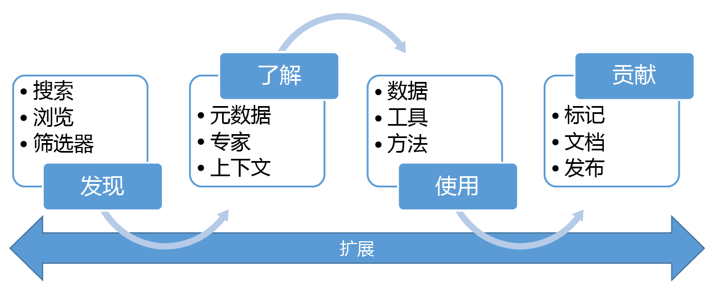

# 什么是 Azure 数据目录？
Azure 数据目录是完全托管的云服务，可让用户发现所需的数据源，理解他们找到的数据源，同时帮助组织从现有投资中获得更大的价值。 任何用户（从分析师到数据专家再到开发人员）都可以使用数据目录提供的功能来发现、理解和使用数据源。 数据目录包含元数据和批注的众包模型，可让所有用户运用他们的知识来构建数据社区和文化。

## 数据使用者面临的数据发现难题
一直以来，发现企业数据源都是基于部落知识的有机过程。 想要充分利用信息资产的公司面临诸多挑战。

* 除非用户在另一个过程中接触到数据源，否则并不知道有此数据源；数据源不会注册到哪个中心位置。
* 除非用户知道数据源的位置，否则无法使用客户端应用程序连接到数据；用户必须知道连接字符串或路径才能使用数据。
* 除非用户知道数据源的文档位置，否则无法了解数据的用途；数据源和文档位于不同的位置，需要通过不同的体验使用。
* 如果用户对信息资产有疑问，必须找到负责数据的专家或团队，在场外请教这些专家；在数据与数据用途上持有专业观点的专家之间，无法建立明确的连接管道。
* 除非用户了解请求访问数据源的过程，否则，发现数据源及其文档仍无法访问所需的数据。

## 数据生成者面临的数据发现难题
与数据使用者面临着难题一样，负责生成和维护信息资产的用户也面临着自身的难题。

* 使用描述性元数据批注数据源往往是白费心力；客户端应用程序通常忽略存储在数据源中的描述。
* 创建数据源的文档往往也是白费心力；将文档与数据源保持同步是一个持续性的职责，用户总是认为文档已过时，因此都不信任文档。
* 限制对数据源的访问，确保数据使用者知道如何请求访问是一个持续性的挑战。

创建和维护数据源的文档费时费力。 为了让使用数据源的每个用户可随时获取文档，面临的挑战通常更加艰巨。

这些挑战结合起来形成更大的障碍，使得公司难以鼓励和推动使用及理解企业数据。

## Azure 数据目录的帮助
数据目录旨在解决这些问题，使企业能够充分利用现有的信息资产。 数据目录可简化数据源的发现，帮助用户理解数据源及管理所需的数据。

数据目录提供基于云的服务，可在其中注册数据源。 数据保留在现有位置，但元数据的副本将连同数据源位置的引用一起添加到数据目录。 此元数据还会编制索引，方便通过搜索功能轻松发现每个数据源，并让发现数据源的用户理解该数据源。

注册数据源之后，执行注册的用户或企业中的其他用户可以充实其数据源的元数据。 任何用户都可以提供描述、标记或其他元数据（例如请求数据源访问权限的文档和过程）来批注数据源。 此描述性元数据可补充从数据源注册的结构元数据（例如列名和数据类型）。

注册源的主要目的是发现和理解数据源及其用途。 当企业用户在工作上（包括商业智能、应用程序开发、数据科研，或任何其他需要正确数据的任务）需要用到数据时，可以通过数据目录发现体验，快速找到符合要求的数据，理解数据以评估其适用性，以及在所选的工具中打开数据源使用该数据。 同时，数据目录允许用户通过标记、阐述和批注已注册的数据源以及注册新的数据源来补充目录，然后，目录用户社区可以发现、理解和使用新数据源。

## 数据目录入门
若要立即开始使用数据目录，请访问 [www.azuredatacatalog.com](https://www.azuredatacatalog.com)。

[此处](data-catalog-get-started.md)提供了入门指南。

## 了解有关数据目录的详细信息
若要了解有关数据目录功能的详细信息，请参阅：

* [How to register data sources](data-catalog-how-to-register.md)
* [How to discover data sources](data-catalog-how-to-discover.md)
* [How to annotate data sources](data-catalog-how-to-annotate.md)
* [How to document data sources](data-catalog-how-to-documentation.md)
* [How to connect to data sources](data-catalog-how-to-connect.md)
* [How to work with big data](data-catalog-how-to-big-data.md)
* [How to manage data assets](data-catalog-how-to-manage.md)
* [How to set up the Business Glossary](data-catalog-how-to-business-glossary.md)
* [常见问题](data-catalog-frequently-asked-questions.md)

<!--HONumber=Dec16_HO2-->

