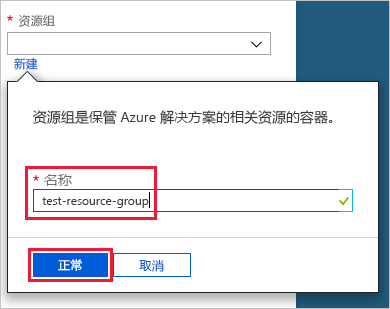
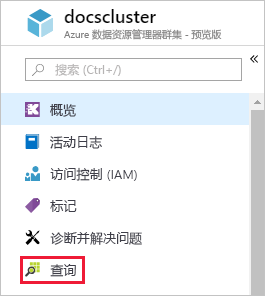

# 快速入门：创建 Azure 数据资源管理器群集和数据库

Azure 数据资源管理器是一项快速且高度可缩放的数据浏览服务，适用于日志和遥测数据。 若要使用 Azure 数据资源管理器，请先创建群集，再在该群集中创建一个或多个数据库。 然后将数据引入（加载）到数据库，以便对其运行查询。 在本快速入门中，你将创建群集和数据库。 在后续文章中，我们介绍如何引入数据。

如果还没有 Azure 订阅，可以在开始前创建一个[免费 Azure 帐户](https://azure.microsoft.com/free/)。

## 登录到 Azure 门户

登录到 [Azure 门户](https://portal.azure.com/)。

## 创建群集

可以使用定义的一组计算和存储资源，在 Azure 资源组中创建 Azure 数据资源管理器群集。

1. 选择门户左上角的“创建资源”按钮 (+)。

1. 搜索“Azure 数据资源管理器”，然后选中它。

   

1. 选择右下角的“创建”。

1. 输入群集的唯一名称，选择订阅，然后创建名为 *test-resource-group* 的资源组。

    

1. 使用以下信息填写窗体。

   

    **设置** | **建议的值** | **字段说明**
    |---|---|---|
    | 群集名称 | 唯一的群集名称 | 选择用于标识群集的唯一名称。 例如，*mytestcluster*。 域名 *[region].kusto.windows.net* 将追加到所提供的群集名称。 名称只能包含小写字母和数字。 并且必须包含 3 到 22 个字符。
    | 订阅 | 订阅 | 选择要用于群集的 Azure 订阅。|
    | 资源组 | *test-resource-group* | 创建新的资源组。 |
    | 位置 | *美国西部* | 为此快速入门选择美国西部。 对于生产系统，请选择最能满足你需求的区域。
    | 计算规范 | *D13_v2* | 对于本快速入门，请选择价格最低的规范。 对于生产系统，请选择最能满足你需求的规范。
    | | |

1. 选择“创建”以预配群集。 预配过程通常需要约十分钟。 在工具栏上选择“通知”（钟形图标）以监视预配过程。

1. 该过程完成后，选择“通知”，然后选择“转到资源”。

    

## 创建数据库

现在可以执行过程中的第二步：创建数据库。

1. 在“概述”选项卡上，选择“创建数据库”。

    

1. 使用以下信息填写窗体。

    

    **设置** | **建议的值** | **字段说明**
    |---|---|---|
    | 数据库名称 | *TestDatabase* | 该数据库名称在群集中必须是唯一的。
    | 保留期 | *3650* | 保证数据可供查询的时间跨度。 时间跨度从引入数据时算起。
    | 缓存期 | *31* | 使频繁查询的数据在 SSD 存储或 RAM（而不是更长期的存储）中保持可用的时间跨度。
    | | | |

1. 选择“保存”创建数据库。 创建过程通常需要不到一分钟的时间。 该过程完成后，将返回到群集的“概述”选项卡。

## 在数据库中运行基本命令

由于已有群集和数据库，因此可以运行查询和命令。 数据库中尚无任何数据，但仍可以查看工具的工作原理。

1. 在群集下，选择“查询”。

    

1. 将以下命令粘贴到查询窗口中：`.show databases`，然后选择“运行”。

    

    结果集显示“TestDatabase”，这是群集中的唯一数据库。

1. 将以下命令粘贴到查询窗口中：`.show tables`，然后在该窗口中选择该命令。 选择“运行”。

    此命令将返回空的结果集，因为你尚未拥有任何表。 将在本系列的下一篇文章中添加表。

## 停止并重新启动群集

可以停止并重新启动群集，具体取决于业务需求。

1. 若要停止群集，请在“概述”选项卡顶部选择“停止”。

    停止群集后，数据不可用于查询，并且无法引入新数据。

1. 若要重新启动群集，请在“概述”选项卡顶部选择“启动”。

    重新启动群集后，需要约十分钟才能使用（如同最初预配时那样）。 需要额外时间才能将数据加载到热缓存中。  

## 清理资源

如果计划学习其他快速入门和教程，请保留创建的资源。 否则，请清理“test-resource-group”以避免产生费用。

1. 在 Azure 门户的最左侧选择“资源组”，，然后选择创建的资源组。  

    如果左侧菜单处于折叠状态，请选择  将其展开。

   

1. 在“test-resource-group”下，选择“删除资源组”。

1. 在新窗口中键入要删除的资源组的名称 (*test-resource-group*)，然后选择“删除”。

## 后续步骤

> [!div class="nextstepaction"]
> [快速入门：将数据从事件中心引入到 Azure 数据资源管理器](ingest-data-event-hub.md)

