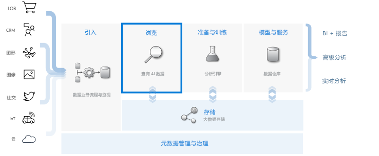
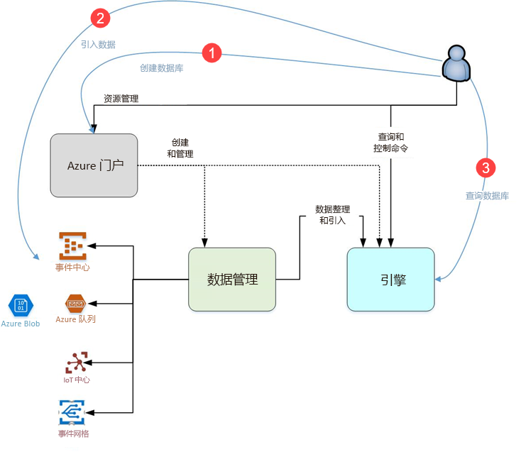

# 什么是 Azure 数据资源管理器？

Azure 数据资源管理器是一项快速且高度可缩放的数据探索服务，适用于日志和遥测数据。 它可以帮助你处理现代软件发出的许多数据流，以便收集、存储和分析数据。 Azure 数据资源管理器非常适合用于分析来自任何数据源（例如网站、应用程序、IoT 设备等）的大量不同数据。 此数据用于诊断、监视、报告、机器学习和其他分析功能。 Azure 数据资源管理器可以轻松地引入数据，并使你能够在几秒钟内对数据执行复杂的即席查询。

## 是什么让 Azure 数据资源管理器与众不同？

- 在几分钟内快速扩展到数 TB 的数据，可以快速迭代数据探索以发现相关见解。

- 提供创新的查询语言，针对高性能数据分析进行了优化。

- 支持分析大量异类数据（结构化和非结构化）。

- 通过与其他服务相结合，提供一个包罗万象、功能强大的交互式数据分析解决方案，让你能够生成和部署所需内容。

## 数据仓库工作流

Azure 数据资源管理器与其他主要服务相集成，提供数据收集、引入、存储、索引、查询和可视化等端到端解决方案。 它通过对数 TB 的各种原始数据上执行流的“探索”步骤，在数据仓库流中发挥着关键作用。

Azure 数据资源管理器支持多个引入方法，包括连接到常见服务（如事件中心）、使用 SDK 以编程方式引入（例如 .NET 和 Python），以及出于探索目的直接访问引擎。 Azure 数据资源管理器与分析和建模服务集成，对数据进行其他分析和可视化操作。

## Azure 数据资源管理器流

下图显示了使用 Azure 数据资源管理器的不同方面。

Azure 数据资源管理器中的工作通常遵循以下模式：

1. **创建数据库**：创建群集，然后在该群集中创建一个或多个数据库。 [快速入门：创建 Azure 数据资源管理器群集和数据库](create-cluster-database-portal.md)

1. **引入数据**：将数据加载到数据库表，以便你可以对其运行查询。 [快速入门：将数据从事件中心引入到 Azure 数据资源管理器](ingest-data-event-hub.md)

1. **查询数据库**：使用 Web 应用程序来运行、查看以及共享查询和结果。 它可在 Azure 门户中使用，也可作为独立的应用程序使用。 此外可以以编程方式（使用 SDK）或向 REST API 终结点发送查询。 [快速入门：在 Azure 数据资源管理器中查询数据](web-query-data.md)

## 查询体验

Azure 数据资源管理器中的查询是只读的请求，用于处理数据并返回此处理的结果，而无需修改数据或元数据。 在完成分析之前，你将继续完善查询。 Azure 数据资源管理器因其非常快速的即席查询体验而使此过程变得简单。

Azure 数据资源管理器同样可以处理大量的结构化、半结构化（类似于 JSON 的嵌套类型）和非结构化（自由文本）数据。 这允许你搜索特定文本术语、查找特定事件，以及对结构化数据执行指标式的计算。 Azure 数据资源管理器通过从自由格式文本字段中提取运行时中的值，来桥接非结构化文本日志和结构化数字以及维度。 通过将快速文本索引、列存储和时间序列操作相结合，简化了数据探索。

一系列其他服务建立在其强大的查询语言之上，包括 [Log Analytics](/azure/log-analytics/)、[Application Insights](/azure/application-insights/)、[时序见解](/azure/time-series-insights/)以及 [Windows Defender 高级威胁防护](/windows/security/threat-protection/windows-defender-atp/windows-defender-advanced-threat-protection/)，扩展了 Azure 数据资源管理器的功能。

## 反馈

我们很乐意收到你对 Azure 数据资源管理器及其查询语言的反馈：

- 提出问题
  - [Stack Overflow](https://stackoverflow.com/questions/tagged/azure-data-explorer)
  - [Microsoft 技术社区](https://techcommunity.microsoft.com/t5/Azure-Data-Explorer/bd-p/Kusto)
  - [MSDN](https://social.msdn.microsoft.com/Forums/en-US/home?forum=AzureKusto)
- [在 User Voice 中提出产品建议](http://aka.ms/AzureDataExplorer.UserVoice)

## 后续步骤

[快速入门：创建 Azure 数据资源管理器群集和数据库](create-cluster-database-portal.md)

[快速入门：将数据从事件中心引入到 Azure 数据资源管理器](ingest-data-event-hub.md)

[快速入门：在 Azure 数据资源管理器中查询数据](web-query-data.md)
