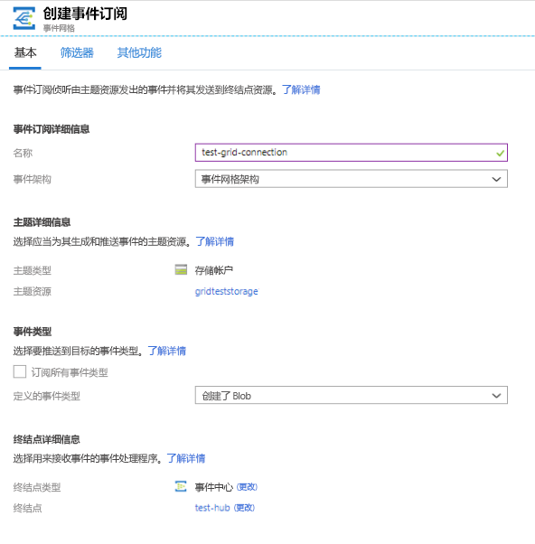
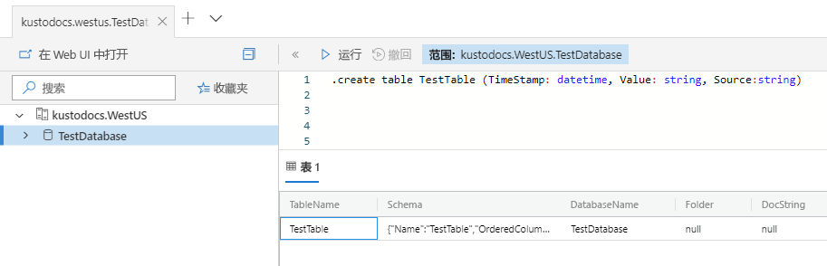
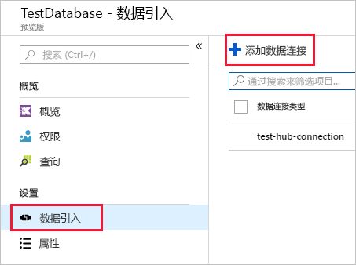
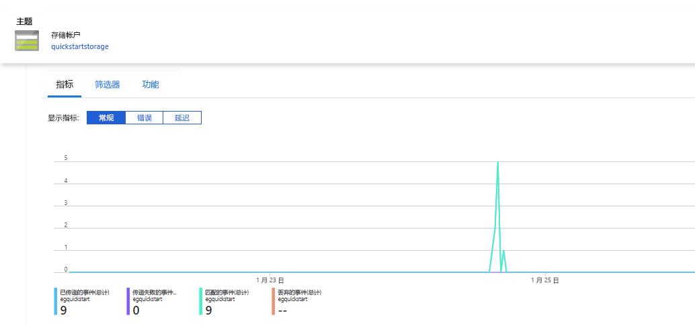
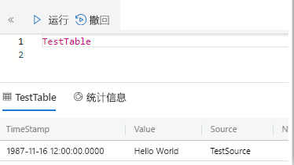

# <a name="quickstart-ingest-azure-blobs-into-azure-data-explorer-by-subscribing-to-event-grid-notifications"></a>快速入门：通过订阅事件网格通知将 Azure Blob 引入 Azure 数据资源管理器

Azure 数据资源管理器是一项快速且高度可缩放的数据探索服务，适用于日志和遥测数据。 Azure 数据资源管理器可以持续从写入到 Blob 容器中的 Blob 引入数据（数据加载）。 这是通过为 Blob 创建事件设置 [Azure 事件网格](/azure/event-grid/overview)订阅，并通过事件中心将这些事件路由到 Kusto 来实现的。 本快速入门假设你有一个存储帐户，以及一个可将通知发送到事件中心的事件网格订阅。 然后，你可以创建事件网格数据连接，并查看整个系统中的数据流。

## <a name="prerequisites"></a>先决条件

1. 如果没有 Azure 订阅，请创建一个[免费 Azure 帐户](https://azure.microsoft.com/free/)
1. [群集和数据库](create-cluster-database-portal.md)
1. [存储帐户](https://docs.microsoft.com/azure/storage/common/storage-quickstart-create-account?tabs=azure-portal)
1. [事件中心](https://docs.microsoft.com/azure/event-hubs/event-hubs-create)

## <a name="create-an-event-grid-subscription-in-your-storage-account"></a>在存储帐户中创建事件网格订阅

1. 在 Azure 门户中导航到你的存储帐户
1. 依次单击“事件”选项卡、“事件订阅”

    

1. 在“创建事件订阅”窗口中的“基本”选项卡内，提供以下值：

    **设置** | **建议的值** | **字段说明**
    |---|---|---|
    | Name | *test-grid-connection* | 要创建的事件网格的名称。|
    | 事件架构 | *事件网格架构* | 事件网格要使用的架构。 |
    | 主题类型 | *存储帐户* | 事件网格主题的类型。 |
    | 主题资源 | *gridteststorage* | 你的存储帐户的名称。 |
    | 订阅所有事件类型 | *取消选中* | 不要获取有关所有事件的通知。 |
    | 定义的事件类型 | *已创建 Blob* | 要获取其通知的特定事件。 |
    | 终结点类型 | *事件中心* | 要将事件发送到的终结点的类型。 |
    | 终结点 | test-hub | 你创建的事件中心。 |
    | | |

1. 若要跟踪特定容器中的文件，请选择“其他功能”选项卡。 按如下所述设置通知筛选器：
    * “主题开头为”字段是 Blob 容器的文本前缀（由于应用的模式是 *startswith*，因此可以跨越多个容器）。 不允许通配符。
     必须设置为：*`/blobServices/default/containers/`*[容器前缀]
    * “主题末尾为”字段是 Blob 的文本后缀。 不允许通配符。

## <a name="create-a-target-table-in-azure-data-explorer"></a>在 Azure 数据资源管理器中创建目标表

在 Azure 数据资源管理器中创建一个表，事件中心会向该表发送数据。 在“先决条件”中准备好的群集和数据库中创建表。

1. 在 Azure 门户中的群集下，选择“查询”。

    

1. 将以下命令复制到窗口中，然后选择“运行”以创建将接收引入数据的表 (TestTable)。

    ```Kusto
    .create table TestTable (TimeStamp: datetime, Value: string, Source:string)
    ```

    

1. 将以下命令复制到窗口中，然后选择“运行”将传入的 JSON 数据映射到表 (TestTable) 的列名和数据类型。

    ```Kusto
    .create table TestTable ingestion json mapping 'TestMapping' '[{"column":"TimeStamp","path":"$.TimeStamp"},{"column":"Value","path":"$.Value"},{"column":"Source","path":"$.Source"}]'
    ```

## <a name="create-an-event-grid-data-connection-in-azure-data-explorer"></a>在 Azure 数据资源管理器中创建事件网格数据连接

现在，请从 Azure 数据资源管理器连接到事件网格，以便流入 Blob 容器的数据流式传输到测试表。

1. 在工具栏上选择“通知”，以验证事件中心部署是否成功。

1. 在创建的群集下，选择“数据库”，然后选择“TestDatabase”。

    

1. 选择“数据引入”，然后选择“添加数据连接”。

    

1. 选择连接类型：**Blob 存储**。

1. 在表单中填写以下信息，然后单击“创建”。

    

     数据源：

    **设置** | **建议的值** | **字段说明**
    |---|---|---|
    | 数据连接名称 | test-hub-connection | 要在 Azure 数据资源管理器中创建的连接的名称。|
    | 存储帐户订阅 | 订阅 ID | 存储帐户所在的订阅 ID。|
    | 存储帐户 | *gridteststorage* | 前面创建的存储帐户的名称。|
    | 事件网格 | *test-grid-connection* | 已创建的事件网格的名称。 |
    | 事件中心名称 | test-hub | 你创建的事件中心。 选取事件网格时，会自动填充此字段。 |
    | 使用者组 | test-group | 在创建的事件中心定义的使用者组。 |
    | | |

    目标表：

     **设置** | **建议的值** | **字段说明**
    |---|---|---|
    | 表 | TestTable | 在“TestDatabase”中创建的表。 |
    | 数据格式 | *JSON* | 支持的格式为 Avro、CSV、JSON、多行 JSON、PSV、SOH、SCSV、TSV 和 TXT。 |
    | 列映射 | TestMapping | 在 **TestDatabase** 中创建的映射将传入的 JSON 数据映射到 **TestTable** 的列名称和数据类型。|
    | | |

## <a name="generate-sample-data"></a>生成示例数据

连接 Azure 数据资源管理器和存储帐户后，可以创建示例数据并将其上传到 Blob 存储。

我们将使用一个小型 shell 脚本，该脚本会发出一些基本的 Azure CLI 命令来与 Azure 存储资源交互。 该脚本首先在存储帐户中创建新容器，然后将现有文件（作为 Blob）上传到该容器。 然后，该脚本列出容器中的所有 Blob。 可以直接在门户中使用 [Cloud Shell](https://docs.microsoft.com/azure/cloud-shell/overview) 执行该脚本。

将以下数据保存到某个文件中并在以下脚本中使用此数据：

```Json
{"TimeStamp": "1987-11-16 12:00","Value": "Hello World","Source": "TestSource"}
```

```bash
#!/bin/bash
### A simple Azure Storage example script

    export AZURE_STORAGE_ACCOUNT=<storage_account_name>
    export AZURE_STORAGE_KEY=<storage_account_key>

    export container_name=<container_name>
    export blob_name=<blob_name>
    export file_to_upload=<file_to_upload>
    export destination_file=<destination_file>

    echo "Creating the container..."
    az storage container create --name $container_name

    echo "Uploading the file..."
    az storage blob upload --container-name $container_name --file $file_to_upload --name $blob_name

    echo "Listing the blobs..."
    az storage blob list --container-name $container_name --output table

    echo "Done"
```

## <a name="review-the-data-flow"></a>查看数据流

> [!NOTE]
> ADX 提供用于数据引入的聚合（批处理）策略，旨在优化引入过程。
默认情况下，该策略配置为 5 分钟。
以后可根据需要更改该策略。 在本快速入门中，预期会发生几分钟的延迟。

1. 在 Azure 门户中的事件网格下，可以看到应用运行时的活动高峰。

    

1. 若要检查到目前为止已向数据库发送的消息数，请在测试数据库中运行以下查询。

    ```Kusto
    TestTable
    | count
    ```

1. 若要查看消息的内容，请在测试数据库中运行以下查询。

    ```Kusto
    TestTable
    ```

    结果集应如下所示。

    

## <a name="clean-up-resources"></a>清理资源

如果不再打算使用事件网格，请清理 **test-hub-rg**，以免产生费用。

1. 在 Azure 门户的最左侧选择“资源组”，，然后选择创建的资源组。  

    如果左侧菜单处于折叠状态，请选择  将其展开。

   

1. 在“test-resource-group”下，选择“删除资源组”。

1. 在新窗口中，键入要删除的资源组的名称 (test-hub-rg)，然后选择“删除”。

## <a name="next-steps"></a>后续步骤

> [!div class="nextstepaction"]
> [快速入门：在 Azure 数据资源管理器中查询数据](web-query-data.md)
