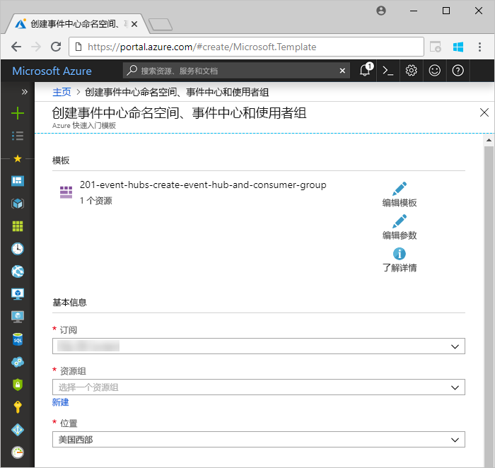
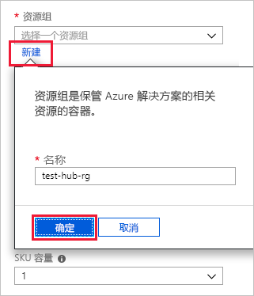
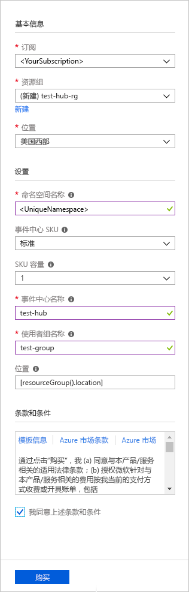
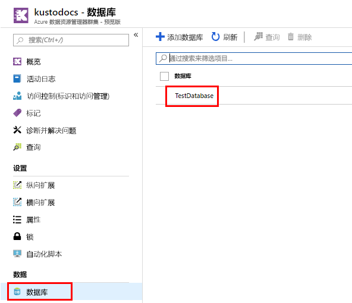
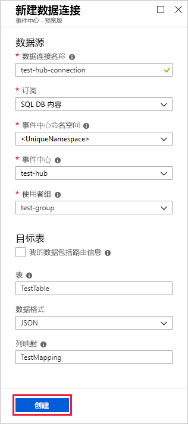
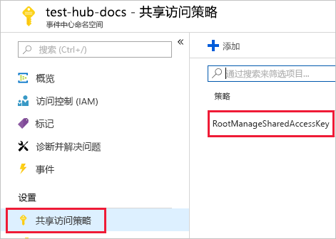
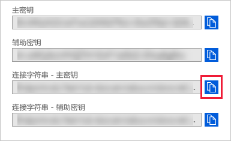
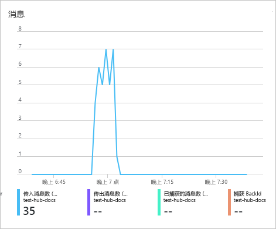
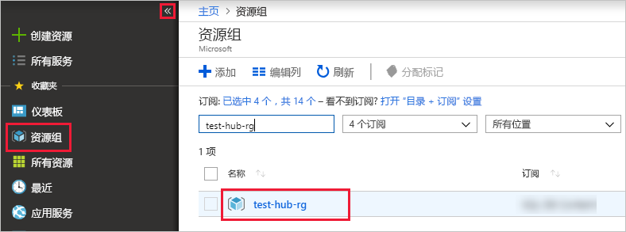

# <a name="ingest-data-from-event-hub-into-azure-data-explorer"></a>将数据从事件中心引入到 Azure 数据资源管理器

Azure 数据资源管理器是一项快速且高度可缩放的数据探索服务，适用于日志和遥测数据。 Azure 数据资源管理器可从事件中心引入（加载数据），是一个大数据流式处理平台和事件引入服务。 [事件中心](/azure/event-hubs/event-hubs-about)每秒可以近实时处理数百万个事件。 在本文中，创建事件中心，从 Azure 数据资源管理器和整个系统，请参阅数据流连接到它。

## <a name="prerequisites"></a>先决条件

* 如果还没有 Azure 订阅，可以在开始前创建一个[免费 Azure 帐户](https://azure.microsoft.com/free/)。

* [一个测试群集和数据库](create-cluster-database-portal.md)。

* 生成数据并将其发送到事件中心的[示例应用](https://github.com/Azure-Samples/event-hubs-dotnet-ingest)。 将示例应用下载到系统。

* 用于运行示例应用的 [Visual Studio 2019](https://visualstudio.microsoft.com/vs/)。

## <a name="sign-in-to-the-azure-portal"></a>登录到 Azure 门户

登录到 [Azure 门户](https://portal.azure.com/)。

## <a name="create-an-event-hub"></a>创建事件中心

在本文中，将生成示例数据和将其发送到事件中心。 第一步是创建事件中心。 通过使用 Azure 资源管理器模板在 Azure 门户中执行此操作。

1. 若要创建事件中心，请使用以下按钮开始部署。 右键单击并选择“在新窗口中打开”  ，以便按本文中的剩余步骤操作。

    [](https://portal.azure.com/#create/Microsoft.Template/uri/https%3A%2F%2Fraw.githubusercontent.com%2FAzure%2Fazure-quickstart-templates%2Fmaster%2F201-event-hubs-create-event-hub-and-consumer-group%2Fazuredeploy.json)

    “部署到 Azure”  按钮将转到 Azure 门户以填写部署窗体。

    

1. 选择要在其中创建事件中心的订阅，并创建名为 test-hub-rg  的资源组。

    

1. 使用以下信息填写窗体。

    

    对下表中未列出的任何设置使用默认值。

    **设置** | **建议的值** | **字段说明**
    |---|---|---|
    | 订阅 | 订阅 | 选择要用于事件中心的 Azure 订阅。|
    | 资源组 | test-hub-rg  | 创建新的资源组。 |
    | Location | *美国西部* | 选择*美国西部*本文。 对于生产系统，请选择最能满足你需求的区域。 在与 Kusto 群集相同的位置创建事件中心命名空间以获得最佳性能（对于具有高吞吐量的事件中心命名空间来说最重要）。
    | 命名空间名称 | 唯一的命名空间名称 | 选择用于标识命名空间的唯一名称。 例如，mytestnamespace  。 域名 servicebus.windows.net  将追加到所提供的名称。 该名称只能包含字母、数字和连字符。 名称必须以字母开头，并且必须以字母或数字结尾。 值长度必须介于 6 到 50 个字符之间。
    | 事件中心名称 | test-hub  | 事件中心位于命名空间下，该命名空间提供唯一的范围容器。 事件中心名称在命名空间中必须唯一。 |
    | 使用者组名称 | test-group  | 使用者组允许多个使用应用程序各自具有事件流的单独视图。 |
    | | |

1. 选择“购买”  ，确认你要在订阅中创建资源。

1. 在工具栏上选择“通知”以监视预配过程。  部署成功可能需要几分钟时间，但现在可以继续执行下一步。

    

## <a name="create-a-target-table-in-azure-data-explorer"></a>在 Azure 数据资源管理器中创建目标表

现在，在 Azure 数据资源管理器中创建一个表，事件中心会向该表发送数据。 在“先决条件”  中预配的群集和数据库中创建表。

1. 在 Azure 门户中导航到群集，然后选择“查询”。 

    

1. 将以下命令复制到窗口中，然后选择“运行”  以创建将接收引入数据的表 (TestTable)。

    ```Kusto
    .create table TestTable (TimeStamp: datetime, Name: string, Metric: int, Source:string)
    ```

    

1. 将以下命令复制到窗口中，然后选择“运行”  将传入的 JSON 数据映射到表 (TestTable) 的列名和数据类型。

    ```Kusto
    .create table TestTable ingestion json mapping 'TestMapping' '[{"column":"TimeStamp","path":"$.timeStamp","datatype":"datetime"},{"column":"Name","path":"$.name","datatype":"string"},{"column":"Metric","path":"$.metric","datatype":"int"},{"column":"Source","path":"$.source","datatype":"string"}]'
    ```

## <a name="connect-to-the-event-hub"></a>连接到事件中心

现在，请通过 Azure 数据资源管理器连接到事件中心。 当此连接建立好以后，流入事件中心的数据会流式传输到此前在本文中创建的测试表。

1. 在工具栏上选择“通知”  ，以验证事件中心部署是否成功。

1. 在创建的群集下，选择“数据库”  ，然后选择“TestDatabase”  。

    

1. 选择“数据引入”  ，然后选择“添加数据连接”  。 然后使用以下信息填写窗体。 完成后，选择“创建”  。

    

    数据源：

    **设置** | **建议的值** | **字段说明**
    |---|---|---|
    | 数据连接名称 | test-hub-connection  | 要在 Azure 数据资源管理器中创建的连接的名称。|
    | 事件中心命名空间 | 唯一的命名空间名称 | 先前选择的用于标识命名空间的名称。 |
    | 事件中心 | test-hub  | 你创建的事件中心。 |
    | 使用者组 | test-group  | 在创建的事件中心定义的使用者组。 |
    | | |

    目标表：

    路由引入数据有两个选项：静态和动态。   
    本文将使用静态路由，需在其中指定表名、数据格式和映射。 因此，请让“我的数据包含路由信息”保留未选中状态。 

     **设置** | **建议的值** | **字段说明**
    |---|---|---|
    | 表 | TestTable  | 在“TestDatabase”  中创建的表。 |
    | 数据格式 | *JSON* | 支持的格式为 Avro、CSV、JSON、多行 JSON、PSV、SOH、SCSV、TSV 和 TXT。 |
    | 列映射 | TestMapping  | 在 **TestDatabase** 中创建的映射将传入的 JSON 数据映射到 **TestTable** 的列名称和数据类型。 对于 JSON、多行 JSON 或 AVRO 是必需的，对于其他格式是可选的。|
    | | |

    > [!NOTE]
    > 选择“我的数据包含路由信息”  以使用动态路由，其中你的数据包含必要的路由信息，如[示例应用](https://github.com/Azure-Samples/event-hubs-dotnet-ingest)注释中所示。 如果同时设置了静态和动态属性，则动态属性将覆盖静态属性。 

## <a name="copy-the-connection-string"></a>复制连接字符串

运行在先决条件中列出的[示例应用](https://github.com/Azure-Samples/event-hubs-dotnet-ingest)时，需要事件中心命名空间的连接字符串。

1. 在创建的事件中心命名空间下，选择“共享访问策略”  ，然后选择“RootManageSharedAccessKey”  。

    

1. 复制“连接字符串 - 主键”  。 请将其粘贴到下一节。

    

## <a name="generate-sample-data"></a>生成示例数据

使用下载的[示例应用](https://github.com/Azure-Samples/event-hubs-dotnet-ingest)生成数据。

1. 在 Visual Studio 中打开示例应用解决方案。

1. 在 program.cs  文件中，将 `connectionString` 常量更新为从事件中心命名空间复制的连接字符串。

    ```csharp
    const string eventHubName = "test-hub";
    // Copy the connection string ("Connection string-primary key") from your Event Hub namespace.
    const string connectionString = @"<YourConnectionString>";
    ```

1. 生成并运行应用。 应用将消息发送到事件中心，并且每十秒显示一次状态。

1. 应用发送一些消息后，继续执行下一步：查看到事件中心和测试表的数据流。

## <a name="review-the-data-flow"></a>查看数据流

应用生成数据以后，现在可以看到该数据从事件中心流到群集中的表。

1. 在 Azure 门户中的事件中心下，可以看到应用运行时活动的峰值。

    

1. 若要检查到目前为止已向数据库发送的消息数，请在测试数据库中运行以下查询。

    ```Kusto
    TestTable
    | count
    ```

1. 若要查看消息的内容，请运行以下查询：

    ```Kusto
    TestTable
    ```

    结果集应如下所示：

    

    > [!NOTE]
    > Azure 数据资源管理器具有用于数据引入的聚合（批处理）策略，旨在优化引入过程。 策略配置为 5 分钟，默认情况下，因此可能会出现延迟。 请参阅[批处理策略](/azure/kusto/concepts/batchingpolicy)聚合选项。 请参阅[流式处理策略](/azure/kusto/concepts/streamingingestionpolicy)用于引入与聚合函数。

## <a name="clean-up-resources"></a>清理资源

如果不打算再次使用事件中心，请清理 test-hub-rg  ，以避免产生费用。

1. 在 Azure 门户的最左侧选择“资源组”，，然后选择创建的资源组。   

    如果左侧菜单处于折叠状态，请选择  将其展开。

   

1. 在“test-resource-group”  下，选择“删除资源组”  。

1. 在新窗口中，键入要删除的资源组的名称 (test-hub-rg  )，然后选择“删除”  。

## <a name="next-steps"></a>后续步骤

* [在 Azure 数据资源管理器中查询数据](web-query-data.md)
