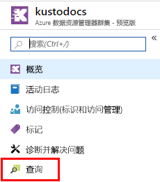
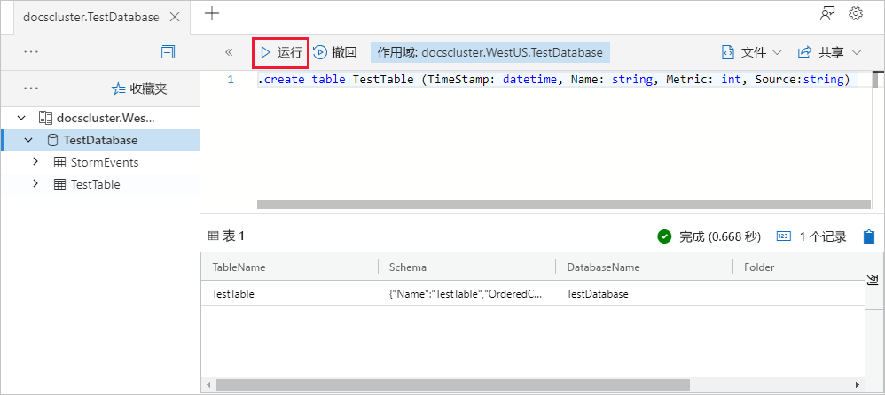
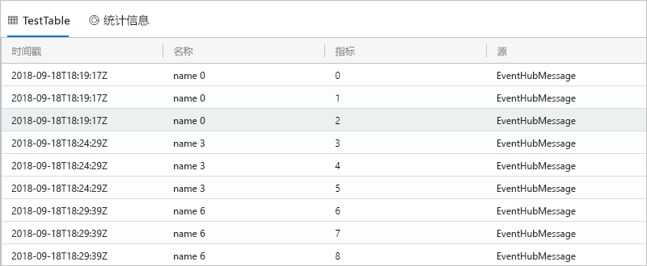

# <a name="ingest-data-from-kafka-into-azure-data-explorer"></a>将数据从 Kafka 引入到 Azure 数据资源管理器
 
Azure 数据资源管理器是一项快速且高度可缩放的数据探索服务，适用于日志和遥测数据。 Azure 数据资源管理器提供从 Kafka 引入数据（加载数据）的功能。 Kafka 是一个分布式流式处理平台，可用于构建实时流式处理数据管道，在系统或应用程序之间可靠地移动数据。
 
## <a name="prerequisites"></a>必备组件
 
* 如果还没有 Azure 订阅，可以在开始前创建一个[免费 Azure 帐户](https://azure.microsoft.com/free/)。 
 
* [一个测试群集和数据库](create-cluster-database-portal.md)。
 
* 一个生成数据并将其发送到 Kafka 的[示例应用](https://github.com/Azure/azure-kusto-samples-dotnet/tree/master/kafka)。

* 用于运行示例应用的 [Visual Studio 2019](https://visualstudio.microsoft.com/vs/)。
 
## <a name="kafka-connector-setup"></a>Kafka 连接器安装程序

Kafka Connect 是一个工具，用于在 Apache Kafka 和其他系统之间以可伸缩且可靠的方式流式传输数据。 可以通过它简单快速地定义连接器，将大量数据移进和移出 Kafka。 ADX Kafka 接收器充当 Kafka 的连接器。
 
### <a name="bundle"></a>捆绑

Kafka 可以加载 `.jar` 作为插件，该插件将充当自定义连接器。 为了生成此类 `.jar`，我们将在本地克隆代码，并使用 Maven 进行构建。 

#### <a name="clone"></a>克隆

```bash
git clone git://github.com:Azure/kafka-sink-azure-kusto.git
cd ./kafka-sink-azure-kusto/kafka/
```

#### <a name="build"></a>Build

通过 Maven 进行本地构建，以便生成一个带依赖项的 `.jar`。

* JDK >= 1.8 [下载](https://www.oracle.com/technetwork/java/javase/downloads/index.html)
* Maven [下载](https://maven.apache.org/install.html)
 

在根目录 *kafka-sink-azure-kusto* 中，运行：

```bash
mvn clean compile assembly:single
```

### <a name="deploy"></a>部署 

将插件加载到 Kafka 中。 [kafka-sink-azure-kusto](https://github.com/Azure/kafka-sink-azure-kusto#deploy) 中提供了使用 docker 的部署示例
 

[Kafka Connect](https://kafka.apache.org/documentation/#connect) 中详细记录了 Kafka 连接器以及如何部署它们 

### <a name="example-configuration"></a>示例配置 
 
```config
name=KustoSinkConnector 
connector.class=com.microsoft.azure.kusto.kafka.connect.sink.KustoSinkConnector 
kusto.sink.flush_interval_ms=300000 
key.converter=org.apache.kafka.connect.storage.StringConverter 
value.converter=org.apache.kafka.connect.storage.StringConverter 
tasks.max=1 
topics=testing1 
kusto.tables.topics_mapping=[{'topic': 'testing1','db': 'daniel', 'table': 'TestTable','format': 'json', 'mapping':'TestMapping'}] 
kusto.auth.authority=XXX 
kusto.url=https://ingest-{mycluster}.kusto.windows.net/ 
kusto.auth.appid=XXX 
kusto.auth.appkey=XXX 
kusto.sink.tempdir=/var/tmp/ 
kusto.sink.flush_size=1000
```
 
## <a name="create-a-target-table-in-adx"></a>在 ADX 中创建目标表
 
在 ADX 中创建一个表，以便 Kafka 可以向其发送数据。 在“先决条件”  中预配的群集和数据库中创建表。
 
1. 在 Azure 门户中导航到群集，然后选择“查询”。 
 
    
 
1. 将以下命令复制到窗口中，然后选择“运行”  。
 
    ```Kusto
    .create table TestTable (TimeStamp: datetime, Name: string, Metric: int, Source:string)
    ```
 
    
 
1. 将以下命令复制到窗口中，然后选择“运行”  。
 
    ```Kusto
    .create table TestTable ingestion json mapping 'TestMapping' '[{"column":"TimeStamp","path":"$.timeStamp","datatype":"datetime"},{"column":"Name","path":"$.name","datatype":"string"},{"column":"Metric","path":"$.metric","datatype":"int"},{"column":"Source","path":"$.source","datatype":"string"}]'
    ```

    此命令将传入的 JSON 数据映射到表 (TestTable) 的列名称和数据类型。


## <a name="generate-sample-data"></a>生成示例数据

Kafka 群集连接到 ADX 以后，即可使用下载的[示例应用](https://github.com/Azure-Samples/event-hubs-dotnet-ingest)来生成数据。

### <a name="clone"></a>克隆

在本地克隆示例应用：

```cmd
git clone git://github.com:Azure/azure-kusto-samples-dotnet.git
cd ./azure-kusto-samples-dotnet/kafka/
```

### <a name="run-the-app"></a>运行应用

1. 在 Visual Studio 中打开示例应用解决方案。

1. 在 `Program.cs` 文件中，将 `connectionString` 常量更新为 Kafka 连接字符串。

    ```csharp    
    const string connectionString = @"<YourConnectionString>";
    ```

1. 生成并运行应用。 应用将消息发送到 Kafka 群集，并且每 10 秒显示一次状态。

1. 应用发送一些消息后，继续执行下一步。
 
## <a name="query-and-review-the-data"></a>查询和查看数据

1. 若要确保在引入期间不发生错误，请执行以下命令：

    ```Kusto
    .show ingestion failures
    ```

1. 若要查看新引入的数据，请执行以下命令：

    ```Kusto
    TestTable 
    | count
    ```

1. 若要查看消息的内容，请执行以下命令：
 
    ```Kusto
    TestTable
    ```
 
    结果集应如下所示：
 
    
 
## <a name="next-steps"></a>后续步骤
 
* [在 Azure 数据资源管理器中查询数据](web-query-data.md)
