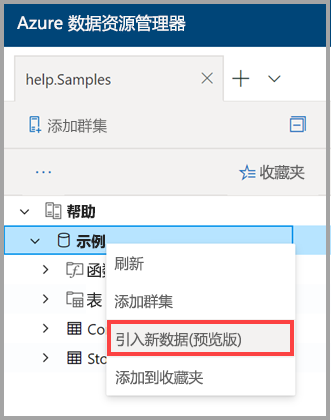

# 使用一键式引入将数据引入 Azure 数据资源管理器

本文介绍如何使用一键式引入快速引入 JSON 或 CSV 格式的新表。 数据可以从存储或本地文件引入到现有表或新表中。 使用直观的一键式向导，并在几分钟内引入数据。 然后，可以使用 Azure 数据资源管理器 Web UI 编辑表并运行查询。

## 必备组件

* 如果还没有 Azure 订阅，可以在开始前创建一个[免费 Azure 帐户](https://azure.microsoft.com/free/)。
* 登录到[应用程序](https://dataexplorer.azure.com/)。
* 创建[Azure 数据资源管理器群集和数据库](create-cluster-database-portal.md)。
* 登录到[WEB UI](https://dataexplorer.azure.com/)并[添加到群集的连接](/azure/data-explorer/web-query-data#add-clusters)。

## 引入新数据

1. 右键单击 Web UI 左侧菜单中的 "*数据库*" 或 "*表*" 行，然后选择 "引入**新数据（预览版）** "。

       
 
1. 在 "引入**新数据（预览）** " 窗口中，选择 "**源**" 选项卡并完成**项目详细信息**：

    * 对于 "**表**"，从下拉菜单中选择一个现有的表名称，或选择 "**新建**" 以创建新表。
    * 对于 "**摄取类型**"，请**从 "存储**" 或 "**从文件**" 中选择。
      * 如果选择了 "**从存储**"，请选择 "**链接到存储**" 以添加 URL。 将[BLOB SAS URL](/azure/vs-azure-tools-storage-explorer-blobs#get-the-sas-for-a-blob-container)用于专用存储帐户。 
      * 如果选择了 "**从文件**"，请选择 "**浏览**"，然后将文件拖动到框中。
    * 选择 "**编辑架构**" 以查看和编辑表列配置。
 
     

    > [!TIP]
    > 如果在*表*行中选择 "引入**新数据（预览）** "，则所选表名称将出现在**项目详细信息**中。

1. 如果选择了一个现有表，则将打开 "**映射列**" 窗口，以便将源数据列映射到目标表列。 
    * 使用**省略列**从表中删除目标列。
    * 使用 "**新建列**" 将新列添加到表中。

    

1. 在 "**架构**" 选项卡中：

    * 从下拉菜单中选择 "**压缩类型**"，然后选择 "**未压缩**" 或 " **GZip**"。
    * 从下拉菜单中选择 "**数据格式**"，然后选择**JSON**、 **CSV**、 **TSV**、 **SCSV**、 **SOHSV**、 **TSVE**或**PSV**。 
        * 选择**json**格式时，还必须选择**json 级别**，从1到10。 级别会影响表列数据的描述。 
        * 如果选择 JSON 以外的其他格式，则必须选中**复选框以**忽略该文件的标题行。
    * **映射名称**是自动设置的，但可以编辑。
    * 如果选择了现有的表，则可以选择 "**映射列**" 以打开 "**映射列**" 窗口。

    

1. 在**编辑器**窗格的上方，选择 " **v** " 按钮打开编辑器。 在编辑器中，您可以查看和复制从输入生成的自动查询。 

1. 在表中： 
    * 右键单击新的列标题以**更改数据类型**、**重命名列**、**删除列**、按**升序排序**或按**降序排序**。 对于现有列，只有数据排序可用。 
    * 双击要编辑的新列名称。

1. 选择 "**开始引入**" 创建表和映射，并开始数据引入。

     
 
## 查询数据

1. 如果数据引入成功完成，则在 "**数据引入完成**" 窗口中，所有三个步骤都将标记为绿色复选标记。
 
    

1. 选择 " **v** " 按钮打开查询。 复制到 Web UI 以编辑查询。

1. 右侧菜单包含**快速查询**和**工具**选项。 

    * **快速查询**包括指向 Web UI 的链接，并提供示例查询。
    * **工具**包含用于在 Web UI 上**删除命令**的链接，通过运行相关的 `.drop` 命令，可以对问题进行故障排除。

    > [!TIP]
    > 使用 `.drop` 命令时，可能会丢失数据。 请谨慎使用。

## 后续步骤

* [在 Azure 中查询数据数据资源管理器 Web UI](web-query-data.md)
* [使用 Kusto 查询语言编写 Azure 数据资源管理器查询](write-queries.md)
