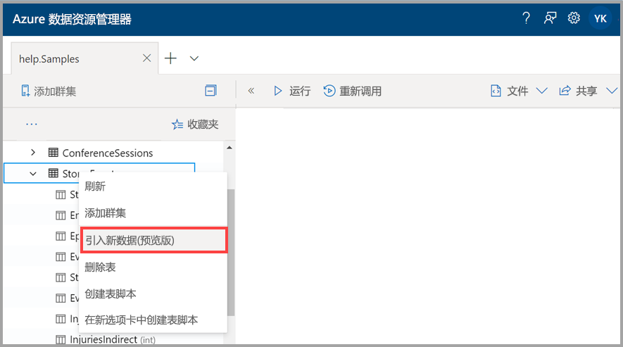
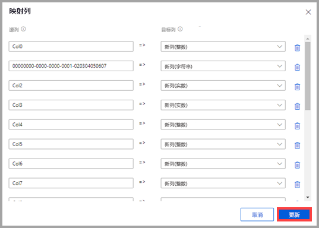
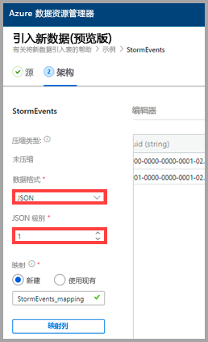
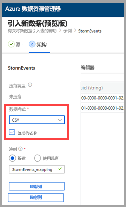
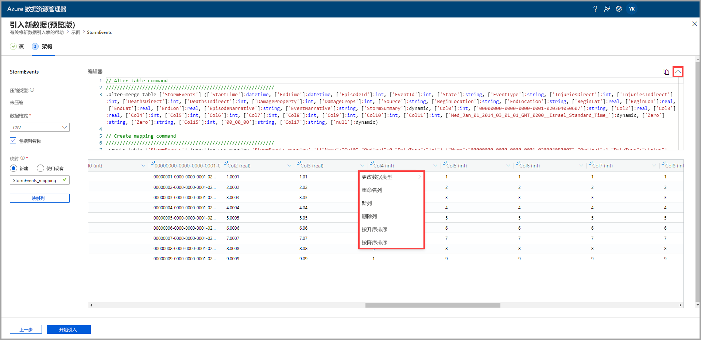
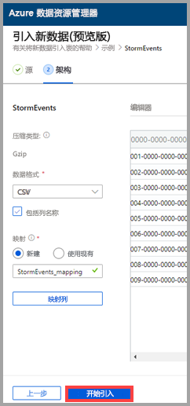
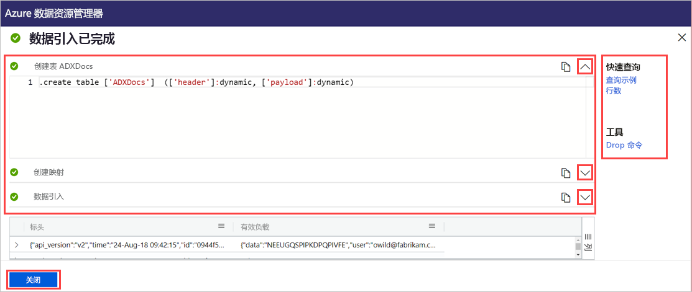

# 使用一键式引入将数据引入到 Azure 数据资源管理器中的现有表

借助一键式引入，可将 JSON、CSV 和其他格式的数据快速引入表中。 使用 Azure 数据资源管理器 Web UI 可以从存储、本地文件或容器中引入数据。 

本文档介绍如何使用直观的一键式向导将文件中的 JSON 数据引入到现有表中。 然后，可以使用 Azure 数据资源管理器 Web UI 编辑该表和运行查询。

首次引入数据时，或者在你不熟悉自己数据的架构时，一键式引入特别有用。 

有关一键式引入的概述和先决条件列表，请参阅[一键式引入](ingest-data-one-click.md)。
若要了解如何将数据引入到 Azure 数据资源管理器中的新表，请参阅[一键式引入到新表中](one-click-ingestion-new-table.md)

## 引入新数据

1. 在 Web UI 的左侧菜单中，右键单击“数据库”或“表”，并选择“引入新数据(预览版)”。   

       
 
1. 在“引入新数据(预览版)”窗口中，系统已自动选择“源”选项卡。  

1. 如果“表”字段未自动填充，请从下拉菜单中选择一个现有的表名。 
    > [!TIP]
    > 如果在“表”行中选择了“引入新数据(预览版)”，选定的表名称将显示在“项目详细信息”中。   

[!INCLUDE [data-explorer-one-click-ingestion-types](../../includes/data-explorer-one-click-ingestion-types.md)]
    
选择“编辑架构”以查看并编辑表列配置。 

## 编辑架构

1. 此时会打开“映射列”对话框，可将源数据列映射到目标表列。  
    * 在“源列”字段中，输入要与“目标列”相映射的列名称。  
    * 若要删除映射，请选择垃圾桶图标。

    

1. 选择“更新”  。
1. 在“架构”选项卡中： 
    1. 选择“压缩类型”，然后选择“未压缩”或“GZip”。   

        [!INCLUDE [data-explorer-one-click-ingestion-edit-schema](../../includes/data-explorer-one-click-ingestion-edit-schema.md)]
        
    1. 如果选择了“JSON”，则还必须选择从 1 到 10 的“JSON 级别”。   级别会影响表列数据的描述。

    

    * 如果选择 JSON 以外的其他格式，则可以选中“包含列名称”复选框来忽略文件的标题行。 
        
    

    > [!Note]
    > 表格格式只能将列数据引入到 Azure 数据资源管理器表中的一个列。 

    * 系统会自动设置新的映射，但你可以将其更改为使用现有映射。 
    * 可以选择“映射列”，打开“映射列”窗口。  

## 复制并粘贴查询

1. 在“编辑器”窗格上方选择“v”按钮，打开编辑器。   在编辑器中，可以查看和复制基于输入生成的自动命令。 
1. 在表中： 
    * 选择新列标题，以添加新列、删除列、按升序排序或按降序排序。     在现有列中，只能对数据排序。

    > [!Note]
    > * 不能更新现有表的名称和数据类型。
    > * Drop 命令只会还原此引入流所做的更改（新建范围和列）， 而不会删除任何其他内容。

 

## 开始引入

选择“开始引入”，在创建表和映射后开始引入数据。 

## 数据引入已完成

如果数据引入成功完成，则“数据引入已完成”窗口中的所有三个步骤都会带有绿色的对勾标记。 
 

[!INCLUDE [data-explorer-one-click-ingestion-query-data](../../includes/data-explorer-one-click-ingestion-query-data.md)]

## 后续步骤

* [在 Azure 数据资源管理器 Web UI 中查询数据](/azure/data-explorer/web-query-data)
* [使用 Kusto 查询语言编写 Azure 数据资源管理器的查询](/azure/data-explorer/write-queries)
