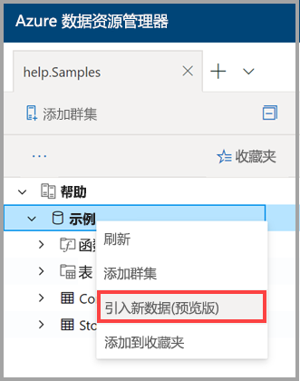
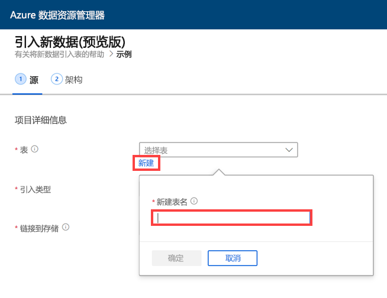
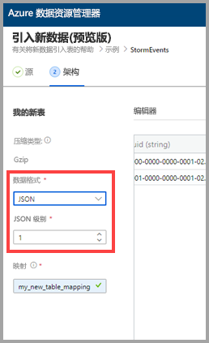
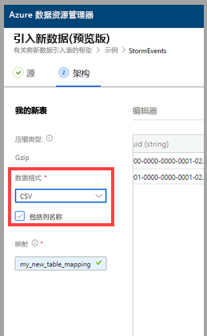
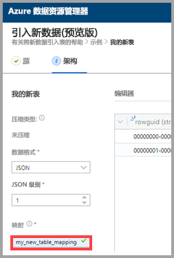
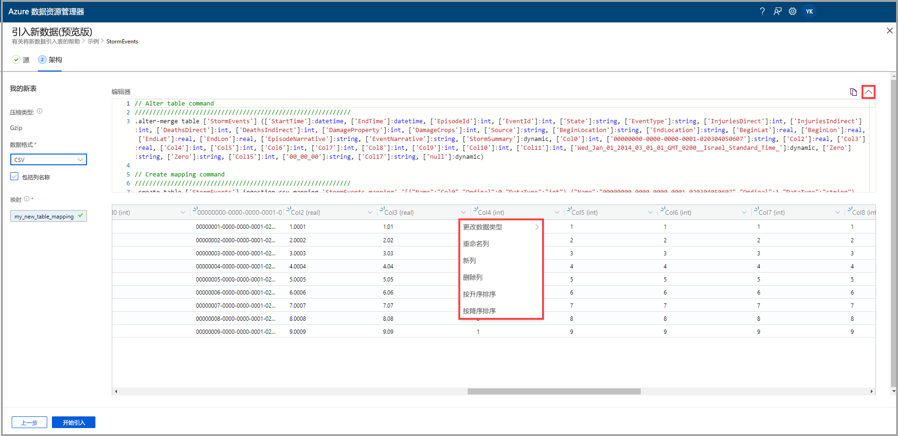
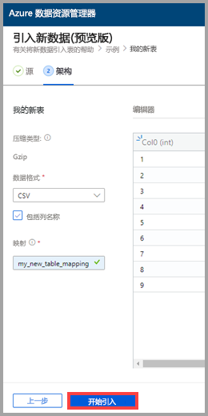
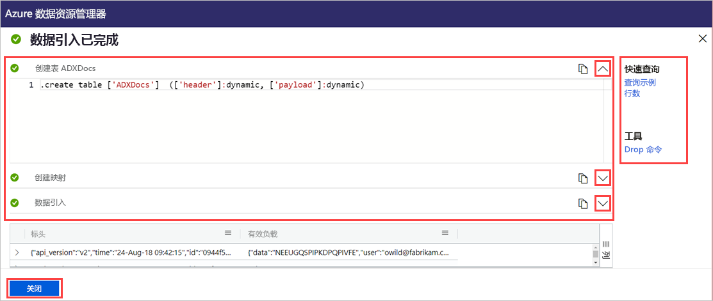

# 使用一键式引入将数据引入 Azure 数据资源管理器中的新表

借助一键式引入，可将 JSON、CSV 和其他格式的数据快速引入表中。 使用 Azure 数据资源管理器 Web UI 可以从存储、本地文件或容器中引入数据。 

本文档介绍如何使用直观的一键式向导将容器中的 CSV 数据引入新表。 然后，可以使用 Azure 数据资源管理器 Web UI 编辑该表和运行查询。 还可以设置连续引入，以便在源数据更新时自动将数据引入表中。

首次引入数据时，或者在你不熟悉自己数据的架构时，一键式引入特别有用。 

有关一键式引入的概述和先决条件列表，请参阅[一键式引入](ingest-data-one-click.md)。
若要了解如何将数据引入 Azure 数据资源管理器中的现有表，请参阅[一键式引入到现有表中](one-click-ingestion-existing-table.md)

## 引入新数据

1. 在 Web UI 的左侧菜单中，右键单击“数据库”并选择“引入新数据(预览版)”。  

       
 
1. 在“引入新数据(预览版)”窗口中，系统已自动选择“源”选项卡。   

1. 选择“创建新表”并输入新表的名称。  可以使用字母数字字符、连字符和下划线。 不支持特殊字符。

 

[!INCLUDE [data-explorer-one-click-ingestion-types](../../includes/data-explorer-one-click-ingestion-types.md)]

选择“编辑架构”以查看并编辑表列配置。  系统会随机选择一个 Blob，并基于该 Blob 生成架构。 服务会通过检查源的名称自动确定该源是否已压缩。

## 编辑架构

1. 在“架构”选项卡中： 

    1. 选择“数据格式”： 

        [!INCLUDE [data-explorer-one-click-ingestion-edit-schema](../../includes/data-explorer-one-click-ingestion-edit-schema.md)]

    1. 如果选择了“JSON”，则还必须选择从 1 到 10 的“JSON 级别”。   级别会影响表列数据的描述。 

    

    * 如果选择 JSON 以外的其他格式，则可以选中“包含列名称”复选框来忽略文件的标题行。 

        
        
1. 在“映射名称”字段中输入映射名称。  可以使用字母数字字符和下划线。 不支持空格、特殊字符和连字符。
    
    

## 复制并粘贴查询

1. 在“编辑器”窗格上方选择“v”按钮，打开编辑器。   在编辑器中，可以查看和复制基于输入生成的自动查询。 
1. 在表中： 
    * 双击新列名称进行编辑。
    * 选择新列标题并执行以下任一操作：
    
|操作         |说明                                  |
|-----------------|-------------------------------------------|
|更改数据类型 |将数据类型从服务自动选择的类型更改为其他[支持的数据类型](#edit-the-schema)之一|
|重命名列    |更改列名称 |
|新列       |添加新列|
|删除列    |删除选定的列|
|按升序排序   |按选定列的升序将表排序（仅限现有列）|
|按降序排序  |按选定列的降序将表排序（仅限现有列） |

> [!Note]
> 可将表格格式的每个列引入到 Azure 数据资源管理器的某个列中。
> 可以从不同的 JSON 级别创建新列。

 

## 开始引入

选择“开始引入”，在创建表和映射后开始引入数据。 

## 数据引入已完成

如果数据引入成功完成，则“数据引入已完成”窗口中的所有三个步骤都会带有绿色的对勾标记。 
 

[!INCLUDE [data-explorer-one-click-ingestion-query-data](../../includes/data-explorer-one-click-ingestion-query-data.md)]

**连续引入**

使用连续引入可以创建一个侦听源容器的事件网格。 任何满足预定义参数（前缀、后缀等）条件的新 Blob 都会自动引入到目标表中。

> [!Note]
> 仅当从容器引入时，连续引入才有作用。

1. 选择“连续引入”，打开 Azure 门户。  此时会打开数据连接页，其中打开了事件网格数据连接器，并已输入了源和目标参数（源容器、表和映射）。

1. 选择“创建”，创建用于侦听该容器中发生的任何更改的数据连接。  

## 后续步骤

* [在 Azure 数据资源管理器 Web UI 中查询数据](/azure/data-explorer/web-query-data)
* [使用 Kusto 查询语言编写 Azure 数据资源管理器的查询](/azure/data-explorer/write-queries)
