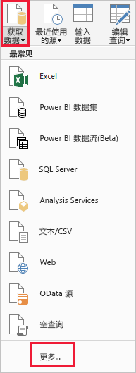
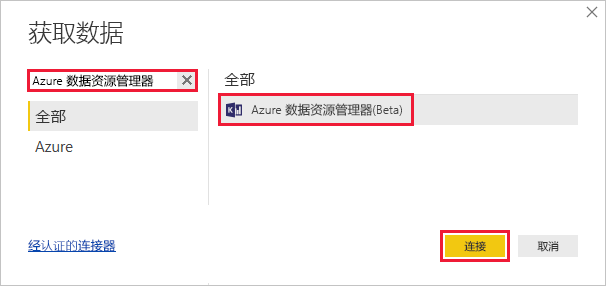
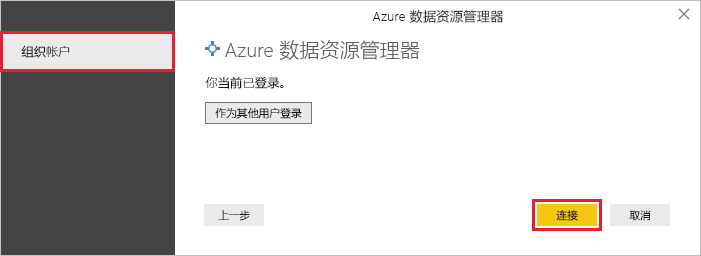
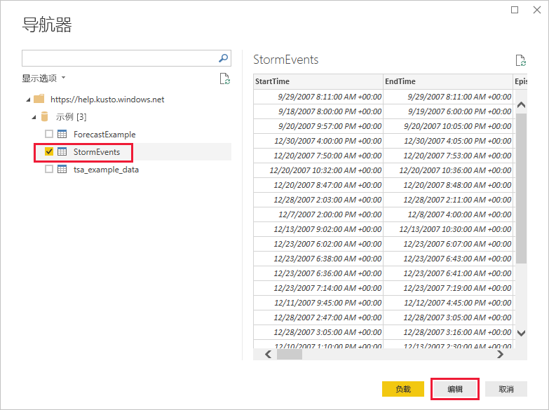
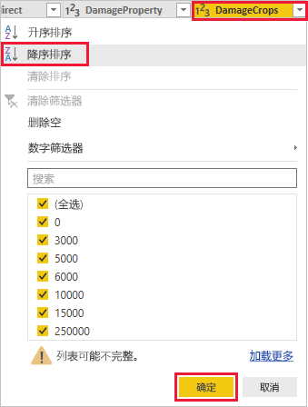
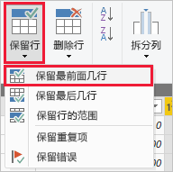
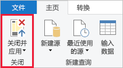

# 使用 Power BI 的 Azure 数据资源管理器连接器直观显示数据

Azure 数据资源管理器是一项快速且高度可缩放的数据探索服务，适用于日志和遥测数据。 Power BI 是一种业务分析解决方案，可以用来可视化数据，并在组织内共享结果。

Azure 数据资源管理器提供三个可以在 Power BI 中连接到数据的选项：使用内置连接器、从 Azure 数据资源管理器导入查询，或者使用 SQL 查询。 本文介绍如何使用内置连接器获取数据并可视化 Power BI 报表中。

如果还没有 Azure 订阅，可以在开始前创建一个[免费 Azure 帐户](https://azure.microsoft.com/free/)。

## 必备组件

若要完成本文，您需要：

* 一个属于 Azure Active Directory 成员的组织电子邮件帐户，以便连接到 [Azure 数据资源管理器帮助群集](https://dataexplorer.azure.com/clusters/help/databases/samples)。

* [Power BI Desktop](https://powerbi.microsoft.com/get-started/)（选择“免费下载”  ）

## 从 Azure 数据资源管理器获取数据

首先连接到 Azure 数据资源管理器帮助群集，然后从 *StormEvents* 表引入一部分数据。 [!INCLUDE [data-explorer-storm-events](../../includes/data-explorer-storm-events.md)]

1. 在 Power BI Desktop 的“主页”选项卡上选择“获取数据”，然后选择“更多”    。

    

1. 搜索*Azure 数据资源管理器*，选择**Azure 数据资源管理器**然后**Connect**。

    

1. 上**Azure 数据资源管理器 (Kusto)** 屏幕上，填写以下信息在窗体。

    

    **设置** | **ReplTest1** | **字段说明**
    |---|---|---|
    | 群集 | *https://help.kusto.windows.net* | 帮助群集的 URL。 其他群集的 URL 采用 *https://\<ClusterName\>.\<区域\>.kusto.windows.net* 格式。 |
    | 数据库 | 留空 | 托管在要连接到的群集上的数据库。 我们会在后面的步骤中选择此项。 |
    | 表名称 | 留空 | 数据库中的一个表，或者类似 <code>StormEvents \| take 1000</code> 的查询。 我们会在后面的步骤中选择此项。 |
    | 高级选项 | 留空 | 查询选项，例如结果集大小。 |
    | 数据连接模式 | *DirectQuery* | 确定 Power BI 是导入数据还是直接连接到数据源。 可以对此连接器使用任一选项。 |
    | | | |

1. 如果还没有连接到帮助群集，请登录。 使用组织帐户登录，然后选择“连接”。 

    

1. 在“导航器”屏幕上，展开  **Samples** 数据库，选择“StormEvents”，然后选择“编辑”。  

    

    表在 Power Query 编辑器中打开，可以在其中编辑行和列，然后导入数据。

1. 在 Power Query 编辑器中，选择“DamageCrops”列旁边的箭头，然后选择“降序排序”。  

    

1. 在“主页”选项卡中，选择“保留行”，然后选择“保留最前面几行”。    输入值 *1000*，引入已存储表的前面 1000 行。

    

1. 在“主页”  选项卡上，选择“关闭并应用”  。

    

## 在报表中将数据可视化

[!INCLUDE [data-explorer-power-bi-visualize-basic](../../includes/data-explorer-power-bi-visualize-basic.md)]

## 清理资源

如果不再需要所创建的报表的这篇文章，删除 Power BI Desktop (.pbix) 文件。

## 后续步骤

[使用导入的查询在 Power BI 中可视化数据](power-bi-imported-query.md)
