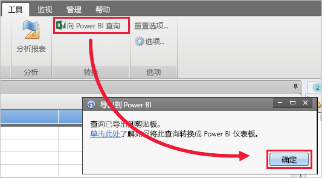
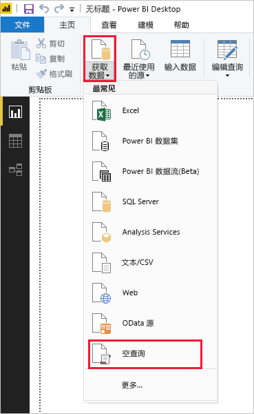
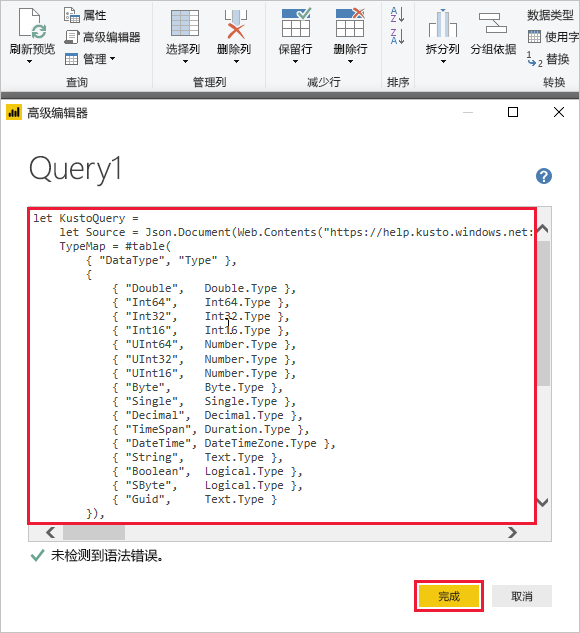

# <a name="quickstart-visualize-data-using-a-query-imported-into-power-bi"></a>快速入门：使用已导入到 Power BI 中的查询来可视化数据

Azure 数据资源管理器是一项快速且高度可缩放的数据探索服务，适用于日志和遥测数据。 Power BI 是一种业务分析解决方案，可以用来可视化数据，并在组织内共享结果。

Azure 数据资源管理器提供三个可以在 Power BI 中连接到数据的选项：使用内置连接器、从 Azure 数据资源管理器导入查询，或者使用 SQL 查询。 本快速入门介绍如何导入查询，以便获取数据并在 Power BI 报表中将其可视化。

如果还没有 Azure 订阅，可以在开始前创建一个[免费 Azure 帐户](https://azure.microsoft.com/free/)。

## <a name="prerequisites"></a>先决条件

需要以下先决条件才能完成本快速入门：

* 一个属于 Azure Active Directory 成员的组织电子邮件帐户，以便连接到 [Azure 数据资源管理器帮助群集](https://dataexplorer.azure.com/clusters/help/databases/samples)。

* [Power BI Desktop](https://powerbi.microsoft.com/get-started/)（选择“免费下载”）

* [Azure 数据资源管理器桌面应用](/azure/kusto/tools/kusto-explorer)

## <a name="get-data-from-azure-data-explorer"></a>从 Azure 数据资源管理器获取数据

首先，在 Azure 数据资源管理器桌面应用中创建一个查询并将其导出，以便在 Power BI 中使用。 然后，连接到 Azure 数据资源管理器帮助群集，并从 *StormEvents* 表引入一部分数据。 [!INCLUDE [data-explorer-storm-events](../../includes/data-explorer-storm-events.md)]

1. 在浏览器中转到 [https://help.kusto.windows.net/](https://help.kusto.windows.net/)，以便启动 Azure 数据资源管理器桌面应用。

1. 在桌面应用中，将以下查询复制到右上查询窗口中，然后运行该查询。

    ```Kusto
    StormEvents
    | sort by DamageCrops desc
    | take 1000
    ```

    结果集的头几行应该如下图所示。

    

1. 在“工具”选项卡上选择“对 Power BI 进行查询”，然后选择“确定”。

    

1. 在 Power BI Desktop 的“主页”选项卡上，选择“获取数据”，然后选择“空白查询”。

    

1. 在 Power Query 编辑器的“主页”选项卡上，选择“高级编辑器”。

1. 在“高级编辑器”窗口中，粘贴导出的查询，然后选择“完成”。

    

1. 在 Power Query 编辑器主窗口中，选择“编辑凭据”。 选择“组织帐户”，登录，然后选择“连接”。

    

1. 在“主页”选项卡上，选择“关闭并应用”。

    

## <a name="visualize-data-in-a-report"></a>在报表中将数据可视化

[!INCLUDE [data-explorer-power-bi-visualize-basic](../../includes/data-explorer-power-bi-visualize-basic.md)]

## <a name="clean-up-resources"></a>清理资源

如果不再需要为本快速入门创建的报表，请删除 Power BI Desktop (.pbix) 文件。

## <a name="next-steps"></a>后续步骤

> [!div class="nextstepaction"]
> [快速入门：使用 Power BI 中已导入的查询来直观显示数据](power-bi-sql-query.md)