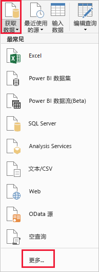
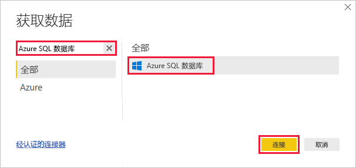
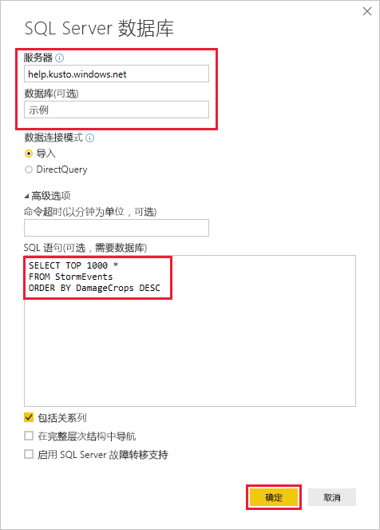
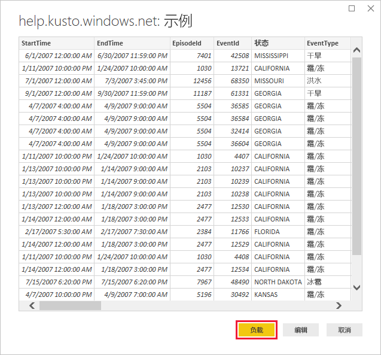

# <a name="quickstart-visualize-data-using-the-azure-data-explorer-connector-for-power-bi"></a>快速入门：使用 Power BI 的 Azure 数据资源管理器连接器直观显示数据

Azure 数据资源管理器是一项快速且高度可缩放的数据探索服务，适用于日志和遥测数据。 Power BI 是一种业务分析解决方案，可以用来可视化数据，并在组织内共享结果。

Azure 数据资源管理器提供三个可以在 Power BI 中连接到数据的选项：使用内置连接器、从 Azure 数据资源管理器导入查询，或者使用 SQL 查询。 本快速入门介绍如何使用 SQL 查询，以便获取数据并在 Power BI 报表中将其可视化。

如果还没有 Azure 订阅，可以在开始前创建一个[免费 Azure 帐户](https://azure.microsoft.com/free/)。

## <a name="prerequisites"></a>先决条件

需要以下先决条件才能完成本快速入门：

* 一个属于 Azure Active Directory 成员的组织电子邮件帐户，以便连接到 [Azure 数据资源管理器帮助群集](https://dataexplorer.azure.com/clusters/help/databases/samples)。

* [Power BI Desktop](https://powerbi.microsoft.com/get-started/)（选择“免费下载”）

## <a name="get-data-from-azure-data-explorer"></a>从 Azure 数据资源管理器获取数据

首先连接到 Azure 数据资源管理器帮助群集，然后从 *StormEvents* 表引入一部分数据。 [!INCLUDE [data-explorer-storm-events](../../includes/data-explorer-storm-events.md)]

通常对 Azure 数据资源管理器使用本机查询语言，但它也支持这里将要用到的 SQL 查询。 Azure 数据资源管理器将 SQL 查询转换成本机查询。

1. 在 Power BI Desktop 的“主页”选项卡上选择“获取数据”，然后选择“更多”。

    

1. 搜索“Azure SQL 数据库”，选择“Azure SQL 数据库”，然后选择“连接”。

    

1. 在“SQL Server 数据库”屏幕的窗体中填充以下信息。

    

    **设置** | **值** | **字段说明**
    |---|---|---|
    | 服务器 | *help.kusto.windows.net* | 帮助群集的 URL（没有 *https://*）。 其他群集的 URL 采用 *\<ClusterName\>.\<区域\>.kusto.windows.net* 格式。 |
    | 数据库 | *示例* | 托管在要连接到的群集上的示例数据库。 |
    | 数据连接模式 | *导入* | 确定 Power BI 是导入数据还是直接连接到数据源。 可以对此连接器使用任一选项。 |
    | 命令超时 | 留空 | 查询会在运行多长时间之后引发超时错误。 |
    | SQL 语句 | 复制此表下面的查询 | 一种 SQL 语句，通过 Azure 数据资源管理器转换成本机查询。 |
    | 其他选项 | 保留为默认值 | 选项不应用到 Azure 数据资源管理器群集。 |
    | | | |

    ```SQL
    SELECT TOP 1000 *
    FROM StormEvents
    ORDER BY DamageCrops DESC
    ```

1. 如果还没有连接到帮助群集，请登录。 使用 Microsoft 帐户登录，然后选择“连接”。

    

1. 在“help.kusto.windows.net: 示例”屏幕上，选择“加载”。

    

    此表在 Power BI 主窗口的报表视图中打开，方便你在其中根据示例数据来创建报表。

## <a name="visualize-data-in-a-report"></a>在报表中将数据可视化

[!INCLUDE [data-explorer-power-bi-visualize-basic](../../includes/data-explorer-power-bi-visualize-basic.md)]

## <a name="clean-up-resources"></a>清理资源

如果不再需要为本快速入门创建的报表，请删除 Power BI Desktop (.pbix) 文件。

## <a name="next-steps"></a>后续步骤

> [!div class="nextstepaction"]
> [快速入门：使用 Power BI 中已导入的查询来直观显示数据](power-bi-connector.md)