# <a name="quickstart-query-data-in-azure-data-explorer-web-ui"></a>快速入门：在 Azure 数据资源管理器 Web UI 中查询数据

Azure 数据资源管理器是一项快速且高度可缩放的数据探索服务，适用于日志和遥测数据。 Azure 数据资源管理器提供了 Web 应用程序，可用于运行和共享查询。 该应用程序可在 Azure 门户中使用，也可作为独立的 Web 应用程序使用。 在本文中，将使用独立版本，该版本允许连接到多个群集并共享指向查询的深层链接。

如果还没有 Azure 订阅，可以在开始前创建一个[免费 Azure 帐户](https://azure.microsoft.com/free/)。

## <a name="prerequisites"></a>先决条件

除 Azure 订阅外，还需[测试群集和数据库](create-cluster-database-portal.md)才能完成此快速入门。

## <a name="sign-in-to-the-application"></a>登录应用程序

登录到[应用程序](https://dataexplorer.azure.com/)。

## <a name="add-clusters"></a>添加群集

首次打开应用程序时，未进行任何连接。


开始运行查询前，必须先将连接添加到至少一个群集中。 在本部分中，将连接添加到我们为帮助学习而设置的 Azure 数据资源管理器 help 群集，以及在之前的快速入门中创建的测试群集中  。

1. 在应用程序的左上角，选择“添加群集”  。

1. 在“添加群集”对话框中，输入 URI，然后选择“添加”   。

   可使用 help 群集 URI `https://help.kusto.windows.net`。 如果你有自己的群集，请提供自己的群集 URI。 例如，`https://mydataexplorercluster.westus.kusto.windows.net`，如下图所示：

    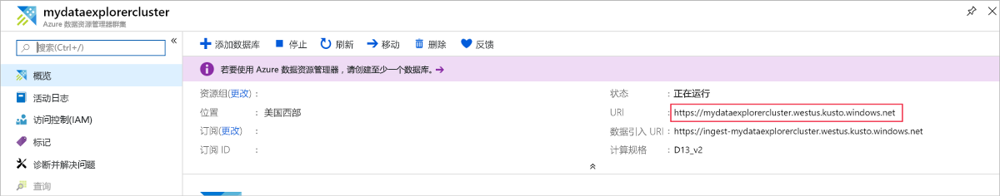

1. 在左侧窗格中，现在应看到 help 群集  。 展开“示例”数据库，以便可查看有权访问的示例表  。

    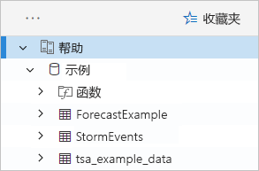

    我们在本快速入门后面部分以及其他 Azure 数据资源管理器文章中使用 StormEvents 表  。

现在添加创建的测试群集。

1. 选择“添加群集”  。

1. 在“添加群集”对话框中，以 `https://<ClusterName>.<Region>.kusto.windows.net/` 格式输入测试群集 URL，然后选择“添加”   。

    在以下示例中，会看到 help 群集和一个新群集 docscluster.westus（完整 URL 为 `https://docscluster.westus.kusto.windows.net/`）   。

    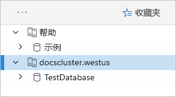

## <a name="run-queries"></a>运行查询

现在可针对连接到的任一群集运行查询（假设测试群集中有数据）。 我们将重点介绍 help 群集  。

1. 在左窗格中的 help 群集下，选择示例数据库   。

1. 将以下查询复制并粘贴到查询窗口中。 在窗口顶部，选择“运行”  。

    ```Kusto
    StormEvents
    | sort by StartTime desc
    | take 10
    ```
    此查询返回 StormEvents 表中的十条最新记录  。 结果的左侧应如下表所示。

    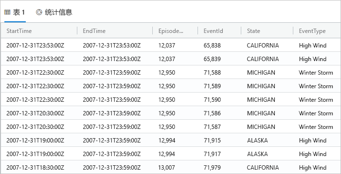

    下图显示了应用程序现在应处的状态，添加了群集以及带有结果的查询。

    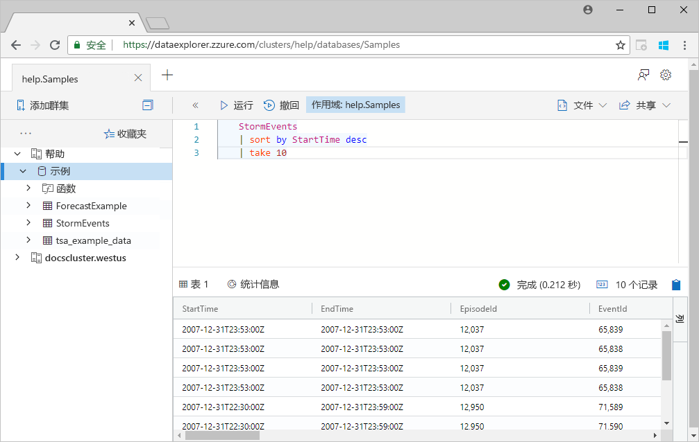

1. 将以下查询复制并粘贴到第一个查询下方的查询窗口中。 请注意，它与首个查询在单独行上格式化的方式有何不同。

    ```Kusto
    StormEvents | sort by StartTime desc | project StartTime, EndTime, State, EventType, DamageProperty, EpisodeNarrative | take 10
    ```

1. 单击窗口中的新建查询，该窗口将选择该查询。 按 Shift+Alt+F 设置查询格式，如下所示。

    

1. 按 Shift+Enter，这是运行查询的快捷方式。

   此查询返回与第一条记录相同的记录，但仅包括 `project` 语句中指定的列。 结果应如下表所示。

    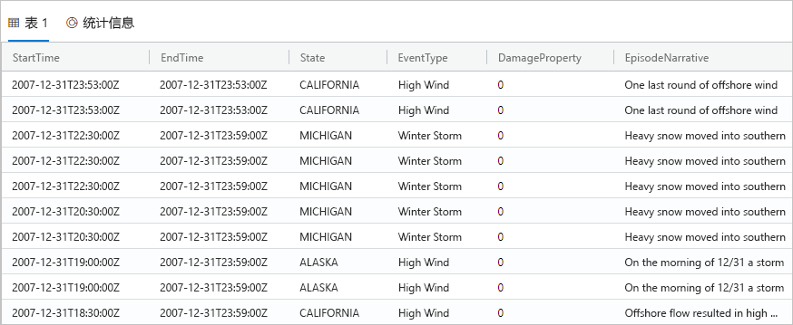

1. 在查询窗口顶部，选择“撤回”  。

    查询窗口现在显示第一个查询的结果集，而无需重新运行该查询。 通常在分析期间，会运行多个查询，通过“撤回”可以重新访问先前查询的结果  。

1. 让我们再运行一个查询来查看不同类型的输出。

    ```Kusto
    StormEvents
    | summarize event_count=count(), mid = avg(BeginLat) by State
    | sort by mid
    | where event_count > 1800
    | project State, event_count
    | render columnchart
    ```
    结果应如下图所示。

    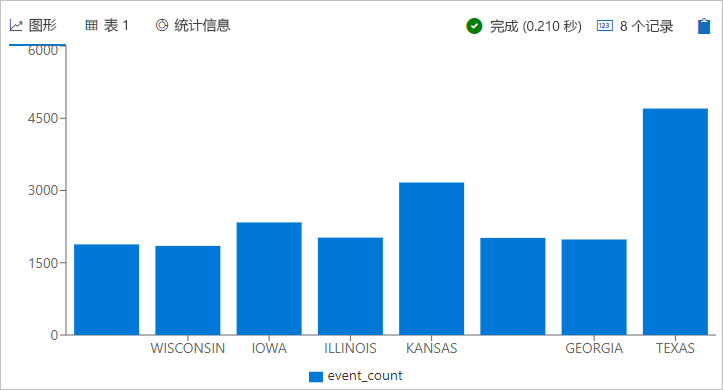

## <a name="work-with-the-table-grid"></a>使用网格型

现在你已了解了基本查询的工作原理，让我们看看如何使用网格型来自定义结果并进行进一步分析。

1. 重新运行第一个查询。 将鼠标悬停在“州”列上，选择菜单，然后选择“按州分组”   。

    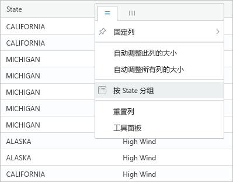

1. 在网格中，展开加利福尼亚州，以查看该州的记录  。

    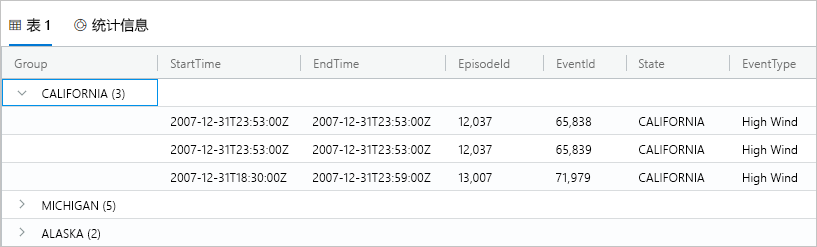

    进行探索性分析时，此类型的分组可能会有所帮助。

1. 将鼠标悬停在“组”列上，然后选择“重置列”   。

    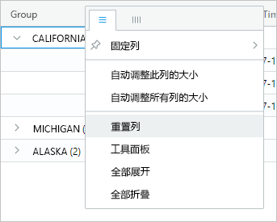

    此操作将网格返回到其原始状态。

1. 运行以下查询。

    ```Kusto
    StormEvents
    | sort by StartTime desc
    | where DamageProperty > 5000
    | project StartTime, State, EventType, DamageProperty, Source
    | take 10
    ```

1. 在网格的右侧，选择“列”以查看工具面板  。

    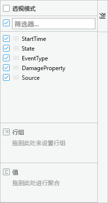

    此面板的功能类似于 Excel 中的数据透视表字段列表，可在网格中执行更多分析。

1. 选择“透视模式”，然后按以下方式拖动列  ：将“状态”拖动到“行组”；将“DamageProperty”拖动到“值”，并将“EventType”拖动到“列标签”       。  

    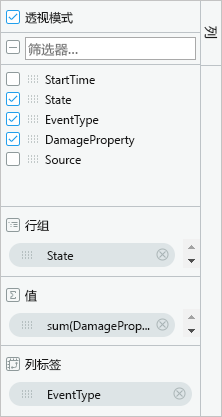

    结果应如以下数据透视表所示。

    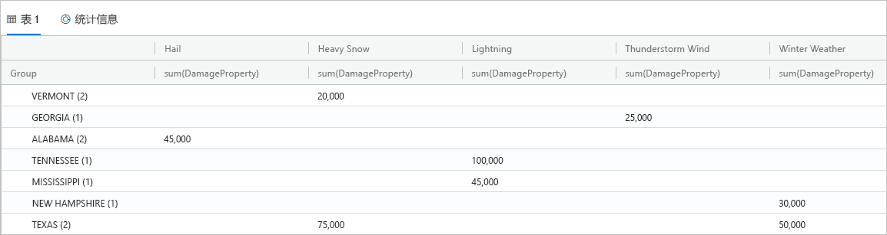

    请注意佛蒙特州和阿拉巴马州各有两个属于同一类别的事件，而德克萨斯州有两个不同类别的事件。 通过数据透视表可以快速发现这样的情况，它们是快速分析的绝佳工具。

## <a name="share-queries"></a>共享查询

很多时候，你希望共享创建的查询。 可提供深层链接，以便有权访问群集的其他用户可运行查询。

1. 在查询窗口中，选择复制的第一个查询。

1. 在查询窗口顶部，选择“共享”  。

1. 选择“链接，查询剪贴板”  。

1. 将链接和查询复制到文本文件。

1. 将链接粘贴到新的浏览器窗口中。 运行查询后，结果应如下所示。

    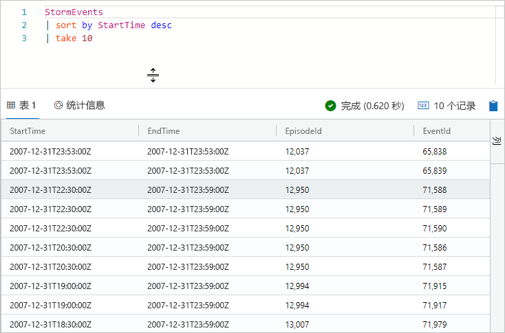

## <a name="provide-feedback"></a>提供反馈

数据资源管理器当前处于预览阶段，欢迎提供体验反馈。 可立即执行此操作，也可等待，直到你已经花了更多时间。

1. 在应用程序的右上角，选择反馈图标： .

1. 输入反馈，然后选择“提交”  。

## <a name="clean-up-resources"></a>清理资源

未在此快速入门中创建任何资源，但如果要从应用程序中删除一个或两个群集，请右键单击群集并选择“删除连接”  。

## <a name="next-steps"></a>后续步骤

[Azure 数据资源管理器的编写查询](write-queries.md)
