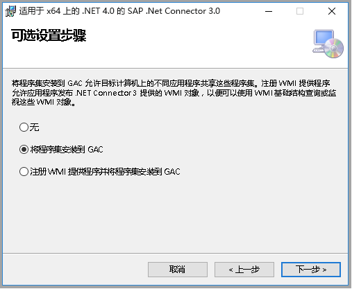

# <a name="copy-data-from-sap-business-warehouse-via-open-hub-using-azure-data-factory"></a>使用 Azure 数据工厂通过 Open Hub 从 SAP Business Warehouse 复制数据

本文概述了如何使用 Azure 数据工厂中的复制活动，通过 Open Hub 从 SAP Business Warehouse (BW) 复制数据。 它是基于概述复制活动总体的[复制活动概述](copy-activity-overview.md)一文。

>[!TIP]
>若要了解 ADF 全面支持 SAP 数据集成方案, 请参阅[使用 Azure 数据工厂的 SAP 数据集成白皮书](https://github.com/Azure/Azure-DataFactory/blob/master/whitepaper/SAP%20Data%20Integration%20using%20Azure%20Data%20Factory.pdf), 并提供详细的简介、comparsion 和指南。

## <a name="supported-capabilities"></a>支持的功能

可以通过 Open Hub 将数据从 SAP Business Warehouse 复制到任何受支持的接收器数据存储。 有关复制活动支持作为源/接收器的数据存储列表，请参阅[支持的数据存储](copy-activity-overview.md#supported-data-stores-and-formats)表。

具体而言，此 SAP Business Warehouse Open Hub 连接器支持：

- SAP Business Warehouse **7.01 或更高版本（位于最新的 SAP 支持包堆栈中，该堆栈是 2015 年以后发布的）** 。
- 通过 Open Hub Destination 本地表复制数据，该表下方可能是 DSO、InfoCube、MultiProvider、DataSource 等。
- 使用基本身份验证复制数据。
- 连接到应用程序服务器。

## <a name="sap-bw-open-hub-integration"></a>SAP BW Open Hub 集成 

可以通过 [SAP BW Open Hub Service](https://wiki.scn.sap.com/wiki/display/BI/Overview+of+Open+Hub+Service) 从 SAP BW 高效地提取数据。 下图显示客户在其 SAP 系统中的典型流之一，数据流动方向为：SAP ECC -> PSA -> DSO -> 多维数据集。

SAP BW Open Hub Destination (OHD) 定义 SAP 数据的中继目标。 可以使用 SAP 数据传输过程 (DTP) 支持的任何对象（例如，DSO、InfoCube、DataSource 等）作为 Open Hub 数据源。Open Hub Destination 类型是存储中继数据的地方，可以是数据库表（本地或远程）和平面文件。 此 SAP BW Open Hub 连接器支持从 BW 中的 OHD 本地表复制数据。 如果使用其他类型，则可使用其他连接器直接连接到数据库或文件系统。


## <a name="delta-extraction-flow"></a>增量提取流

ADF SAP BW Open Hub 连接器提供两种可选属性：`excludeLastRequest` 和 `baseRequestId`，可以用于处理来自 Open Hub 的增量负荷。 

- **excludeLastRequestId**：是否排除最后一个请求的记录。 默认值为 true。 
- **baseRequestId**：增量加载的请求的 ID。 设置以后，只会检索 requestId 大于此属性的值的数据。 

总之，从 SAP InfoProviders 提取到 Azure 数据工厂 (ADF) 的操作包含 2 个步骤： 

1. **SAP BW 数据传输过程 (DTP)** ：此步骤将数据从 SAP BW InfoProvider 复制到 SAP BW Open Hub 表 

1. **ADF 数据复制**：在此步骤中，Open Hub 表由 ADF 连接器读取 


在第一步中，执行 DTP。 每执行一次都会创建新的 SAP 请求 ID。 此请求 ID 存储在 Open Hub 表中，然后 ADF 连接器用它来标识增量。 这两个步骤以异步方式运行：DTP 由 SAP 触发，ADF 数据复制通过 ADF 触发。 

默认情况下，ADF 不从 Open Hub 表读取最新增量（选项“排除上一请求”为 true）。 因此，ADF 中的数据并非与 Open Hub 表中的数据 100% 一致（最后的增量缺失）。 反过来，此过程可确保不会因异步提取而导致行丢失。 即使在 ADF 读取 Open Hub 表（此时 DTP 仍在写入同一表）时，它也适用。 

通常将在最后一次运行时由 ADF 进行了最多复制的请求 ID 存储在暂存数据存储（例如上图中的 Azure Blob）中。 因此，同一请求不会在后续运行中由 ADF 再次读取。 同时请注意，数据不会自动从 Open Hub 表中删除。

为了进行正常的增量处理，不允许将来自不同 DTP 的请求 ID 置于同一 Open Hub 表中。 因此，不得为单个 Open Hub 目标 (OHD) 创建多个 DTP。 需要从同一 InfoProvider 进行完全提取和增量提取时，应该为同一 InfoProvider 创建两个 OHD。 

## <a name="prerequisites"></a>先决条件

若要使用此 SAP Business Warehouse Open Hub 连接器，需要：

- 设置 3.13 或更高版本的自承载集成运行时。 有关详细信息，请参阅[自承载集成运行时](create-self-hosted-integration-runtime.md)一文。

- 从 SAP 的网站下载 **64 位 [SAP .NET Connector 3.0](https://support.sap.com/en/product/connectors/msnet.html)** ，将其安装在自承载 IR 计算机上。 安装时，请在可选的安装步骤窗口中确保选择“将程序集安装到 GAC”选项，如下图所示。 

    

- 在数据工厂 BW 连接器中使用的 SAP 用户需要有以下权限： 

    - RFC 和 SAP BW 的授权。 
    - “执行”授权对象“S_SDSAUTH”的活动的权限。

- 将 SAP Open Hub Destination 类型创建为“数据库表”（勾选“技术密钥”选项）。  另外还建议取消选中“从表中删除数据”，虽然这不是必需的操作。 利用 DTP（直接执行或集成到现有进程链中）将数据从所选源对象（例如多维数据集）移到 Open Hub Destination 表。

## <a name="getting-started"></a>入门

> [!TIP]
>
> 若要详细了解如何使用 SAP BW Open Hub 连接器，请参阅[使用 Azure 数据工厂从 SAP Business Warehouse (BW) 加载数据](load-sap-bw-data.md)。

[!INCLUDE [data-factory-v2-connector-get-started](../../includes/data-factory-v2-connector-get-started.md)]

对于特定于 SAP Business Warehouse Open Hub 连接器的数据工厂实体，以下部分提供了有关用于定义这些实体的属性的详细信息。

## <a name="linked-service-properties"></a>链接服务属性

SAP Business Warehouse Open Hub 链接服务支持以下属性：

| 属性 | 说明 | 必选 |
|:--- |:--- |:--- |
| type | type 属性必须设置为：**SapOpenHub** | 是 |
| 服务器 | SAP BW 实例所驻留的服务器的名称。 | 是 |
| systemNumber | SAP BW 系统的系统编号。<br/>允许值：用字符串表示的两位十进制数。 | 是 |
| clientId | SAP W 系统中的客户端的客户端 ID。<br/>允许值：用字符串表示的三位十进制数。 | 是 |
| language | SAP 系统使用的语言。 | 否（默认值为 **EN**）|
| userName | 有权访问 SAP 服务器的用户名。 | 是 |
| password | 用户密码。 将此字段标记为 SecureString 以安全地将其存储在数据工厂中或[引用存储在 Azure Key Vault 中的机密](store-credentials-in-key-vault.md)。 | 是 |
| connectVia | 用于连接到数据存储的[集成运行时](concepts-integration-runtime.md)。 如[先决条件](#prerequisites)中所述，需要自承载集成运行时。 |是 |

**示例：**

```json
{
    "name": "SapBwOpenHubLinkedService",
    "properties": {
        "type": "SapOpenHub",
        "typeProperties": {
            "server": "<server name>",
            "systemNumber": "<system number>",
            "clientId": "<client id>",
            "userName": "<SAP user>",
            "password": {
                "type": "SecureString",
                "value": "<Password for SAP user>"
            }
        },
        "connectVia": {
            "referenceName": "<name of Integration Runtime>",
            "type": "IntegrationRuntimeReference"
        }
    }
}
```

## <a name="dataset-properties"></a>数据集属性

有关可用于定义数据集的各部分和属性的完整列表，请参阅[数据集](concepts-datasets-linked-services.md)一文。 本部分提供 SAP BW Open Hub 数据集支持的属性列表。

若要从/向 SAP BW Open Hub 复制数据，请将数据集的 type 属性设置为 **SapOpenHubTable**。 支持以下属性。

| 属性 | 说明 | 必选 |
|:--- |:--- |:--- |
| type | type 属性必须设置为 **SapOpenHubTable**。  | 是 |
| openHubDestinationName | 要从其复制数据的 Open Hub Destination 的名称。 | 是 |
| excludeLastRequest | 是否排除最后一个请求的记录。 | 否（默认为 **true**） |
| baseRequestId | 增量加载的请求的 ID。 设置以后，只会检索 requestId **大于**此属性的值的数据。  | 否 |

>[!TIP]
>如果 Open Hub 表只包含通过单个请求 ID 生成的数据（例如，始终进行完全加载并覆盖表中的现有数据，或者只在测试时运行 DTP 一次），则请记住取消选中“excludeLastRequest”选项，以便复制数据。

**示例：**

```json
{
    "name": "SAPBWOpenHubDataset",
    "properties": {
        "type": "SapOpenHubTable",
        "linkedServiceName": {
            "referenceName": "<SAP BW Open Hub linked service name>",
            "type": "LinkedServiceReference"
        },
        "typeProperties": {
            "openHubDestinationName": "<open hub destination name>"
        }
    }
}
```

## <a name="copy-activity-properties"></a>复制活动属性

有关可用于定义活动的各部分和属性的完整列表，请参阅[管道](concepts-pipelines-activities.md)一文。 本部分提供 SAP BW Open Hub 源支持的属性列表。

### <a name="sap-bw-open-hub-as-source"></a>将 SAP BW Open Hub 作为源

若要从 SAP BW Open Hub 复制数据，请将复制活动中的源类型设置为“SapOpenHubSource”。 复制活动的 **source** 节中没有其他特定于类型的必需属性。

若要加快数据加载速度, 可以在复制[`parallelCopies`](copy-activity-performance.md#parallel-copy)活动上设置, 以并行从 SAP BW 打开的中心加载数据。 例如, 如果将设置`parallelCopies`为 4, 则数据工厂会同时执行四个 RFC 调用, 并且每个 rfc 调用都将从 SAP BW 打开的中心表中检索部分数据, 并按 DTP 请求 id 和包 id 进行分区。 这适用于唯一 DTP 请求 ID + 包 ID 的数量大于的值`parallelCopies`时。 将数据复制到基于文件的数据存储时, 还 recommanded 将文件夹作为多个文件写入 (仅指定文件夹名称), 在这种情况下, 性能比写入单个文件更好。

**示例：**

```json
"activities":[
    {
        "name": "CopyFromSAPBWOpenHub",
        "type": "Copy",
        "inputs": [
            {
                "referenceName": "<SAP BW Open Hub input dataset name>",
                "type": "DatasetReference"
            }
        ],
        "outputs": [
            {
                "referenceName": "<output dataset name>",
                "type": "DatasetReference"
            }
        ],
        "typeProperties": {
            "source": {
                "type": "SapOpenHubSource"
            },
            "sink": {
                "type": "<sink type>"
            },
            "parallelCopies": 4
        }
    }
]
```

## <a name="data-type-mapping-for-sap-bw-open-hub"></a>SAP BW Open Hub 的数据类型映射

从 SAP BW Open Hub 复制数据时，以下映射用于从 SAP BW 数据类型映射到 Azure 数据工厂临时数据类型。 若要了解复制活动如何将源架构和数据类型映射到接收器，请参阅[架构和数据类型映射](copy-activity-schema-and-type-mapping.md)。

| SAP ABAP 类型 | 数据工厂临时数据类型 |
|:--- |:--- |
| C (String) | String |
| I (integer) | Int32 |
| F (Float) | Double |
| D (Date) | String |
| T (Time) | String |
| P (BCD Packed, Currency, Decimal, Qty) | Decimal |
| N (Numc) | String |
| X (Binary and Raw) | String |

## <a name="next-steps"></a>后续步骤
有关 Azure 数据工厂中复制活动支持作为源和接收器的数据存储的列表，请参阅[支持的数据存储](copy-activity-overview.md#supported-data-stores-and-formats)。
