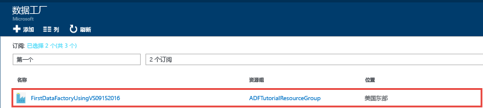
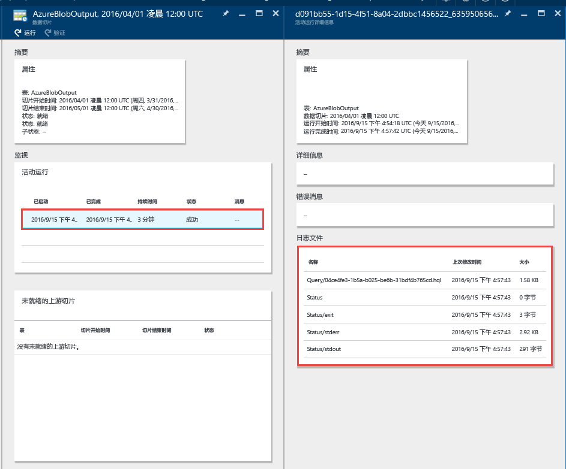
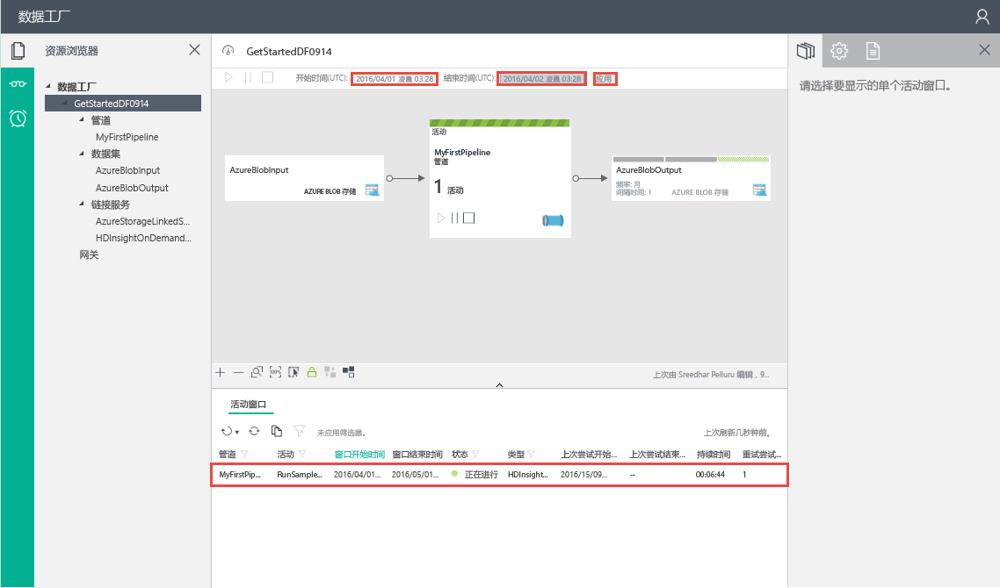
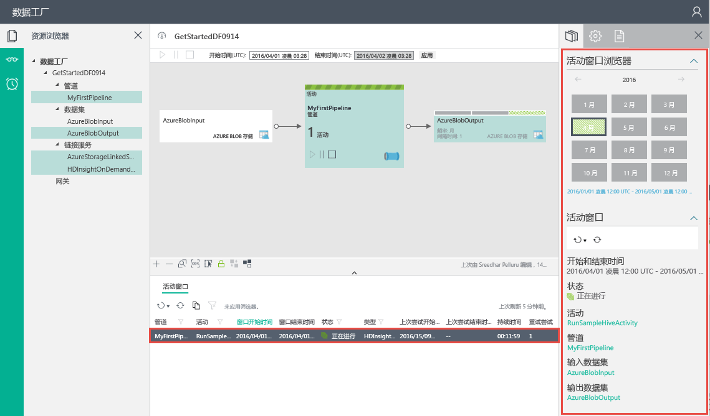

# 教程：使用 Microsoft Visual Studio 构建第一个 Azure 数据工厂
> [!div class="op_single_selector"]
> * [概述与先决条件](data-factory-build-your-first-pipeline.md)
> * [Azure 门户](data-factory-build-your-first-pipeline-using-editor.md)
> * [Visual Studio](data-factory-build-your-first-pipeline-using-vs.md)
> * [PowerShell](data-factory-build-your-first-pipeline-using-powershell.md)
> * [Resource Manager 模板](data-factory-build-your-first-pipeline-using-arm.md)
> * [REST API](data-factory-build-your-first-pipeline-using-rest-api.md)
> 
> 

本教程介绍如何使用 Microsoft Visual Studio 创建第一个 Azure 数据工厂。

## 先决条件
1. 阅读[教程概述](data-factory-build-your-first-pipeline.md)，完成**先决条件**步骤。
2. 只有 **Azure 订阅的管理员**才能将数据工厂实体从 Visual Studio 发布到 Azure 数据工厂。
3. 必须在计算机上安装以下软件：
   * Visual Studio 2013 或 Visual Studio 2015
   * 下载用于 Visual Studio 2013 或 Visual Studio 2015 的 Azure SDK。导航到 [Azure 下载页](https://azure.microsoft.com/downloads/)，在“.NET”部分中单击“VS 2013”或“VS 2015”。
   * 下载用于 Visual Studio 的最新 Azure 数据工厂插件：[VS 2013](https://visualstudiogallery.msdn.microsoft.com/754d998c-8f92-4aa7-835b-e89c8c954aa5) 或 [VS 2015](https://visualstudiogallery.msdn.microsoft.com/371a4cf9-0093-40fa-b7dd-be3c74f49005)。如果使用了 Visual Studio 2013，则还可通过执行以下步骤更新插件：在菜单上，依次单击“工具”->“扩展和更新”->“联机”->“Visual Studio 库”->“适用于 Visual Studio 的 Microsoft Azure 数据工厂工具”->“更新”。

现在，使用 Visual Studio 创建 Azure 数据工厂。

## 创建 Visual Studio 项目
1. 启动 **Visual Studio 2013** 或 **Visual Studio 2015**。单击“文件”，指向“新建”并单击“项目”。此时将显示“新建项目”对话框。
2. 在“新建项目”对话框中，选择“DataFactory”模板，然后单击“空数据工厂项目”。
   
    
3. 输入项目的**名称**、**位置**以及**解决方案**的名称，然后单击“确定”。
   
    

## 创建链接服务
数据工厂可以包含一个或多个数据管道。管道可以包含一个或多个活动。例如，将数据从源复制到目标数据存储的复制活动，以及运行 Hive 脚本来转换输入数据的 HDInsight Hive 活动。稍后在发布数据工厂解决方案时，将指定数据工厂的名称和设置。

在此步骤中，将 Azure 存储帐户和按需 Azure HDInsight 群集链接到数据工厂。Azure 存储帐户保留本示例中管道的输入和输出数据。HDInsight 链接服务用于运行本示例中管道活动指定的 Hive 脚本。识别方案中使用的数据存储/计算服务，创建链接的服务将这些服务链接到数据工厂。

#### 创建 Azure 存储链接服务
在此步骤中，将 Azure 存储帐户链接到数据工厂。本教程使用相同的 Azure 存储帐户来存储输入/输出数据和 HQL 脚本文件。

1. 在解决方案资源管理器中，右键单击“链接服务”，指向“添加”，然后单击“新建项”。
2. 在“添加新项”对话框中，从列表中选择“Azure 存储链接服务”，然后单击“添加”。
3. 将 **accountname** 和 **accountkey** 替换为 Azure 存储帐户及其密钥。若要了解如何获取存储访问密钥，请参阅 [View, copy and regenerate storage access keys](../storage/storage-create-storage-account.md#view-copy-and-regenerate-storage-access-keys)（查看、复制和重新生成存储访问密钥）
   
    
4. 保存 **AzureStorageLinkedService1.json** 文件。

#### 创建 Azure HDInsight 链接服务
在此步骤中，可将按需 HDInsight 群集链接到数据工厂。HDInsight 群集在运行时自动创建，在处理完成之后删除，并且会空闲指定的一段时间。可以使用自己的 HDInsight 群集，而不使用按需 HDInsight 群集。有关详细信息，请参阅 [Compute Linked Services](data-factory-compute-linked-services.md)（计算链接服务）。

1. 在“解决方案资源管理器”中，右键单击“链接服务”，指向“添加”，然后单击“新建项”。
2. 选择“HDInsight 按需链接服务”，然后单击“添加”。
3. 将 **JSON** 替换为以下代码：
   
        {
          "name": "HDInsightOnDemandLinkedService",
          "properties": {
            "type": "HDInsightOnDemand",
            "typeProperties": {
              "version": "3.2",
              "clusterSize": 1,
              "timeToLive": "00:30:00",
              "linkedServiceName": "AzureStorageLinkedService1"
            }
          }
        }
   
    下表提供了代码片段中使用的 JSON 属性的描述：
   
   | 属性 | 说明 |
   | --- | --- |
   |  版本 |指定所创建的 HDInsight 版本为 3.2。 |
   |  ClusterSize |指定 HDInsight 群集的大小。 |
   |  TimeToLive |指定 HDInsight 群集在被删除之前的空闲时间。 |
   |  linkedServiceName |指定用于存储 HDInsight 生成的日志的存储帐户 |
   
    注意以下事项：
   
   * 数据工厂使用前面的 JSON 创建**基于 Windows 的** HDInsight 群集。也可以让它创建**基于 Linux 的** HDInsight 群集。有关详细信息，请参阅 [On-demand HDInsight Linked Service](data-factory-compute-linked-services.md#azure-hdinsight-on-demand-linked-service)（按需 HDInsight 链接服务）。
   * 可以使用**自己的 HDInsight 群集**，而不使用按需 HDInsight 群集。有关详细信息，请参阅 [HDInsight Linked Service](data-factory-compute-linked-services.md#azure-hdinsight-linked-service)（HDInsight 链接服务）。
   * HDInsight 群集在 JSON 中指定的 Blob 存储 (**linkedServiceName**).内创建**默认容器**。HDInsight 不会在删除群集时删除此容器。这是设计的行为。使用按需 HDInsight 链接服务时，除非有现有的实时群集 (**timeToLive**)，否则每当需要处理切片时，都会创建 HDInsight 群集。处理完成后将自动删除该群集。
     
       随着处理的切片越来越多，Azure Blob 存储中会出现大量的容器。如果不需要使用它们对作业进行故障排除，则可能需要删除它们以降低存储成本。这些容器的名称遵循模式：“adf**yourdatafactoryname**-**linkedservicename**-datetimestamp”。使用 [Microsoft 存储资源管理器](http://storageexplorer.com/)等工具删除 Azure Blob 存储中的容器。
     
     有关详细信息，请参阅 [On-demand HDInsight Linked Service](data-factory-compute-linked-services.md#azure-hdinsight-on-demand-linked-service)（按需 HDInsight 链接服务）。
4. 保存 **HDInsightOnDemandLinkedService1.json** 文件。

## 创建数据集
此步骤创建数据集来代表 Hive 处理的输入和输出数据。这些数据集引用前面在本教程中创建的 **AzureStorageLinkedService1**。链接服务指向 Azure 存储帐户，数据集指定用于保存输入和输出数据的存储中的容器、文件夹和文件名。

#### 创建输入数据集
1. 在“解决方案资源管理器”中，右键单击“表”，指向“添加”，然后单击“新建项”。
2. 从列表中选择“Azure Blob”，将文件名更改为 **InputDataSet.json**，然后单击“添加”。
3. 在编辑器中将 **JSON** 替换为以下代码：
   
    在 JSON 代码片段中，创建名为 **AzureBlobInput** 的数据集，表示管道中活动的输入数据。此外，指定将输入数据放在名为 **adfgetstarted** 的 Blob 容器及名为 **inputdata** 的文件夹中
   
        {
            "name": "AzureBlobInput",
            "properties": {
                "type": "AzureBlob",
                "linkedServiceName": "AzureStorageLinkedService1",
                "typeProperties": {
                    "fileName": "input.log",
                    "folderPath": "adfgetstarted/inputdata",
                    "format": {
                        "type": "TextFormat",
                        "columnDelimiter": ","
                    }
                },
                "availability": {
                    "frequency": "Month",
                    "interval": 1
                },
                "external": true,
                "policy": {}
            }
        } 
   
    下表提供了代码片段中使用的 JSON 属性的描述：
   
   | 属性 | 说明 |
   |:--- |:--- |
   | type |type 属性设置为 AzureBlob，因为数据位于 Azure Blob 存储中。 |
   | linkedServiceName |表示前面创建的 AzureStorageLinkedService1。 |
   | fileName |此属性是可选的。如果省略此属性，将选择 folderPath 中的所有文件。在这种情况下，只处理 input.log。 |
   | type |日志文件采用文本格式，因此这里使用 TextFormat。 |
   | columnDelimiter |日志中的列以逗号 (,) 分隔 |
   | frequency/interval |frequency 设置为 Month，interval 为 1，表示每月获取输入切片。 |
   | external |如果输入数据不是由数据工厂服务生成的，此属性设置为 true。 |
4. 保存 **InputDataset.json** 文件。

#### 创建输出数据集
现在，创建输出数据集来表示 Azure Blob 存储中存储的输出数据。

1. 在“解决方案资源管理器”中，右键单击“表”，指向“添加”，然后单击“新建项”。
2. 从列表中选择“Azure Blob”，将文件名更改为 **OutputDataset.json**，然后单击“添加”。
3. 在编辑器中将 **JSON** 替换为以下代码：
   
    在 JSON 代码片段中，创建名为 **AzureBlobOutput** 的数据集，指定 Hive 脚本生成的数据结构。此外，指定将结果存储在名为 **adfgetstarted** 的 Blob 容器及名为 **partitioneddata** 的文件夹中。**availability** 节指定每月生成输出数据集一次。
   
        {
          "name": "AzureBlobOutput",
          "properties": {
            "type": "AzureBlob",
            "linkedServiceName": "AzureStorageLinkedService1",
            "typeProperties": {
              "folderPath": "adfgetstarted/partitioneddata",
              "format": {
                "type": "TextFormat",
                "columnDelimiter": ","
              }
            },
            "availability": {
              "frequency": "Month",
              "interval": 1
            }
          }
        }
   
    有关这些属性的描述，请参阅**创建输入数据集**部分。由于数据集是由数据工厂服务生成的，因此未在输出数据集上设置外部属性。
4. 保存 **OutputDataset.json** 文件。

### 创建管道
此步骤创建第一个具有 **HDInsightHive** 活动的管道。每月获取输入切片（frequency：Month；interval：1），每月生成输出切片，活动的计划程序属性也设置为每月。输出数据集的设置必须与活动计划程序匹配。当前，输出数据集驱动计划，因此即使活动并未生成任何输出，也必须创建输出数据集。如果活动没有任何输入，可以跳过创建输入数据集。本部分结尾说明以下 JSON 中使用的属性。

1. 在“解决方案资源管理器”中，右键单击“管道”，指向“添加”，然后单击“新建项”。
2. 从列表中选择“Hive 转换管道”，然后单击“添加”。
3. 将 **JSON** 替换为以下代码片段。
   
   > [!IMPORTANT]
   > 将 **storageaccountname** 替换为存储帐户名。
   > 
   > 
   
        {
            "name": "MyFirstPipeline",
            "properties": {
                "description": "My first Azure Data Factory pipeline",
                "activities": [
                    {
                        "type": "HDInsightHive",
                        "typeProperties": {
                            "scriptPath": "adfgetstarted/script/partitionweblogs.hql",
                            "scriptLinkedService": "AzureStorageLinkedService1",
                            "defines": {
                                "inputtable": "wasb://adfgetstarted@<storageaccountname>.blob.core.windows.net/inputdata",
                                "partitionedtable": "wasb://adfgetstarted@<storageaccountname>.blob.core.windows.net/partitioneddata"
                            }
                        },
                        "inputs": [
                            {
                                "name": "AzureBlobInput"
                            }
                        ],
                        "outputs": [
                            {
                                "name": "AzureBlobOutput"
                            }
                        ],
                        "policy": {
                            "concurrency": 1,
                            "retry": 3
                        },
                        "scheduler": {
                            "frequency": "Month",
                            "interval": 1
                        },
                        "name": "RunSampleHiveActivity",
                        "linkedServiceName": "HDInsightOnDemandLinkedService"
                    }
                ],
                "start": "2016-04-01T00:00:00Z",
                "end": "2016-04-02T00:00:00Z",
                "isPaused": false
            }
        }
   
     在 JSON 代码片段中创建一个管道，其中包括在 HDInsight 群集上使用 Hive 处理数据的单个活动。
   
    在 JSON 代码片段中创建一个管道，其中包括在 HDInsight 群集上使用 Hive 处理数据的单个活动。
   
    Hive 脚本文件 **partitionweblogs.hql** 存储在 Azure 存储帐户（由 scriptLinkedService 指定，名为 **AzureStorageLinkedService1**）中，以及 **adfgetstarted** 容器的 **script** 文件夹中。
   
    **defines** 节用于指定运行时设置，这些设置将作为 Hive 配置值（例如 ${hiveconf:inputtable}、${hiveconf:partitionedtable}）传递到 Hive 脚本。
   
    管道的 **start** 和 **end** 属性指定管道的活动期限。
   
    在活动 JSON 中，指定 Hive 脚本要在通过 **linkedServiceName** – **HDInsightOnDemandLinkedService** 指定的计算资源上运行。
   
   > [!NOTE]
   > 有关示例中使用的 JSON 属性的详细信息，请参阅 [Anatomy of a Pipeline](data-factory-create-pipelines.md#anatomy-of-a-pipeline)（管道剖析）。
   > 
   > 
4. 保存 **HiveActivity1.json** 文件。

### 将 partitionweblogs.hql 和 input.log 添加为依赖项
1. 在“解决方案资源管理器”窗口中右键单击“依赖项”，指向“添加”，然后单击“现有项”。
2. 导航到 **C:\\ADFGettingStarted**，选择 **partitionweblogs.hql** 和 **input.log** 文件，然后单击“添加”。现已根据[教程概述](data-factory-build-your-first-pipeline.md)的部分先决条件创建两个文件。

在下一步骤中发布解决方案时，会将 **partitionweblogs.hql** 文件上载到 **adfgetstarted** Blob 容器中的 scripts 文件夹。

### 发布/部署数据工厂实体
1. 在“解决方案资源管理器”中，右键单击该项目，然后单击“发布”。
2. 如果显示“登录到 Microsoft 帐户”对话框，请输入拥有 Azure 订阅的帐户凭据，然后单击“登录”。
3. 应会看到以下对话框：
   
   
4. 在“配置数据工厂”页中执行以下步骤：
   
   1. 选择“新建数据工厂”选项。
   2. 输入数据工厂的唯一**名称**。例如：**FirstDataFactoryUsingVS09152016**。该名称必须全局唯一。
      
      > [!IMPORTANT]
      > 如果在发布时收到错误：“数据工厂名称 ‘FirstDataFactoryUsingVS’ 不可用”，请更改名称（例如 yournameFirstDataFactoryUsingVS）。有关数据工厂项目命名规则，请参阅 [Data Factory - Naming Rules](data-factory-naming-rules.md)（数据工厂 - 命名规则）主题。
      > 
      > 
   3. 在“订阅”字段中选择正确的订阅。
      
      > [!IMPORTANT]
      > 如果未看到任何订阅，请确保使用属于订阅管理员或共同管理员的帐户登录。
      > 
      > 
   4. 为要创建的数据工厂选择**资源组**。
   5. 为数据工厂选择**区域**。
   6. 单击“下一步”切换到“发布项”页。（如果“下一步”按钮已禁用，请按 **TAB** 移出“名称”字段）。
5. 在“发布项”页上，确保已选择所有数据工厂实体，然后单击“下一步”切换到“摘要”页。
6. 查看摘要，单击“下一步”，启动部署过程并查看“部署状态”。
7. 在“部署状态”页上，应看到部署过程的状态。部署完成后，单击“完成”。

重要注意事项：

* 如果收到错误：“该订阅未注册为使用命名空间 Microsoft.DataFactory”，请执行下列操作之一，尝试再次发布：
  
  * 在 Azure PowerShell 中，运行以下命令，注册数据工厂提供程序。
    
          Register-AzureRmResourceProvider -ProviderNamespace Microsoft.DataFactory
    
      可通过运行以下命令来确认数据工厂提供程序是否已注册。
    
          Get-AzureRmResourceProvider
  * 使用 Azure 订阅登录到 [Azure 门户](https://portal.azure.com)，然后导航到“数据工厂”边栏选项卡，或在 Azure 门户中创建数据工厂。此操作将自动注册提供程序。
* 数据工厂名称可能在将来被注册为 DNS 名称，因此将变成公开可见。
* 只有 Azure 订阅的管理员或共同管理员才可以创建数据工厂实例

## 监视管道
### 使用图示视图监视管道
1. 登录到 [Azure 门户](https://portal.azure.com/)，执行以下操作：
   1. 单击“更多服务”，然后单击“数据工厂”。
   2. 从数据工厂列表中选择数据工厂的名称（例如：**FirstDataFactoryUsingVS09152016**）。
2. 在数据工厂的主页中单击“图示”。
   
    
3. 在“图示视图”中，可以看到管道的概述，以及本教程中使用的数据集。
   
    
4. 若要查看管道中的所有活动，请右键单击图示中的管道，然后单击“打开管道”。
   
    
5. 确认管道中显示了 HDInsightHive 活动。
   
    
   
    若要导航回到上一个视图，请单击顶部痕迹导航菜单中的“数据工厂”。
6. 在“图示视图”中，双击数据集 **AzureBlobInput**。确认切片处于“就绪”状态。可能需要几分钟时间，切片才显示为“就绪”状态。如果一段时间后未显示此状态，请检查是否已将输入文件 (input.log) 放置在正确的容器 (adfgetstarted) 和文件夹 (inputdata) 中。
   
   
7. 单击“X”关闭“AzureBlobInput”边栏选项卡。
8. 在“图示视图”中，双击数据集 **AzureBlobOutput**。此时将显示当前正在处理的切片。
   
   
9. 处理完成后，可以看到切片处于“就绪”状态。
   
   > [!IMPORTANT]
   > 创建按需 HDInsight 群集通常需要一段时间（大约 20 分钟）。因此，预期管道需要花费**大约 30 分钟**来处理切片。
   > 
   > 
   
    
10. 当切片处于“就绪”状态时，检查 Blob 存储中 **adfgetstarted** 容器内 **partitioneddata** 文件夹的输出数据。
    
    
11. 单击切片可在“数据切片”边栏选项卡中查看其详细信息。
    
    
12. 单击“活动运行列表”中的某个活动运行可在“活动运行详细信息”窗口中查看有关该活动运行（在本例中为 Hive 活动）的详细信息。
    
    在日志文件中，可以看到已执行的 Hive 查询和状态信息。可以使用这些日志来排查任何问题。

有关如何使用 Azure 门户监视本教程中所创建管道和数据集的说明，请参阅 [Monitor datasets and pipeline](data-factory-monitor-manage-pipelines.md)（监视数据集和管道）。

### 使用“监视和管理”应用来监视管道
还可以使用“监视和管理”应用程序来监视管道。有关使用此应用程序的详细信息，请参阅 [Monitor and manage Azure Data Factory pipelines using Monitoring and Management App](data-factory-monitor-manage-app.md)（使用监视和管理应用程序来监视和管理 Azure 数据工厂管道）。

1. 单击“监视和管理”磁贴。
   
    
2. 此时应出现“监视和管理应用程序”。更改“开始时间”和“结束时间”，使之与管道的开始时间 (04-01-2016 12:00 AM) 和结束时间 (04-02-2016 12:00 AM) 匹配，然后单击“应用”。
   
    
3. 在“活动窗口”列表中选择一个活动窗口查看其详细信息。

> [!IMPORTANT]
> 成功处理切片后，将会删除输入文件。因此，如果想要重新运行切片或重新学习本教程，请将输入文件 (input.log) 上载到 adfgetstarted 容器的 inputdata 文件夹中。
> 
> 

## 使用服务器资源管理器查看数据工厂
1. 在 **Visual Studio** 中，在菜单上单击“视图”，然后单击“服务器资源管理器”。
2. 在“服务器资源管理器”窗口中，依次展开“Azure”和“数据工厂”。如果看到“登录到 Visual Studio”，请输入与 Azure 订阅关联的**帐户**，然后单击“继续”。输入**密码**，然后单击“登录”。Visual Studio 尝试获取有关订阅中所有 Azure 数据工厂的信息。可在“数据工厂任务列表”窗口中查看此操作的状态。
   
    
3. 可右键单击数据工厂，并选择“将数据工厂导出到新项目”，创建基于现有数据工厂的 Visual Studio 项目。
   
    

## 更新用于 Visual Studio 的数据工厂工具
若要更新用于 Visual Studio 的 Azure 数据工厂工具，请执行以下操作：

1. 在菜单中单击“工具”，然后选择“扩展和更新”。
2. 在左窗格中选择“更新”，然后选择“Visual Studio 库”。
3. 选择“用于 Visual Studio 的 Azure 数据工厂工具”，然后单击“更新”。如果未看到此项，表示已安装了此工具的最新版本。

## 使用配置文件
可以在 Visual Studio 中使用配置文件，以不同的方式为每个环境配置链接服务/表/管道的属性。

针对 Azure 存储链接服务，请考虑以下 JSON 定义。根据部署数据工厂实体的环境（开发/测试/生产），为 accountname 和 accountkey 指定具有不同值的 **connectionString**。可以针对每个环境使用不同的配置文件来实现此行为。

    {
        "name": "StorageLinkedService",
        "properties": {
            "type": "AzureStorage",
            "description": "",
            "typeProperties": {
                "connectionString": "DefaultEndpointsProtocol=https;AccountName=<accountname>;AccountKey=<accountkey>"
            }
        }
    } 

### 添加配置文件
执行以下步骤，为每个环境添加配置文件：

1. 在 Visual Studio 解决方案中右键单击数据工厂项目，指向“添加”，然后单击“添加项”。
2. 在左侧的已安装模板列表中选择“配置”，选择“配置文件”，输入配置文件的**名称**，然后单击“添加”。
   
    
3. 使用以下格式添加配置参数及其值。
   
        {
            "$schema": "http://datafactories.schema.management.azure.com/vsschemas/V1/Microsoft.DataFactory.Config.json",
            "AzureStorageLinkedService1": [
                {
                    "name": "$.properties.typeProperties.connectionString",
                    "value": "DefaultEndpointsProtocol=https;AccountName=<accountname>;AccountKey=<accountkey>"
                }
            ],
            "AzureSqlLinkedService1": [
                {
                    "name": "$.properties.typeProperties.connectionString",
                    "value":  "Server=tcp:spsqlserver.database.windows.net,1433;Database=spsqldb;User ID=spelluru;Password=Sowmya123;Trusted_Connection=False;Encrypt=True;Connection Timeout=30"
                }
            ]
        }
   
    此示例配置 Azure 存储链接服务和 Azure SQL 链接服务的 connectionString 属性。请注意，指定名称的语法是 [JsonPath](http://goessner.net/articles/JsonPath/)。
   
    如果 JSON 具有属性，该属性将包含以下代码所示的值数组：
   
        "structure": [
              {
                  "name": "FirstName",
                "type": "String"
              },
              {
                "name": "LastName",
                "type": "String"
            }
        ],
   
    配置如以下配置文件中所示的属性（使用从零开始的索引）：
   
        {
            "name": "$.properties.structure[0].name",
            "value": "FirstName"
        }
        {
            "name": "$.properties.structure[0].type",
            "value": "String"
        }
        {
            "name": "$.properties.structure[1].name",
            "value": "LastName"
        }
        {
            "name": "$.properties.structure[1].type",
            "value": "String"
        }

### 包含空格的属性名称
如果属性名称包含空格，请按以下示例中所示使用方括号（数据库服务器名称）：

     {
         "name": "$.properties.activities[1].typeProperties.webServiceParameters.['Database server name']",
         "value": "MyAsqlServer.database.windows.net"
     }

### 使用配置部署解决方案
在 VS 中发布 Azure 数据工厂实体时，可以指定要用于该发布操作的配置。

使用配置文件在 Azure 数据工厂项目中发布实体：

1. 右键单击数据工厂项目，然后单击“发布”查看“发布项”对话框。
2. 选择现有的数据工厂，或者在“配置数据工厂”页上指定用于创建数据工厂的值，然后单击“下一步”。
3. 在“发布项”页上，可以看到一个下拉列表，其中包含“选择部署配置”字段的可用配置。
   
    
4. 选择要使用的**配置文件**，然后单击“下一步”。
5. 确认在“摘要”页上显示了 JSON 文件的名称，然后单击“下一步”。
6. 部署操作完成后，请单击“完成”。

部署时，在将实体部署到 Azure 数据工厂服务之前，将使用配置文件中的值设置数据工厂实体的 JSON 文件中的属性。

## 摘要
本教程通过在 HDInsight hadoop 群集上运行 Hive 脚本，创建了一个 Azure 数据工厂来处理数据。在 Azure 门户中使用数据工厂编辑器执行了以下步骤：

1. 创建了 Azure **数据工厂**。
2. 创建了两个**链接服务**：
   1. **Azure 存储**链接服务，用于将保存输入/输出文件的 Azure Blob 存储链接到数据工厂。
   2. **Azure HDInsight** 按需链接服务，用于将 HDInsight Hadoop 按需群集链接到数据工厂。Azure 数据工厂实时创建 HDInsight Hadoop 群集来处理输入数据以及生成输出数据。
3. 创建了两个**数据集**，描述管道中 HDInsight Hive 活动的输入和输出数据。
4. 创建了具有 **HDInsight Hive** 活动的**管道**。

## 后续步骤
本文创建了可在按需 HDInsight 群集上运行 Hive 脚本、包含转换活动（HDInsight 活动）的管道。若要了解如何使用复制活动将数据从 Azure Blob 复制到 Azure SQL，请参阅 [Tutorial: Copy data from an Azure blob to Azure SQL](data-factory-copy-data-from-azure-blob-storage-to-sql-database.md)（教程：将数据从 Azure Blob 复制到 Azure SQL）。

## 另请参阅
| 主题 | 说明 |
|:--- |:--- |
| [Data Transformation Activities](data-factory-data-transformation-activities.md)（数据转换活动） |此文提供 Azure 数据工厂支持的数据转换活动列表（例如本教程中使用的 HDInsight Hive 转换）。 |
| [Scheduling and execution](data-factory-scheduling-and-execution.md)（计划和执行） |此文介绍 Azure 数据工厂应用程序模型的计划和执行方面。 |
| [管道](data-factory-create-pipelines.md) |帮助了解 Azure 数据工厂中的管道和活动，以及如何利用它们为方案或业务构造端到端数据驱动工作流。 |
| [数据集](data-factory-create-datasets.md) |此文帮助了解 Azure 数据工厂中的数据集。 |
| [Monitor and manage pipelines using Monitoring App](data-factory-monitor-manage-app.md)（使用监视应用来监视和管理管道） |此文介绍如何使用监视和管理应用来监视、管理及调试管道。 |

<!---HONumber=AcomDC_0921_2016-->