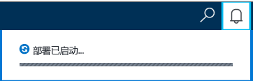
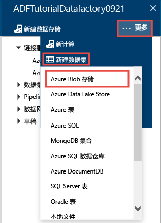
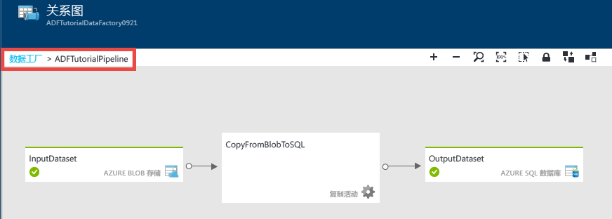
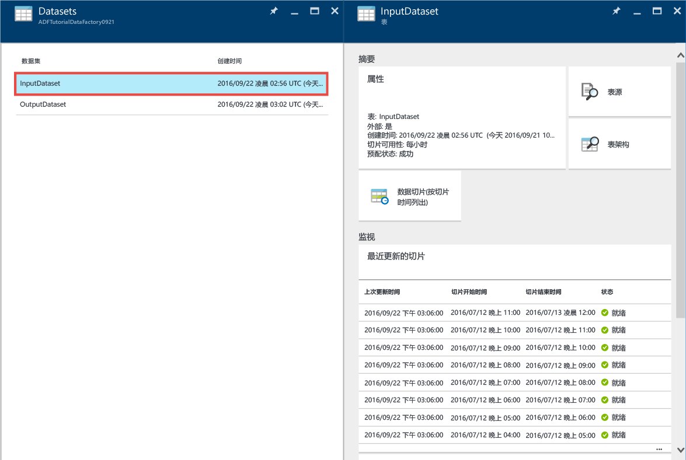
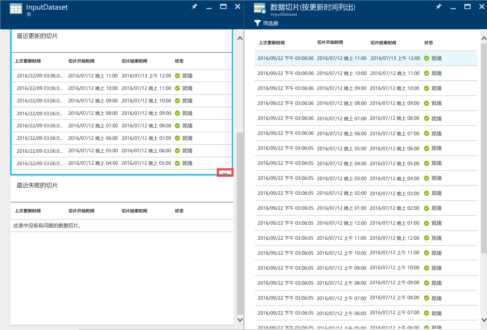
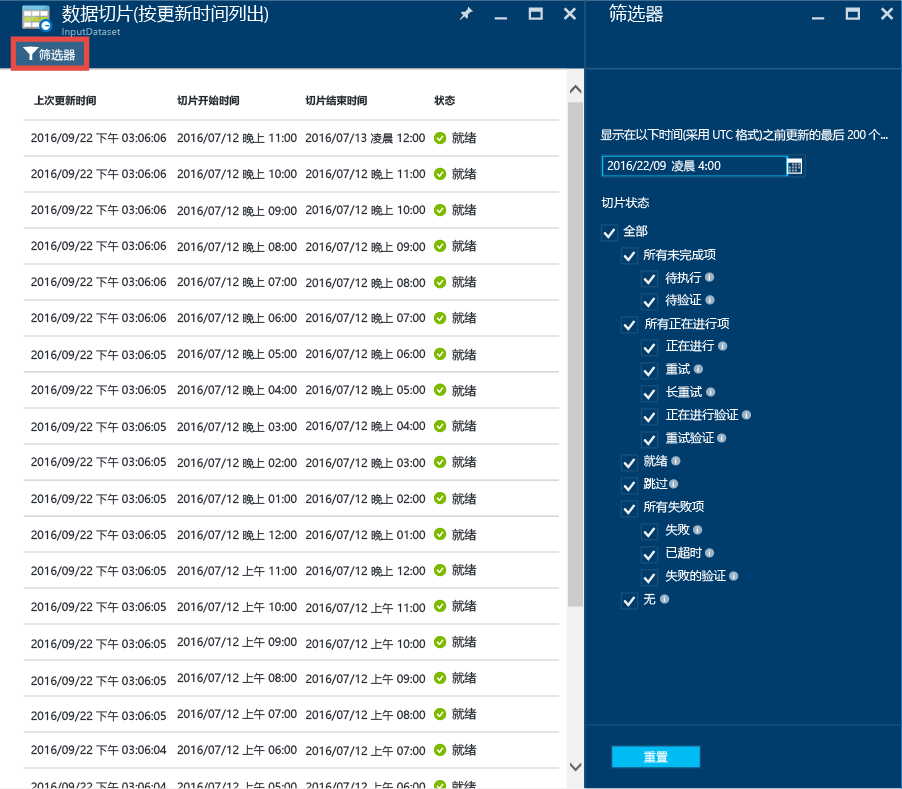
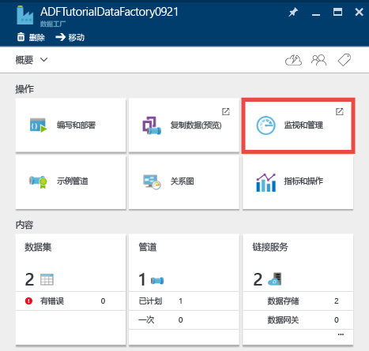
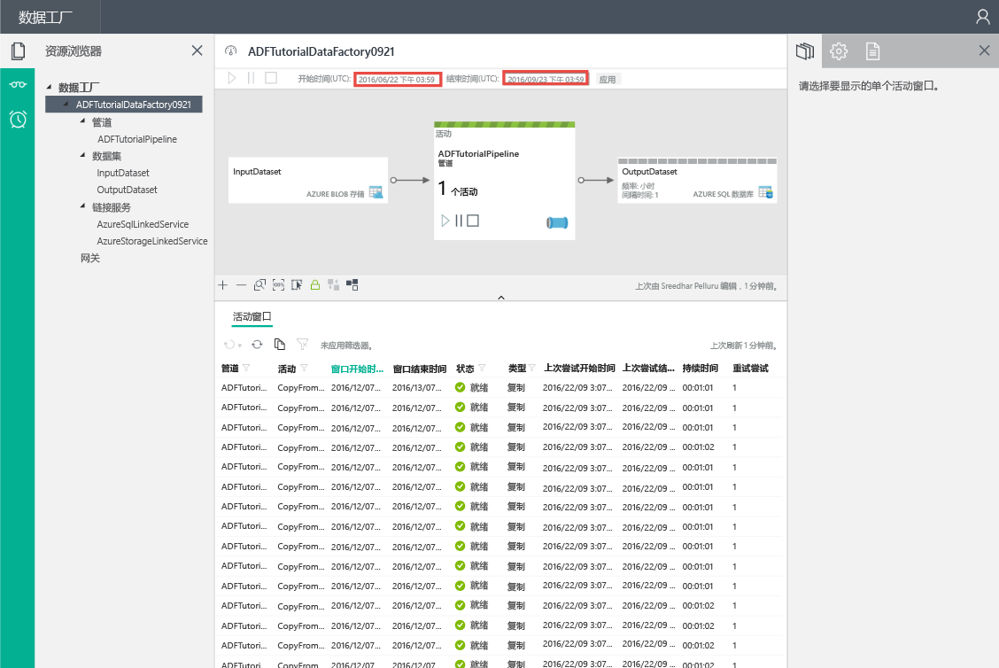
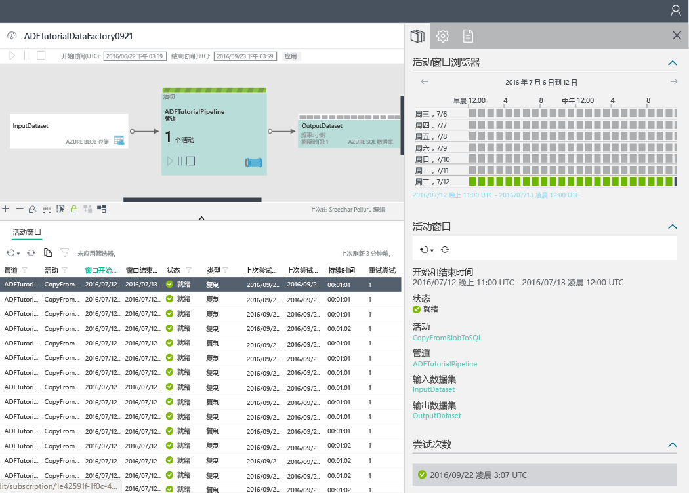

# <a name="tutorial-create-a-pipeline-with-copy-activity-using-azure-portal"></a>教程：使用 Azure 门户创建包含复制活动的管道
> [!div class="op_single_selector"]
> * [概述与先决条件](data-factory-copy-data-from-azure-blob-storage-to-sql-database.md)
> * [复制向导](data-factory-copy-data-wizard-tutorial.md)
> * [Azure 门户](data-factory-copy-activity-tutorial-using-azure-portal.md)
> * [Visual Studio](data-factory-copy-activity-tutorial-using-visual-studio.md)
> * [PowerShell](data-factory-copy-activity-tutorial-using-powershell.md)
> * [Azure Resource Manager 模板](data-factory-copy-activity-tutorial-using-azure-resource-manager-template.md)
> * [REST API](data-factory-copy-activity-tutorial-using-rest-api.md)
> * [.NET API](data-factory-copy-activity-tutorial-using-dotnet-api.md)
> 
> 

本教程演示如何使用 Azure 门户创建和监视 Azure 数据工厂。 数据工厂中的管道使用复制活动将数据从 Azure Blob 存储复制到 SQL 数据库。

下面是本教程中要执行的步骤：

| 步骤 | 说明 |
| --- | --- |
| [创建 Azure 数据工厂](#create-data-factory) |本步骤创建名为 **ADFTutorialDataFactory**的 Azure 数据工厂。 |
| [创建链接服务](#create-linked-services) |本步骤创建两个链接服务：**AzureStorageLinkedService** 和 **AzureSqlLinkedService**。 <br/><br/>AzureStorageLinkedService 和 AzureSqlLinkedService 分别将 Azure 存储和 Azure SQL 数据库链接到 ADFTutorialDataFactory。 管道的输入数据存在于 Azure Blob 存储的 Blob 容器中，其输出数据存储在 Azure SQL 数据库的表中。 因此，将这两个数据存储作为链接服务添加到数据工厂。 |
| [创建输入和输出数据集](#create-datasets) |在上一步骤中，创建了引用包含输入/输出数据的数据存储的链接服务。 本步骤定义两个数据集 - **InputDataset** 和 **OutputDataset**，分别代表存储在数据存储中的输入/输出数据。 <br/><br/>为 InputDataset 指定 Blob 容器，其中包含用于存储源数据的 Blob；为 OutputDataset 指定 SQL 表，用于存储输出数据。 还可指定其他属性，例如结构、可用性和策略。 |
| [创建管道](#create-pipeline) |本步骤在 ADFTutorialDataFactory 中创建名为 **ADFTutorialPipeline** 的管道。 <br/><br/>将**复制活动**添加到管道，用于将输入数据从 Azure Blob 复制到输出 Azure SQL 表。 复制活动在 Azure 数据工厂中执行数据移动。 该活动由全球可用的服务提供支持，能以安全、可靠、可缩放的方式在各种数据存储之间复制数据。 有关复制活动的详细信息，请参阅 [Data Movement Activities](data-factory-data-movement-activities.md) （数据移动活动）。 |
| [监视管道](#monitor-pipeline) |本步骤使用 Azure 门户监视输入和输出表的切片。 |

## <a name="prerequisites"></a>先决条件
执行本教程之前，请完成[教程概述](data-factory-copy-data-from-azure-blob-storage-to-sql-database.md)中的先决条件步骤。

## <a name="create-data-factory"></a>创建数据工厂
本步中，使用 Azure 门户创建名为 **ADFTutorialDataFactory**的 Azure 数据工厂。

1. 登录 [Azure 门户](https://portal.azure.com/)后，单击“新建”，选择“智能 + 分析”，然后单击“数据工厂”。 
   
       
2. 在“新建数据工厂”  边栏选项卡中：
   
   1. 输入 **ADFTutorialDataFactory** 作为**名称**。 
      
         
      
       Azure 数据工厂的名称必须 **全局唯一**。 如果收到错误，请更改数据工厂的名称（例如改为 yournameADFTutorialDataFactory），然后重新尝试创建。 有关数据工厂项目命名规则，请参阅 [Data Factory - Naming Rules](data-factory-naming-rules.md) （数据工厂 - 命名规则）主题。
      
           Data factory name “ADFTutorialDataFactory” is not available  
      
       
   2. 选择 **Azure 订阅**。
   3. 对于资源组，请执行以下步骤之一：
      
      - 选择“使用现有资源组”，然后从下拉列表选择现有的资源组。 
      - 选择“新建”，然后输入资源组的名称。   
         
          本教程中部分步骤假定你使用 **ADFTutorialResourceGroup** 作为资源组名称。 若要了解有关资源组的详细信息，请参阅 [使用资源组管理 Azure 资源](../azure-resource-manager/resource-group-overview.md)。  
   4. 选择数据工厂的**位置**。 下拉列表中只显示数据工厂服务支持的区域。
   5. 选择“ **固定到启动板**”。     
   6. 单击“创建” 。
      
      > [!IMPORTANT]
      > 只有订阅/资源组级别的“数据工厂参与者”角色成员才能创建数据工厂实例。[](../active-directory/role-based-access-built-in-roles.md#data-factory-contributor)
      > 
      > 数据工厂名称可能在将来被注册为 DNS 名称，因此将变成公开可见。                
      > 
      > 
3. 若要查看状态/通知消息，请单击工具栏上的铃铛图标。 
   
    
4. 完成创建后，将显示图中所示的“数据工厂”边栏选项卡。
   
   

## <a name="create-linked-services"></a>创建链接服务
链接服务将数据存储或计算服务链接到 Azure 数据工厂。 有关复制活动支持的所有源和接收器，请参阅[支持的数据存储](data-factory-data-movement-activities.md#supported-data-stores-and-formats)。 有关数据工厂支持的计算服务列表，请参阅[计算链接的服务](data-factory-compute-linked-services.md)。 本教程不使用任何计算服务。 

本步骤创建两个链接服务：**AzureStorageLinkedService** 和 **AzureSqlLinkedService**。 AzureStorageLinkedService 和 AzureSqlLinkedService 链接服务分别将 Azure 存储帐户和 Azure SQL 数据库链接到 **ADFTutorialDataFactory**。 稍后要在本教程中创建管道，将数据从 AzureStorageLinkedService 中的 Blob 容器复制到 AzureSqlLinkedService 中的 SQL 表。

### <a name="create-a-linked-service-for-the-azure-storage-account"></a>为 Azure 存储帐户创建链接服务
1. 在“数据工厂”边栏选项卡中，单击“编写和部署”磁贴启动数据工厂的“编辑器”。
   
    
2. 在“编辑器”中，单击工具栏上的“新建数据存储”按钮，然后从下拉菜单中选择“Azure 存储”。 在右窗格中，应会看到用于创建 Azure 存储链接服务的 JSON 模板。 
   
        
3. 将 `<accountname>` 和 `<accountkey>` 替换为 Azure 存储帐户的帐户名与帐户密钥值。 
   
        
4. 单击工具栏上的“部署”。 现在，树视图中应会显示已部署的 **AzureStorageLinkedService**。 
   
    

> [!NOTE]
> 有关 JSON 属性的详细信息，请参阅 [Move data from/to Azure Blob](data-factory-azure-blob-connector.md#azure-storage-linked-service)（将数据移出/移入 Azure Blob）。
> 
> 

### <a name="create-a-linked-service-for-the-azure-sql-database"></a>为 Azure SQL 数据库创建链接服务
1. 在“数据工厂编辑器”中，单击工具栏上的“新建数据存储”按钮，然后从下拉菜单中选择“Azure SQL 数据库”。 在右窗格中，应会看到用于创建 Azure SQL 链接服务的 JSON 模板。
2. 将 `<servername>`、`<databasename>`、`<username>@<servername>` 和 `<password>` 分别替换为 Azure SQL 服务器名称、数据库名称、用户帐户名和密码。 
3. 单击工具栏上的“部署”，创建并部署 **AzureSqlLinkedService**。
4. 确认树视图中已显示 **AzureSqlLinkedService**。 

> [!NOTE]
> 有关 JSON 属性的详细信息，请参阅 [Move data from/to Azure SQL Database](data-factory-azure-sql-connector.md#azure-sql-linked-service-properties)（将数据移出/移入 Azure SQL 数据库）。
> 
> 

## <a name="create-datasets"></a>创建数据集
上一步骤已创建 **AzureStorageLinkedService** 和 **AzureSqlLinkedService** 链接服务，用于将 Azure 存储帐户和 Azure SQL 数据库链接到数据工厂：**ADFTutorialDataFactory**。 本步骤定义两个数据集 - **InputDataset** 和 **OutputDataset**，表示存储在 AzureStorageLinkedService 和 AzureSqlLinkedService 所引用数据存储中的输入/输出数据。 为 InputDataset 指定 Blob 容器，其中包含用于存储源数据的 Blob；为 OutputDataset 指定 SQL 表，用于存储输出数据。 

### <a name="create-input-dataset"></a>创建输入数据集
本步骤在 **AzureStorageLinkedService** 链接服务代表的 Azure 存储中，创建指向 Blob 容器的 **InputDataset** 数据集。

1. 在数据工厂的“编辑器”中，依次单击下拉菜单中的“......更多”、“新建数据集”、“Azure Blob 存储”。 
   
    
2. 将右窗格中的 JSON 替换为以下 JSON 代码片段： 
   
    ```JSON
    {
      "name": "InputDataset",
      "properties": {
        "structure": [
          {
            "name": "FirstName",
            "type": "String"
          },
          {
            "name": "LastName",
            "type": "String"
          }
        ],
        "type": "AzureBlob",
        "linkedServiceName": "AzureStorageLinkedService",
        "typeProperties": {
          "folderPath": "adftutorial/",
          "fileName": "emp.txt",
          "format": {
            "type": "TextFormat",
            "columnDelimiter": ","
          }
        },
        "external": true,
        "availability": {
          "frequency": "Hour",
          "interval": 1
        }
      }
    }
    ```   
    注意以下几点： 
   
   * 数据集 **type** 设置为 **AzureBlob**。
   * **linkedServiceName** 设置为 **AzureStorageLinkedService**。 已在步骤 2 中创建此链接服务。
   * **folderPath** 设置为 **adftutorial** 容器。 也可以使用 **fileName** 属性指定文件夹中 Blob 的名称。 由于未指定 Blob 的名称，容器中所有 Blob 的数据被视为输入数据。  
   * 格式 **type** 设置为 **TextFormat**
   * 文本文件中有两个以逗号分隔 (**columnDelimiter**) 的字段 - **FirstName** 和 **LastName**    
   * **availability** 设置为 **hourly**（**frequency** 设置为 **hour**，**interval** 设置为 **1**）。 因此，数据工厂每小时在指定的 Blob 容器 (**adftutorial**) 的根文件夹中查找输入数据。 
     
     如果没有指定**输入**数据集的 **fileName**，则输入文件夹 (**folderPath**) 中的所有文件/Blob 都被视为输入。 如果在 JSON 中指定 fileName，则只有指定的文件/Blob 被视为输入。
     
     如果未指定**输出表**的 **fileName**，**folderPath** 中生成的文件根据以下格式命名：Data.&lt;Guid&gt;.txt（例如：Data.0a405f8a-93ff-4c6f-b3be-f69616f1df7a.txt）。
     
     若要根据 **SliceStart** 时间动态设置 **folderPath** 和 **fileName**，请使用 **partitionedBy** 属性。 在以下示例中，folderPath 使用 SliceStart（所处理的切片的开始时间）中的年、月和日，fileName 使用 SliceStart 中的小时。 例如，如果切片生成于 2016-09-20T08:00:00，folderName 将设置为 wikidatagateway/wikisampledataout/2016/09/20，fileName 设置为 08.csv。 

    ```JSON     
    "folderPath": "wikidatagateway/wikisampledataout/{Year}/{Month}/{Day}",
    "fileName": "{Hour}.csv",
    "partitionedBy": 
    [
       { "name": "Year", "value": { "type": "DateTime", "date": "SliceStart", "format": "yyyy" } },
       { "name": "Month", "value": { "type": "DateTime", "date": "SliceStart", "format": "MM" } }, 
       { "name": "Day", "value": { "type": "DateTime", "date": "SliceStart", "format": "dd" } }, 
       { "name": "Hour", "value": { "type": "DateTime", "date": "SliceStart", "format": "hh" } } 
    ],
    ```
3. 单击工具栏上的“部署”，创建并部署 **InputDataset** 数据集。 确认树视图中显示了 **InputDataset**。

> [!NOTE]
> 有关 JSON 属性的详细信息，请参阅 [Move data from/to Azure Blob](data-factory-azure-blob-connector.md#azure-blob-dataset-type-properties)（将数据移出/移入 Azure Blob）。
> 
> 

### <a name="create-output-dataset"></a>创建输出数据集
本步骤的此部分创建名为 **OutputDataset**的输出数据集。 此数据集指向 Azure SQL 数据库中 **AzureSqlLinkedService**所代表的 SQL 表。 

1. 在数据工厂的“编辑器”中，依次单击下拉菜单中的“......更多”、“新建数据集”、“Azure SQL”。 
2. 将右窗格中的 JSON 替换为以下 JSON 代码片段：

    ```JSON   
    {
      "name": "OutputDataset",
      "properties": {
        "structure": [
          {
            "name": "FirstName",
            "type": "String"
          },
          {
            "name": "LastName",
            "type": "String"
          }
        ],
        "type": "AzureSqlTable",
        "linkedServiceName": "AzureSqlLinkedService",
        "typeProperties": {
          "tableName": "emp"
        },
        "availability": {
          "frequency": "Hour",
          "interval": 1
        }
      }
    }
    ```     
    注意以下几点： 
   
   * 数据集 **type** 设置为 **AzureSQLTable**。
   * **linkedServiceName** 设置为 **AzureSqlLinkedService**（已在步骤 2 中创建此链接服务）。
   * **tablename** 设置为 **emp**。
   * 数据库的 emp 表包含三列 – **ID**、**FirstName** 和 **LastName**。 ID 是标识列，因此只需在此处指定 **FirstName** 和 **LastName**。
   * **availability** 设置为 **hourly**（**frequency** 设置为 **hour**，**interval** 设置为 **1**）。  数据工厂服务每隔一小时在 Azure SQL 数据库的 **emp** 表中生成输出数据切片。
3. 单击工具栏上的“部署”，创建并部署 **OutputDataset** 数据集。 确认树视图中显示了 **OutputDataset**。 

> [!NOTE]
> 有关 JSON 属性的详细信息，请参阅 [Move data from/to Azure SQL Database](data-factory-azure-sql-connector.md#azure-sql-linked-service-properties)（将数据移出/移入 Azure SQL 数据库）。
> 
> 

## <a name="create-pipeline"></a>创建管道
本步骤创建管道，其中包含使用 **InputDataset** 作为输入和使用 **OutputDataset** 作为输出的**复制活动**。

1. 在数据工厂的“编辑器”中，单击“...更多”，然后单击“新建管道”。 或者，也可以在树视图中，右键单击“管道”，然后单击“新建管道”。
2. 将右窗格中的 JSON 替换为以下 JSON 代码片段： 

    ```JSON   
    {
      "name": "ADFTutorialPipeline",
      "properties": {
        "description": "Copy data from a blob to Azure SQL table",
        "activities": [
          {
            "name": "CopyFromBlobToSQL",
            "type": "Copy",
            "inputs": [
              {
                "name": "InputDataset"
              }
            ],
            "outputs": [
              {
                "name": "OutputDataset"
              }
            ],
            "typeProperties": {
              "source": {
                "type": "BlobSource"
              },
              "sink": {
                "type": "SqlSink",
                "writeBatchSize": 10000,
                "writeBatchTimeout": "60:00:00"
              }
            },
            "Policy": {
              "concurrency": 1,
              "executionPriorityOrder": "NewestFirst",
              "retry": 0,
              "timeout": "01:00:00"
            }
          }
        ],
        "start": "2016-07-12T00:00:00Z",
        "end": "2016-07-13T00:00:00Z"
      }
    } 
    ```   
    
    注意以下几点：
   
   * 在 activities 节中，只有一个活动的 **type** 设置为 **Copy**。
   * 活动的输入设置为 **InputDataset**，活动的输出设置为 **OutputDataset**。
   * 在 **typeProperties** 节中，**BlobSource** 指定为源类型，**SqlSink** 指定为接收器类型。
     
     将 **start** 属性的值替换为当前日期，将 **end** 值替换为下一个日期。 可以仅指定日期部分，跳过日期时间的时间部分。 例如，“2016-02-03”等效于“2016-02-03T00:00:00Z”
     
     开始和结束日期时间必须采用 [ISO 格式](http://en.wikipedia.org/wiki/ISO_8601)。 例如：2016-10-14T16:32:41Z。 **结束** 时间是可选的，但本教程使用该时间。 
     
     如果未指定 **end** 属性的值，则以“**开始时间 + 48 小时**”计算。 若要无限期运行管道，请指定 **9999-09-09** 作为 **end** 属性的值。
     
     在上述示例中，由于每小时生成一个数据切片，因此共有 24 个数据切片。
3. 单击工具栏上的“部署”，创建并部署 **ADFTutorialPipeline**。 确认树视图中显示了该管道。 
4. 现在，请单击“X”关闭“编辑器”边栏选项卡。再次单击“X”查看 **ADFTutorialDataFactory** 的“数据工厂”主页。

**祝贺你！** 现已成功创建 Azure 数据工厂、链接服务、表和管道，并已计划好管道。   

### <a name="view-the-data-factory-in-a-diagram-view"></a>在图示视图中查看数据工厂
1. 在“数据工厂”边栏选项卡中，单击“图示”。
   
    
2. 应会看到如下所示的图形： 
   
    
   
    可以将管道和表放大、缩小、恢复、缩放到适当比例和自动定位，以及显示沿袭信息（突出显示所选项的上游和下游项）。  可以双击对象（输入/输出表或管道）查看其属性。 
3. 在图示视图中右键单击“ADFTutorialPipeline”，然后单击“打开管道”。 
   
    
4. 应会看到管道中的活动，以及活动的输入和输出数据集。 在本教程中，管道只能包含一个活动（复制活动），其中 InputDataset 为输入数据集，OutputDataset 为输出数据集。   
   
    
5. 单击左上角痕迹导航栏中的“数据工厂”，返回图示视图。 图示视图显示所有管道。 在本示例中，只创建了一个管道。   

## <a name="monitor-pipeline"></a>监视管道
本步骤使用 Azure 门户监视 Azure 数据工厂的运行情形。 

### <a name="monitor-pipeline-using-diagram-view"></a>使用图示视图监视管道
1. 单击“X”关闭“图示”视图，查看数据工厂的“数据工厂”主页。 如果已关闭 Web 浏览器，请执行以下步骤： 
   1. 导航到 [Azure 门户](https://portal.azure.com/)。 
   2. 双击“启动板”上的 **ADFTutorialDataFactory**，或者单击左侧菜单中的“数据工厂”，然后搜索 ADFTutorialDataFactory。 
2. 应会在此边栏选项卡上看到创建的表和管道的计数与名称。
   
    
3. 现在，请单击“数据集”磁贴。
4. 在“数据集”边栏选项卡中，单击“InputDataset”。 **ADFTutorialPipeline**的输入数据集。
   
       
5. 单击 **...（省略号）**查看所有数据切片。
   
      
   
    请注意，到目前为止，所有数据切片已“就绪”，因为 **emp.txt** 文件始终在 Blob 容器中：**adftutorial\input**。 确认底部的“最近失败的切片”部分中没有任何切片。
   
    “最近更新的切片”和“最近失败的切片”列表已根据“上次更新时间”排序。 
   
    单击工具栏上的“筛选”可以筛选切片。  
   
    
6. 保持关闭边栏选项卡，直到看到“数据集”边栏选项卡。 单击“OutputDataset”。 **ADFTutorialPipeline**的输出数据集。
   
    
7. 应会看到下图所示的“OutputDataset”边栏选项卡：
   
     
8. 可以看到，到目前为止已生成数据切片，并且其状态为“就绪”。 底部的“问题切片”部分中未显示任何切片。
9. 单击 **...（省略号）** 查看所有切片。
   
    
10. 在列表中单击任一数据切片可以看到“数据切片”边栏选项卡。
    
     
    
     如果切片状态不是“就绪”，可以在“未就绪的上游切片”列表中看到未就绪且阻碍当前切片运行的上游切片。
11. 在“数据切片”边栏选项卡的底部列表中，应会看到所有活动都在运行。 单击“活动运行”查看“活动运行详细信息”边栏选项卡。 
    
    
12. 单击“X”关闭所有边栏选项卡，直到返回 **ADFTutorialDataFactory** 的主页边栏选项卡。
13. （可选）在 **ADFTutorialDataFactory** 的主页上单击“管道”，单击“管道”边栏选项卡中的“ADFTutorialPipeline”，然后深入到输入表（“已使用”）或输出表（“已生成”）。
14. 启动 **SQL Server Management Studio**，连接到 Azure SQL 数据库，然后确认行是否已插入数据库的 **emp** 表中。
    
    

### <a name="monitor-pipeline-using-monitor--manage-app"></a>使用“监视和管理”应用来监视管道
还可以使用“监视和管理”应用程序来监视管道。 有关使用此应用程序的详细信息，请参阅 [Monitor and manage Azure Data Factory pipelines using Monitoring and Management App](data-factory-monitor-manage-app.md)（使用监视和管理应用程序来监视和管理 Azure 数据工厂管道）。

1. 在数据工厂的主页上单击“监视和管理”磁贴。
   
     
2. 此时应出现“监视和管理应用程序”。 更改“开始时间”和“结束时间”以包含管道的开始时间 (2016-07-12) 和结束时间 (2016-07-13) 匹配，然后单击“应用”。 
   
     
3. 在“活动窗口”列表中选择一个活动窗口查看其详细信息。 
    

## <a name="summary"></a>摘要
本教程创建了一个 Azure 数据工厂，用于将数据从 Azure Blob 复制到 Azure SQL 数据库。 已使用 Azure 门户创建了数据工厂、链接服务、数据集和管道。 下面是本教程中执行的高级步骤：  

1. 创建了 Azure **数据工厂**。
2. 创建 **链接服务**：
   1. **Azure 存储** 链接服务，链接存放输入数据的 Azure 存储帐户。     
   2. 一个 **Azure SQL** 链接服务，用于链接保存输出数据的 Azure SQL 数据库。 
3. 创建了 **数据集** ，用于描述管道的输入和输出数据。
4. 创建了包含**复制活动**的**管道**，其中 **BlobSource** 为源，**SqlSink** 为接收器。  

## <a name="see-also"></a>另请参阅
| 主题 | 说明 |
|:--- |:--- |
| [数据移动活动](data-factory-data-movement-activities.md) |本文提供有关教程中所用复制活动的详细信息。 |
| [计划和执行](data-factory-scheduling-and-execution.md) |本文介绍 Azure 数据工厂应用程序模型的计划方面和执行方面。 |
| [管道](data-factory-create-pipelines.md) |帮助了解 Azure 数据工厂中的管道和活动 |
| [数据集](data-factory-create-datasets.md) |还有助于了解 Azure 数据工厂中的数据集。 |
| [使用监视应用监视和管理管道](data-factory-monitor-manage-app.md) |本文介绍如何使用监视和管理应用来监视、管理和调试管道。 |


<!--HONumber=Jan17_HO2-->


