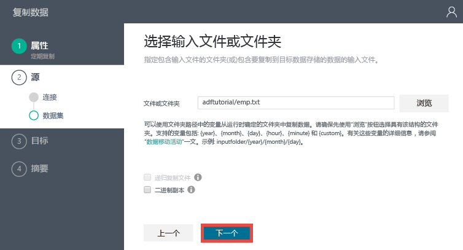

<properties 
	pageTitle="教程：使用复制向导创建管道" 
	description="在本教程中，通过使用数据工厂所支持的复制向导，创建带有复制活动的 Azure 数据工厂管道。" 
	services="data-factory" 
	documentationCenter="" 
	authors="spelluru" 
	manager="jhubbard" 
	editor="monicar"/>

<tags ms.service="data-factory" ms.workload="data-services" ms.tgt_pltfrm="na" ** ms.devlang="na" ms.topic="get-started-article" ms.date="09/16/2016" ms.author="spelluru"/>

# 教程：使用数据工厂复制向导创建带有复制活动的管道
> [AZURE.SELECTOR]
- [概述与先决条件](data-factory-copy-data-from-azure-blob-storage-to-sql-database.md)
- [Azure 门户](data-factory-copy-activity-tutorial-using-azure-portal.md)
- [Visual Studio](data-factory-copy-activity-tutorial-using-visual-studio.md)
- [PowerShell](data-factory-copy-activity-tutorial-using-powershell.md)
- [REST API](data-factory-copy-activity-tutorial-using-rest-api.md)
- [.NET API](data-factory-copy-activity-tutorial-using-dotnet-api.md)
- [复制向导](data-factory-copy-data-wizard-tutorial.md)

在本教程中，将使用数据工厂复制向导在数据工厂中创建带复制活动的管道。首先，使用 Azure 门户来创建数据工厂。然后使用复制向导创建数据工厂链接服务、数据集和带复制活动的管道，可将数据从 Azure Blob 存储复制到 Azure SQL 数据库。有关复制活动的详细信息，请参阅[数据移动活动](data-factory-data-movement-activities.md)。

> [AZURE.IMPORTANT] 执行本教程前，请通读[教程概述](data-factory-copy-data-from-azure-blob-storage-to-sql-database.md)并完成**先决条件**步骤。

## 创建数据工厂
本步中，使用 Azure 门户创建名为 **ADFTutorialDataFactory** 的 Azure 数据工厂。

1.	登录 [Azure 门户](https://portal.azure.com)后，在左上角单击“+ 新建”，在“创建”边栏选项卡中选择“数据分析”，然后在“数据分析”边栏选项卡中单击“数据工厂”。

	

6. 在“新建数据工厂”边栏选项卡中：
	1. 输入 **ADFTutorialDataFactory** 作为“名称”。
	
  		
	2. 单击“资源组名称”并按下列步骤操作：
		1. 单击“新建资源组”。
		2. 在“创建资源组”边栏选项卡上，输入 **ADFTutorialResourceGroup** 作为资源组的“名称”，并单击“确定”。

			

		本教程中部分步骤假定你使用 **ADFTutorialResourceGroup** 作为资源组名称。若要了解有关资源组的详细信息，请参阅[使用资源组管理 Azure 资源](../resource-group-overview.md)。
7. 请注意，在“新建数据工厂”边栏选项卡中，“添加到启动板”处于选中状态。
8. 在“新建数据工厂”边栏选项卡中单击“创建”。

	Azure 数据工厂的名称必须是全局唯一的。如果收到错误：**数据工厂名称“ADFTutorialDataFactory”不可用**，请更改该数据工厂名称（例如改为“yournameADFTutorialDataFactory”），并尝试再次创建。有关数据工厂项目命名规则，请参阅[数据工厂 - 命名规则](data-factory-naming-rules.md)主题。
	 
	
	
	> [AZURE.NOTE] 数据工厂名称可能在将来被注册为 DNS 名称，因此将变成公开可见。

9. 单击左侧的“通知”中心，查找创建过程中的通知。如果“通知”边栏选项卡处于打开状态，则单击“X”将其关闭。
10. 完成创建后，将看到如下图所示的“数据工厂”边栏选项卡：

    

## 创建管道

1. 在数据工厂主页上，单击“复制数据”磁贴，启动“复制向导”。

	> [AZURE.NOTE] 如果 Web 浏览器卡在“正在授权...”处，请禁用或取消选中“阻止第三方 Cookie 和站点数据”设置，或在保持启用的状态下为 **login.microsoftonline.com** 创建一个例外，然后尝试再次启动该向导。
2. 在“属性”页中：
	1. 输入 **CopyFromBlobToAzureSql** 作为“任务名称”
	2. 输入**说明**（可选）。
	3. 请注意**开始日期时间**和**结束日期时间**。将**结束日期时间**更改为从**开始日期时间**算起的第二天。
	3. 单击“下一步”。

	
3. 在“源数据存储”页上，单击“Azure Blob 存储”磁贴。此页用于指定复制任务的源数据存储。可使用现有的数据存储链接服务，或指定新的数据存储。要使用现有链接服务，请单击“来自现有链接服务”，并选择适当的链接服务。

	
5. 在“指定 Azure Blob 存储帐户”页上：
	1. 输入 **AzureStorageLinkedService** 作为“链接服务名称”。
	2. 请确认“来自 Azure 订阅”作为“帐户选择方法”。
	3. 从所选订阅的可用 Azure 存储帐户列表中，选择一个 **Azure 存储帐户**。还可选择手动输入存储帐户设置，请在“帐户选择方法”中选择“手动输入”选项，并单击“下一步”。

	
6. 在“选择输入文件或文件夹”页上：
	1. 请导航至“adftutorial”文件夹。
	2. 选择“emp.txt”，然后单击“选择”
	3. 单击“下一步”。

	
7. 在“选择输入文件或文件夹”页中，单击“下一步”。请不要选择“二进制副本”。

	
8. 在“文件格式设置”页上，选择**默认**值，并单击“下一步”。

	
8. 在“目标数据存储”页中，单击“Azure SQL 数据库”磁贴，再单击“下一步”。
9. 在“指定 Azure SQL 数据库”页中：
	1. 输入 **AzureSqlLinkedService** 作为“链接服务名称”字段。
	2. 请确认已将“服务器/数据库选择方法”设置为“来自 Azure 订阅”。
	3. 选择**服务器名称**和**数据库**。
	4. 输入**用户名**和**密码**。
	5. 单击“下一步”。
9. 在“表映射”页，从下拉列表选择“emp”作为“目标”字段，单击**向下箭头**查看架构和预览数据（可选）。

	
10. 在“架构映射”页中，单击“下一步”。
11. 在“性能设置”页上，单击“下一步”。
11. 在“摘要”页中查看信息，然后单击“完成”。复制向导在数据工厂（即启动该向导的位置）中创建两个链接服务、两个数据集（输入和输出）和一个管道。
12. 在“部署成功”页上，单击链接：**单击此处监控副本管道**。

	
13. 查看[使用监视应用监视和管理管道](data-factory-monitor-manage-app.md)中的说明，学习如何监视所创建的管道。单击**活动时段**列表中的“刷新”图标进行查看。

	
 

## 另请参阅
| 主题 | 说明 |
| :---- | :---- |
| [数据移动活动](data-factory-data-movement-activities.md) | 本文提供有关教程中所用复制活动的详细信息。 |
| [计划和执行](data-factory-scheduling-and-execution.md) | 本文介绍 Azure 数据工厂应用程序模型的计划方面和执行方面。 |
| [管道](data-factory-create-pipelines.md) | 帮助你了解 Azure 数据工厂中的管道和活动，以及如何利用它们为方案或业务构造端对端数据驱动工作流。 |
| [数据集](data-factory-create-datasets.md) | 还有助于了解 Azure 数据工厂中的数据集。
| [使用监视应用监视和管理管道](data-factory-monitor-manage-app.md) | 本文介绍如何使用监视和管理应用来监视、管理和调试管道。 

<!---HONumber=AcomDC_0921_2016-->