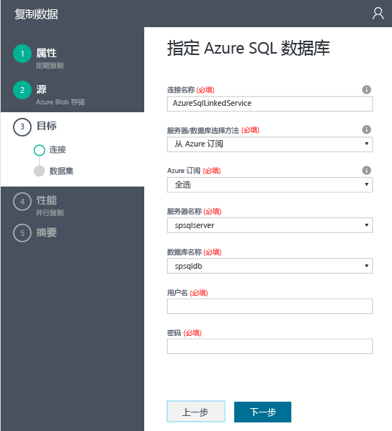
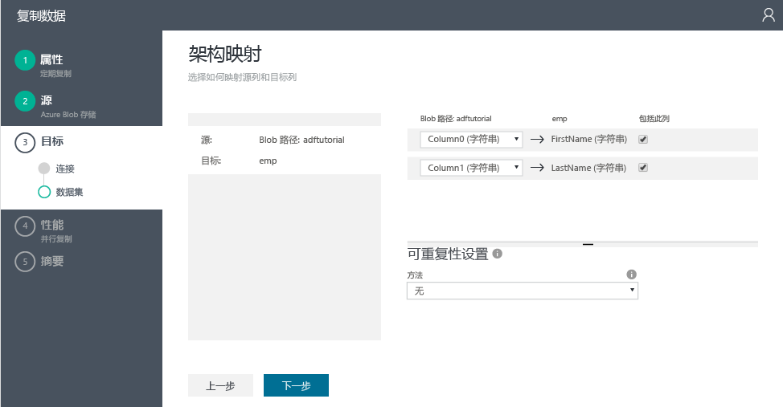
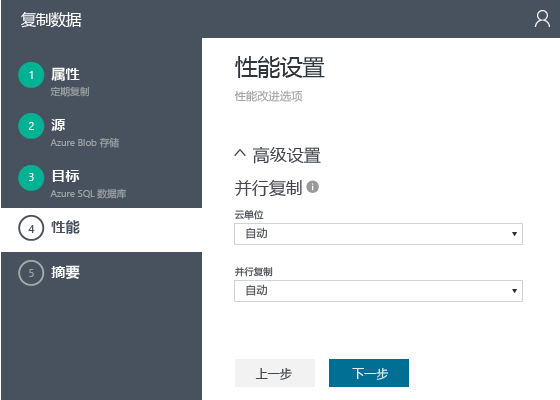

# 教程：使用数据工厂复制向导创建带有复制活动的管道
> [!div class="op_single_selector"]
> * [概述与先决条件](data-factory-copy-data-from-azure-blob-storage-to-sql-database.md)
> * [复制向导](data-factory-copy-data-wizard-tutorial.md)
> * [Azure 门户](data-factory-copy-activity-tutorial-using-azure-portal.md)
> * [Visual Studio](data-factory-copy-activity-tutorial-using-visual-studio.md)
> * [PowerShell](data-factory-copy-activity-tutorial-using-powershell.md)
> * [Azure Resource Manager 模板](data-factory-copy-activity-tutorial-using-azure-resource-manager-template.md)
> * [REST API](data-factory-copy-activity-tutorial-using-rest-api.md)
> * [.NET API](data-factory-copy-activity-tutorial-using-dotnet-api.md)
> 
> 

使用 Azure数据工厂的**复制向导**可以快速轻松地创建管道用于实现数据引入/移动方案。 因此，建议首先使用向导为数据移动方案创建一个示例管道。 本教程说明如何创建 Azure 数据工厂、启动复制向导，以及执行一系列步骤来提供有关数据引入/移动方案的详细信息。 完成向导中的步骤后，向导会自动创建包含复制活动的管道，将数据从 Azure Blob 存储复制到 Azure SQL 数据库。 有关复制活动的详细信息，请参阅 [数据移动活动](data-factory-data-movement-activities.md) 。 

> [!IMPORTANT]
> 执行本教程之前，请通读 [Tutorial overview and prerequisites](data-factory-copy-data-from-azure-blob-storage-to-sql-database.md)（教程概述和先决条件）一文了解教程的概述，并完成**先决条件**步骤。
> 
> 

## 创建数据工厂
本步中，使用 Azure 门户创建名为 **ADFTutorialDataFactory**的 Azure 数据工厂。

1. 登录到 [Azure 门户](https://portal.azure.com)后，单击左上角的“+ 新建”，单击“智能 + 分析”，然后单击“数据工厂”。 
   
   
2. 在“新建数据工厂”  边栏选项卡中：
   
   1. 输入 **ADFTutorialDataFactory** 作为**名称**。
       Azure 数据工厂的名称必须是全局唯一的。 如果收到错误： **数据工厂名称“ADFTutorialDataFactory”不可用**，请更改该数据工厂名称（例如改为“yournameADFTutorialDataFactory”），并尝试再次创建。 有关数据工厂项目命名规则，请参阅 [数据工厂 - 命名规则](data-factory-naming-rules.md) 主题。  
      
       
      
      > [!NOTE]
      > 数据工厂名称可能在将来被注册为 DNS 名称，因此将变成公开可见。
      > 
      > 
   2. 选择 **Azure 订阅**。
   3. 对于资源组，请执行以下步骤之一： 
      
      - 选择“使用现有资源组”并选择一个现有的资源组。
      - 选择“新建”并输入资源组的名称。
         
          本教程中部分步骤假定你使用 **ADFTutorialResourceGroup** 作为资源组名称。 若要了解有关资源组的详细信息，请参阅 [使用资源组管理 Azure 资源](../azure-resource-manager/resource-group-overview.md)。
   4. 选择数据工厂的**位置**。
   5. 选中位于边栏选项卡底部的“固定到仪表板”复选框。  
   6. 单击“创建” 。
      
                   
3. 完成创建后，将看到如下图所示的“数据工厂”边栏选项卡：
   
   

## 启动复制向导
1. 在“数据工厂”主页上，单击“复制数据”磁贴，启动“复制向导”。 
   
   > [!NOTE]
   > 如果 Web 浏览器卡在“正在授权...”处，请禁用或取消选中“阻止第三方 Cookie 和站点数据”设置，或在保持启用的状态下为 **login.microsoftonline.com** 创建一个例外，然后尝试再次启动该向导。
   > 
   > 
2. 在“属性”  页中：
   
   1. 输入 **CopyFromBlobToAzureSql** 作为**任务名称**
   2. 输入 **说明** （可选）。
   3. 更改“开始日期时间”和“结束日期时间”，使结束日期设置为当天，开始日期设置为当天的五天前。  
   4. 单击“下一步”。  
      
       
3. 在“源数据存储”页上，单击“Azure Blob 存储”磁贴。 此页用于指定复制任务的源数据存储。 可使用现有的数据存储链接服务，或指定新的数据存储。 要使用现有链接服务，请单击“来自现有链接服务”  ，并选择适当的链接服务。 
   
    
4. 在“指定 Azure Blob 存储帐户”  页上：
   
   1. 输入 **AzureStorageLinkedService** 作为**链接服务名称**。
   2. 确认为“帐户选择方法”选择了“来自 Azure 订阅”。
   3. 选择 **Azure 订阅**。  
   4. 从所选订阅的可用 Azure 存储帐户列表中，选择一个 **Azure 存储帐户**。 还可选择手动输入存储帐户设置，方法是在“帐户选择方法”中选择“手动输入”选项，并单击“下一步”。 
      
      
5. 在“选择输入文件或文件夹”  页上：
   
   1. 请导航至“adftutorial”  文件夹。
   2. 选择“emp.txt”，然后单击“选择”
   3. 单击“下一步”。 
      
      
6. 在“选择输入文件或文件夹”页中，单击“下一步”。 请不要选择“二进制副本” 。 
   
     
7. 在“文件格式设置”页上，可以看到分隔符以及向导通过分析文件自动检测到的架构。 也可以手动输入分隔符，使复制向导停止自动检测或覆盖设置。 检查分隔符并预览数据之后，请单击“下一步”。 
   
      
8. 在“目标数据存储”页上，选择“Azure SQL 数据库”，然后单击“下一步”。
   
    
9. 在“指定 Azure SQL 数据库”  页中：
   
   1. 在“连接名称”字段中输入 **AzureSqlLinkedService**。
   2. 确认为“服务器/数据库选择方法”选择了“来自 Azure 订阅”。
   3. 选择 **Azure 订阅**。  
   4. 选择**服务器名称**和**数据库**。
   5. 输入**用户名**和**密码**。
   6. 单击“下一步”。  
      
      
10. 在“表映射”页上，在“目标”字段中通过下拉列表中选择“emp”，然后单击**向下箭头**查看架构并预览数据（可选）。
    
      
11. 在“架构映射”页上，单击“下一步”。
    
    
12. 在“性能设置”页上，单击“下一步”。 
    
    
13. 在“摘要”页中检查信息，然后单击“完成”。 复制向导在数据工厂（即启动该向导的位置）中创建两个链接服务、两个数据集（输入和输出）和一个管道。 
    
    

## 启动监视器和管理应用程序
1. 在“部署”页上单击以下链接：`Click here to monitor copy pipeline`。
   
     
2. 查看 [使用监视应用监视和管理管道](data-factory-monitor-manage-app.md) 中的说明，学习如何监视所创建的管道。 单击“活动时段”列表中的“刷新”图标可查看分片。 
   
    
   
   > [!NOTE]
   > 单击“活动时段”列表底部的“刷新”按钮可查看最新状态。 状态不会自动刷新。 
   > 
   > 

## 另请参阅
| 主题 | 说明 |
|:--- |:--- |
| [数据移动活动](data-factory-data-movement-activities.md) |本文提供有关教程中所用复制活动的详细信息。 |
| [计划和执行](data-factory-scheduling-and-execution.md) |本文介绍 Azure 数据工厂应用程序模型的计划方面和执行方面。 |
| [管道](data-factory-create-pipelines.md) |帮助你了解 Azure 数据工厂中的管道和活动，以及如何利用它们为方案或业务构造端对端数据驱动工作流。 |
| [数据集](data-factory-create-datasets.md) |还有助于了解 Azure 数据工厂中的数据集。 |
| [使用监视应用监视和管理管道](data-factory-monitor-manage-app.md) |本文介绍如何使用监视和管理应用来监视、管理和调试管道。 |

<!--HONumber=Dec16_HO1-->

