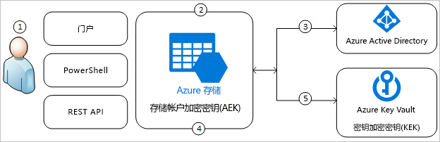
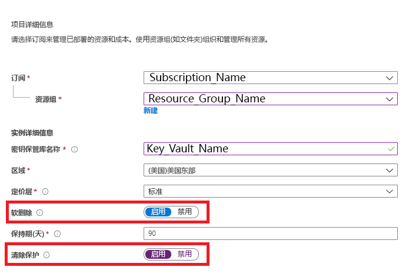
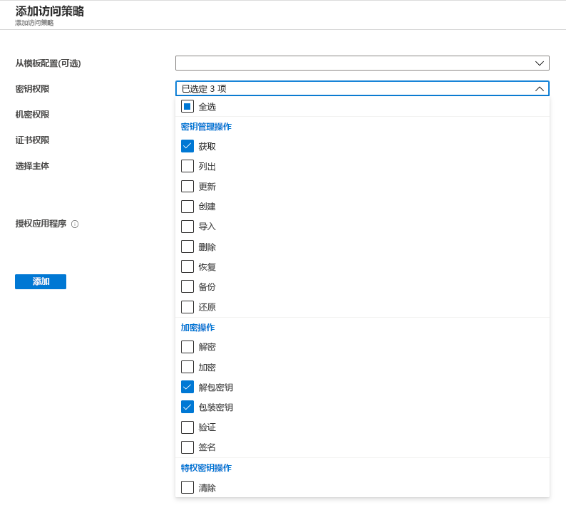
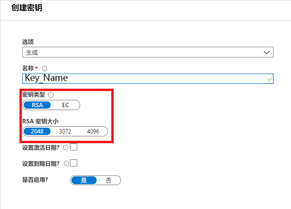
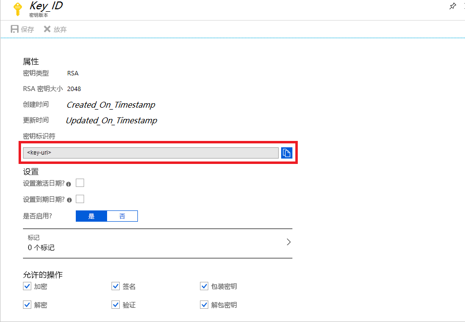
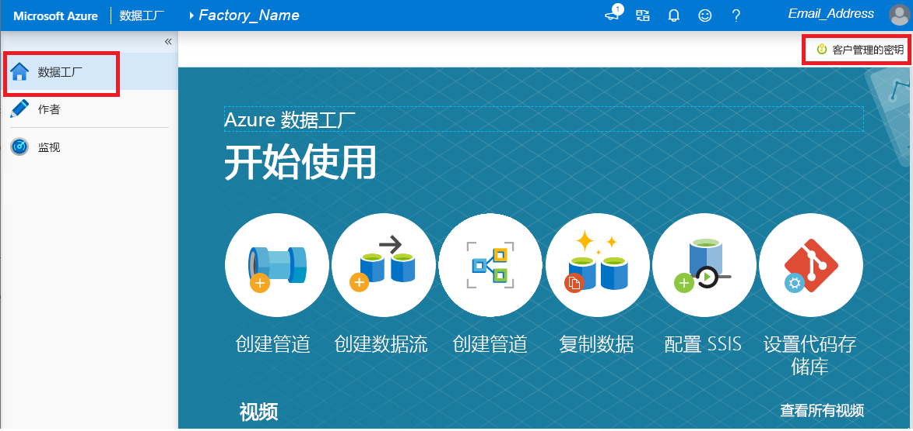

# 使用客户管理的密钥加密 Azure 数据工厂

[!INCLUDE[appliesto-adf-xxx-md](includes/appliesto-adf-xxx-md.md)]

Azure 数据工厂对静态数据进行加密，其中包括实体定义和在运行期间缓存的所有数据。 默认情况下，使用随机生成并由 Microsoft 管理的密钥加密数据，该密钥只会分配到数据工厂。 为了获得额外的安全保证，现在可以通过 Azure 数据工厂客户管理的密钥功能启用“创建自己的密钥”(BYOK)。 指定客户管理的密钥时，数据工厂会使用工厂系统密钥和 CMK 加密客户数据。 缺少两者中的任何一个都会导致拒绝访问数据和工厂。

存储客户管理的密钥需要 Azure 密钥保管库。 可以创建自己的密钥并将其存储在密钥保管库中，也可以使用 Azure 密钥保管库 API 来生成密钥。 密钥保管库和数据工厂必须位于同一 Azure Active Directory (Azure AD) 租户和同一区域，但可以位于不同订阅中。 有关 Azure 密钥保管库的详细信息，请参阅[什么是 Azure 密钥保管库？](../key-vault/general/overview.md)

> [!NOTE]
> 客户管理的密钥只能在空数据工厂上配置。 数据工厂不能包含链接服务、管道以及数据流等任何资源。 建议创建工厂后立即启用客户管理的密钥。

## 关于客户管理的密钥

下图显示了数据工厂如何借助 Azure Active Directory 和 Azure 密钥保管库使用客户管理的密钥发出请求：

  

下表说明了图中的编号步骤：

1. Azure 密钥保管库管理员向与数据工厂关联的托管标识授予对加密密钥的权限
1. 数据工厂管理员在工厂中启用客户管理的密钥功能
1. 数据工厂使用与工厂关联的托管标识通过 Azure Active Directory 针对对 Azure 密钥保管库的访问进行身份验证
1. 数据工厂在 Azure 密钥保管库中使用客户密钥包装工厂加密密钥
1. 对于读/写操作，数据工厂会将请求发送到 Azure 密钥保管库，以便展开包帐户加密密钥，从而执行加密和解密操作

## 先决条件 - 配置 Azure 密钥保管库并生成密钥

### 在 Azure 密钥保管库上启用“软删除”和“不清除”

要在数据工厂中使用客户管理的密钥，需要在密钥保管库上设置两个属性，即“软删除”和“不清除” 。 可以在新的或现有的密钥保管库上使用 PowerShell 或 Azure CLI 启用这些属性。 若要了解如何在现有的密钥保管库上启用这些属性，请参阅下方其中一篇文章中标题为“启用软删除”和“启用清除保护”的部分 ：

- [如何在 PowerShell 中使用软删除](../key-vault/general/soft-delete-powershell.md)
- [如何在 CLI 中使用软删除](../key-vault/general/soft-delete-cli.md)

如果通过 Azure 门户新建 Azure 密钥保管库，可通过如下方式启用“软删除”和“不清除” ：

  

### 授予数据工厂对 Azure 密钥保管库的访问权限

确保 Azure 密钥保管库和 Azure 数据工厂位于同一 Azure Active Directory (Azure AD) 租户以及同一区域。 从 Azure 密钥保管库访问控制，向数据工厂的托管服务标识 (MSI) 授予以下权限：获取、展开密钥和包装密钥  。 在数据工厂中启用客户管理的密钥需要这些权限。

  

### 在 Azure Key Vault 中生成或上传客户管理的密钥

可以创建自己的密钥并将其存储在密钥保管库中，也可以使用 Azure 密钥保管库 API 来生成密钥。 数据工厂加密仅支持 2048 位 RSA 密钥。 有关详细信息，请参阅[关于密钥、机密和证书](../key-vault/general/about-keys-secrets-certificates.md)。

  

## 启用客户管理的密钥

1. 确保数据工厂为空。 数据工厂不能包含链接服务、管道以及数据流等任何资源。 目前，将客户管理的密钥部署到非空工厂将会导致错误。

1. 若要在 Azure 门户中找到密钥 URI，请导航到 Azure 密钥保管库，然后选择“密钥”设置。 选择所需密钥，然后单击该密钥以查看其版本。 选择密钥版本以查看设置

1. 复制密钥标识符字段的值，该字段提供了 URI

    

1. 启动 Azure 数据工厂门户，然后使用左侧导航栏跳转到数据工厂管理门户

1. 单击“客户管理的密钥”图标

    

1. 输入之前复制的客户管理的密钥的 URI

1. 单击“保存”，然后为数据工厂启用客户管理的密钥加密

## 更新密钥版本

新建密钥版本时，请更新数据工厂以使用新版本。 按照“启用客户管理的密钥”一节中所述的类似步骤进行操作，其中包括：

1. 通过 Azure 密钥保管库门户找到新密钥版本的 URI

1. 导航到“客户管理的密钥”设置

1. 替换并粘贴新密钥的 URI

1. 单击“保存”，数据工厂将立即使用新密钥版本进行加密

## 使用其他密钥

若要更改用于数据工厂加密的密钥，必须手动更新数据工厂中的设置。 按照“启用客户管理的密钥”一节中所述的类似步骤进行操作，其中包括：

1. 通过 Azure 密钥保管库门户找到新密钥的 URI

1. 导航到“客户管理的密钥”设置

1. 替换并粘贴新密钥的 URI

1. 单击“保存”，数据工厂将立即使用新密钥进行加密

## 禁用客户管理的密钥

按照设计，启用客户管理的密钥功能之后，无法删除其他安全步骤。 我们将始终需要使用客户所提供的密钥来加密工厂和数据。

## 后续步骤

完成相关[教程](tutorial-copy-data-dot-net.md)来了解如何在更多方案中使用数据工厂。
