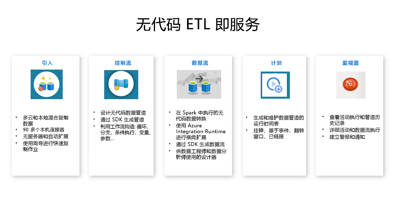

# 什么是 Azure 数据工厂？

在大数据环境中，原始、散乱的数据通常存储在关系、非关系和其他存储系统中。 但是，就其本身而言，原始数据没有适当的上下文或含义来为分析师、数据科学家或业务决策人提供有意义的见解。 

大数据需要可以启用协调和操作过程以将这些巨大的原始数据存储优化为可操作的业务见解的服务。 Azure 数据工厂是为这些复杂的混合提取-转换-加载 (ETL)、提取-加载-转换 (ELT) 和数据集成项目而构建的托管云服务。

例如，假设某个游戏公司收集云中的游戏所生成的万兆字节的游戏日志。 该公司的目的是通过分析这些日志，了解客户偏好、人口统计信息和使用行为。 该公司的另一个目的是确定向上销售和交叉销售机会、开发极具吸引力的新功能、促进企业发展，并为其客户提供更好的体验。

为了分析这些日志，该公司需要使用参考数据，例如位于本地数据存储中的客户信息、游戏信息和市场营销活动信息。 公司想要利用本地数据存储中的这些数据，将其与云数据存储中具有的其他日志数据结合在一起。 

为了获取见解，它希望使用云中的 Spark 群集 (Azure HDInsight) 处理加入的数据，并将转换的数据发布到云数据仓库（如 Azure SQL 数据仓库）以轻松地基于它生成报表。 公司的人员希望自动执行此工作流，并每天按计划对其进行监视和管理。 他们还希望在文件存储到 blob 存储容器中时执行该工作流。

Azure 数据工厂是解决此类数据方案的平台。 它是基于云的 ETL 和数据集成服务，可让你创建数据驱动型工作流用于大规模协调数据移动和转换数据。  可以使用 Azure 数据工厂创建和计划数据驱动型工作流（称为管道），以便从不同的数据存储引入数据。 可以构建复杂的 ETL 流程，用于通过数据流或使用 Azure HDInsight Hadoop、Azure Databricks 和 Azure SQL 数据库等计算服务直观转换数据。 

此外，还可以将转换的数据发布到数据存储（例如 Azure SQL 数据仓库），供商业智能 (BI) 应用程序使用。 最终，通过 Azure 数据工厂，可将原始数据组织成有意义的数据存储和数据湖，以实现更好的业务决策。

## 工作原理

数据工厂包含一系列为数据工程师提供完整端到端平台的互连系统。

### 连接和收集

企业拥有各种类型的数据（位于云、结构化、非结构化和半结构化的本地分散源中），都以不同的时间间隔和速度到达。 

构建信息生产系统时，第一步是连接到所有必需的数据和处理源（例如软件即服务 (SaaS) 服务、数据库、文件共享、FTP Web 服务）。 下一步是根据需要将数据移至中央位置进行后续处理。

没有数据工厂，企业就必须生成自定义数据移动组件或编写自定义服务，以便集成这些数据源并进行处理。 集成和维护此类系统既昂贵又困难。 另外，这些系统通常还缺乏企业级监视、警报和控制，而这些功能是完全托管的服务能够提供的。

而有了数据工厂，便可以在数据管道中使用[复制活动](copy-activity-overview.md)，将数据从本地和云的源数据存储移到云的集中数据存储进行进一步的分析。 例如，可以先将数据收集在 Azure Data Lake Storage 中，以后再使用 Azure Data Lake Analytics 计算服务对数据进行转换。 也可将数据收集在 Azure Blob 存储中，在以后再使用 Azure HDInsight Hadoop 群集对其进行转换。

### 转换和扩充
将数据保存到云中的集中式数据存储后，使用 ADF 映射数据流来处理或转换收集的数据。 数据工程师可以使用数据流来构建和维护在 Spark 中执行的数据转换图，而无需了解 Spark 群集或 Spark 编程。

如果你偏向于手动编写转换代码，ADF 支持使用外部活动在 HDInsight Hadoop、Spark、Data Lake Analytics 和机器学习等计算服务中执行转换。

### CI/CD 和发布
数据工厂完全支持使用 Azure DevOps 和 GitHub 实现数据管道的 CI/CD。 这样，你就可以增量开发和交付 ETL 流程，然后发布成品。 原始数据被优化为业务就绪型可使用的窗体后，请将数据载入 Azure 数据仓库、Azure SQL 数据库、Azure CosmosDB 或业务用户可从其商业智能工具中指向的任何分析引擎。

### 监视
成功地构建和部署数据集成管道后（提供优化数据的业务值），请监视计划的活动和管道，以了解成功率和失败率。 Azure 数据工厂通过 Azure 门户上的 Azure Monitor、API、PowerShell、Azure Monitor 日志和运行状况面板，对管道监视提供内置支持。

## 顶级概念
一个 Azure 订阅可以包含一个或多个 Azure 数据工厂实例（或数据工厂）。 Azure 数据工厂由四个关键组件组成。 这些组件组合起来提供一个平台，供你在上面编写数据驱动型工作流（其中包含用来移动和转换数据的步骤）。

### 管道
数据工厂可以包含一个或多个管道。 管道是执行任务单元的活动的逻辑分组。 管道中的活动可以共同执行一项任务。 例如，一个管道可能包含一组活动，这些活动从 Azure Blob 引入数据，然后在 HDInsight 群集上运行 Hive 查询，以便对数据分区。 

这样做的好处是，可以通过管道以集的形式管理活动，不必对每个活动单独进行管理。 管道中的活动可以链接在一起来按顺序执行，也可以独立并行执行。

### 映射数据流
创建和管理可用于转换任意大小的数据的数据转换逻辑图。 可以构建可重用的数据转换例程库，并通过 ADF 管道以横向扩展方式执行这些流程。 数据工厂将在可按需扩展和缩减的 Spark 群集上执行逻辑。 你根据不需要管理或维护群集。

### 活动
活动表示管道中的处理步骤。 例如，可以使用复制活动将数据从一个数据存储复制到另一个数据存储。 同样，可以使用在 Azure HDInsight 群集上运行 Hive 查询的 Hive 活动来转换或分析数据。 数据工厂支持三种类型的活动：数据移动活动、数据转换活动和控制活动。

### 数据集
数据集代表数据存储中的数据结构，这些结构直接指向需要在活动中使用的数据，或者将其作为输入或输出引用。 

### 链接服务
链接服务十分类似于连接字符串，用于定义数据工厂连接到外部资源时所需的连接信息。 不妨这样考虑：链接服务定义到数据源的连接，而数据集则代表数据的结构。 例如，Azure 存储链接服务指定连接到 Azure 存储帐户所需的连接字符串。 另外，Azure Blob 数据集指定 Blob 容器以及包含数据的文件夹。

数据工厂中的链接服务有两个用途：

- 代表  数据存储。此类存储包括但不限于本地 SQL Server 数据库、Oracle 数据库、文件共享或 Azure Blob 存储帐户。 有关支持的数据存储的列表，请参阅[复制活动](copy-activity-overview.md)一文。

- 代表可托管活动执行的**计算资源**。 例如，HDInsightHive 活动在 HDInsight Hadoop 群集上运行。 有关转换活动列表和支持的计算环境，请参阅[转换数据](transform-data.md)一文。

### 触发器
触发器代表处理单元，用于确定何时需要启动管道执行。 不同类型的事件有不同类型的触发器类型。

### 管道运行
管道运行是管道执行实例。 管道运行通常是通过将自变量传递给管道中定义的参数来实例化的。 自变量可手动传递，也可在触发器定义中传递。

### parameters
参数是只读配置的键值对。  参数是在管道中定义的。 所定义的参数的自变量是在执行期间通过由触发器创建的运行上下文传递的或通过手动执行的管道传递的。 管道中的活动使用参数值。

数据集是强类型参数和可重用/可引用的实体。 活动可以引用数据集并且可以使用数据集定义中所定义的属性。

链接服务也是强类型参数，其中包含数据存储或计算环境的连接信息。 它也是可重用/可引用的实体。

### 控制流
控制流是管道活动的业务流程，包括将活动按顺序链接起来、设置分支。可以在管道级别定义参数，在按需或者通过触发器调用管道时传递自变量。 它还包括自定义状态传递和循环容器，即 For-each 迭代器。

### 变量
可以在管道内部使用变量来存储临时值，还可以将这些变量与参数结合使用，以在管道、数据流和其他活动之间传递值。

## 后续步骤
请阅读以下重要后续步骤文档：

- [数据集和链接服务](concepts-datasets-linked-services.md)
- [管道和活动](concepts-pipelines-activities.md)
- [集成运行时](concepts-integration-runtime.md)
- [映射数据流](concepts-data-flow-overview.md)
- [Azure 门户中的数据工厂 UI](quickstart-create-data-factory-portal.md)
- [Azure 门户中的“复制数据”工具](quickstart-create-data-factory-copy-data-tool.md)
- [PowerShell](quickstart-create-data-factory-powershell.md)
- [.NET](quickstart-create-data-factory-dot-net.md)
- [Python](quickstart-create-data-factory-python.md)
- [REST](quickstart-create-data-factory-rest-api.md)
- [Azure 资源管理器模板](quickstart-create-data-factory-resource-manager-template.md)
 
