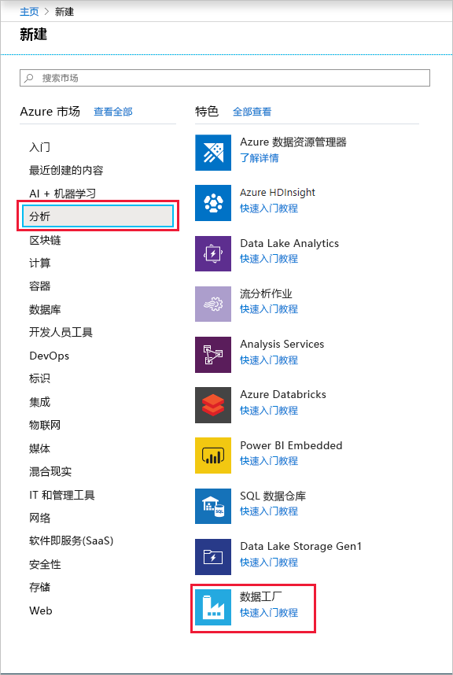
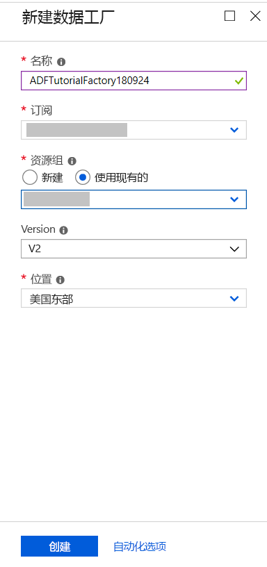
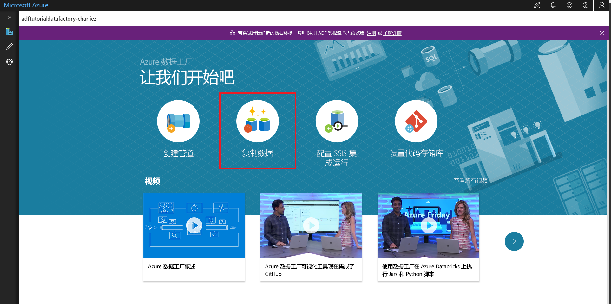
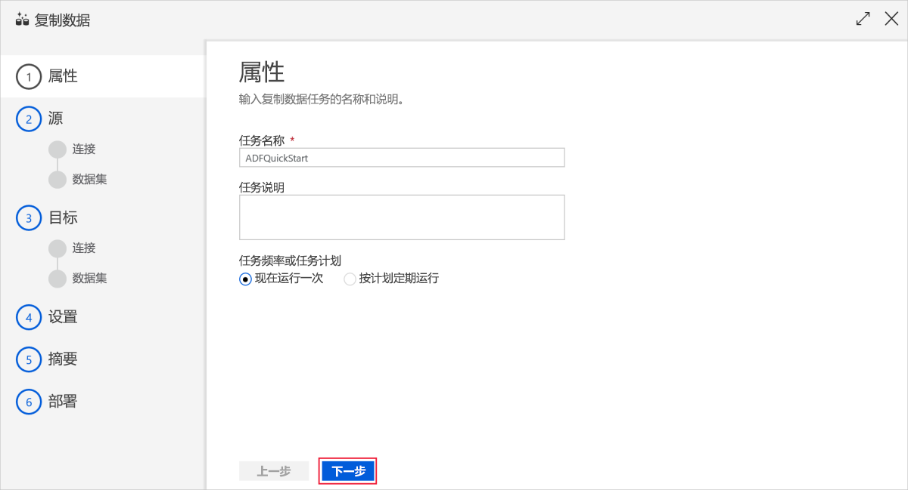
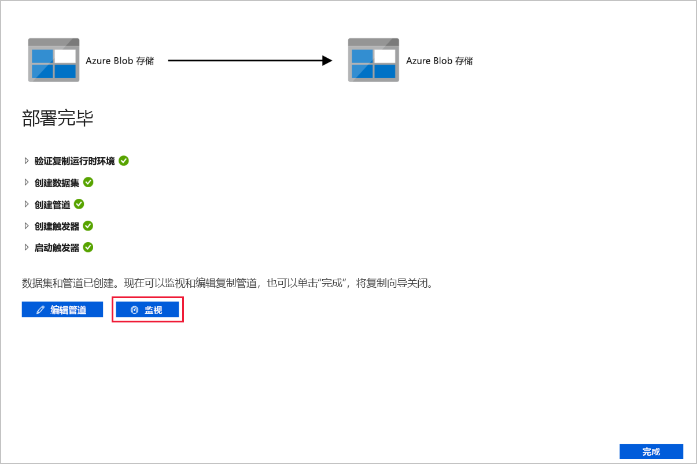

# 使用“复制数据”工具复制数据 
> [!div class="op_single_selector" title1="Select the version of Data Factory service you are using:"]
> * [版本 1 - 正式版](v1/data-factory-copy-data-from-azure-blob-storage-to-sql-database.md)
> * [版本 2 - 预览版](quickstart-create-data-factory-copy-data-tool.md)

在本快速入门中，我们将使用 Azure 门户创建一个数据工厂。 然后，使用“复制数据”工具创建一个管道，用于将数据从 Azure Blob 存储中的某个文件夹复制到另一个文件夹。 

> [!NOTE]
> 如果你对 Azure 数据工厂不太熟悉，请在学习本快速入门之前参阅 [Azure 数据工厂简介](data-factory-introduction.md)。 
>
> 本文适用于目前处于预览版的数据工厂版本 2。 如果使用数据工厂服务版本 1（即正式版 (GA)），请参阅[数据工厂版本 1 入门](v1/data-factory-copy-data-from-azure-blob-storage-to-sql-database.md)。

[!INCLUDE [data-factory-quickstart-prerequisites](../../includes/data-factory-quickstart-prerequisites.md)] 

## 创建数据工厂

1. 在左侧菜单中单击“新建”，并依次单击“数据 + 分析”、“数据工厂”。 
   
   
2. 在“新建数据工厂”页中，输入 **ADFTutorialDataFactory** 作为**名称**。 
      
     
 
   Azure 数据工厂的名称必须 **全局唯一**。 如果看到名称字段的以下错误，请更改数据工厂的名称（例如，改为 yournameADFTutorialDataFactory），然后重试创建。 有关数据工厂项目命名规则，请参阅[数据工厂 - 命名规则](naming-rules.md)一文。
  
     
3. 选择要在其中创建数据工厂的 Azure **订阅**。 
4. 对于**资源组**，请执行以下步骤之一：
     
      - 选择“使用现有资源组”，并从下拉列表选择现有的资源组。 
      - 选择“新建”，并输入资源组的名称。   
         
      若要了解有关资源组的详细信息，请参阅 [使用资源组管理 Azure 资源](../azure-resource-manager/resource-group-overview.md)。  
4. 选择“V2 (预览)”作为**版本**。
5. 选择数据工厂的**位置**。 下拉列表中仅显示支持的位置。 数据工厂使用的数据存储（Azure 存储、Azure SQL 数据库等）和计算资源（HDInsight 等）可以位于其他位置/区域。
6. 选择“固定到仪表板”。     
7. 单击“创建”。
8. 在仪表板上，会看到状态为“正在部署数据工厂”的以下磁贴。 

    
9. 创建完成后，会显示图中所示的“数据工厂”页。
   
   
10. 单击“创作和监视”磁贴，在单独的选项卡中启动 Azure 数据工厂用户界面 (UI)。 

## 启动“复制数据”工具

1. 在入门页中，单击“复制数据”磁贴启动“复制数据”工具。 

   
2. 在“复制数据”工具的“属性”页中，单击“下一步”。 在此页中可以指定管道的名称及其说明。 

    
3. 在“源数据存储”页中选择“Azure Blob 存储”，然后单击“下一步”。

    
4. 在“指定 Azure Blob 存储帐户”页中，从下拉列表中选择自己的**存储帐户名称**，然后单击“下一步”。 

    
5. 在“选择输入文件或文件夹”页中执行以下步骤：

    1. 导航到“adftutorial/input”文件夹。 
    2. 选择“emp.txt”文件。
    3. 单击“选择”。 可以双击“emp.txt”跳过此步骤。 
    4. 单击“资源组名称” 的 Azure 数据工厂。 

    
6. 在“文件格式设置”页中，注意该工具会自动检测列与行的分隔符，然后单击“下一步”。 还可以在此页中预览数据，以及查看输入数据的架构。 

    
7. 在“目标数据存储”页中选择“Azure Blob 存储”，然后单击“下一步”。 

        
8. 在“指定 Azure Blob 存储帐户”页中选择自己的 Azure Blob 存储帐户，然后单击“下一步”。 

    
9. 在“选择输出文件或文件夹”页中执行以下步骤： 

    1. 输入 **adftutorial/output** 作为**文件夹路径**。
    2. 输入 **emp.txt** 作为**文件名**。 
    3. 单击“资源组名称” 的 Azure 数据工厂。 

     
10. 在“文件格式设置”页中，单击“下一步”。 

    
11. 在“设置”页中，单击“下一步”。 

    
12. 在“摘要”页中检查所有设置，然后单击“下一步”。 

    
13. 在“部署已完成”页中，单击“监视”可以监视创建的管道。 

    
14. 应用程序将切换到“监视”选项卡。可在此页中查看管道的状态。 单击“刷新”可刷新列表。 
    
    
15. 在“操作”列中单击“查看活动运行”链接。 该管道只包含一个“复制”类型的活动。 

    
16. 若要查看复制操作的详细信息，请单击“操作”列中的“详细信息”（眼镜图像）链接。 有关属性的详细信息，请参阅[复制活动概述](copy-activity-overview.md)。 

    
17. 验证 **adftutorial** 容器的 **output** 文件夹中是否创建了 **emp.txt** 文件。 如果 output 文件夹不存在，数据工厂服务会自动创建它。 
18. 切换到“编辑”选项卡可以编辑链接服务、数据集和管道。 若要了解如何在数据工厂 UI 中编辑这些实体，请参阅[使用 Azure 门户创建数据工厂](quickstart-create-data-factory-portal.md)。

    

## 后续步骤
此示例中的管道将数据从 Azure Blob 存储中的一个位置复制到另一个位置。 完成相关[教程](tutorial-copy-data-portal.md)来了解如何在更多方案中使用数据工厂。 