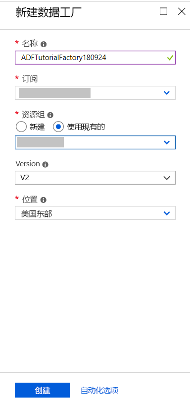
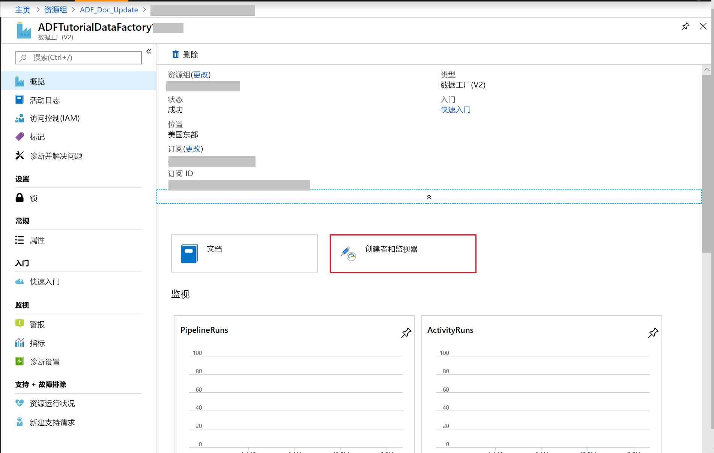
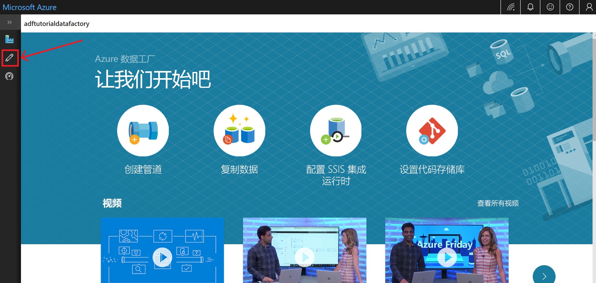
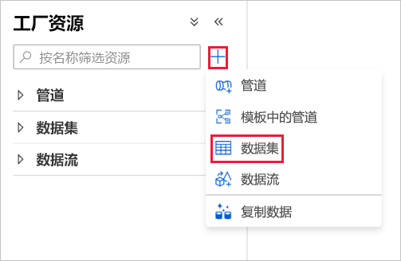
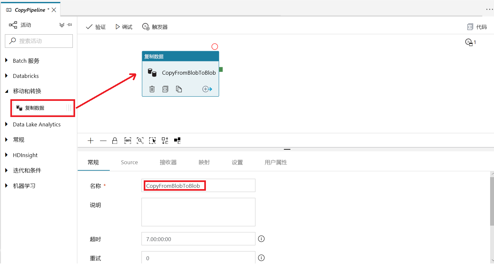
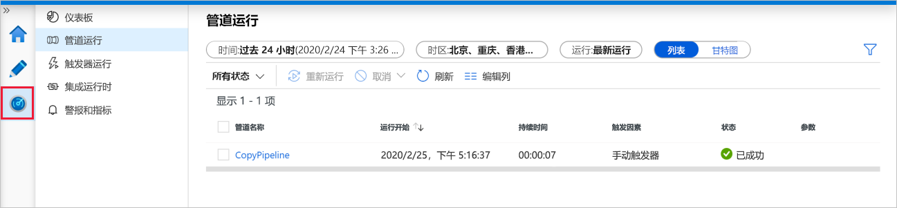
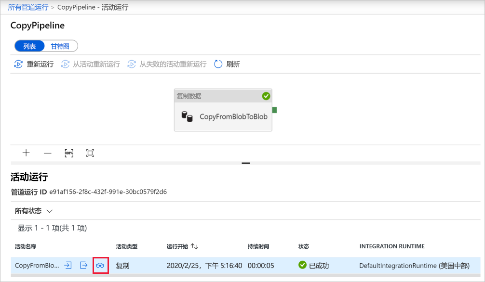
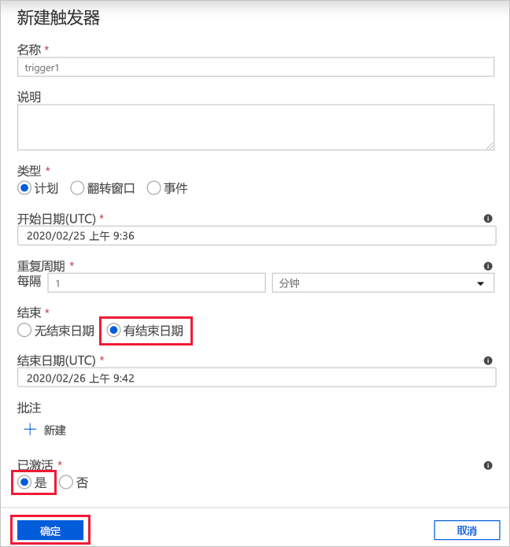
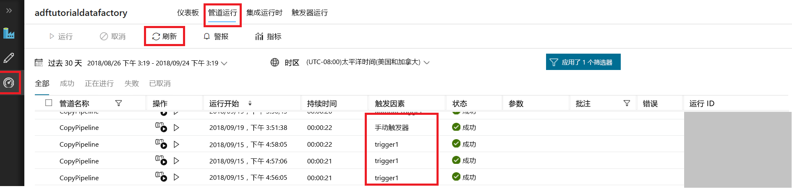
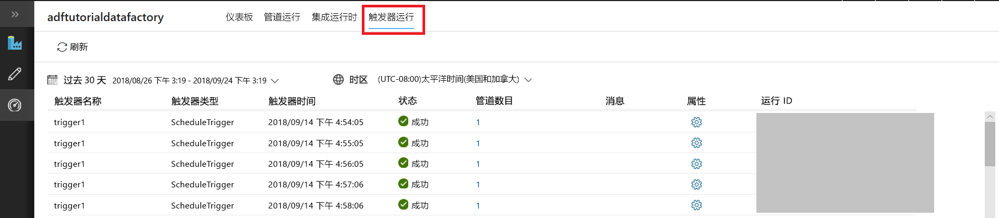

# 使用 Azure 数据工厂 UI 创建数据工厂
> [!div class="op_single_selector" title1="Select the version of Data Factory service you are using:"]
> * [版本 1 - 正式版](v1/data-factory-copy-data-from-azure-blob-storage-to-sql-database.md)
> * [版本 2 - 预览版](quickstart-create-data-factory-portal.md)

本快速入门介绍如何使用 Azure 数据工厂 UI 创建和监视数据工厂。 在此数据工厂中创建的管道会将数据从 Azure Blob 存储中的一个文件夹**复制**到另一个文件夹。 有关如何使用 Azure 数据工厂**转换**数据的教程，请参阅[教程：使用 Spark 转换数据](tutorial-transform-data-spark-portal.md)。 

> [!NOTE]
> 如果对 Azure 数据工厂不熟悉，请在学习本快速入门之前参阅 [Azure 数据工厂简介](data-factory-introduction.md)。 
>
> 本文适用于目前处于预览版的数据工厂版本 2。 如果使用公开发行 (GA) 的第 1 版数据工厂，请参阅[数据工厂第 1 版 - 教程](v1/data-factory-copy-data-from-azure-blob-storage-to-sql-database.md)。

[!INCLUDE [data-factory-quickstart-prerequisites](../../includes/data-factory-quickstart-prerequisites.md)] 

### 视频 
观看以下视频，了解数据工厂 UI： 
>[!VIDEO https://channel9.msdn.com/Shows/Azure-Friday/Visually-build-pipelines-for-Azure-Data-Factory-v2/Player]

## 创建数据工厂

1. 导航到 [Azure 门户](https://portal.azure.com)。 
2. 在左侧菜单中单击“新建”，并依次单击“数据 + 分析”、“数据工厂”。 
   
   
2. 在“新建数据工厂”页中，输入 **ADFTutorialDataFactory** 作为**名称**。 
      
     
 
   Azure 数据工厂的名称必须 **全局唯一**。 如果看到名称字段的以下错误，请更改数据工厂的名称（例如，改为 yournameADFTutorialDataFactory）。 有关数据工厂项目命名规则，请参阅[数据工厂 - 命名规则](naming-rules.md)一文。
  
     
3. 选择要在其中创建数据工厂的 Azure **订阅**。 
4. 对于**资源组**，请执行以下步骤之一：
     
      - 选择“使用现有资源组”，并从下拉列表选择现有的资源组。 
      - 选择“新建”，并输入资源组的名称。   
         
    若要了解有关资源组的详细信息，请参阅 [使用资源组管理 Azure 资源](../azure-resource-manager/resource-group-overview.md)。  
4. 选择“V2 (预览)”作为**版本**。
5. 选择数据工厂的**位置**。 下拉列表中仅显示数据工厂支持的位置。 数据工厂使用的数据存储（Azure 存储、Azure SQL 数据库等）和计算资源（HDInsight 等）可以位于其他位置。
6. 选择“固定到仪表板”。     
7. 单击“创建”。
8. 在仪表板上，会看到状态为“正在部署数据工厂”的以下磁贴。 

    
9. 创建完以后，会显示图中所示的“数据工厂”页。
   
    
10. 单击“创作和监视”磁贴，在单独的选项卡中启动 Azure 数据工厂用户界面 (UI) 应用程序。 
11. 在“入门”页的左侧面板中，切换到“编辑”选项卡，如下图所示： 

    

## 创建 Azure 存储链接服务
在此步骤中，请创建一个链接服务，将 Azure 存储帐户链接到数据工厂。 链接服务包含的连接信息可供数据工厂服务用来在运行时连接到它。

2. 单击“连接”，然后单击工具栏中的“新建”按钮。 

        
3. 在“新建链接服务”页中，选择“Azure Blob 存储”，然后单击“继续”。 

    
4. 在“新建链接服务”页中，执行以下步骤： 

    1. 输入 **AzureStorageLinkedService** 作为**名称**。
    2. 对于“存储帐户名称”，选择 Azure 存储帐户的名称。
    3. 单击“测试连接”，确认数据工厂服务可以连接到存储帐户。 
    4. 单击“保存”保存链接服务。 

         
5. 确认可以在链接服务列表中看到 **AzureStorageLinkedService**。 

    

## 创建数据集
此步骤创建两个数据集：**InputDataset** 和 **OutputDataset**。 这两个数据集的类型为 **AzureBlob**。 它们引用在上一步创建的 **Azure 存储链接服务**。 

输入数据集表示输入文件夹中的源数据。 在输入数据集定义中，请指定包含源数据的 Blob 容器 (**adftutorial**)、文件夹 (**input**) 和文件 (**emp.txt**)。 

输出数据集表示复制到目标的数据。 在输出数据集定义中，请指定要将数据复制到其中的 Blob 容器 (**adftutorial**)、文件夹 (**output**) 和文件。 每个管道运行都有一个与之关联的唯一 ID，可以通过系统变量 **RunId** 对其进行访问。 输出文件的名称会根据管道的运行 ID 动态进行赋值。   

在链接服务设置中，已指定包含源数据的 Azure 存储帐户。 在源数据集设置中，请指定源数据的具体驻留位置（Blob 容器、文件夹和文件）。 在接收器数据集设置中，请指定将数据复制到其中的位置（Blob 容器、文件夹和文件）。 
 
1. 单击“+ (加)”按钮，然后选择“数据集”。

    
2. 在“新建数据集”页中，选择“Azure Blob 存储”，然后单击“完成”。 

    
3. 在数据集的“属性”窗口中，输入 **InputDataset** 作为**名称**。 

    
4. 切换到“连接”选项卡，然后执行以下步骤： 

    1. 选择 **AzureStorageLinkedService** 作为链接服务。 
    2. 对于“文件路径”，请单击“浏览”按钮。 
        
    3. 在“选择文件或文件夹”窗口中导航到 **adftutorial** 容器中的 **input** 文件夹，选择 **emp.txt** 文件，然后单击“完成”。

        
    4. （可选）单击“预览数据”，预览 emp.txt 文件中的数据。     
5. 重复创建输出数据集的步骤。  

    1. 在左窗格中单击“+ (加)”按钮，然后选择“数据集”。
    2. 在“新建数据集”页中，选择“Azure Blob 存储”，然后单击“完成”。
    3. 指定 **OutputDataset** 作为名称。
    4. 输入 **adftutorial/output** 作为文件夹。 如果输出文件夹不存在，“复制”活动会创建一个。 
    5. 输入 `@CONCAT(pipeline().RunId, '.txt')` 作为文件名。 每次运行管道时，该管道运行都与一个与之关联的唯一 ID。 此表达式将管道的运行 ID 与 **.txt** 连接起来，为输出文件名赋值。 如需支持的系统变量和表达式的列表，请参阅[系统变量](control-flow-system-variables.md)和[表达式语言](control-flow-expression-language-functions.md)。

        

## 创建管道 
此步骤创建和验证一个管道，其中包含的**复制**活动可使用输入和输出数据集。 “复制”活动将数据从输入数据集设置中指定的文件复制到输出数据集设置中指定的文件。 如果输入数据集只指定了一个文件夹（不是文件名），则“复制”活动会将源文件夹中的所有文件复制到目标。 

1. 单击“+ (加)”按钮，然后选择“管道”。 

    
2. 在“属性”窗口中指定 **CopyPipeline** 作为**名称**。 

    
3. 在“活动”工具箱中，展开 **DataFlow** ，然后将**复制**活动从“活动”工具箱拖放到管道设计器图面。 也可在“活动”工具箱中搜索活动。 指定 **CopyFromBlobToBlob** 作为**名称**。

    
4. 切换到复制活动设置中的“源”选项卡，选择 **InputDataset** 作为**源数据集**。

        
5. 切换到复制活动设置中的“接收器”选项卡，选择 **OutputDataset** 作为**接收器数据集**。

        
7. 单击“验证”对管道设置进行验证。 确认已成功验证管道。 若要关闭验证输出，请单击**右箭头** (>>) 按钮。 

    

## 测试性运行管道
此步骤对管道进行测试性运行，然后再将其部署到数据工厂。 

1. 在管道的工具栏中单击“测试性运行”。 
    
    
2. 确认可以在管道设置的“输出”选项卡中看到管道运行的状态。 

        
3. 确认可以在 **adftutorial** 容器的 **output** 文件夹中看到输出文件。 如果 output 文件夹不存在，数据工厂服务会自动创建它。 
    
    

## 手动触发管道
在此步骤中，请将实体（链接服务、数据集、管道）部署到 Azure 数据工厂， 然后手动触发管道运行。 也可将实体发布到自己的 VSTS GIT 存储库，这在[另一教程](tutorial-copy-data-portal.md?#configure-code-repository)中有介绍。

1. 在触发管道之前，必须将实体发布到数据工厂。 若要进行发布，请单击左窗格中的“发布”。 

    
2. 若要手动触发管道，请单击工具栏中的“触发器”，然后选择“立即触发”。 
    
    

## 监视管道

1. 在左侧切换到“监视”选项卡。 使用“刷新”按钮刷新列表。

    
2. 在“操作”下单击“查看活动运行”链接。 此时会在此页中看到复制活动运行的状态。 

    
3. 若要查看复制操作的详细信息，请单击“操作”列中的“详细信息”（眼镜图像）链接。 有关属性的详细信息，请参阅[复制活动概述](copy-activity-overview.md)。 

    
4. 确认可以在 **output** 文件夹中看到新文件。 
5. 可以通过单击“管道”链接，从“活动运行”视图切换回“管道运行”视图。 

## 按计划触发管道
在本教程中，此步骤为可选步骤。 可以创建**计划程序触发器**，将管道计划为定期运行（每小时运行一次、每天运行一次，等等）。 此步骤创建一个触发器。该触发器每分钟运行一次，直至指定作为结束日期的日期/时间。 

1. 切换到“编辑”选项卡。 

    
1. 单击菜单上的“触发器”，然后单击“新建/编辑”。 

    
2. 在“添加触发器”页中单击“选择触发器...”，然后单击“新建”。 

    
3. 在“新建触发器”页中，对于“结束”字段，请选择“在特定日期”，指定一个结束时间，使之比当前时间晚数分钟，然后单击“应用”。 每次管道运行都需要支付相关成本，因此请指定适当的结束时间，使之仅比开始时间晚数分钟。 确保两个时间是在同一天。 但是，请确保在发布时间和结束时间之间有足够的时间来运行管道。 只有在将解决方案发布到数据工厂之后，触发器才会生效，而不是在 UI 中保存触发器就会使该触发器生效。 

    
4. 在“新建触发器”页中勾选“已激活”选项，然后单击“下一步”。 

    
5. 在“新建触发器”页中查看警告消息，然后单击“完成”。

    
6. 单击“发布”，将所做的更改发布到数据工厂。 

    
8. 在左侧切换到“监视”选项卡。 单击“刷新”对列表进行刷新。 从发布时间到结束时间这段时间内，可以看到管道每分钟运行一次。 请注意“触发因素”列中的值。 手动触发器运行是在此前执行的步骤（“立即触发”）中完成的。 

    
9. 单击“管道运行”旁边的向下箭头，切换到“触发器运行”视图。 

        
10. 确认每次管道运行时，在 **output** 文件夹中都创建了**输出文件**，直至指定的结束日期/时间为止。 

## 后续步骤
此示例中的管道将数据从 Azure Blob 存储中的一个位置复制到另一个位置。 完成相关[教程](tutorial-copy-data-portal.md)来了解如何在更多方案中使用数据工厂。 