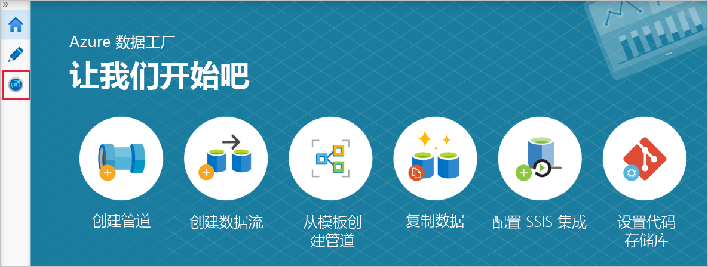
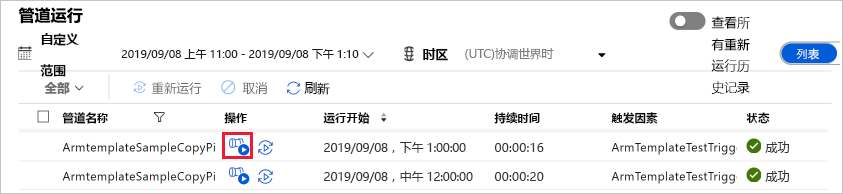
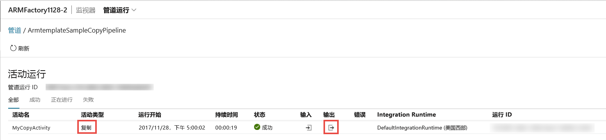

# <a name="tutorial-create-an-azure-data-factory-using-azure-resource-manager-template"></a>教程：使用 Azure 资源管理器模板创建 Azure 数据工厂

> [!div class="op_single_selector" title1="选择所使用的数据工厂服务版本："]
> * [版本 1](v1/data-factory-build-your-first-pipeline-using-arm.md)
> * [当前版本](quickstart-create-data-factory-resource-manager-template.md)

[!INCLUDE[appliesto-adf-xxx-md](includes/appliesto-adf-xxx-md.md)]

本快速入门介绍如何使用 Azure 资源管理器模板来创建 Azure 数据工厂。 在此数据工厂中创建的管道会将数据从 Azure Blob 存储中的一个文件夹**复制**到另一个文件夹。 有关如何使用 Azure 数据工厂**转换**数据的教程，请参阅[教程：使用 Spark 转换数据](transform-data-using-spark.md)。

> [!NOTE]
> 本文不提供数据工厂服务的详细介绍。 有关 Azure 数据工厂服务的介绍，请参阅 [Azure 数据工厂简介](introduction.md)。

[!INCLUDE [data-factory-quickstart-prerequisites](../../includes/data-factory-quickstart-prerequisites.md)]

### <a name="azure-powershell"></a>Azure PowerShell

[!INCLUDE [updated-for-az](../../includes/updated-for-az.md)]

按[如何安装和配置 Azure PowerShell](/powershell/azure/install-Az-ps) 中的说明安装最新的 Azure PowerShell 模块。

## <a name="resource-manager-templates"></a>资源管理器模板

若要了解 Azure 资源管理器模板的一般信息，请参阅[创作 Azure 资源管理器模板](../azure-resource-manager/templates/template-syntax.md)。

以下部分提供了用于定义数据工厂实体的完整 Resource Manager 模板，以便可以快速完成整个教程并测试模板。 若要了解每个数据工厂实体的定义方式，请参阅[模板中的数据工厂实体](#data-factory-entities-in-the-template)部分。

若要了解模板中数据工厂资源的 JSON 语法和属性，请参阅 [Microsoft.DataFactory 资源类型](/azure/templates/microsoft.datafactory/allversions)。

## <a name="data-factory-json"></a>数据工厂 JSON

在 **C:\ADFTutorial** 文件夹中创建名为 **ADFTutorialARM.json** 的 JSON 文件（如果 ADFTutorial 文件夹不存在，请创建该文件夹），其内容如下：

```json
{  
    "$schema":"http://schema.management.azure.com/schemas/2015-01-01/deploymentTemplate.json#",
    "contentVersion":"1.0.0.0",
    "parameters":{  
        "dataFactoryName":{  
            "type":"string",
            "metadata":"Data Factory Name"
        },
        "dataFactoryLocation":{  
            "type":"string",
            "defaultValue":"East US",
            "metadata":{  
                "description":"Location of the data factory. Currently, only East US, East US 2, and West Europe are supported. "
            }
        },
        "storageAccountName":{  
            "type":"string",
            "metadata":{  
                "description":"Name of the Azure storage account that contains the input/output data."
            }
        },
        "storageAccountKey":{  
            "type":"securestring",
            "metadata":{  
                "description":"Key for the Azure storage account."
            }
        },
        "triggerStartTime": {
            "type": "string",
            "metadata": {
                "description": "Start time for the trigger."
            }
        },
        "triggerEndTime": {
            "type": "string",
            "metadata": {
                "description": "End time for the trigger."
            }
        }
    },      
    "variables":{  
        "factoryId":"[concat('Microsoft.DataFactory/factories/', parameters('dataFactoryName'))]"
    },
    "resources":[  
        {  
            "name":"[parameters('dataFactoryName')]",
            "apiVersion":"2018-06-01",
            "type":"Microsoft.DataFactory/factories",
            "location":"[parameters('dataFactoryLocation')]",
            "identity":{  
                "type":"SystemAssigned"
            },
            "resources":[  
                {  
                    "name":"[concat(parameters('dataFactoryName'), '/ArmtemplateStorageLinkedService')]",
                    "type":"Microsoft.DataFactory/factories/linkedServices",
                    "apiVersion":"2018-06-01",
                    "properties":{  
                        "annotations":[  

                        ],
                        "type":"AzureBlobStorage",
                        "typeProperties":{  
                            "connectionString":"[concat('DefaultEndpointsProtocol=https;AccountName=',parameters('storageAccountName'),';AccountKey=',parameters('storageAccountKey'))]"
                        }
                    },
                    "dependsOn":[  
                        "[parameters('dataFactoryName')]"
                    ]
                },
                {  
                    "name":"[concat(parameters('dataFactoryName'), '/ArmtemplateTestDatasetIn')]",
                    "type":"Microsoft.DataFactory/factories/datasets",
                    "apiVersion":"2018-06-01",
                    "properties":{  
                        "linkedServiceName":{  
                            "referenceName":"ArmtemplateStorageLinkedService",
                            "type":"LinkedServiceReference"
                        },
                        "annotations":[  

                        ],
                        "type":"Binary",
                        "typeProperties":{  
                            "location":{  
                                "type":"AzureBlobStorageLocation",
                                "fileName":"emp.txt",
                                "folderPath":"input",
                                "container":"adftutorial"
                            }
                        }
                    },
                    "dependsOn":[  
                        "[parameters('dataFactoryName')]",
                        "[concat(variables('factoryId'), '/linkedServices/ArmtemplateStorageLinkedService')]"
                    ]
                },
                {  
                    "name":"[concat(parameters('dataFactoryName'), '/ArmtemplateTestDatasetOut')]",
                    "type":"Microsoft.DataFactory/factories/datasets",
                    "apiVersion":"2018-06-01",
                    "properties":{  
                        "linkedServiceName":{  
                            "referenceName":"ArmtemplateStorageLinkedService",
                            "type":"LinkedServiceReference"
                        },
                        "annotations":[  

                        ],
                        "type":"Binary",
                        "typeProperties":{  
                            "location":{  
                                "type":"AzureBlobStorageLocation",
                                "folderPath":"output",
                                "container":"adftutorial"
                            }
                        }
                    },
                    "dependsOn":[  
                        "[parameters('dataFactoryName')]",
                        "[concat(variables('factoryId'), '/linkedServices/ArmtemplateStorageLinkedService')]"
                    ]
                },
                {  
                    "name":"[concat(parameters('dataFactoryName'), '/ArmtemplateSampleCopyPipeline')]",
                    "type":"Microsoft.DataFactory/factories/pipelines",
                    "apiVersion":"2018-06-01",
                    "properties":{  
                        "activities":[  
                            {  
                                "name":"MyCopyActivity",
                                "type":"Copy",
                                "dependsOn":[  

                                ],
                                "policy":{  
                                    "timeout":"7.00:00:00",
                                    "retry":0,
                                    "retryIntervalInSeconds":30,
                                    "secureOutput":false,
                                    "secureInput":false
                                },
                                "userProperties":[  

                                ],
                                "typeProperties":{  
                                    "source":{  
                                        "type":"BinarySource",
                                        "storeSettings":{  
                                            "type":"AzureBlobStorageReadSettings",
                                            "recursive":true
                                        }
                                    },
                                    "sink":{  
                                        "type":"BinarySink",
                                        "storeSettings":{  
                                            "type":"AzureBlobStorageWriteSettings"
                                        }
                                    },
                                    "enableStaging":false
                                },
                                "inputs":[  
                                    {  
                                        "referenceName":"ArmtemplateTestDatasetIn",
                                        "type":"DatasetReference",
                                        "parameters":{  

                                        }
                                    }
                                ],
                                "outputs":[  
                                    {  
                                        "referenceName":"ArmtemplateTestDatasetOut",
                                        "type":"DatasetReference",
                                        "parameters":{  

                                        }
                                    }
                                ]
                            }
                        ],
                        "annotations":[  

                        ]
                    },
                    "dependsOn":[  
                        "[parameters('dataFactoryName')]",
                        "[concat(variables('factoryId'), '/datasets/ArmtemplateTestDatasetIn')]",
                        "[concat(variables('factoryId'), '/datasets/ArmtemplateTestDatasetOut')]"
                    ]
                },
                {  
                    "name":"[concat(parameters('dataFactoryName'), '/ArmTemplateTestTrigger')]",
                    "type":"Microsoft.DataFactory/factories/triggers",
                    "apiVersion":"2018-06-01",
                    "properties":{  
                        "annotations":[  

                        ],
                        "runtimeState":"Started",
                        "pipelines":[  
                            {  
                                "pipelineReference":{  
                                    "referenceName":"ArmtemplateSampleCopyPipeline",
                                    "type":"PipelineReference"
                                },
                                "parameters":{  

                                }
                            }
                        ],
                        "type":"ScheduleTrigger",
                        "typeProperties":{  
                            "recurrence":{  
                                "frequency":"Hour",
                                "interval":1,
                                "startTime":"[parameters('triggerStartTime')]",
                                "endTime":"[parameters('triggerEndTime')]",
                                "timeZone":"UTC"
                            }
                        }
                    },
                    "dependsOn":[  
                        "[parameters('dataFactoryName')]",
                        "[concat(variables('factoryId'), '/pipelines/ArmtemplateSampleCopyPipeline')]"
                    ]
                }
            ]
        }
    ]
}
```
## <a name="parameters-json"></a>参数 JSON

创建名为 **ADFTutorialARM-Parameters.json**、包含 Azure 资源管理器模板参数的 JSON 文件。

> [!IMPORTANT]
> - 为此参数文件中的 **storageAccountName** 和 **storageAccountKey** 参数指定 Azure 存储帐户的名称和密钥。 已在此 Azure Blob 存储中创建 adftutorial 容器并将示例文件 (emp.txt) 上传到 input 文件夹。
> - 对于 **dataFactoryName** 参数，请为数据工厂指定一个全局唯一名称。 例如：ARMTutorialFactoryJohnDoe11282017。
> - 对于 **triggerStartTime**，请按 `2019-09-08T00:00:00` 格式指定当天的时间。
> - 对于 **triggerEndTime**，请按 `2019-09-09T00:00:00` 格式指定第二天的时间。 也可查看当前的 UTC 时间，指定随后的一小时或两小时作为结束时间。 例如，如果现在的 UTC 时间为凌晨 1:32，则可指定 `2019-09-09:03:00:00` 作为结束时间。 在这种情况下，触发器运行管道两次（一次在凌晨 2 点，一次在凌晨 3 点）。

```json
{  
    "$schema":"https://schema.management.azure.com/schemas/2015-01-01/deploymentParameters.json#",
    "contentVersion":"1.0.0.0",
    "parameters":{  
        "dataFactoryName":{  
            "value":"<datafactoryname>"
        },
        "dataFactoryLocation":{  
            "value":"East US"
        },
        "storageAccountName":{  
            "value":"<yourstorageaccountname>"
        },
        "storageAccountKey":{  
            "value":"<yourstorageaccountkey>"
        },
        "triggerStartTime":{  
            "value":"2019-09-08T11:00:00"
        },
        "triggerEndTime":{  
            "value":"2019-09-08T14:00:00"
        }
    }
}
```

> [!IMPORTANT]
> 在同一个数据工厂 JSON 模板中，可为开发、测试和生产环境使用不同的参数 JSON 文件。 使用 Power Shell 脚本可在这些环境中自动部署数据工厂实体。

## <a name="deploy-data-factory-entities"></a>部署数据工厂实体

在 PowerShell 中，运行以下命令以使用在本快速入门中前面创建的资源管理器模板在资源组中部署数据工厂实体（在本例中，以 ADFTutorialResourceGroup 为例）。

```powershell
New-AzResourceGroupDeployment -Name MyARMDeployment -ResourceGroupName ADFTutorialResourceGroup -TemplateFile C:\ADFTutorial\ADFTutorialARM.json -TemplateParameterFile C:\ADFTutorial\ADFTutorialARM-Parameters.json
```

将显示类似于以下示例的输出：

```console
DeploymentName          : MyARMDeployment
ResourceGroupName       : ADFTutorialResourceGroup
ProvisioningState       : Succeeded
Timestamp               : 9/8/2019 10:52:29 AM
Mode                    : Incremental
TemplateLink            : 
Parameters              : 
                          Name                   Type                       Value     
                          =====================  =========================  ==========
                          dataFactoryName        String                     <data factory name>
                          dataFactoryLocation    String                     East US   
                          storageAccountName     String                     <storage account name>
                          storageAccountKey      SecureString                         
                          triggerStartTime       String                     9/8/2019 11:00:00 AM
                          triggerEndTime         String                     9/8/2019 2:00:00 PM
                          
Outputs                 : 
DeploymentDebugLogLevel : 
```

## <a name="start-the-trigger"></a>启动触发器

此模板部署以下数据工厂实体：

- Azure 存储链接服务
- 二进制数据集（输入和输出）
- 包含复制活动的管道
- 用于触发管道的触发器

部署的触发器处于已停止状态。 若要启动触发器，一种方式是使用 **Start-AzDataFactoryV2Trigger** PowerShell cmdlet。 以下过程提供了详细步骤：

1. 在 PowerShell 窗口中创建一个变量，用于保存资源组的名称。 将以下命令复制到 PowerShell 窗口中，然后按 ENTER。 如果已为 New-AzResourceGroupDeployment 命令指定了其他资源组名称，请在此处更新该值。

    ```powershell
    $resourceGroupName = "ADFTutorialResourceGroup"
    ```
2. 创建一个变量，用于保存数据工厂的名称。 指定一个已在 ADFTutorialARM-Parameters.json 文件中指定的名称。

    ```powershell
    $dataFactoryName = "<yourdatafactoryname>"
    ```
3. 设置一个变量作为触发器的名称。 触发器的名称在资源管理器模板文件 (ADFTutorialARM.json) 中进行硬编码。

    ```powershell
    $triggerName = "ArmTemplateTestTrigger"
    ```
4. 获取**触发器的状态**，方法是在指定数据工厂和触发器的名称后，运行以下 PowerShell 命令：

    ```powershell
    Get-AzDataFactoryV2Trigger -ResourceGroupName $resourceGroupName -DataFactoryName $dataFactoryName -Name $triggerName
    ```

    下面是示例输出：

    ```json

    TriggerName       : ArmTemplateTestTrigger
    ResourceGroupName : ADFTutorialResourceGroup
    DataFactoryName   : ADFQuickstartsDataFactory0905
    Properties        : Microsoft.Azure.Management.DataFactory.Models.ScheduleTrigger
    RuntimeState      : Stopped
    ```
    
    请注意，触发器的运行时状态为“已停止”。 
5. **启动触发器**。 触发器在相应时间运行在模板中定义的管道。 也就是说，如果在下午 2:25 执行此命令，则触发器会在下午 3 点首次运行管道。 然后，触发器会每小时运行一次管道，直至为触发器指定的结束时间。

    ```powershell
    Start-AzDataFactoryV2Trigger -ResourceGroupName $resourceGroupName -DataFactoryName $dataFactoryName -TriggerName $triggerName
    ```
    
    下面是示例输出：
    
    ```console
    Confirm
    Are you sure you want to start trigger 'ArmTemplateTestTrigger' in data factory 'ARMFactory1128'?
    [Y] Yes  [N] No  [S] Suspend  [?] Help (default is "Y"): y
    True
    ```
6. 再次运行 Get-AzDataFactoryV2Trigger 命令，确认触发器已启动。

    ```powershell
    Get-AzDataFactoryV2Trigger -ResourceGroupName $resourceGroupName -DataFactoryName $dataFactoryName -TriggerName $triggerName
    ```
    
    下面是示例输出：
    
    ```console
    TriggerName       : ArmTemplateTestTrigger
    ResourceGroupName : ADFTutorialResourceGroup
    DataFactoryName   : ADFQuickstartsDataFactory0905
    Properties        : Microsoft.Azure.Management.DataFactory.Models.ScheduleTrigger
    RuntimeState      : Started
    ```

## <a name="monitor-the-pipeline"></a>监视管道

1. 登录到 [Azure 门户](https://portal.azure.com/)以后，单击“所有服务”，使用 **data fa** 之类的关键字进行搜索，然后选择“数据工厂”。  

2. 在“数据工厂”  页中单击已创建的数据工厂。 根据需要使用数据工厂的名称对列表进行筛选。

3. 在“数据工厂”页中，单击“创作和监视”磁贴。 

4. 在“开始使用”页中，选择“监视”选项卡。   

    > [!IMPORTANT]
    > 仅在整点（例如，早晨 4 点、早晨 5 点、早晨 6 点，等等）查看管道运行。 当时间到达下一小时时，单击工具栏上的“刷新”以刷新列表。 

5. 在“操作”列中单击“查看活动运行”链接。  

    

6. 此时会看到与管道运行相关联的活动运行。 在本快速入门中，管道只有一个活动，其类型为：“复制”。 因此会看到该活动的一个运行。

    
7. 单击“操作”列下的“输出”  链接。 此时会在“输出”窗口中看到复制操作的输出。  单击最大化按钮可查看完整输出。 可以关闭最大化输出窗口，也可以直接关闭它。

8. 看到运行成功/失败以后，即可停止触发器。 触发器一小时运行管道一次。 每次运行时，管道会将同一文件从 input 文件夹复制到 output 文件夹。 若要停止触发器，请在 PowerShell 窗口中运行以下命令。
    
    ```powershell
    Stop-AzDataFactoryV2Trigger -ResourceGroupName $resourceGroupName -DataFactoryName $dataFactoryName -Name $triggerName
    ```

[!INCLUDE [data-factory-quickstart-verify-output-cleanup.md](../../includes/data-factory-quickstart-verify-output-cleanup.md)]

## <a name="json-definitions-for-entities"></a><a name="data-factory-entities-in-the-template"></a> 实体的 JSON 定义

JSON 模板中定义了以下数据工厂实体：

- [Azure 存储链接服务](#azure-storage-linked-service)
- [二进制输入数据集](#binary-input-dataset)
- [二进制输出数据集](#binary-output-dataset)
- [包含复制活动的数据管道](#data-pipeline)
- [触发器](#trigger)

#### <a name="azure-storage-linked-service"></a>Azure 存储链接服务

AzureStorageLinkedService 链接将 Azure 存储帐户链接到数据工厂。 已根据先决条件创建了一个容器并将数据上传到该存储帐户。 在本部分中指定 Azure 存储帐户的名称和密钥。 有关用于定义 Azure 存储链接服务的 JSON 属性的详细信息。请参阅 [Azure Storage linked service](connector-azure-blob-storage.md#linked-service-properties)（Azure 存储链接服务）。

```json
{  
    "name":"[concat(parameters('dataFactoryName'), '/ArmtemplateStorageLinkedService')]",
    "type":"Microsoft.DataFactory/factories/linkedServices",
    "apiVersion":"2018-06-01",
    "properties":{  
        "annotations":[  

        ],
        "type":"AzureBlobStorage",
        "typeProperties":{  
            "connectionString":"[concat('DefaultEndpointsProtocol=https;AccountName=',parameters('storageAccountName'),';AccountKey=',parameters('storageAccountKey'))]"
        }
    },
    "dependsOn":[  
        "[parameters('dataFactoryName')]"
    ]
}
```

connectionString 使用 storageAccountName 和 storageAccountKey 参数。 可以使用配置文件传递这些参数的值。 该定义还使用了模板中定义的变量 azureStorageLinkedService 和 dataFactoryName。

#### <a name="binary-input-dataset"></a>二进制输入数据集

Azure 存储链接服务指定一个连接字符串，数据工厂服务在运行时使用该字符串连接到 Azure 存储帐户。 在二进制数据集定义中，请指定包含输入数据的 Blob 容器、文件夹和文件的名称。 有关用于定义二进制数据集的 JSON 属性的详细信息，请参阅[二进制数据集属性](format-binary.md#dataset-properties)。

```json
{  
    "name":"[concat(parameters('dataFactoryName'), '/ArmtemplateTestDatasetIn')]",
    "type":"Microsoft.DataFactory/factories/datasets",
    "apiVersion":"2018-06-01",
    "properties":{  
        "linkedServiceName":{  
            "referenceName":"ArmtemplateStorageLinkedService",
            "type":"LinkedServiceReference"
        },
        "annotations":[  

        ],
        "type":"Binary",
        "typeProperties":{  
            "location":{  
                "type":"AzureBlobStorageLocation",
                "fileName":"emp.txt",
                "folderPath":"input",
                "container":"adftutorial"
            }
        }
    },
    "dependsOn":[  
        "[parameters('dataFactoryName')]",
        "[concat(variables('factoryId'), '/linkedServices/ArmtemplateStorageLinkedService')]"
    ]
}
```

#### <a name="binary-output-dataset"></a>二进制输出数据集

请在 Azure Blob 存储中指定一个文件夹的名称，用于保存从 input 文件夹复制的数据。 有关用于定义二进制数据集的 JSON 属性的详细信息，请参阅[二进制数据集属性](format-binary.md#dataset-properties)。

```json
{  
    "name":"[concat(parameters('dataFactoryName'), '/ArmtemplateTestDatasetOut')]",
    "type":"Microsoft.DataFactory/factories/datasets",
    "apiVersion":"2018-06-01",
    "properties":{  
        "linkedServiceName":{  
            "referenceName":"ArmtemplateStorageLinkedService",
            "type":"LinkedServiceReference"
        },
        "annotations":[  

        ],
        "type":"Binary",
        "typeProperties":{  
            "location":{  
                "type":"AzureBlobStorageLocation",
                "folderPath":"output",
                "container":"adftutorial"
            }
        }
    },
    "dependsOn":[  
        "[parameters('dataFactoryName')]",
        "[concat(variables('factoryId'), '/linkedServices/ArmtemplateStorageLinkedService')]"
    ]
}
```

#### <a name="data-pipeline"></a>数据管道

定义将数据从一个二进制数据集复制到另一个二进制数据集的管道。 有关用于定义本示例中所述管道的 JSON 元素的说明，请参阅 [Pipeline JSON](concepts-pipelines-activities.md#pipeline-json)（管道 JSON）。

```json
{  
    "name":"[concat(parameters('dataFactoryName'), '/ArmtemplateSampleCopyPipeline')]",
    "type":"Microsoft.DataFactory/factories/pipelines",
    "apiVersion":"2018-06-01",
    "properties":{  
        "activities":[  
            {  
                "name":"MyCopyActivity",
                "type":"Copy",
                "dependsOn":[  

                ],
                "policy":{  
                    "timeout":"7.00:00:00",
                    "retry":0,
                    "retryIntervalInSeconds":30,
                    "secureOutput":false,
                    "secureInput":false
                },
                "userProperties":[  

                ],
                "typeProperties":{  
                    "source":{  
                        "type":"BinarySource",
                        "storeSettings":{  
                            "type":"AzureBlobStorageReadSettings",
                            "recursive":true
                        }
                    },
                    "sink":{  
                        "type":"BinarySink",
                        "storeSettings":{  
                            "type":"AzureBlobStorageWriteSettings"
                        }
                    },
                    "enableStaging":false
                },
                "inputs":[  
                    {  
                        "referenceName":"ArmtemplateTestDatasetIn",
                        "type":"DatasetReference",
                        "parameters":{  

                        }
                    }
                ],
                "outputs":[  
                    {  
                        "referenceName":"ArmtemplateTestDatasetOut",
                        "type":"DatasetReference",
                        "parameters":{  

                        }
                    }
                ]
            }
        ],
        "annotations":[  

        ]
    },
    "dependsOn":[  
        "[parameters('dataFactoryName')]",
        "[concat(variables('factoryId'), '/datasets/ArmtemplateTestDatasetIn')]",
        "[concat(variables('factoryId'), '/datasets/ArmtemplateTestDatasetOut')]"
    ]
}
```

#### <a name="trigger"></a>触发器

定义一个每小时运行一次管道的触发器。 部署的触发器处于已停止状态。 使用 **Start-AzDataFactoryV2Trigger** cmdlet 启动触发器。 有关触发器的详细信息，请参阅[管道执行和触发器](concepts-pipeline-execution-triggers.md#trigger-execution)一文。

```json
{  
    "name":"[concat(parameters('dataFactoryName'), '/ArmTemplateTestTrigger')]",
    "type":"Microsoft.DataFactory/factories/triggers",
    "apiVersion":"2018-06-01",
    "properties":{  
        "annotations":[  

        ],
        "runtimeState":"Started",
        "pipelines":[  
            {  
                "pipelineReference":{  
                    "referenceName":"ArmtemplateSampleCopyPipeline",
                    "type":"PipelineReference"
                },
                "parameters":{  

                }
            }
        ],
        "type":"ScheduleTrigger",
        "typeProperties":{  
            "recurrence":{  
                "frequency":"Hour",
                "interval":1,
                "startTime":"[parameters('triggerStartTime')]",
                "endTime":"[parameters('triggerEndTime')]",
                "timeZone":"UTC"
            }
        }
    },
    "dependsOn":[  
        "[parameters('dataFactoryName')]",
        "[concat(variables('factoryId'), '/pipelines/ArmtemplateSampleCopyPipeline')]"
    ]
}
```

## <a name="reuse-the-template"></a>重复使用模板

本教程创建了一个用于定义数据工厂实体的模板，以及一个用于传递参数值的模板。 要使用同一个模板将数据工厂实体部署到不同的环境，可为每个环境创建一个参数文件，并在部署到该环境时使用该文件。

示例：

```powershell
New-AzResourceGroupDeployment -Name MyARMDeployment -ResourceGroupName ADFTutorialResourceGroup -TemplateFile ADFTutorialARM.json -TemplateParameterFile ADFTutorialARM-Parameters-Dev.json

New-AzResourceGroupDeployment -Name MyARMDeployment -ResourceGroupName ADFTutorialResourceGroup -TemplateFile ADFTutorialARM.json -TemplateParameterFile ADFTutorialARM-Parameters-Test.json

New-AzResourceGroupDeployment -Name MyARMDeployment -ResourceGroupName ADFTutorialResourceGroup -TemplateFile ADFTutorialARM.json -TemplateParameterFile ADFTutorialARM-Parameters-Production.json
```

请注意，三条命令分别使用开发环境、测试环境和生产环境的参数文件。

可以重复使用该模板来执行重复的任务。 例如，创建多个数据工厂，其中包含用于实现相同逻辑的一个或多个管道，但每个数据工厂使用不同的 Azure 存储帐户。 在这种情况下，可以在同一个环境（开发、测试或生产）中使用包含不同参数文件的同一个模板来创建数据工厂。

## <a name="next-steps"></a>后续步骤

此示例中的管道将数据从 Azure Blob 存储中的一个位置复制到另一个位置。 完成相关[教程](tutorial-copy-data-dot-net.md)来了解如何在更多方案中使用数据工厂。
