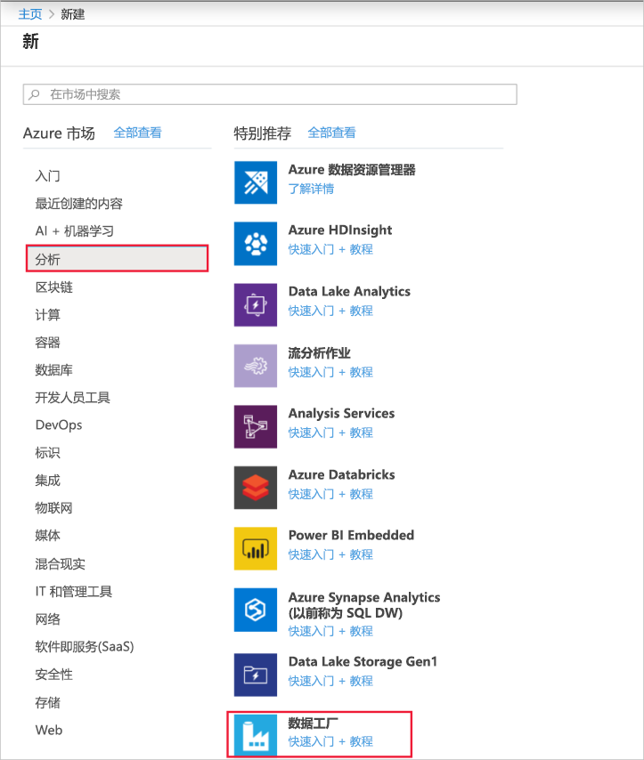
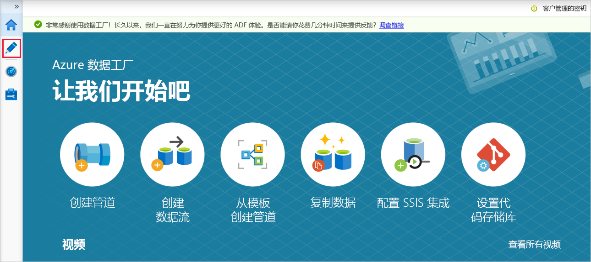

# <a name="copy-multiple-tables-in-bulk-by-using-azure-data-factory"></a>使用 Azure 数据工厂批量复制多个表

[!INCLUDE[appliesto-adf-asa-md](includes/appliesto-adf-asa-md.md)]

本教程演示如何**将 Azure SQL 数据库中的多个表复制到 Azure Synapse Analytics（前称为 SQL 数据仓库）** 。 在其他复制方案中，也可以应用相同的模式。 例如，将 SQL Server/Oracle 中的表复制到 Azure SQL 数据库/Azure Synapse Analytics（前称为 SQL 数据仓库）/Azure Blob，将 Blob 中的不同路径复制到 Azure SQL 数据库表。

> [!NOTE]
> - 如果你对 Azure 数据工厂不熟悉，请参阅 [Azure 数据工厂简介](introduction.md)。

从较高层面讲，本教程涉及以下步骤：

> [!div class="checklist"]
> * 创建数据工厂。
> * 创建 Azure SQL 数据库、Azure Synapse Analytics（前称为 SQL 数据仓库）和 Azure 存储链接服务。
> * 创建 Azure SQL 数据库和 Azure Synapse Analytics（前称为 SQL 数据仓库）数据集。
> * 创建一个管道用于查找要复制的表，创建另一个管道用于执行实际复制操作。 
> * 启动管道运行。
> * 监视管道和活动运行。

本教程使用 Azure 门户。 若要了解如何使用其他工具/SDK 创建数据工厂，请参阅[快速入门](quickstart-create-data-factory-dot-net.md)。 

## <a name="end-to-end-workflow"></a>端到端工作流
在本方案中，Azure SQL 数据库中包含一些需要复制到 Azure Synapse Analytics（前称为 SQL 数据仓库）的表。 下面是管道中发生的工作流中的逻辑步骤顺序：


* 第一个管道查找需要复制到接收器数据存储的表列表。  也可以维护一个元数据表用于列出要复制到接收器数据存储的所有表。 然后，该管道触发另一个管道，后者循环访问数据库中的每个表并执行数据复制操作。
* 第二个管道执行实际复制。 它使用表列表作为参数。 对于列表中的每个表，为获得最佳性能，会使用[通过 Blob 存储和 PolyBase 进行的分阶段复制](connector-azure-sql-data-warehouse.md#use-polybase-to-load-data-into-azure-sql-data-warehouse)，将 Azure SQL 数据库中的特定表复制到 Azure Synapse Analytics（前称为 SQL 数据仓库）中的相应表。 在本示例中，第一个管道传递表列表作为参数值。 

如果没有 Azure 订阅，请在开始之前创建一个[免费帐户](https://azure.microsoft.com/free/)。

## <a name="prerequisites"></a>先决条件
* **Azure 存储帐户**。 Azure 存储帐户用作批量复制操作中的过渡 Blob 存储。 
* **Azure SQL 数据库**。 此数据库包含源数据。 
* **Azure Synapse Analytics（前称为 SQL 数据仓库）** 。 此数据仓库包含从 SQL 数据库复制的数据。 

### <a name="prepare-sql-database-and-azure-synapse-analytics-formerly-sql-dw"></a>准备 SQL 数据库和 Azure Synapse Analytics（前称为 SQL 数据仓库）

**准备源 Azure SQL 数据库**：

遵循[创建 Azure SQL 数据库](../sql-database/sql-database-get-started-portal.md)一文，使用 Adventure Works LT 示例数据创建 Azure SQL 数据库。 本教程将此示例数据库中的所有表复制到 Azure Synapse Analytics（前称为 SQL 数据仓库）。

**准备接收器 Azure Synapse Analytics（前称为 SQL 数据仓库）** ：

1. 如果没有 Azure Synapse Analytics（前称为 SQL 数据仓库），请参阅[创建 SQL 数据仓库](../sql-data-warehouse/sql-data-warehouse-get-started-tutorial.md)一文了解创建步骤。

1. 在 Azure Synapse Analytics（前称为 SQL 数据仓库）中创建相应的表架构。 后面的步骤使用 Azure 数据工厂迁移/复制数据。

## <a name="azure-services-to-access-sql-server"></a>Azure 服务访问 SQL 服务器

对于 SQL 数据库和 Azure Synapse Analytics（前称为 SQL 数据仓库），请允许 Azure 服务访问 SQL 服务器。 确保 Azure SQL 服务器的“允许 Azure 服务和资源访问此服务器”设置为“打开”状态。   此设置允许数据工厂服务从 Azure SQL 数据库中读取数据，并将数据写入 Azure Synapse Analytics（前称为 SQL 数据仓库）。 

若要验证并启用此设置，请转到 Azure SQL 服务器 >“安全性”>“防火墙和虚拟网络”> 将“允许 Azure 服务和资源访问此服务器”设置为“打开”。  

## <a name="create-a-data-factory"></a>创建数据工厂
1. 启动 **Microsoft Edge** 或 **Google Chrome** Web 浏览器。 目前，仅 Microsoft Edge 和 Google Chrome Web 浏览器支持数据工厂 UI。
1. 转到 [Azure 门户](https://portal.azure.com)。 
1. 在 Azure 门户菜单的左侧，选择“创建资源” > “分析” > “数据工厂”。    
   
1. 在“新建数据工厂”页上，输入 ADFTutorialBulkCopyDF 作为**名称**。   
 
   Azure 数据工厂的名称必须 **全局唯一**。 如果看到名称字段的以下错误，请更改数据工厂的名称（例如，改为 yournameADFTutorialBulkCopyDF）。 有关数据工厂项目命名规则，请参阅[数据工厂 - 命名规则](naming-rules.md)一文。
  
       `Data factory name "ADFTutorialBulkCopyDF" is not available`
1. 选择要在其中创建数据工厂的 Azure **订阅**。 
1. 对于**资源组**，请执行以下步骤之一：
     
   - 选择“使用现有资源组”，并从下拉列表选择现有的资源组。  
   - 选择“新建”，并输入资源组的名称。    
         
     若要了解有关资源组的详细信息，请参阅 [使用资源组管理 Azure 资源](../azure-resource-manager/management/overview.md)。  
1. 选择“V2”  作为“版本”  。
1. 选择数据工厂的**位置**。 若要查看目前提供数据工厂的 Azure 区域的列表，请在以下页面上选择感兴趣的区域，然后展开“分析”  以找到“数据工厂”  ：[可用产品(按区域)](https://azure.microsoft.com/global-infrastructure/services/)。 数据工厂使用的数据存储（Azure 存储、Azure SQL 数据库，等等）和计算资源（HDInsight 等）可以位于其他区域中。
1. 单击“创建”。 
1. 创建完成后，选择“转到资源”导航到“数据工厂”页。   
   
1. 单击“创作和监视”磁贴，在单独的选项卡中启动数据工厂 UI 应用程序。 
1. 在“让我们开始吧”页上，切换到左侧面板中的“创作”选项卡，如下图所示：  

     

## <a name="create-linked-services"></a>创建链接服务
创建链接服务，将数据存储和计算链接到数据工厂。 链接服务包含的连接信息可供数据工厂服务用来在运行时连接到数据存储。 

在本教程中，请将 Azure SQL 数据库、Azure Synapse Analytics（前称为 SQL 数据仓库）和 Azure Blob 存储数据存储链接到数据工厂。 Azure SQL 数据库是源数据存储。 Azure Synapse Analytics（前称为 SQL 数据仓库）是接收器/目标数据存储。 在使用 PolyBase 将数据载入 Azure Synapse Analytics（前称为 SQL 数据仓库）之前，Azure Blob 存储用于暂存数据。 

### <a name="create-the-source-azure-sql-database-linked-service"></a>创建源 Azure SQL 数据库链接服务
在此步骤中，请创建一个链接服务，将 Azure SQL 数据库链接到数据工厂。 

1. 单击窗口底部的“连接”，然后单击工具栏上的“+ 新建”（“连接”按钮位于左栏底部的“工厂资源”下）。     

1. 在“新建链接服务”窗口中，选择“Azure SQL 数据库”，然后单击“继续”。    
1. 在“新建链接服务(Azure SQL 数据库)”窗口中执行以下步骤：  

    a. 对于“名称”，请输入 **AzureSqlDatabaseLinkedService**。 
    
    b. 对于“服务器名称”，请选择 Azure SQL Server 
    
    c. 对于“数据库名称”，请选择 Azure SQL 数据库。  
    
    d. 输入要连接到 Azure SQL 数据库的**用户名称**。 
    
    e. 输入对应于该用户的**密码**。 

    f. 若要使用指定的信息测试到 Azure SQL 数据库的连接，请单击“测试连接”。 
  
    g. 单击“创建”以保存链接服务。 


### <a name="create-the-sink-azure-synapse-analytics-formerly-sql-dw-linked-service"></a>创建接收器 Azure Synapse Analytics（前称为 SQL 数据仓库）链接服务

1. 在“连接”选项卡中，再次单击工具栏中的“+ 新建”。   
1. 在“新建链接服务”窗口中，选择“Azure Synapse Analytics (前称为 SQL 数据仓库)”，然后单击“继续”。    
1. 在“新建链接服务(Azure Synapse Analytics (前称为 SQL 数据仓库))”窗口中执行以下步骤：  
   
    a. 对于“名称”，请输入 **AzureSqlDWLinkedService**。 
     
    b. 对于“服务器名称”，请选择 Azure SQL Server 
     
    c. 对于“数据库名称”，请选择 Azure SQL 数据库。  
     
    d. 输入用于连接 Azure SQL 数据库的**用户名**。 
     
    e. 输入该用户的**密码**。 
     
    f. 若要使用指定的信息测试到 Azure SQL 数据库的连接，请单击“测试连接”。 
     
    g. 单击“创建”。 

### <a name="create-the-staging-azure-storage-linked-service"></a>创建过渡 Azure 存储链接服务
本教程使用 Azure Blob 存储作为临时过渡区域，以利用 PolyBase 来实现更好的复制性能。

1. 在“连接”选项卡中，再次单击工具栏中的“+ 新建”。   
1. 在“新建链接服务”窗口中，选择“Azure Blob 存储”，然后单击“继续”。    
1. 在“新建链接服务(Azure Blob 存储)”  窗口中执行以下步骤： 

    a. 输入 **AzureStorageLinkedService** 作为**名称**。                                                 
    b. 对于“存储帐户名称”，请选择 **Azure 存储帐户**。 
    
    c. 单击“创建”。 


## <a name="create-datasets"></a>创建数据集
在本教程中创建源和接收器数据集，用于指定数据的存储位置。 

输入数据集 **AzureSqlDatabaseDataset** 是指 **AzureSqlDatabaseLinkedService**。 链接服务指定用于连接到数据库的连接字符串。 数据集指定数据库的名称以及包含源数据的表。 

输出数据集 **AzureSqlDWDataset** 是指 **AzureSqlDWLinkedService**。 链接服务指定用于连接 Azure Synapse Analytics（前称为 SQL 数据仓库）的连接字符串。 数据集指定数据库以及要向其复制数据的表。 

在本教程中，源和目标 SQL 表未在数据集定义中硬编码， 而是通过 ForEach 活动在运行时将表的名称传递到“复制”活动。 

### <a name="create-a-dataset-for-source-sql-database"></a>为源 SQL 数据库创建数据集

1. 单击左窗格中的“+ (加号)”，然后单击“数据集”。   

    
1. 在“新建数据集”窗口中，选择“Azure SQL 数据库”，然后单击“继续”。    
    
1. 在“设置属性”  窗口的“名称”  下，输入 **AzureSqlDatabaseDataset**。 在“链接服务”下选择“AzureSqlDatabaseLinkedService”。   然后单击“确定”  。

1. 切换到“连接”  选项卡，然后选择任何表作为“表”。  此表是一个虚拟表。 在创建管道时指定一个针对源数据集的查询。 该查询用于从 Azure SQL 数据库提取数据。 也可以单击“编辑”复选框，然后输入 **dbo.dummyName** 作为表名称。  
 

### <a name="create-a-dataset-for-sink-azure-synapse-analytics-formerly-sql-dw"></a>为接收器 Azure Synapse Analytics（前称为 SQL 数据仓库）创建数据集

1. 单击左窗格中的“+ (加)”，然后单击“数据集”。   
1. 在“新建数据集”窗口中，选择“Azure Synapse Analytics (前称为 SQL 数据仓库)”，然后单击“继续”。   
1. 在“设置属性”  窗口的“名称”  下，输入 **AzureSqlDWDataset**。 在“链接服务”下选择“AzureSqlDWLinkedService”。   然后单击“确定”  。
1. 切换到“参数”  选项卡，单击“+ 新建”  ，并输入 **DWTableName** 作为参数名称。 如果从页面中复制/粘贴此名称，请确保 **DWTableName** 末尾没有**尾随空格字符**。
1. 切换到“连接”选项卡。  

    a. 对于“表”，请选中“编辑”选项。   在第一个表名称输入框中输入 **dbo**。 然后选择进入第二个输入框，单击下面的“添加动态内容”链接。  

    

    b. 在“添加动态内容”  页面中，单击“参数”  下的 **DWTAbleName** 以自动填充顶部的表达式文本框 `@dataset().DWTableName`，然后单击“完成”  。 数据集的 **tableName** 属性设置为一个特定值，该值作为 **DWTableName** 参数的自变量传递。 ForEach 活动循环访问一系列表，然后将这些表逐个传递到“复制”活动。 

    
 
## <a name="create-pipelines"></a>创建管道
在本教程中创建两个管道：**IterateAndCopySQLTables** 和 **GetTableListAndTriggerCopyData**。 

**GetTableListAndTriggerCopyData** 管道执行两项操作：

* 查找 Azure SQL 数据库系统表，以获取要复制的表列表。
* 触发管道 **IterateAndCopySQLTables** 来执行实际数据复制。

**IterateAndCopySQLTables** 管道接受表列表作为参数。 对于列表中的每个表，此管道会使用分阶段复制和 PolyBase，将 Azure SQL 数据库中的表的数据复制到 Azure Synapse Analytics（前称为 SQL 数据仓库）。

### <a name="create-the-pipeline-iterateandcopysqltables"></a>创建管道 IterateAndCopySQLTables

1. 在左窗格中单击“+ (加)”，然后单击“管道”。  

    
1. 在“常规”  选项卡中，指定 **IterateAndCopySQLTables** 作为名称。 

1. 切换到“参数”  选项卡，然后执行以下操作： 

    a. 单击“+ 新建”  。 
    
    b. 输入 **tableList** 作为参数**名称**。
    
    c. 选择“数组”  作为**类型**。

1. 在“活动”工具栏中  展开“迭代和条件”  ，然后将 **ForEach** 活动拖放到管道设计图面。 也可在“活动”工具箱中搜索活动。  

    a. 在底部的“常规”  选项卡中，输入 **IterateSQLTables** 作为**名称**。 

    b. 切换到“设置”  选项卡，单击“项”  的输入框，然后单击下面的“添加动态内容”  链接。 

    c. 在“添加动态内容”  页面中，折叠“系统变量”和“函数”部分，单击“参数”下的 **tableList**，这会将顶部的表达式文本框自动填充为 `@pipeline().parameter.tableList`。    然后单击“完成”  。 

    
    
    d. 切换到“活动”选项卡，单击**铅笔图标**向 **ForEach** 活动添加子活动。 
    

1. 在“活动”工具箱中，展开“移动并传输”，将“复制数据”活动拖放到管道设计器图面中。    请注意顶部的痕迹导航菜单。 **IterateAndCopySQLTable** 是管道名称，**IterateSQLTables** 是 ForEach 活动名称。 设计器处于活动范围内。 若要从 ForEach 编辑器切换回管道编辑器，可单击痕迹导航菜单中的链接。 

    

1. 切换到“源”  选项卡，然后执行以下步骤：

    1. 选择 **AzureSqlDatabaseDataset** 作为**源数据集**。 
    1. 为“使用查询”选择“查询”选项。   
    1. 单击“查询”  输入框，选择下方的“添加动态内容”  ，为**查询**输入以下表达式，然后选择“完成”。 

        ```sql
        SELECT * FROM [@{item().TABLE_SCHEMA}].[@{item().TABLE_NAME}]
        ``` 


1. 切换到“接收器”  选项卡，然后执行以下步骤： 

    1. 选择 **AzureSqlDWDataset** 作为**接收器数据集**。
    1. 单击 DWTableName 参数的“值”输入框，选择下方的“添加动态内容”  ，输入 `[@{item().TABLE_SCHEMA}].[@{item().TABLE_NAME}]` 表达式作为脚本，然后选择“完成”。 
    1. 对于“复制方法”，请选择“PolyBase”。  
    1. 清除“使用类型默认值”选项。  
    1. 单击“复制前脚本”  输入框，选择下方的“添加动态内容”  ，输入以下表达式作为脚本，然后选择“完成”。  

        ```sql
        TRUNCATE TABLE [@{item().TABLE_SCHEMA}].[@{item().TABLE_NAME}]
        ```

        
1. 切换到“设置”选项卡，然后执行以下步骤：  

    1. 选中“启用暂存”  对应的复选框。
    1. 选择 **AzureStorageLinkedService** 作为**存储帐户链接服务**。

1. 若要验证管道设置，请单击管道工具栏上的“验证”  。 确保没有任何验证错误。 若要关闭“管道验证报告”，  请单击 **>>** 。

### <a name="create-the-pipeline-gettablelistandtriggercopydata"></a>创建管道 GetTableListAndTriggerCopyData

此管道执行两项操作：

* 查找 Azure SQL 数据库系统表，以获取要复制的表列表。
* 触发管道“IterateAndCopySQLTables”来执行实际数据复制。

1. 在左窗格中单击“+ (加)”，然后单击“管道”。  
1. 在“常规”选项卡中，将管道的名称更改为 **GetTableListAndTriggerCopyData**。  

1. 在“活动”工具箱中展开“常规”，   将“查找”  活动拖放到管道设计器图面，然后执行以下步骤：

    1. 输入 **LookupTableList** 作为**名称**。 
    1. 输入“从 Azure SQL 数据库检索表格列表”  作为**说明**。

1. 切换到“设置”选项卡，然后执行以下步骤： 

    1. 选择 **AzureSqlDatabaseDataset** 作为**源数据集**。 
    1. 为“使用查询”选择“查询”。   
    1. 为“查询”输入以下 SQL 查询。 

        ```sql
        SELECT TABLE_SCHEMA, TABLE_NAME FROM information_schema.TABLES WHERE TABLE_TYPE = 'BASE TABLE' and TABLE_SCHEMA = 'SalesLT' and TABLE_NAME <> 'ProductModel'
        ```
    1. 清除“仅第一行”字段对应的复选框。 

        
1. 将“执行管道”活动从“活动”工具箱拖放到管道设计器图面，然后将名称设置为 **TriggerCopy**。 

1. 若要将“查找”  活动**连接**到“执行管道”活动，  请将附加到“查找”活动的**绿框**拖至“执行管道”活动左侧。

    

1. 切换到“执行管道”活动的“设置”选项卡，并执行以下步骤：   

    1. 选择 **IterateAndCopySQLTables** 作为**调用的管道**。 
    1. 展开“高级”部分，然后清除“等待完成”对应的复选框。  
    1. 在“参数”部分单击“+ 新建”。   
    1. 输入 **tableList** 作为参数**名称**。
    1. 单击“值”输入框，选择下方的“添加动态内容”  ，输入 `@activity('LookupTableList').output.value` 作为表名值，然后选择“完成”  。 你是在将“查找”活动的结果列表设置为第二个管道的输入。 结果列表包含一系列表，这些表的数据需要复制到目标。 

        

1. 若要验证管道，请单击工具栏中的“验证”  。 确认没有任何验证错误。 若要关闭“管道验证报告”，  请单击 **>>** 。

1. 若要将实体（数据集、管道等）发布到数据工厂服务，请单击窗口顶部的“全部发布”。  等待发布成功。 

## <a name="trigger-a-pipeline-run"></a>触发管道运行

1. 转到管道 **GetTableListAndTriggerCopyData**，单击顶部管道工具栏上的“添加触发器”，然后单击“立即触发”。   

1. 确认“管道运行”页上的运行，然后选择“完成”。  

## <a name="monitor-the-pipeline-run"></a>监视管道运行

1. 切换到“监视”选项卡。  单击“刷新”  ，直至看到解决方案中两个管道的运行。 持续刷新列表，直至看到“成功”状态。  

1. 若要查看与 **GetTableListAndTriggerCopyData** 管道关联的活动运行，请单击该管道的管道名称链接。 此时会看到该管道运行的两个活动运行。 
    
1. 若要查看“查找”活动的输出，请单击“活动名称”列下该活动旁边的“输出”链接。    可以最大化和还原“输出”窗口。  查看后，单击“X”关闭“输出”窗口。  

    ```json
    {
        "count": 9,
        "value": [
            {
                "TABLE_SCHEMA": "SalesLT",
                "TABLE_NAME": "Customer"
            },
            {
                "TABLE_SCHEMA": "SalesLT",
                "TABLE_NAME": "ProductDescription"
            },
            {
                "TABLE_SCHEMA": "SalesLT",
                "TABLE_NAME": "Product"
            },
            {
                "TABLE_SCHEMA": "SalesLT",
                "TABLE_NAME": "ProductModelProductDescription"
            },
            {
                "TABLE_SCHEMA": "SalesLT",
                "TABLE_NAME": "ProductCategory"
            },
            {
                "TABLE_SCHEMA": "SalesLT",
                "TABLE_NAME": "Address"
            },
            {
                "TABLE_SCHEMA": "SalesLT",
                "TABLE_NAME": "CustomerAddress"
            },
            {
                "TABLE_SCHEMA": "SalesLT",
                "TABLE_NAME": "SalesOrderDetail"
            },
            {
                "TABLE_SCHEMA": "SalesLT",
                "TABLE_NAME": "SalesOrderHeader"
            }
        ],
        "effectiveIntegrationRuntime": "DefaultIntegrationRuntime (East US)",
        "effectiveIntegrationRuntimes": [
            {
                "name": "DefaultIntegrationRuntime",
                "type": "Managed",
                "location": "East US",
                "billedDuration": 0,
                "nodes": null
            }
        ]
    }
    ```    
1. 若要切换回到“管道运行”视图，请单击痕迹导航菜单顶部的“所有管道运行”链接。   单击“IterateAndCopySQLTables”链接（在“管道名称”列下）查看该管道的活动运行。   请注意，每个表在“查找”活动输出中都有一个“复制”活动运行。   

1. 确认数据已复制到在本教程中使用的目标 Azure Synapse Analytics（前称为 SQL 数据仓库）。 

## <a name="next-steps"></a>后续步骤
已在本教程中执行了以下步骤： 

> [!div class="checklist"]
> * 创建数据工厂。
> * 创建 Azure SQL 数据库、Azure Synapse Analytics（前称为 SQL 数据仓库）和 Azure 存储链接服务。
> * 创建 Azure SQL 数据库和 Azure Synapse Analytics（前称为 SQL 数据仓库）数据集。
> * 创建一个管道用于查找要复制的表，创建另一个管道用于执行实际复制操作。 
> * 启动管道运行。
> * 监视管道和活动运行。

转到以下教程，了解如何以增量方式将数据从源复制到目标：
> [!div class="nextstepaction"]
>[以增量方式复制数据](tutorial-incremental-copy-portal.md)
