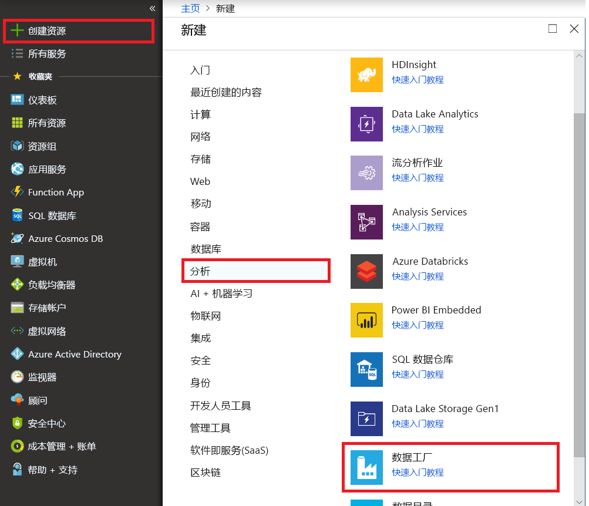

# <a name="branching-and-chaining-activities-in-a-data-factory-pipeline"></a>数据工厂管道中的分支和链接活动

[!INCLUDE[appliesto-adf-xxx-md](includes/appliesto-adf-xxx-md.md)]

在本教程中，我们将创建一个数据工厂管道来展示某些控制流功能。 此管道执行从 Azure Blob 存储容器中某个容器到同一存储帐户中另一个容器的简单复制。 如果复制活动成功，该管道会在告知成功结果的电子邮件中发送成功复制操作的详细信息（例如写入的数据量）。 如果复制活动失败，该管道会在告知失败结果的电子邮件中发送复制失败的详细信息（例如错误消息）。 整个教程讲解了如何传递参数。

方案的综合概述：

在本教程中执行以下步骤：

> [!div class="checklist"]
> * 创建数据工厂。
> * 创建 Azure 存储链接服务。
> * 创建 Azure Blob 数据集
> * 创建包含“复制”活动和“Web”活动的管道
> * 将活动的输出发送到后续活动
> * 利用参数传递和系统变量
> * 启动管道运行
> * 监视管道和活动运行

本教程使用 Azure 门户。 可以使用其他机制来与 Azure 数据工厂交互，具体请参阅目录中的“快速入门”。

## <a name="prerequisites"></a>必备条件

* **Azure 订阅**。 如果没有 Azure 订阅，请在开始之前创建一个[免费](https://azure.microsoft.com/free/)帐户。
* **Azure 存储帐户**。 可将 Blob 存储用作**源**数据存储。 如果没有 Azure 存储帐户，请参阅[创建存储帐户](../storage/common/storage-account-create.md)一文获取创建步骤。
* **Azure SQL 数据库**。 将数据库用作**接收器**数据存储。 如果没有 Azure SQL 数据库，请参阅[创建 Azure SQL 数据库](../sql-database/sql-database-get-started-portal.md)一文获取创建步骤。

### <a name="create-blob-table"></a>创建 Blob 表

1. 启动记事本。 复制以下文本并在磁盘上将其另存为 **input.txt** 文件。

    ```
    John,Doe
    Jane,Doe
    ```
2. 使用 [Azure 存储资源管理器](https://storageexplorer.com/)等工具执行以下步骤：
    1. 创建 **adfv2branch** 容器。
    2. 在 **adfv2branch** 容器中创建 **input** 文件夹。
    3. 将 **input.txt** 文件上传到该容器。

## <a name="create-email-workflow-endpoints"></a>创建电子邮件工作流终结点
若要从管道触发电子邮件发送，请使用[逻辑应用](../logic-apps/logic-apps-overview.md)来定义工作流。 有关创建逻辑应用工作流的详细信息，请参阅[如何创建逻辑应用](../logic-apps/quickstart-create-first-logic-app-workflow.md)。

### <a name="success-email-workflow"></a>成功电子邮件工作流
创建名为 `CopySuccessEmail` 的逻辑应用工作流。 将工作流触发器定义为 `When an HTTP request is received`，并添加 `Office 365 Outlook – Send an email` 操作。


对于请求触发器，请在 `Request Body JSON Schema` 中填写以下 JSON：

```json
{
    "properties": {
        "dataFactoryName": {
            "type": "string"
        },
        "message": {
            "type": "string"
        },
        "pipelineName": {
            "type": "string"
        },
        "receiver": {
            "type": "string"
        }
    },
    "type": "object"
}
```

逻辑应用设计器中的“请求”应如下图所示：


对于“发送电子邮件”操作，请使用传入请求正文 JSON 架构的属性来自定义如何设置电子邮件的格式。  以下是示例：


保存工作流。 记下成功电子邮件工作流的 HTTP Post 请求 URL：

```
//Success Request Url
https://prodxxx.eastus.logic.azure.com:443/workflows/000000/triggers/manual/paths/invoke?api-version=2016-10-01&sp=%2Ftriggers%2Fmanual%2Frun&sv=1.0&sig=000000
```

### <a name="fail-email-workflow"></a>失败电子邮件工作流
遵循相同的步骤创建另一个 **CopyFailEmail** 逻辑应用工作流。 在请求触发器中，`Request Body JSON schema` 是相同的。 更改电子邮件的格式（例如 `Subject`）即可定制失败电子邮件。 以下是示例：


保存工作流。 记下失败电子邮件工作流的 HTTP Post 请求 URL：

```
//Fail Request Url
https://prodxxx.eastus.logic.azure.com:443/workflows/000000/triggers/manual/paths/invoke?api-version=2016-10-01&sp=%2Ftriggers%2Fmanual%2Frun&sv=1.0&sig=000000
```

现在，应有两个工作流 URL：

```
//Success Request Url
https://prodxxx.eastus.logic.azure.com:443/workflows/000000/triggers/manual/paths/invoke?api-version=2016-10-01&sp=%2Ftriggers%2Fmanual%2Frun&sv=1.0&sig=000000

//Fail Request Url
https://prodxxx.eastus.logic.azure.com:443/workflows/000000/triggers/manual/paths/invoke?api-version=2016-10-01&sp=%2Ftriggers%2Fmanual%2Frun&sv=1.0&sig=000000
```

## <a name="create-a-data-factory"></a>创建数据工厂

1. 启动 **Microsoft Edge** 或 **Google Chrome** Web 浏览器。 目前，仅 Microsoft Edge 和 Google Chrome Web 浏览器支持数据工厂 UI。
1. 在左侧菜单中，选择“创建资源”   > “数据 + 分析”   > “数据工厂”  ：

   

2. 在“新建数据工厂”  页中，输入 **ADFTutorialDataFactory** 作为**名称**。

     

   Azure 数据工厂的名称必须 **全局唯一**。 如果收到错误，请更改数据工厂的名称（例如改为 yournameADFTutorialDataFactory），并重新尝试创建。 有关数据工厂项目命名规则，请参阅[数据工厂 - 命名规则](naming-rules.md)一文。

       `Data factory name “ADFTutorialDataFactory” is not available`
3. 选择要在其中创建数据工厂的 Azure **订阅**。
4. 对于**资源组**，请执行以下步骤之一：

      - 选择“使用现有资源组”，并从下拉列表选择现有的资源组。 
      - 选择“新建”，并输入资源组的名称。    
         
        若要了解有关资源组的详细信息，请参阅 [使用资源组管理 Azure 资源](../azure-resource-manager/management/overview.md)。  
4. 选择“V2”  作为“版本”  。
5. 选择数据工厂的**位置**。 下拉列表中仅显示支持的位置。 数据工厂使用的数据存储（Azure 存储、Azure SQL 数据库，等等）和计算资源（HDInsight 等）可以位于其他区域中。
6. 选择“固定到仪表板”  。     
7. 单击“创建”。       
8. 在仪表板上，会看到状态为“正在部署数据工厂”的以下磁贴。 

    
9. 创建完成后，可以看到图中所示的“数据工厂”页。 

   
10. 单击“创作和监视”磁贴，在单独的选项卡中启动 Azure 数据工厂用户界面 (UI)。 


## <a name="create-a-pipeline"></a>创建管道
本步骤创建包含一个“复制”活动和两个“Web”活动的管道。 使用以下功能创建管道：

- 数据集访问的管道参数。
- 用于调用逻辑应用工作流发送成功/失败电子邮件的 Web 活动。
- 将一个活动连接到另一个活动（成功和失败时）
- 使用一个活动的输出作为后续活动的输入

1. 在数据工厂 UI 的“入门”页中，单击“创建管道”磁贴。    

   
3. 在管道的属性窗口中切换到“参数”选项卡，并使用“新建”按钮添加字符串类型的以下三个参数：sourceBlobContainer、sinkBlobContainer 和 receiver。  

    - **sourceBlobContainer** – 源 Blob 数据集使用的管道中的参数。
    - **sinkBlobContainer** – 接收器 Blob 数据集使用的管道中的参数。
    - **receiver** – 此参数由管道中的两个 Web 活动用来向其电子邮件地址已通过此参数指定的接收方发送成功或失败电子邮件。

   
4. 在“活动”工具箱中展开“数据流”，将“复制”活动拖放到管道设计器图面。   

   
5. 在底部“复制”活动的“属性”窗口中切换到“源”选项卡，然后单击“+ 新建”。     此步骤创建复制活动的源数据集。

   
6. 在“新建数据集”窗口中，选择“Azure Blob 存储”，然后单击“完成”。   

   
7. 此时会显示标题为“AzureBlob1”的新**选项卡**。  将数据集的名称更改为 **SourceBlobDataset**。

   
8. 在“属性”窗口中切换到“连接”选项卡，然后针对“链接服务”单击“新建”。    此步骤创建一个链接服务，用于将 Azure 存储帐户链接到数据工厂。

   
9. 在“新建链接服务”  窗口中执行以下步骤：

    1. 输入 **AzureStorageLinkedService** 作为**名称**。
    2. 选择自己 Azure 存储帐户作为**存储帐户名称**。
    3. 单击“ **保存**”。

   
12. 输入 `@pipeline().parameters.sourceBlobContainer` 作为文件夹，输入 `emp.txt` 作为文件名。 使用 sourceBlobContainer 管道参数设置数据集的文件夹路径。

   
13. 切换到“管道”选项卡，或单击树状视图中的管道。  确认为“源数据集”选择了“SourceBlobDataset”。  

    
13. 在属性窗口中切换到“接收器”选项卡，针对“接收器数据集”单击“+ 新建”。    像创建源数据集一样，在此步骤中创建复制活动的接收器数据集。

    
14. 在“新建数据集”窗口中，选择“Azure Blob 存储”，然后单击“完成”。   
15. 在数据集的“常规”设置页中，输入 **SinkBlobDataset** 作为**名称**。
16. 切换到“连接”  选项卡，然后执行以下步骤：

    1. 为“LinkedService”选择“AzureStorageLinkedService”。  
    2. 输入 `@pipeline().parameters.sinkBlobContainer` 作为文件夹。
    1. 输入 `@CONCAT(pipeline().RunId, '.txt')` 作为文件名。 该表达式使用当前管道运行的 ID 作为文件名。 有关支持的系统变量和表达式列表，请参阅[系统变量](control-flow-system-variables.md)和[表达式语言](control-flow-expression-language-functions.md)。

        
17. 切换到顶部的“管道”选项卡。  在“活动”工具箱中展开“常规”，将“Web”活动拖放到管道设计器图面。    将活动的名称设置为 **SendSuccessEmailActivity**。 Web 活动允许调用任何 REST 终结点。 有关该活动的详细信息，请参阅 [Web 活动](control-flow-web-activity.md)。 此管道使用 Web 活动调用逻辑应用电子邮件工作流。

    
18. 从“常规”选项卡切换到“设置”选项卡，然后执行以下步骤：  
    1. 对于“URL”，请指定用于发送成功电子邮件的逻辑应用工作流的 URL。   
    2. 为“方法”选择“POST”。  
    3. 在“标头”部分中单击“+ 添加标头”链接。  
    4. 添加标头 **Content-Type** 并将其设置为 **application/json**。
    5. 为“正文”指定以下 JSON。 

        ```json
        {
            "message": "@{activity('Copy1').output.dataWritten}",
            "dataFactoryName": "@{pipeline().DataFactory}",
            "pipelineName": "@{pipeline().Pipeline}",
            "receiver": "@pipeline().parameters.receiver"
        }
        ```
        消息正文包含以下属性：

       - 消息 – `@{activity('Copy1').output.dataWritten` 的传递值。 访问前一复制活动的属性，并传递 dataWritten 的值。 失败时，传递错误输出而不是 `@{activity('CopyBlobtoBlob').error.message`。
       - 数据工厂名称 – `@{pipeline().DataFactory}` 的传递值。这是一个系统变量，用于访问相应的数据工厂名称。 有关系统变量的列表，请参阅[系统变量](control-flow-system-variables.md)一文。
       - 管道名称 – `@{pipeline().Pipeline}` 的传递值。 这也是系统变量，用于访问相应的管道名称。
       - 接收方 – 传递 "\@pipeline().parameters.receiver") 的值。 访问管道参数。

                  
19. 将“复制”活动旁边的绿色按钮拖放到“Web”活动，以便将“复制”活动连接到“Web”活动。  

    
20. 将“Web”活动从“活动”工具箱拖放到管道设计器图面，并将**名称**设置为 **SendFailureEmailActivity**。

    
21. 切换到“设置”选项卡，然后执行以下步骤： 

    1. 对于“URL”，请指定用于发送失败电子邮件的逻辑应用工作流的 URL。   
    2. 为“方法”选择“POST”。  
    3. 在“标头”部分中单击“+ 添加标头”链接。  
    4. 添加标头 **Content-Type** 并将其设置为 **application/json**。
    5. 为“正文”指定以下 JSON。 

        ```json
        {
            "message": "@{activity('Copy1').error.message}",
            "dataFactoryName": "@{pipeline().DataFactory}",
            "pipelineName": "@{pipeline().Pipeline}",
            "receiver": "@pipeline().parameters.receiver"
        }
        ```

                 
22. 在管道设计器中选择“复制”活动，单击 **+->** 按钮，然后选择“错误”。  

    
23. 将“复制”活动旁边的**红色**按钮拖放到第二个“Web”活动 **SendFailureEmailActivity**。 可以四处移动活动，使管道如下图所示：

    
24. 若要验证管道，请单击工具栏中的“验证”按钮。  单击 **>>** 按钮关闭“管道验证输出”窗口。

    
24. 若要将实体（数据集、管道等）发布到数据工厂服务，请选择“全部发布”。  等待“已成功发布”消息出现。 

    

## <a name="trigger-a-pipeline-run-that-succeeds"></a>触发成功的管道运行
1. 若要**触发**某个管道运行，请在工具栏中单击“触发器”，然后单击“立即触发”。  

    
2. 在“管道运行”窗口中执行以下步骤： 

    1. 为 **sourceBlobContainer** 参数输入 **adftutorial/adfv2branch/input**。
    2. 为 **sinkBlobContainer** 参数输入 **adftutorial/adfv2branch/output**。
    3. 输入**接收方**的**电子邮件地址**。
    4. 单击“完成” 

        

## <a name="monitor-the-successful-pipeline-run"></a>监视成功的管道运行

1. 若要监视管道运行，请切换到左侧的“监视”选项卡。  可以看到手动触发的管道运行。 使用“刷新”按钮刷新列表。 

    
2. 若要**查看**与此管道运行关联的活动运行，请单击“操作”列中的第一个链接。  单击顶部的“管道”可以切换回到上一视图。  使用“刷新”按钮刷新列表。 

    

## <a name="trigger-a-pipeline-run-that-fails"></a>触发失败的管道运行
1. 在左侧切换到“编辑”选项卡。 
2. 若要**触发**某个管道运行，请在工具栏中单击“触发器”，然后单击“立即触发”。  
3. 在“管道运行”窗口中执行以下步骤： 

    1. 为 **sourceBlobContainer** 参数输入 **adftutorial/dummy/input**。 请确保 adftutorial 容器中不存在 dummy 文件夹。
    2. 为 **sinkBlobContainer** 参数输入 **adftutorial/dummy/output**。
    3. 输入**接收方**的**电子邮件地址**。
    4. 单击“完成”  。

## <a name="monitor-the-failed-pipeline-run"></a>监视失败的管道运行

1. 若要监视管道运行，请切换到左侧的“监视”选项卡。  可以看到手动触发的管道运行。 使用“刷新”按钮刷新列表。 

    
2. 单击管道运行对应的“错误”链接可查看有关错误的详细信息。 

    
2. 若要**查看**与此管道运行关联的活动运行，请单击“操作”列中的第一个链接。  使用“刷新”按钮刷新列表。  请注意，管道中的“复制”活动失败。 “Web”活动已成功将失败电子邮件发送到指定的接收方。

    
4. 在“操作”列中单击“错误”链接可查看有关错误的详细信息。  

    

## <a name="next-steps"></a>后续步骤
已在本教程中执行了以下步骤：

> [!div class="checklist"]
> * 创建数据工厂。
> * 创建 Azure 存储链接服务。
> * 创建 Azure Blob 数据集
> * 创建包含复制活动和 Web 活动的管道
> * 将活动的输出发送到后续活动
> * 利用参数传递和系统变量
> * 启动管道运行
> * 监视管道和活动运行

现在可以转到“概念”部分详细了解 Azure 数据工厂。
> [!div class="nextstepaction"]
>[管道和活动](concepts-pipelines-activities.md)
