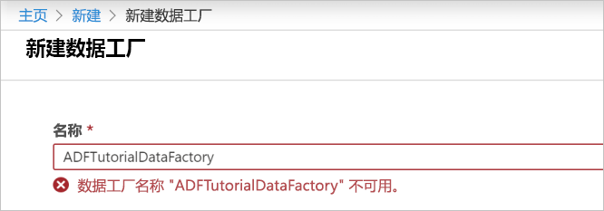
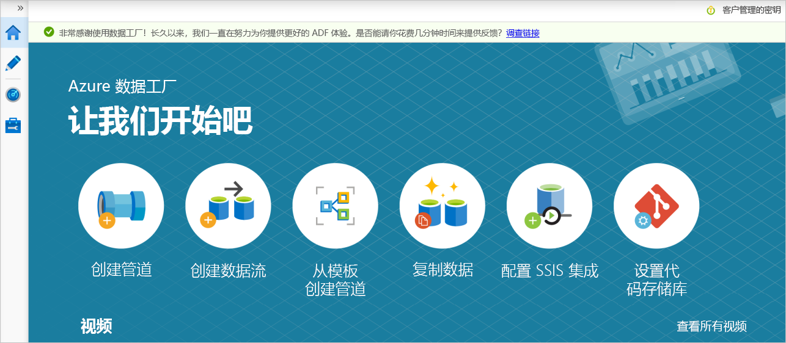

# 使用复制数据工具以增量方式复制基于 LastModifiedDate 的新文件和更改的文件

在本教程中，你将使用 Azure 门户来创建数据工厂。 然后，将使用复制数据工具创建一个管道，该管道基于其从 Azure Blob 存储到 Azure Blob 存储的**LastModifiedDate**增量复制新文件和更改的文件。

通过执行此操作，ADF 将扫描源存储中的所有文件，通过 LastModifiedDate 应用文件筛选器，并仅自上次到目标存储的时间复制新文件和更新的文件。  请注意，如果让 ADF 扫描大量文件，但只将一些文件复制到目标，则仍会因为文件扫描所需的持续时间很长。   

> [!NOTE]
> 如果对 Azure 数据工厂不熟悉，请参阅 [Azure 数据工厂简介](introduction.md)。

在本教程中，您将执行以下任务：

> [!div class="checklist"]
> * 创建数据工厂。
> * 使用“复制数据”工具创建管道。
> * 监视管道和活动运行。

## 必备组件

* **Azure 订阅**：如果还没有 Azure 订阅，可以在开始前创建一个[免费帐户](https://azure.microsoft.com/free/)。
* **Azure 存储帐户**：使用 Blob 存储作为_源_和_接收器_数据存储。 如果没有 Azure 存储帐户，请参阅[创建存储帐户](../storage/common/storage-quickstart-create-account.md)中的说明。

### 在 Blob 存储中创建两个容器

通过执行以下步骤，为本教程准备你的 Blob 存储。

1. 创建一个名为**source**的容器。 您可以使用各种工具来执行此任务，例如[Azure 存储资源管理器](https://storageexplorer.com/)。

2. 创建一个名为**destination**的容器。 

## 创建数据工厂

1. 在左侧菜单中，选择“创建资源” > “数据 + 分析” > “数据工厂”： 
   
   

2. 在“新建数据工厂”页的“名称”下输入 **ADFTutorialDataFactory**。 
 
   数据工厂的名称必须全局唯一。 可能会收到以下错误消息：
   
   

   如果收到有关名称值的错误消息，请为数据工厂输入另一名称。 例如，使用名称 _**yourname**_ **ADFTutorialDataFactory**。 有关数据工厂项目的命名规则，请参阅[数据工厂命名规则](naming-rules.md)。
3. 选择要在其中创建新数据工厂的 Azure**订阅**。 
4. 对于“资源组”，请执行以下步骤之一：
     
    * 选择“使用现有资源组”，并从下拉列表选择现有的资源组。

    * 选择“新建”，并输入资源组的名称。 
         
    若要了解资源组，请参阅[使用资源组管理 Azure 资源](../azure-resource-manager/management/overview.md)。

5. 在 "**版本**" 下，选择**V2**。
6. 在“位置”下选择数据工厂的位置。 下拉列表中仅显示支持的位置。 数据工厂使用的数据存储（例如 Azure 存储和 SQL 数据库）和计算（例如，Azure HDInsight）可以位于其他位置和区域。
7. 选择“固定到仪表板”。 
8. 选择“创建”。
9. 在仪表板上，请参阅**部署数据工厂**磁贴以查看进程状态。

    
10. 创建完以后，会显示“数据工厂”主页。
   
    
11. 若要在单独的选项卡上打开 Azure 数据工厂用户界面（UI），请选择 "**创作 & 监视器**" 磁贴。 

## 使用“复制数据”工具创建管道

1. 在 "**开始**" 页上，选择**复制数据**标题以打开复制数据工具。 

   
   
2. 在 "**属性**" 页上，执行以下步骤：

    a.在“解决方案资源管理器”中，右键单击项目文件夹下的“引用”文件夹，然后单击“添加引用”。 在 "**任务名称**" 下输入**DeltaCopyFromBlobPipeline**。

    b.保留“数据库类型”设置，即设置为“共享”。 在**任务节奏**或**任务计划**下，选择 "**按计划定期运行**"。

    c. 在 "**触发器类型**" 下，选择 "**翻转窗口**"。
    
    d.单击“下一步”。 在 "**重复周期**" 下，输入**15 分钟**。 
    
    e.在“新建 MySQL 数据库”边栏选项卡中，接受法律条款，然后单击“确定”。 选择“**下一页**”。 
    
    数据工厂 UI 将使用指定的任务名称创建一个管道。 

    
    
3. 在“源数据存储”页上，完成以下步骤：

    a.在“解决方案资源管理器”中，右键单击项目文件夹下的“引用”文件夹，然后单击“添加引用”。 选择 " **+ 新建连接**" 以添加连接。
    
    

    b.保留“数据库类型”设置，即设置为“共享”。 从库中选择“Azure Blob 存储”，然后选择“继续”。
    
    

    c. 在 "**新建链接服务**" 页上，从 "**存储帐户名称**" 列表中选择存储帐户，然后选择 "**完成**"。
    
    
    
    d.单击“下一步”。 选择新创建的链接服务，然后选择 "**下一步**"。 
    
   

4. 在“选择输入文件或文件夹”页中完成以下步骤：
    
    a.在“解决方案资源管理器”中，右键单击项目文件夹下的“引用”文件夹，然后单击“添加引用”。 浏览并选择**源**文件夹，然后选择 "**选择**"。
    
    
    
    b.保留“数据库类型”设置，即设置为“共享”。 在 "**文件加载行为**" 下，选择 "**增量加载： LastModifiedDate**"。
    
    
    
    c. 检查**二进制副本**，然后选择 "**下一步**"。
    
     
     
5. 在 "**目标数据存储**" 页上，选择 " **AzureBlobStorage**"。 这是与源数据存储相同的存储帐户。 然后，选择“下一步”。

    
    
6. 在“选择输出文件或文件夹”页中完成以下步骤：
    
    a.在“解决方案资源管理器”中，右键单击项目文件夹下的“引用”文件夹，然后单击“添加引用”。 浏览并选择**目标**文件夹，然后选择 "**选择**"。
    
    
    
    b.保留“数据库类型”设置，即设置为“共享”。 选择“**下一页**”。
    
     
    
7. 在“设置”页中，选择“下一步”。 

    
    
8. 在 "**摘要**" 页上，查看设置，然后选择 "**下一步**"。

    
    
9. 在“部署”页中，选择“监视”可以监视管道（任务）。

    
    
10. 请注意，界面中已自动选择左侧的“监视”选项卡。 “操作”列中包含用于查看活动运行详细信息以及用于重新运行管道的链接。 选择 "**刷新**" 以刷新列表，并在 "**操作**" 列中选择 "**查看活动运行**" 链接。 

    

11. 管道中只有一个活动（复制活动），因此只会看到一个条目。 有关复制操作的详细信息，请选择“操作”列中的“详细信息”链接（眼镜图标）。 

    
    
    由于 Blob 存储帐户的**源**容器中不存在任何文件，因此不会在 blob 存储帐户中看到任何文件复制到**目标**容器。
    
    
    
12. 创建一个空的文本文件并将其命名为**file1**。 将此文本文件上传到存储帐户中的**源**容器。 可以使用各种工具（例如 [Azure 存储资源管理器](https://storageexplorer.com/)）来执行这些任务。   

    
    
13. 若要返回到 "**管道运行**" 视图，请选择 "**所有管道运行**"，然后等待自动触发同一管道。  

    

14. 选择 "**查看活动运行**" 以查看第二个管道运行的时间。 然后，查看详细信息，方法与第一个管道运行的方式相同。  

    

    你将看到一个文件（file1）已**从源**容器复制到你的 Blob 存储帐户的**目标**容器。
    
    
    
15. 创建另一个空文本文件并将其命名为**file2**。 将此文本文件上传到 Blob 存储帐户中的**源**容器。   
    
16. 对于此第二个文本文件，请重复步骤13和14。 你将看到，在下一个管道运行中，只有新文件（file2）已**从源**容器复制到存储帐户的**目标**容器。  
    
    

    还可以通过使用[Azure 存储资源管理器](https://storageexplorer.com/)扫描文件来对此进行验证。
    
    

    
## 后续步骤
转到以下教程，了解如何使用 Azure 上的 Apache Spark 群集来转换数据：

> [!div class="nextstepaction"]
>[使用 Apache Spark 群集转换云中的数据](tutorial-transform-data-spark-portal.md)