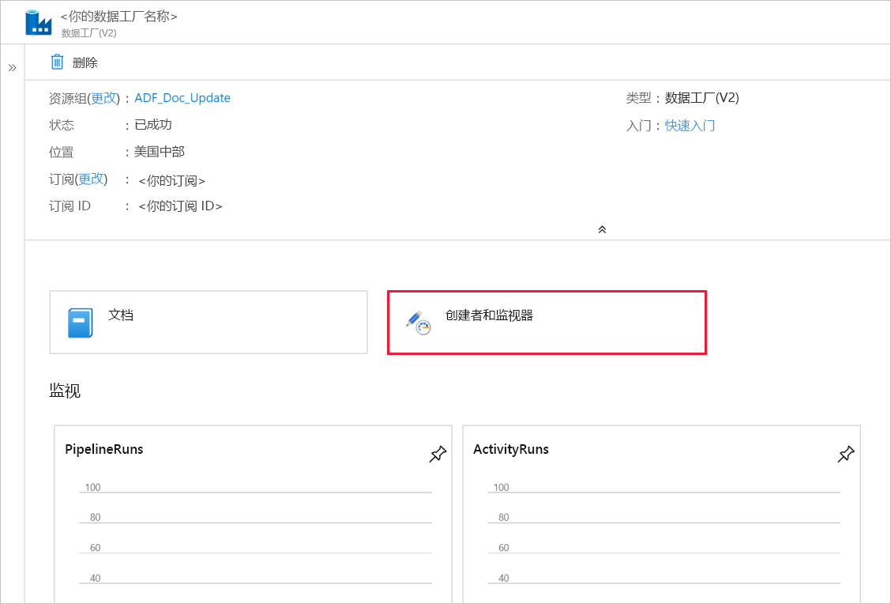

# <a name="incrementally-load-data-from-multiple-tables-in-sql-server-to-an-azure-sql-database"></a>以增量方式将数据从 SQL Server 中的多个表加载到 Azure SQL 数据库

[!INCLUDE[appliesto-adf-xxx-md](includes/appliesto-adf-xxx-md.md)]

在本教程中，请创建一个带管道的 Azure 数据工厂，将增量数据从本地 SQL Server 中的多个表加载到 Azure SQL 数据库。    

在本教程中执行以下步骤：

> [!div class="checklist"]
> * 准备源和目标数据存储。
> * 创建数据工厂。
> * 创建自我托管的集成运行时。
> * 安装 Integration Runtime。 
> * 创建链接服务。 
> * 创建源、接收器和水印数据集。
> * 创建、运行和监视管道。
> * 查看结果。
> * 在源表中添加或更新数据。
> * 重新运行和监视管道。
> * 查看最终结果。

## <a name="overview"></a>概述
下面是创建此解决方案所要执行的重要步骤： 

1. **选择水印列**。
    
    在源数据存储中为每个表选择一个列，该列可用于确定每个运行的新记录或已更新记录。 通常，在创建或更新行时，此选定列中的数据（例如 last_modify_time 或 ID）会不断递增。 此列中的最大值用作水印。

1. **准备用于存储水印值的数据存储**。   
    
    本教程在 SQL 数据库中存储水印值。

1. **创建包含以下活动的管道**： 
    
    a. 创建一个 ForEach 活动，循环访问一个列表，其中的源表名称是作为参数传递到管道的。 对于每个源表，它会调用以下活动，为该表执行增量加载。

    b. 创建两个 Lookup 活动。 使用第一个 Lookup 活动检索上一个水印值。 使用第二个 Lookup 活动检索新的水印值。 这些水印值会传递到 Copy 活动。

    c. 创建 Copy 活动，用于复制源数据存储中其水印列值大于旧水印值但小于新水印值的行。 然后，该活动将源数据存储中的增量数据作为新文件复制到 Azure Blob 存储。

    d. 创建 StoredProcedure 活动，用于更新下一次运行的管道的水印值。 

    下面是高级解决方案示意图： 

    


如果没有 Azure 订阅，请在开始之前创建一个[免费](https://azure.microsoft.com/free/)帐户。

## <a name="prerequisites"></a>必备条件
* **SQL Server**。 在本教程中，请将本地 SQL Server 数据库用作源数据存储。 
* **Azure SQL 数据库**。 使用 SQL 数据库作为接收器数据存储。 如果没有 SQL 数据库，请参阅[创建 Azure SQL 数据库](../sql-database/sql-database-get-started-portal.md)，了解创建该数据库的步骤。 

### <a name="create-source-tables-in-your-sql-server-database"></a>在 SQL Server 数据库中创建源表

1. 打开 SQL Server Management Studio，连接到本地 SQL Server 数据库。

1. 在“服务器资源管理器”中  ，右键单击数据库，然后选择“新建查询”。 

1. 对数据库运行以下 SQL 命令，以便创建名为 `customer_table` 和 `project_table` 的表：

    ```sql
    create table customer_table
    (
        PersonID int,
        Name varchar(255),
        LastModifytime datetime
    );
    
    create table project_table
    (
        Project varchar(255),
        Creationtime datetime
    );
        
    INSERT INTO customer_table
    (PersonID, Name, LastModifytime)
    VALUES
    (1, 'John','9/1/2017 12:56:00 AM'),
    (2, 'Mike','9/2/2017 5:23:00 AM'),
    (3, 'Alice','9/3/2017 2:36:00 AM'),
    (4, 'Andy','9/4/2017 3:21:00 AM'),
    (5, 'Anny','9/5/2017 8:06:00 AM');
    
    INSERT INTO project_table
    (Project, Creationtime)
    VALUES
    ('project1','1/1/2015 0:00:00 AM'),
    ('project2','2/2/2016 1:23:00 AM'),
    ('project3','3/4/2017 5:16:00 AM');
    
    ```

### <a name="create-destination-tables-in-your-azure-sql-database"></a>在 Azure SQL 数据库中创建目标表
1. 打开 SQL Server Management Studio，连接到 Azure SQL 数据库。

1. 在“服务器资源管理器”中  ，右键单击数据库，然后选择“新建查询”。 

1. 对 Azure SQL 数据库运行以下 SQL 命令，以便创建名为 `customer_table` 和 `project_table` 的表：  
    
    ```sql
    create table customer_table
    (
        PersonID int,
        Name varchar(255),
        LastModifytime datetime
    );
    
    create table project_table
    (
        Project varchar(255),
        Creationtime datetime
    );

    ```

### <a name="create-another-table-in-the-azure-sql-database-to-store-the-high-watermark-value"></a>在 Azure SQL 数据库中创建另一个表，用于存储高水印值
1. 针对 Azure SQL 数据库运行以下 SQL 命令，创建名为 `watermarktable` 的表用于存储水印值： 
    
    ```sql
    create table watermarktable
    (
    
        TableName varchar(255),
        WatermarkValue datetime,
    );
    ```
1. 将两个源表的初始水印值插入水印表中。

    ```sql

    INSERT INTO watermarktable
    VALUES 
    ('customer_table','1/1/2010 12:00:00 AM'),
    ('project_table','1/1/2010 12:00:00 AM');
    
    ```

### <a name="create-a-stored-procedure-in-the-azure-sql-database"></a>在 Azure SQL 数据库中创建存储过程 

运行以下命令，在 Azure SQL 数据库中创建存储过程。 此存储过程在每次管道运行后更新水印值。 

```sql
CREATE PROCEDURE usp_write_watermark @LastModifiedtime datetime, @TableName varchar(50)
AS

BEGIN

    UPDATE watermarktable
    SET [WatermarkValue] = @LastModifiedtime 
WHERE [TableName] = @TableName

END

```

### <a name="create-data-types-and-additional-stored-procedures-in-azure-sql-database"></a>在 Azure SQL 数据库中创建数据类型和其他存储过程
运行以下查询，在 Azure SQL 数据库中创建两个存储过程和两个数据类型， 以便将源表中的数据合并到目标表中。

为了方便入门，我们直接使用这些存储过程通过表变量来传入增量数据，然后将其合并到目标存储中。 请注意，不能将大量的增量行（超过 100）存储在表变量中。  

如果确实需要将大量增量行合并到目标存储中，则建议你先使用复制活动将所有增量数据复制到目标存储的某个临时“暂存”表中，然后在不使用表变量的情况下生成你自己的存储过程，以便将它们从“暂存”表合并到“最终”表中。 


```sql
CREATE TYPE DataTypeforCustomerTable AS TABLE(
    PersonID int,
    Name varchar(255),
    LastModifytime datetime
);

GO

CREATE PROCEDURE usp_upsert_customer_table @customer_table DataTypeforCustomerTable READONLY
AS

BEGIN
  MERGE customer_table AS target
  USING @customer_table AS source
  ON (target.PersonID = source.PersonID)
  WHEN MATCHED THEN
      UPDATE SET Name = source.Name,LastModifytime = source.LastModifytime
  WHEN NOT MATCHED THEN
      INSERT (PersonID, Name, LastModifytime)
      VALUES (source.PersonID, source.Name, source.LastModifytime);
END

GO

CREATE TYPE DataTypeforProjectTable AS TABLE(
    Project varchar(255),
    Creationtime datetime
);

GO

CREATE PROCEDURE usp_upsert_project_table @project_table DataTypeforProjectTable READONLY
AS

BEGIN
  MERGE project_table AS target
  USING @project_table AS source
  ON (target.Project = source.Project)
  WHEN MATCHED THEN
      UPDATE SET Creationtime = source.Creationtime
  WHEN NOT MATCHED THEN
      INSERT (Project, Creationtime)
      VALUES (source.Project, source.Creationtime);
END

```

## <a name="create-a-data-factory"></a>创建数据工厂

1. 启动 **Microsoft Edge** 或 **Google Chrome** Web 浏览器。 目前，仅 Microsoft Edge 和 Google Chrome Web 浏览器支持数据工厂 UI。
2. 在左侧菜单中，选择“创建资源” > “Analytics” > “数据工厂”： 
   
   

3. 在“新建数据工厂”页中，输入 ADFMultiIncCopyTutorialDF 作为**名称**。 
 
   Azure 数据工厂的名称必须 **全局唯一**。 如果看到红色感叹号和以下错误，请更改数据工厂的名称（例如改为 yournameADFIncCopyTutorialDF），并重新尝试创建。 有关数据工厂项目命名规则，请参阅[数据工厂 - 命名规则](naming-rules.md)一文。
  
   `Data factory name "ADFIncCopyTutorialDF" is not available`

4. 选择要在其中创建数据工厂的 Azure **订阅**。 
5. 对于**资源组**，请执行以下步骤之一：
     
    - 选择“使用现有资源组”，并从下拉列表选择现有的资源组。  
    - 选择“新建”，并输入资源组的名称。    
    若要了解有关资源组的详细信息，请参阅 [使用资源组管理 Azure 资源](../azure-resource-manager/management/overview.md)。  
6. 选择“V2”  作为“版本”  。
7. 选择数据工厂的**位置**。 下拉列表中仅显示支持的位置。 数据工厂使用的数据存储（Azure 存储、Azure SQL 数据库，等等）和计算资源（HDInsight 等）可以位于其他区域中。
8. 单击“创建”。       
9. 创建完成后，可以看到图中所示的“数据工厂”页。 
   
   
10. 单击“创作和监视”磁贴，在单独的选项卡中启动 Azure 数据工厂用户界面 (UI)。 

## <a name="create-self-hosted-integration-runtime"></a>创建自承载的 Integration Runtime
在将数据从专用网络（本地）中的数据存储移至 Azure 数据存储时，请在本地环境中安装自承载的 Integration Runtime (IR)。 自承载的 IR 可在专用网络和 Azure 之间移动数据。 

1. 单击左窗格底部的“连接”，切换到“连接”窗口中的“Integration Runtime”。    

1. 在“Integration Runtime”选项卡中，单击“+ 新建”。   

1. 在“Integration Runtime 安装”窗口中，选择“执行数据移动并将活动分发到外部计算”，然后单击“继续”。    

1. 选择“自承载”，然后单击“继续”。   
1. 在“名称”中输入 **MySelfHostedIR**，然后单击“创建”。   

1. 在“选项 1: 快速安装”部分单击“单击此处对此计算机启动快速安装”。   

   
1. 在“集成运行时(自承载)快速安装”窗口中，单击“关闭”。   

   
1. 在 Web 浏览器中的“集成运行时安装”窗口中，单击“完成”。   

 
1. 确认在 Integration Runtime 的列表中看到 **MySelfHostedIR**。

## <a name="create-linked-services"></a>创建链接服务
可在数据工厂中创建链接服务，将数据存储和计算服务链接到数据工厂。 在本部分中，创建本地 SQL Server 数据库和 Azure SQL 数据库的链接服务。 

### <a name="create-the-sql-server-linked-service"></a>创建 SQL Server 链接服务
在此步骤中，请将本地 SQL Server 数据库链接到数据工厂。

1. 在“连接”窗口中从“Integration Runtime”选项卡切换到“链接服务”选项卡，然后单击“+ 新建”。    

1. 在“新建链接服务”窗口中，选择“SQL Server”，然后单击“继续”。    

1. 在“新建链接服务”  窗口中执行以下步骤：

    1. 输入 **SqlServerLinkedService** 作为**名称**。 
    1. 为“通过集成运行时连接”选择“MySelfHostedIR”。   这是**重要**步骤。 默认的 Integration Runtime 无法连接到本地数据存储。 使用前面创建的自承载 Integration Runtime。 
    1. 对于“服务器名称”  ，请输入装有 SQL Server 数据库的计算机的名称。
    1. 对于“数据库名称”，请输入 SQL Server 中包含源数据的数据库的名称。  已按照先决条件创建一个表并将数据插入到此数据库中。 
    1. 对于“身份验证类型”，请选择需要用于连接到数据库的**身份验证的类型**。 
    1. 至于“用户名”  ，请输入能够访问 SQL Server 数据库的用户的名称。 如需在用户帐户或服务器名称中使用斜杠字符 (`\`)，请使用转义字符 (`\`)。 示例为 `mydomain\\myuser`。
    1. 至于“密码”，请输入用户的**密码**。 
    1. 若要测试数据工厂是否可以连接到 SQL Server 数据库，请单击“测试连接”  。 修复任何错误，直到连接成功。 
    1. 若要保存链接服务，请单击“完成”。 

### <a name="create-the-azure-sql-database-linked-service"></a>创建 Azure SQL 数据库链接服务
在上一步骤中，你创建一个链接服务，将源 SQL Server 数据库链接到数据工厂。 在此步骤中，请将目标/接收器 Azure SQL 数据库链接到数据工厂。 

1. 在“连接”窗口中从“Integration Runtime”选项卡切换到“链接服务”选项卡，然后单击“+ 新建”。    
1. 在“新建链接服务”窗口中，选择“Azure SQL 数据库”，然后单击“继续”。    
1. 在“新建链接服务”  窗口中执行以下步骤：

    1. 对于“名称”，请输入 **AzureSqlDatabaseLinkedService**。  
    1. 至于“服务器名称”，请从下拉列表中选择 Azure SQL Server 的名称。  
    1. 至于“数据库名称”，请选择按照先决条件在其中创建了 created customer_table 和 project_table 的 Azure SQL 数据库。  
    1. 至于“用户名”  ，请输入能够访问 Azure SQL 数据库的用户的名称。 
    1. 至于“密码”，请输入用户的**密码**。 
    1. 若要测试数据工厂是否可以连接到 SQL Server 数据库，请单击“测试连接”  。 修复任何错误，直到连接成功。 
    1. 若要保存链接服务，请单击“完成”。 

1. 确认在列表中看到两个链接服务。 
   
     

## <a name="create-datasets"></a>创建数据集
在此步骤中，请创建多个数据集，分别表示数据源、数据目标以及用于存储水印的位置。

### <a name="create-a-source-dataset"></a>创建源数据集

1. 在左窗格中单击“+ (加)”，然后单击“数据集”。  

1. 在“新建数据集”窗口中选择“SQL Server”，然后单击“继续”。    

1. 此时会在 Web 浏览器中看到打开的新选项卡，用于配置数据集。 树状视图中也会看到数据集。 在底部的属性窗口的“常规”选项卡中，输入 **SourceDataset** 作为**名称**。 

1. 在“属性”窗口中切换到“连接”选项卡，然后选择 **SqlServerLinkedService** 作为“链接服务”。 不要选择此处的表。 管道中的 Copy 活动使用 SQL 查询来加载数据，而不是加载整个表。

   


### <a name="create-a-sink-dataset"></a>创建接收器数据集
1. 在左窗格中单击“+ (加)”，然后单击“数据集”。  

1. 在“新建数据集”窗口中，选择“Azure SQL 数据库”，然后单击“继续”。    

1. 此时会在 Web 浏览器中看到打开的新选项卡，用于配置数据集。 树状视图中也会看到数据集。 在底部的“属性”窗口的“常规”选项卡中，输入 **SinkDataset** 作为**名称**。

1. 在“属性”窗口中切换到“参数”选项卡，然后执行以下步骤：  

    1. 在“创建/更新参数”部分单击“新建”。   
    1. 输入 **SinkTableName** 作为**名称**，输入**字符串**作为**类型**。 此数据集采用 **SinkTableName** 作为参数。 SinkTableName 参数由管道在运行时动态设置。 管道中的 ForEach 活动循环访问一个包含表名的列表，每一次迭代都将表名传递到此数据集。
   
    
1. 在“属性”窗口中切换到“连接”选项卡，然后选择 **AzureSqlDatabaseLinkedService** 作为“链接服务”。 对于“表”  属性，单击“添加动态内容”  。   
    
1. 在“添加动态内容”窗口的“参数”部分中选择 **SinkTableName**。 
 
1. 单击“完成”  后，可以看到表名为“@dataset().SinkTableName”。

   

### <a name="create-a-dataset-for-a-watermark"></a>为水印创建数据集
在此步骤中，创建用于存储高水印值的数据集。 

1. 在左窗格中单击“+ (加)”，然后单击“数据集”。  

1. 在“新建数据集”窗口中，选择“Azure SQL 数据库”，然后单击“继续”。    

1. 在底部的“属性”窗口的“常规”选项卡中，输入 **WatermarkDataset** 作为**名称**。
1. 切换到“连接”  选项卡，然后执行以下步骤： 

    1. 为“链接服务”选择“AzureSqlDatabaseLinkedService”。  
    1. 对于“表”，请选择 **[dbo].[watermarktable]** 。 

    

## <a name="create-a-pipeline"></a>创建管道
此管道使用表名列表作为参数。 ForEach 活动循环访问包含表名的列表，并执行以下操作： 

1. 通过 Lookup 活动检索旧的水印值（初始值或上次迭代中使用的值）。

1. 通过 Lookup 活动检索新的水印值（源表中水印列的最大值）。

1. 通过 Copy 活动将这两个水印值之间的数据从源数据库复制到目标数据库。

1. 通过 StoredProcedure 活动更新旧水印值，以便在下一迭代的第一步使用该值。 

### <a name="create-the-pipeline"></a>创建管道

1. 在左窗格中单击“+ (加)”，然后单击“管道”。  

1. 在“常规”选项卡中，输入 **IncrementalCopyPipeline** 作为**名称**。 

1. 在“参数”  选项卡中，执行以下步骤： 

    1. 单击“+ 新建”  。 
    1. 输入 **tableList** 作为参数**名称**。 
    1. 选择“数组”  作为参数**类型**。

1. 在“活动”工具栏中  展开“迭代和条件语句”  ，然后将 **ForEach** 活动拖放到管道设计器图面。 在属性窗口的“常规”选项卡中，输入 **IterateSQLTables**。 

1. 切换到“设置”选项卡，  输入 `@pipeline().parameters.tableList` 作为**项**。 ForEach 活动循环访问一系列表，并执行增量复制操作。 

    

1. 在管道中选择 **ForEach** 活动（如果尚未选择）。 单击“编辑(铅笔图标)”按钮。 

1. 在“活动”工具箱中展开“常规”，   将**查找**活动拖放到管道设计器图面，然后输入 **LookupOldWaterMarkActivity** 作为**名称**。

1. 在“属性”窗口中切换到“设置”选项卡，然后执行以下步骤：   

    1. 选择“WatermarkDataset”作为“源数据集”。  
    1. 为“使用查询”选择“查询”。   
    1. 为“查询”输入以下 SQL 查询。  

        ```sql
        select * from watermarktable where TableName  =  '@{item().TABLE_NAME}'
        ```

        
1. 从“活动”工具箱拖放**查找**活动，然后输入 **LookupNewWaterMarkActivity** 作为**名称**。
        
1. 切换到“设置”  选项卡。

    1. 为“源数据集”选择“SourceDataset”。   
    1. 为“使用查询”选择“查询”。  
    1. 为“查询”输入以下 SQL 查询。 

        ```sql    
        select MAX(@{item().WaterMark_Column}) as NewWatermarkvalue from @{item().TABLE_NAME}
        ```
    
        
1. 从“活动”工具箱拖放**复制**活动，然后输入 **IncrementalCopyActivity** 作为**名称**。 

1. 逐个地将“查找”活动连接到“复制”活动。   若要进行连接，可以开始将附加到“查找”活动的**绿色**框  拖放到“复制”活动。  “复制”活动的边框颜色变为**蓝色**时，松开鼠标按键。

    
1. 选择管道中的“复制”活动。  切换到“属性”窗口中的“源”选项卡。   

    1. 为“源数据集”选择“SourceDataset”。   
    1. 为“使用查询”选择“查询”。   
    1. 为“查询”输入以下 SQL 查询。 

        ```sql
        select * from @{item().TABLE_NAME} where @{item().WaterMark_Column} > '@{activity('LookupOldWaterMarkActivity').output.firstRow.WatermarkValue}' and @{item().WaterMark_Column} <= '@{activity('LookupNewWaterMarkActivity').output.firstRow.NewWatermarkvalue}'        
        ```

        
1. 切换到“接收器”选项卡，然后选择“SinkDataset”作为“接收器数据集”。    
        
1. 请执行以下步骤：

    1. 在“数据集”属性中，输入 `@{item().TABLE_NAME}` 作为 **SinkTableName** 参数。
    1. 至于“存储过程名称”属性，请输入 `@{item().StoredProcedureNameForMergeOperation}`。
    1. 至于“表类型”属性，  请输入 `@{item().TableType}`。
    1. 至于“表类型参数名称”，  请输入 `@{item().TABLE_NAME}`。

    
1. 将“存储过程”活动从“活动”工具箱拖放到管道设计器图面。   将“复制”活动连接到“存储过程”活动。   

1. 在管道中选择“存储过程”活动，  然后在“属性”窗口的“常规”选项卡中输入 **StoredProceduretoWriteWatermarkActivity** 作为**名称**。   

1. 切换到“SQL 帐户”选项卡。至于“链接服务”，请选择 **AzureSqlDatabaseLinkedService**。

    
1. 切换到“存储过程”  选项卡，然后执行以下步骤：

    1. 至于“存储过程名称”，请选择  `[dbo].[usp_write_watermark]`。 
    1. 选择“导入参数”  。 
    1. 指定以下参数值： 

        | 名称 | 类型 | 值 | 
        | ---- | ---- | ----- |
        | LastModifiedtime | DateTime | `@{activity('LookupNewWaterMarkActivity').output.firstRow.NewWatermarkvalue}` |
        | TableName | String | `@{activity('LookupOldWaterMarkActivity').output.firstRow.TableName}` |
    
        
1. 选择“全部发布”，以便将创建的实体发布到数据工厂服务。  

1. 等待“已成功发布”消息出现。  若要查看通知，请单击“显示通知”  链接。 单击“X”关闭通知窗口。 

 
## <a name="run-the-pipeline"></a>运行管道

1. 在管道的工具栏中单击“添加触发器”，然后单击“立即触发”。       

1. 在“管道运行”窗口中，输入以下值作为 **tableList** 参数，然后单击“完成”。 

    ```
    [
        {
            "TABLE_NAME": "customer_table",
            "WaterMark_Column": "LastModifytime",
            "TableType": "DataTypeforCustomerTable",
            "StoredProcedureNameForMergeOperation": "usp_upsert_customer_table"
        },
        {
            "TABLE_NAME": "project_table",
            "WaterMark_Column": "Creationtime",
            "TableType": "DataTypeforProjectTable",
            "StoredProcedureNameForMergeOperation": "usp_upsert_project_table"
        }
    ]
    ```

    

## <a name="monitor-the-pipeline"></a>监视管道

1. 在左侧切换到“监视”选项卡。  可以看到**手动触发器**触发的管道运行。 单击“刷新”按钮刷新列表。  使用“操作”列中的链接可以查看与管道运行关联的活动运行，以及重新运行管道。  

    
1. 在“操作”列中单击“查看活动运行”链接。 此时会看到与所选管道运行相关联的所有活动运行。 

## <a name="review-the-results"></a>查看结果
在 SQL Server Management Studio 中对目标 SQL 数据库运行以下查询，验证数据是否已从源表复制到目标表： 

**查询** 
```sql
select * from customer_table
```

**输出**
```
===========================================
PersonID    Name    LastModifytime
===========================================
1           John    2017-09-01 00:56:00.000
2           Mike    2017-09-02 05:23:00.000
3           Alice   2017-09-03 02:36:00.000
4           Andy    2017-09-04 03:21:00.000
5           Anny    2017-09-05 08:06:00.000
```

**查询**

```sql
select * from project_table
```

**输出**

```
===================================
Project     Creationtime
===================================
project1    2015-01-01 00:00:00.000
project2    2016-02-02 01:23:00.000
project3    2017-03-04 05:16:00.000
```

**查询**

```sql
select * from watermarktable
```

**输出**

```
======================================
TableName       WatermarkValue
======================================
customer_table  2017-09-05 08:06:00.000
project_table   2017-03-04 05:16:00.000
```

请注意，已更新这两个表的水印值。 

## <a name="add-more-data-to-the-source-tables"></a>向源表中添加更多数据

对源 SQL Server 数据库运行以下查询，在 customer_table 中更新现有行。 将新行插入到 project_table 中。 

```sql
UPDATE customer_table
SET [LastModifytime] = '2017-09-08T00:00:00Z', [name]='NewName' where [PersonID] = 3

INSERT INTO project_table
(Project, Creationtime)
VALUES
('NewProject','10/1/2017 0:00:00 AM');
``` 

## <a name="rerun-the-pipeline"></a>重新运行管道
1. 在 Web 浏览器窗口中，切换到左侧的“编辑”  选项卡。 
1. 在管道的工具栏中单击“添加触发器”，然后单击“立即触发”。     
1. 在“管道运行”窗口中，输入以下值作为 **tableList** 参数，然后单击“完成”。 

    ```
    [
        {
            "TABLE_NAME": "customer_table",
            "WaterMark_Column": "LastModifytime",
            "TableType": "DataTypeforCustomerTable",
            "StoredProcedureNameForMergeOperation": "usp_upsert_customer_table"
        },
        {
            "TABLE_NAME": "project_table",
            "WaterMark_Column": "Creationtime",
            "TableType": "DataTypeforProjectTable",
            "StoredProcedureNameForMergeOperation": "usp_upsert_project_table"
        }
    ]
    ```

## <a name="monitor-the-pipeline-again"></a>再次监视管道

1. 在左侧切换到“监视”选项卡。  可以看到**手动触发器**触发的管道运行。 单击“刷新”按钮刷新列表。  使用“操作”列中的链接可以查看与管道运行关联的活动运行，以及重新运行管道。  

1. 在“操作”列中单击“查看活动运行”链接。 此时会看到与所选管道运行相关联的所有活动运行。 

## <a name="review-the-final-results"></a>查看最终结果
在 SQL Server Management Studio 中对目标 SQL 数据库运行以下查询，验证更新的/全新的数据是否已从源表复制到目标表。 

**查询** 
```sql
select * from customer_table
```

**输出**
```
===========================================
PersonID    Name    LastModifytime
===========================================
1           John    2017-09-01 00:56:00.000
2           Mike    2017-09-02 05:23:00.000
3           NewName 2017-09-08 00:00:00.000
4           Andy    2017-09-04 03:21:00.000
5           Anny    2017-09-05 08:06:00.000
```

请注意 **PersonID** 为 3 时对应的 **Name** 和 **LastModifytime** 的新值。 

**查询**

```sql
select * from project_table
```

**输出**

```
===================================
Project     Creationtime
===================================
project1    2015-01-01 00:00:00.000
project2    2016-02-02 01:23:00.000
project3    2017-03-04 05:16:00.000
NewProject  2017-10-01 00:00:00.000
```

请注意，已将 **NewProject** 条目添加到 project_table。 

**查询**

```sql
select * from watermarktable
```

**输出**

```
======================================
TableName       WatermarkValue
======================================
customer_table  2017-09-08 00:00:00.000
project_table   2017-10-01 00:00:00.000
```

请注意，已更新这两个表的水印值。
     
## <a name="next-steps"></a>后续步骤
已在本教程中执行了以下步骤： 

> [!div class="checklist"]
> * 准备源和目标数据存储。
> * 创建数据工厂。
> * 创建自承载 Integration Runtime (IR)。
> * 安装 Integration Runtime。
> * 创建链接服务。 
> * 创建源、接收器和水印数据集。
> * 创建、运行和监视管道。
> * 查看结果。
> * 在源表中添加或更新数据。
> * 重新运行和监视管道。
> * 查看最终结果。

请转到下一篇教程，了解如何在 Azure 上使用 Spark 群集转换数据：

> [!div class="nextstepaction"]
>[使用更改跟踪技术，以增量方式将 Azure SQL 数据库中的数据加载到 Azure Blob 存储](tutorial-incremental-copy-change-tracking-feature-portal.md)


