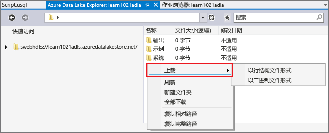
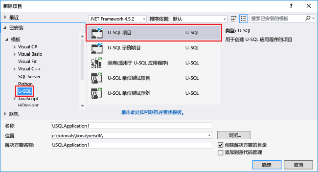
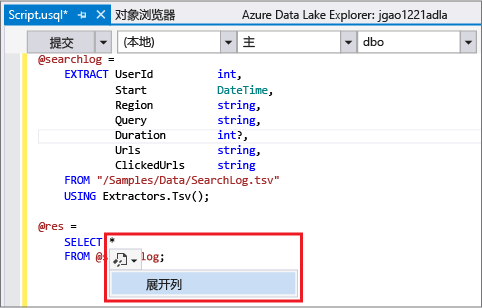
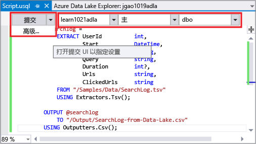
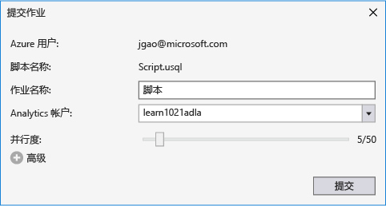
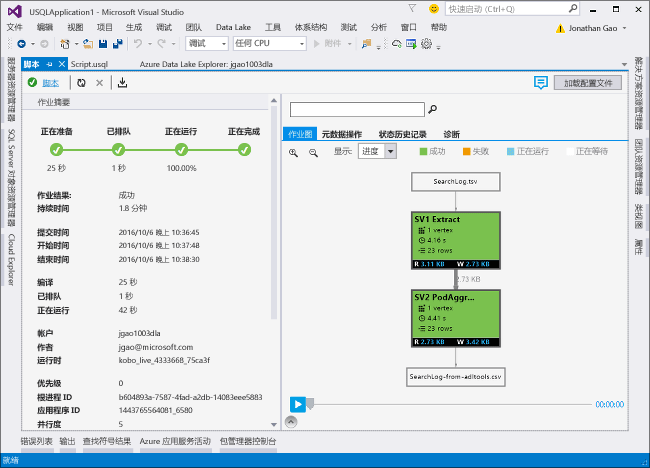
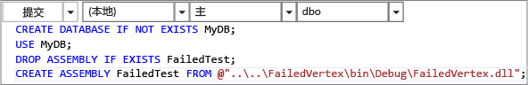

# 教程：使用用于 Visual Studio 的 Data Lake 工具开发 U-SQL 脚本
[!INCLUDE [get-started-selector](../../includes/data-lake-analytics-selector-get-started.md)]

了解如何安装用于 Visual Studio 的 Data Lake 工具，以及如何使用用于 Visual Studio 的 Data Lake 工具来编写和测试 U-SQL 脚本。

U-SQL 是高度可缩放、高度可扩展的语言，用于准备、转换和分析 Data Lake 中的所有数据，此外还提供其他功能。有关详细信息，请参阅 [U-SQL Reference](http://go.microsoft.com/fwlink/p/?LinkId=691348)（U-SQL 参考）。

### 先决条件
* **Visual Studio 2015、Visual Studio 2013 Update 4 或 Visual Studio 2012。支持 Enterprise (Ultimate/Premium)、Professional、Community 版本；不支持 Express 版本。目前不支持 Visual Studio“15”，我们正在努力提供此项支持。**
* **用于 .NET 的 Microsoft Azure SDK 2.7.1 或更高版本**。可以使用 [Web 平台安装程序](http://www.microsoft.com/web/downloads/platform.aspx)安装该产品。
* **[用于 Visual Studio 的 Data Lake 工具](http://aka.ms/adltoolsvs)**。
  
    安装用于 Visual Studio 的 Data Lake 工具后，可以在服务器资源管理器的“Azure”节点下看到“Data Lake Analytics”节点（可以按 Ctrl+Alt+S 打开服务器资源管理器）。
* **完成 [Get Started with Azure Data Lake Analytics using Azure portal](data-lake-analytics-get-started-portal.md)（在 Azure 门户中开始使用 Azure Data Lake Analytics）中的以下两个部分。**
  
  * [创建 Azure Data Lake Analytics 帐户](data-lake-analytics-get-started-portal.md#create_adl_analytics_account)。
  * [将 SearchLog.tsv 上载到默认的 Data Lake Storage 帐户](data-lake-analytics-get-started-portal.md#update-data-to-the-default-adl-storage-account)。
    
    为方便起见，[附录 A：用于准备教程的 PowerShell 示例](data-lake-analytics-data-lake-tools-get-started.md#appx-a-powershell-sample-for-preparing-the-tutorial)部分中提供了用于创建 Data Lake Analytics 服务及上载源数据文件的 PowerShell 示例脚本。
    
    Data Lake 工具不支持创建 Data Lake Analytics 帐户。因此必须使用 Azure 门户、Azure PowerShell、.NET SDK 或 Azure CLI 创建该帐户。若要运行 Data Lake Analytics 作业，需要提供一些数据。尽管 Data Lake 工具支持上载数据，但为了方便理解本教程，这里将使用门户来上载示例数据。

## 连接到 Azure
**连接到 Data Lake Analytics**

1. 打开 Visual Studio。
2. 在“视图”菜单中，单击“服务器资源管理器”打开服务器资源管理器。或者按 **[CTRL]+[ALT]+S**。
3. 右键单击“Azure”，单击“连接到 Microsoft Azure 订阅”，然后按照说明操作。
4. 在“服务器资源管理器”中，展开“Azure”，然后展开“Data Lake Analytics”。如果有 Data Lake Analytics 帐户，将看到其列表。无法从 Visual Studio 创建 Data Lake Analytics 帐户。若要创建帐户，请参阅 [Get Started with Azure Data Lake Analytics using Azure portal](data-lake-analytics-get-started-portal.md)（在 Azure 门户中开始使用 Azure Data Lake Analytics）或 [Get Started with Azure Data Lake Analytics using Azure PowerShell](data-lake-analytics-get-started-powershell.md)（在 Azure PowerShell 中开始使用 Azure Data Lake Analytics）。

## 上载源数据文件
已在本教程前面的**先决条件**部分中上载了一些数据。

如果想要使用自己的数据，下面是从 Data Lake 工具上载数据的过程。

**将文件上载到依赖的 Azure Data Lake 帐户**

1. 在“服务器资源管理器”中依次展开“Azure”、“Data Lake Analytics”、Data Lake Analytics 帐户、“存储帐户”。应会看到默认的 Data Lake Storage 帐户、链接的 Data Lake Storage 帐户和链接的 Azure 存储帐户。默认 Data Lake 帐户具有“默认存储帐户”标签。
2. 右键单击默认的 Data Lake Storage 帐户，然后单击“资源管理器”。此时将会打开“用于 Visual Studio 的 Data Lake 工具资源管理器”窗格。左侧显示了树视图，右侧显示了内容视图。
3. 浏览到要上载的文件所在的文件夹。
4. 右键单击任何空白区域，然后单击“上载”。
   
    

**将文件上载到链接的 Azure Blob 存储帐户**

1. 在“服务器资源管理器”中依次展开“Azure”、“Data Lake Analytics”、Data Lake Analytics 帐户、“存储帐户”。应会看到默认的 Data Lake Storage 帐户、链接的 Data Lake Storage 帐户和链接的 Azure 存储帐户。
2. 展开“Azure 存储帐户”。
3. 右键单击文件要上载到的容器，然后单击“资源管理器”。如果没有容器，必须先使用 Azure 门户、Azure PowerShell 或其他工具创建一个。
4. 浏览到要上载的文件所在的文件夹。
5. 右键单击任何空白区域，然后单击“上载”。

## 开发 U-SQL 脚本
Data Lake Analytics 作业使用 U-SQL 语言编写而成。若要了解有关 U-SQL 的详细信息，请参阅 [Get started with U-SQL language](data-lake-analytics-u-sql-get-started.md)（U-SQL 语言入门）和 [U-SQL language reference](http://go.microsoft.com/fwlink/?LinkId=691348)（U-SQL 语言参考）。

**创建并提交 Data Lake Analytics 作业**

1. 在“文件”菜单中，单击“新建”，然后单击“项目”。
2. 选择“U-SQL 项目”类型。
   
    
3. 单击**“确定”**。Visual Studio 将创建包含 **Script.usql** 文件的解决方案。
4. 在 **Script.usql** 中输入以下脚本：
   
        @searchlog =
            EXTRACT UserId          int,
                    Start           DateTime,
                    Region          string,
                    Query           string,
                    Duration        int?,
                    Urls            string,
                    ClickedUrls     string
            FROM "/Samples/Data/SearchLog.tsv"
            USING Extractors.Tsv();
   
        @res =
            SELECT *
            FROM @searchlog;        
   
        OUTPUT @res   
            TO "/Output/SearchLog-from-Data-Lake.csv"
        USING Outputters.Csv();
   
    此 U-SQL 脚本使用 **Extractors.Tsv()** 读取源数据文件，然后使用 **Outputters.Csv()** 创建 csv 文件。
   
    除非将源文件复制到了其他位置，否则不要修改这两条路径。如果输出文件夹不存在，Data Lake Analytics 将创建一个。
   
    对于存储在默认 Data Lake 帐户中的文件而言，使用相对路径更为简单。也可使用绝对路径。例如
   
        adl://<Data LakeStorageAccountName>.azuredatalakestore.net:443/Samples/Data/SearchLog.tsv
   
    必须使用绝对路径来访问链接的存储帐户中的文件。链接的 Azure 存储帐户中所储存文件的语法是：
   
        wasb://<BlobContainerName>@<StorageAccountName>.blob.core.windows.net/Samples/Data/SearchLog.tsv
   
   > [!NOTE]
   > 当前不支持对含公共 Blob 的 Azure Blob 容器或公共容器的访问权限。
   > 
   > 
   
    请注意以下功能：
   
   * **IntelliSense**
     
       自动填写名称，并显示行集、类、数据库、架构和用户定义对象 (UDO) 的成员。
     
       目录实体（数据库、架构、表、UDO 等）的 IntelliSense 与计算帐户相关。可以在顶部工具栏中检查当前活动的计算帐户、数据库和架构，通过下拉列表切换实体。
   * **展开*列**
     
       单击 * 的右侧，可以看到 * 下面出现蓝色下划线。将鼠标光标悬停在蓝色下划线上，然后单击向下箭头。
     
       单击“展开列”，工具会将 * 替换为列名称。
   * **自动套用格式**
     
       用户可以根据代码结构，在“编辑”->“高级”下面更改 U-SQL 脚本的缩进：
     
     * 设置文档的格式（Ctrl+E、D）：设置整个文档的格式
     * 设置选定内容的格式（Ctrl+K、Ctrl+F）：设置选定内容的格式。如果未做选择，此快捷键将设置光标所在行的格式。
       
       可以在“工具”->“选项”->“文本编辑器”->“SIP”->“格式”下面设置所有格式规则。
   * **智能缩进**
     
       用于 Visual Studio 的 Data Lake 工具可在编写脚本时自动缩进表达式。此功能默认已禁用，用户需要通过选中“U-SQL”->“选项和设置”->“开关”->“启用智能缩进”来启用它。
   * **转到定义并查找所有引用**
     
       右键单击行集/参数/列/UDO 等的名称，然后单击“转到定义”(F12) 即可导航到其定义。单击“查找所有引用”(Shift+F12) 会显示所有引用。
   * **插入 Azure 路径**
     
       用于 Visual Studio 的 Data Lake 工具提供一个简单的方法，使用户无需在编写脚本时记住 Azure 文件路径和手动键入：在编辑器中单击右键，然后单击“插入 Azure 路径”。导航到“Azure Blob 浏览器”对话框中的文件。单击“确定”，文件路径将插入到代码中。
5. 指定 Data Lake Analytics 帐户、数据库和架构。为了测试，可以选择“(本地)”，在本地运行脚本。有关详细信息，请参阅[在本地运行 U-SQL](#run-u-sql-locally)。
   
    
   
    有关详细信息，请参阅[使用 U-SQL 目录](data-lake-analytics-use-u-sql-catalog.md)。
6. 在“解决方案资源管理器”中，右键单击“Script.usql”，然后单击“生成脚本”。验证“输出”窗格中的结果。
7. 在“解决方案资源管理器”中，右键单击“Script.usql”，然后单击“提交脚本”。（可选）也可以在 Script.usql 窗格中单击“提交”。请参阅上面的屏幕截图。单击“提交”按钮旁边的向下箭头，使用高级选项提交脚本：
8. 指定“作业名称”，确认“Analytics 帐户”，然后单击“提交”。完成提交后，“用于 Visual Studio 的 Data Lake 工具结果”窗口中会出现提交结果和作业链接。
   
    
9. 必须单击“刷新”按钮才能看到最新的作业状态和刷新屏幕。作业成功时，将显示“作业图表”、“元数据操作”、“状态历史记录”和“诊断”：
   
    
   
   * 作业摘要。显示当前作业的摘要信息，例如：状态、进度、执行时间、运行时名称、发送者，等等。
   * 作业详细信息。提供此作业的详细信息，包括脚本、资源、顶点执行视图。
   * 作业图表。提供四个图表来可视化作业的信息：进度、数据读取时间、数据写入时间、执行时间、每个节点的平均执行时间、输入吞吐量、输出吞吐量。
   * 元数据操作。显示了所有元数据操作。
   * 状态历史记录。
   * 诊断。用于 Visual Studio 的 Data Lake 工具将自动诊断作业执行。当作业中出现一些错误或性能问题时，将会收到警报。有关详细信息，请参阅“Job Diagnostics”（作业诊断）（链接有待提供）。

**检查作业状态**

1. 在服务器资源管理器中依次展开“Azure”、“Data Lake Analytics”、Data Lake Analytics 帐户名
2. 双击“作业”可列出作业。
3. 单击作业可查看状态。

**查看作业输出**

1. 在“服务器资源管理器”中依次展开“Azure”、“Data Lake Analytics”、Data Lake Analytics 帐户、“存储帐户”，右键单击默认 Data Lake Storage 帐户，然后单击“资源管理器”。
2. 双击“输出”打开文件夹
3. 双击“SearchLog-From-adltools.csv”。

### 作业播放
使用作业播放可以观看作业执行进度，直观地检测出性能异常和瓶颈。此功能可以在作业完成执行之前（即，作业有效运行期间）以及完成执行之后使用。在作业执行期间进行播放可让用户播放到目前为止的进度。

**查看作业执行进度**

1. 单击右上角的“加载配置文件”。请参阅上面的屏幕截图。
2. 单击左下角的“播放”按钮查看作业执行进度。
3. 在播放期间，可以单击“暂停”以暂停播放，或者直接将进度条拖到特定的位置。

### 热度地图
用于 Visual Studio 的 Data Lake 工具允许用户在作业视图中选择颜色覆盖层来指示每个阶段的进度、数据 I/O、执行时间和 I/O 吞吐量。通过此方法，用户可以直接且直观地找到潜在问题和作业属性的分布。可以从下拉列表中选择要显示的数据源。

## 在本地运行 U-SQL
在 Visual Studio 中使用 U-SQL 本地运行体验可以：

* 在本地运行 U-SQL 脚本以及 C# 程序集。
* 在本地调试 C# 程序集。
* 在服务器资源管理器中创建/删除/查看本地数据库、程序集、架构和表，就如同在 Azure Data Lake Analytics 服务中所做的一样。

Visual Studio 中会显示“本地”帐户，安装程序将在 *C:\\LocalRunRoot* 中创建 *DataRoot* 文件夹。DataRoot 文件夹用于：

* 存储元数据，包括表、数据库、TVF 等。
* 对于特定的脚本：如果在输入/输出路径中引用相对路径，则会查找 DataRoot（以及脚本的路径，如果它是输入）
* 如果尝试注册程序集并使用相对路径，则不会引用 DataRoot 文件夹（有关详细信息，请参阅“执行本地运行时使用程序集”部分）

以下视频演示 U-SQL 本地运行功能：

> [!VIDEO https://channel9.msdn.com/Series/AzureDataLake/USQL-LocalRun/player]
> 
> 

### 已知问题和限制
* U-SQL 本地运行不支持在本地查询文件集。请参阅 [U-SQL 文件集](https://msdn.microsoft.com/library/azure/mt621294.aspx)。将来会解决此问题。
* 由于作业计划在单个进程中串行执行，较低的并行度会导致性能下降。
* 本地运行无法在 Visual Studio 中显示作业图表。将来会解决此问题。
* 无法在服务器资源管理器中为本地帐户创建表/DB 等对象。
* 引用相对路径时：
  
  * 在脚本输入 (EXTRACT * FROM “/path/abc”) 中 - 将同时搜索 DataRoot 路径和脚本路径。
  * 在脚本输出 (OUTPUT TO “path/abc”) 中：将使用 DataRoot 路径作为输出文件夹。
  * 在程序集注册 (CREATE ASSEMBLY xyz FROM “/path/abc”) 中：将搜索脚本路径，但不搜索 DataRoot。
  * 在注册的 TVF/视图或其他元数据项中：将搜索 DataRoot 路径，但不搜索脚本路径。
    
    对于在 Data Lake 服务上运行的脚本，默认存储帐户将用作根文件夹，因而会在其中搜索。

### 在本地测试 U-SQL 脚本
有关开发 U-SQL 脚本的说明，请参阅 [Develop U-SQL scripts](#develop-and-test-u-sql-scripts)（开发 U-SQL 脚本）。若要在本地生成和运行 U-SQL 脚本，请在群集下拉列表中选择“(本地)”，然后单击“提交”。确保引用正确的数据：引用绝对路径，或者将数据放在 DataRoot 文件夹下。

也可以右键单击脚本，然后在上下文菜单中单击“运行本地计划”，或者按 **CTRL+F5** 触发本地运行。

### 在本地运行中使用程序集
可以通过两种方式运行自定义 C# 文件：

* 在代码隐藏文件中编写程序集，这样，组件将自动注册，并在脚本完成后删除。
* 创建 C# 程序集项目，通过类似于下面的脚本在本地帐户中注册输出 dll。请注意，该路径相对于脚本而不是 DataRoot 文件夹。

### 在本地调试脚本和 C# 程序集
无需将 C# 程序集提交并注册到 Azure Data Lake Analytics 服务即可对其进行调试。可以在两个代码隐藏文件和引用的 C# 项目中设置断点。

**在代码隐藏文件中调试本地代码**

1. 在代码隐藏文件中设置断点。
2. 按 **F5** 在本地调试脚本。

以下过程仅适用于 Visual Studio 2015。在旧版 Visual Studio 中，可能需要手动添加 pdb 文件。

**在引用的 C# 项目中调试本地代码**

1. 创建 C# 程序集项目，生成该项目以生成输出 dll。
2. 使用 U-SQL 语句注册该 dll：
   
     CREATE ASSEMBLY assemblyname FROM @"..\..\path\to\output\.dll";
3. 在 C# 代码中设置断点。
4. 按 **F5**，在本地调试引用 C# dll 的脚本。

## 另请参阅
若要借助不同的工具开始使用 Data Lake Analytics，请参阅：

* [Get started with Data Lake Analytics using Azure portal](data-lake-analytics-get-started-portal.md)（在 Azure 门户中开始使用 Data Lake Analytics）
* [Get started with Data Lake Analytics using Azure PowerShell](data-lake-analytics-get-started-powershell.md)（在 Azure PowerShell 中开始使用 Data Lake Analytics）
* [Get started with Data Lake Analytics using .NET SDK](data-lake-analytics-get-started-net-sdk.md)（在 .NET SDK 中开始使用 Data Lake Analytics）
* [Debug C# code in U-SQL jobs](data-lake-analytics-debug-u-sql-jobs.md)（在 U-SQL 作业中调试 C# 代码）

查看更多开发主题：

* [Analyze weblogs using Data Lake Analytics](data-lake-analytics-analyze-weblogs.md)（使用 Data Lake Analytics 分析网络日志）
* [使用用于 Visual Studio 的 Data Lake 工具开发 U-SQL 脚本](data-lake-analytics-data-lake-tools-get-started.md)
* [Get started with Azure Data Lake Analytics U-SQL language](data-lake-analytics-u-sql-get-started.md)（Azure Data Lake Analytics U-SQL 语言入门）
* [Develop U-SQL user defined operators for Data Lake Analytics jobs](data-lake-analytics-u-sql-develop-user-defined-operators.md)（为 Data Lake Analytics 作业开发 U-SQL 用户定义的运算符）

## 附录 A：用于准备教程的 PowerShell 示例
以下 PowerShell 脚本可以准备 Azure Data Lake Analytics 帐户和源数据，这样就可以直接跳到[开发 U-SQL 脚本](data-lake-analytics-data-lake-tools-get-started.md#develop-u-sql-scripts)部分。

    #region - used for creating Azure service names
    $nameToken = "<Enter an alias>"
    $namePrefix = $nameToken.ToLower() + (Get-Date -Format "MMdd")
    #endregion

    #region - service names
    $resourceGroupName = $namePrefix + "rg"
    $dataLakeStoreName = $namePrefix + "adas"
    $dataLakeAnalyticsName = $namePrefix + "adla"
    $location = "East US 2"
    #endregion

    # Treat all errors as terminating
    $ErrorActionPreference = "Stop"

    #region - Connect to Azure subscription
    Write-Host "`nConnecting to your Azure subscription ..." -ForegroundColor Green
    try{Get-AzureRmContext}
    catch{Login-AzureRmAccount}
    #endregion

    #region - Create an Azure Data Lake Analytics service account
    Write-Host "Create a resource group ..." -ForegroundColor Green
    New-AzureRmResourceGroup `
        -Name  $resourceGroupName `
        -Location $location

    Write-Host "Create a Data Lake account ..."  -ForegroundColor Green
    New-AzureRmDataLakeStoreAccount `
        -ResourceGroupName $resourceGroupName `
        -Name $dataLakeStoreName `
        -Location $location

    Write-Host "Create a Data Lake Analytics account ..."  -ForegroundColor Green
    New-AzureRmDataLakeAnalyticsAccount `
        -Name $dataLakeAnalyticsName `
        -ResourceGroupName $resourceGroupName `
        -Location $location `
        -DefaultDataLake $dataLakeStoreName

    Write-Host "The newly created Data Lake Analytics account ..."  -ForegroundColor Green
    Get-AzureRmDataLakeAnalyticsAccount `
        -ResourceGroupName $resourceGroupName `
        -Name $dataLakeAnalyticsName  
    #endregion

    #region - prepare the source data
    Write-Host "Import the source data ..."  -ForegroundColor Green
    $localFolder = "C:\Tutorials\Downloads" # A temp location for the file.
    $storageAccount = "adltutorials"  # Don't modify this value.
    $container = "adls-sample-data"  #Don't modify this value.

    # Create the temp location  
    New-Item -Path $localFolder -ItemType Directory -Force

    # Download the sample file from Azure Blob storage
    $context = New-AzureStorageContext -StorageAccountName $storageAccount -Anonymous
    $blobs = Azure\Get-AzureStorageBlob -Container $container -Context $context
    $blobs | Get-AzureStorageBlobContent -Context $context -Destination $localFolder

    # Upload the file to the default Data Lake Store account    
    Import-AzureRmDataLakeStoreItem -AccountName $dataLakeStoreName -Path $localFolder"SearchLog.tsv" -Destination "/Samples/Data/SearchLog.tsv"

    Write-Host "List the source data ..."  -ForegroundColor Green
    Get-AzureRmDataLakeStoreChildItem -Account $dataLakeStoreName -Path  "/Samples/Data/"
    #endregion

<!---HONumber=AcomDC_0921_2016-->