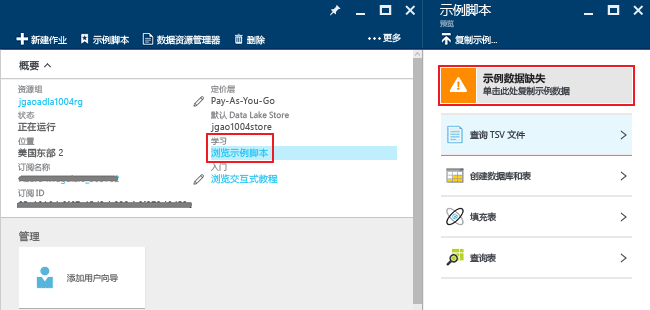
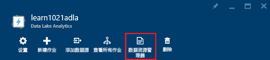
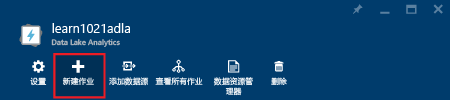
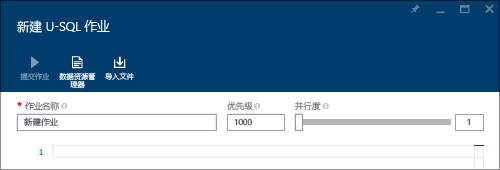

# 教程：通过 Azure 门户开始使用 Azure Data Lake Analytics
[!INCLUDE [get-started-selector](../../includes/data-lake-analytics-selector-get-started.md)]

了解如何使用 Azure 门户创建 Azure Data Lake Analytics 帐户，在 [U-SQL](data-lake-analytics-u-sql-get-started.md)中定义 Data Lake Analytics 作业，并将作业提交到 Data Lake Analytics 服务。 有关 Data Lake Analytics 的详细信息，请参阅 [Azure Data Lake Analytics 概述](data-lake-analytics-overview.md)。

本教程将开发一个作业，它能读取制表符分隔值 (TSV) 文件，并将其转换为逗号分隔值 (CSV) 文件。 若要通过其他支持的工具来完成此教程，请单击本节顶部的选项卡。 第一个作业成功完成后，可以开始使用 U-SQL 编写更复杂的数据转换。

## 先决条件
开始学习本教程之前，必须做好以下准备：

* **一个 Azure 订阅**。 请参阅 [获取 Azure 免费试用版](https://azure.microsoft.com/pricing/free-trial/)。

## 创建 Data Lake Analytics 帐户
在运行任何作业之前，首先必须拥有 Data Lake Analytics 帐户。

每个 Data Lake Analytics 帐户都有一个从属 [Azure Data Lake Store]() 帐户。  该帐户称作默认 Data Lake Store 帐户。  可以事先或在创建 Data Lake Analytics 帐户时，创建 Data Lake Store 帐户。 本教程将创建 Data Lake Store 帐户以及 Data Lake Analytics 帐户。

**创建 Data Lake Analytics 帐户**

1. 登录到 [Azure 门户](https://portal.azure.com)。
2. 依次单击“新建”、“智能 + 分析”、“Data Lake Analytics”。
3. 键入或选择以下值：

    

   * **名称**：Data Lake Analytics 帐户的名称。
   * **订阅**：选择用于 Analytics 帐户的 Azure 订阅。
   * **资源组**。 选择现有的 Azure 资源组或创建新的资源组。 那么，你可以使用 Azure 资源管理器以组的方式处理应用程序中的资源。 有关详细信息，请参阅 [Azure Resource Manager 概述](../azure-resource-manager/resource-group-overview.md)。
   * **位置**。 为 Data Lake Analytics 帐户选择 Azure 数据中心。
   * **Data Lake Store**：每个 Data Lake Analytics 帐户都有一个从属 Data Lake Store 帐户。 Data Lake Analytics 帐户和从属 Data Lake Store 帐户必须位于同一个 Azure 数据中心。 按照说明创建新的 Data Lake Store 帐户，或选择现有帐户。
4. 单击“创建” 。 随后将转到门户主页屏幕。 此时，一个新磁贴已添加到启动板，其中的标签显示“正在部署 Azure Data Lake Analytics”。 需要花一些时间来创建一个 Data Lake Analytics 帐户。 帐户创建后，门户将在新的边栏选项卡上打开该帐户。

创建 Data Lake Analytics 帐户后，可以添加其他 Data Lake Store 帐户和 Azure 存储帐户。 有关说明，请参阅 [Manage Data lake Analytics account data sources](data-lake-analytics-manage-use-portal.md#manage-account-data-sources)（管理 Data Lake Analytics 帐户数据源）。

## 准备源数据
本教程将处理一些搜索日志。  搜索日志可以存储在 Data Lake Store 或 Azure Blob 存储中。

Azure 门户提供一个用户界面，可将一些示例数据复制到默认 Data Lake Store 帐户，包括搜索日志文件。

**复制示例数据文件**

1. 在 [Azure 门户](https://portal.azure.com)中打开 Data Lake Analytics 帐户。  请参阅[管理 Data Lake Analytics 帐户](data-lake-analytics-get-started-portal.md#create-data-lake-analytics-account)创建一个帐户并在门户中将它创建。
2. 展开“概要”窗格，然后单击“浏览示例脚本”。 此时将打开名为“示例脚本”的另一个边栏选项卡。

    
3. 单击“缺少示例数据”复制示例数据文件。 完成后，门户将显示“已成功更新示例数据”。
4. 单击“Data Lake Analytics 帐户”边栏选项卡顶部的“数据资源管理器”。

    

    此时将打开两个边栏选项卡。 其中一个是“数据资源管理器”，另一个是“默认的 Data Lake Store 帐户”。
5. 在“默认的 Data Lake Store 帐户”边栏选项卡中，单击“示例”展开相应的文件夹，然后单击“数据”展开相应的文件夹。 应会看到以下文件和文件夹：

   * AmbulanceData/
   * AdsLog.tsv
   * SearchLog.tsv
   * version.txt
   * WebLog.log

     本教程使用 SearchLog.tsv。

在实践中，可将应用程序设定为向链接的存储帐户写入数据，或者上载数据。 有关上载文件的详细信息，请参阅 [Upload data to Data Lake Store](data-lake-analytics-manage-use-portal.md#upload-data-to-adls)（将数据上载到 Data Lake Store）或 [Upload data to Blob storage](data-lake-analytics-manage-use-portal.md#upload-data-to-wasb)（将数据上载到 Blob 存储）。

## 创建并提交 Data Lake Analytics 作业
准备好源数据后，可以开始开发 U-SQL 脚本。  

**提交作业**

1. 在门户上的“Data Lake Analytics 帐户”边栏选项卡中，单击“新建作业”。

    

    如果未看到该边栏选项卡，请参阅 [Open a Data Lake Analytics account from portal](data-lake-analytics-manage-use-portal.md#access-adla-account)（从门户打开 Data Lake Analytics 帐户）。
2. 输入“作业名称”和以下 U-SQL 脚本： 

        @searchlog =
            EXTRACT UserId          int,
                    Start           DateTime,
                    Region          string,
                    Query           string,
                    Duration        int?,
                    Urls            string,
                    ClickedUrls     string
            FROM "/Samples/Data/SearchLog.tsv"
            USING Extractors.Tsv();

        OUTPUT @searchlog   
            TO "/Output/SearchLog-from-Data-Lake.csv"
        USING Outputters.Csv();

    

    此 U-SQL 脚本通过 **Extractors.Tsv()** 读取源数据文件，然后通过 **Outputters.Csv()** 创建 csv 文件。

    除非将源文件复制到其他位置，否则不要修改这两条路径。  如果输出文件夹不存在，Data Lake Analytics 将创建一个。  在本例中，我们使用简单的相对路径。  

    对于存储在默认 Data Lake 帐户中的文件而言，使用相对路径更为简单。 也可使用绝对路径。  例如

        adl://<Data LakeStorageAccountName>.azuredatalakestore.net:443/Samples/Data/SearchLog.tsv

    若要了解有关 U-SQL 的详细信息，请参阅 [Get started with Azure Data Lake Analytics U-SQL language](data-lake-analytics-u-sql-get-started.md)（Azure Data Lake Analytics U-SQL 语言入门）和 [U-SQL language reference](http://go.microsoft.com/fwlink/?LinkId=691348)（U-SQL 语言参考）。

1. 单击顶部的“提交作业”。   
2. 请等到作业状态变为“成功”。 可以看到，完成作业大约花费了一分钟。

    如果作业失败，请参阅 [Monitor and troubleshoot Data Lake Analytics jobs](data-lake-analytics-monitor-and-troubleshoot-jobs-tutorial.md)（对 Data Lake Analytics 作业进行监视和故障排除）。
3. 在边栏选项卡底部，单击“输出”选项卡，然后单击“SearchLog-from-Data-Lake.csv”。 可以预览、下载、重命名和删除输出文件。

    

## 另请参阅
* 若要查看更复杂的查询，请参阅 [Analyze Website logs using Azure Data Lake Analytics](data-lake-analytics-analyze-weblogs.md)（使用 Azure Data Lake Analytics 分析网站日志）。
* 若要着手开发 U-SQL 应用程序，请参阅 [使用 Data Lake Tools for Visual Studio 开发 U-SQL 脚本](data-lake-analytics-data-lake-tools-get-started.md)。
* 若要了解 U-SQL，请参阅 [Azure Data Lake Analytics U-SQL 语言入门](data-lake-analytics-u-sql-get-started.md)。
* 有关管理任务，请参阅 [Manage Azure Data Lake Analytics using Azure Portal](data-lake-analytics-manage-use-portal.md)（使用 Azure 门户管理 Azure Data Lake Analytics）。
* 有关 Data Lake Analytics 的概述，请参阅 [Azure Data Lake Analytics 概述](data-lake-analytics-overview.md)。
* 若要了解如何使用其他工具完成本教程，请单击页面顶部的选项卡选择器。
* 若要记录诊断信息，请参阅 [Accessing diagnostics logs for Azure Data Lake Analytics](data-lake-analytics-diagnostic-logs.md)

<!--HONumber=Dec16_HO2-->

