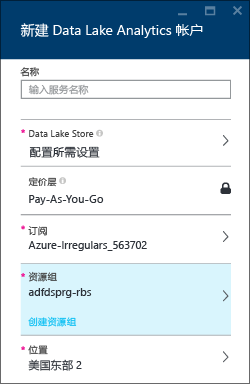
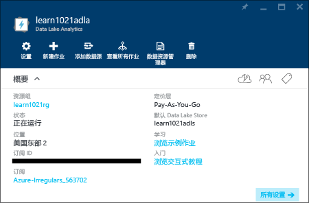
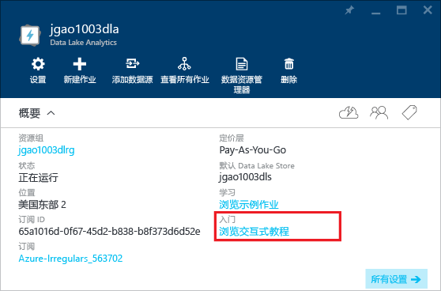

# 使用 Azure Data Lake Analytics 交互式教程
Azure 门户为用户提供了学习 Data Lake Analytics 入门的互动式教程。 本文将介绍如何通过本教程学习来分析网站日志。

> [!NOTE]
> 如果想要通过使用 Visual Studio 完成同一个教程，请参阅 [使用 Data Lake Analytics 分析网站日志](data-lake-analytics-analyze-weblogs.md)。
> 还有更多可添加到门户的交互式教程。
> 
> 

其他相关教程，请参阅：

* [Get started with Data Lake Analytics using Azure portal](data-lake-analytics-get-started-portal.md)
* [Get started with Data Lake Analytics using Azure PowerShell](data-lake-analytics-get-started-powershell.md)
* [通过 .NET SDK 实现 Data Lake Analytics 入门](data-lake-analytics-get-started-net-sdk.md)
* [通过 Visual Studio 的 Data Lake 工具开发 U-SQL 脚本](data-lake-analytics-data-lake-tools-get-started.md) 

**先决条件**

在开始阅读本教程前，你必须具有：

* **Data Lake Analytics 帐户**。  请参阅[通过 Azure 门户实现 Azure Data Lake Analytics 入门](data-lake-analytics-get-started-portal.md)。

## 创建 Data Lake Analytics 帐户
在运行任何作业之前，首先必须拥有 Data Lake Analytics 帐户。

每个 Data Lake Analytics 帐户都有一个从属 [Azure Data Lake Store](../data-lake-store/data-lake-store-overview.md) 帐户 - 默认 Data Lake Store 帐户。  本教程将使用 Analytics 帐户创建默认 Data Lake Store 帐户，但你也可提前创建它。

**创建 Data Lake Analytics 帐户**

1. 登录到 [Azure 门户](https://portal.azure.com/signin/index/?Microsoft_Azure_Kona=true&Microsoft_Azure_DataLake=true&hubsExtension_ItemHideKey=AzureDataLake_BigStorage%2cAzureKona_BigCompute)。
2. 单击左上角的“ **Microsoft Azure** ”打开启动板。
3. 单击“ **Marketplace** ”磁贴。  
4. 在“全部”边栏选项卡上的搜索框中键入 **Azure Data Lake Analytics**，然后按 **ENTER**。 应该会在列表中看到 **Azure Data Lake Analytics** 。
5. 从列表中单击“ **Azure Data Lake Analytics** ”。
6. 单击边栏选项卡底部的“ **创建** ”。
7. 键入或选择：
   
    
   
   * **名称**：命名 Analytics 帐户。
   * **Data Lake Store**：每个 Data Lake Analytics 帐户都有一个从属 Data Lake Store 帐户。 Data Lake Analytics 帐户和从属 Data Lake Store 帐户必须位于同一个 Azure 数据中心。 按照说明创建 Data Lake Store 帐户，或选择现有帐户。
   * **订阅**：选择用于 Analytics 帐户的 Azure 订阅。
   * **资源组**。 选择现有的 Azure 资源组或创建新的资源组。 应用程序通常由许多组件构成，例如 Web 应用、数据库、数据库服务器、存储和第三方服务。 你可以使用 Azure 资源管理器 (ARM) 以组（称为 Azure 资源组）的方式处理应用程序中的资源。 可通过单个协调的操作为应用程序部署、更新、监视或删除资源。 可使用一个模板来完成部署，该模板适用于不同的环境，例如测试、过渡和生产。 你可以通过查看整个组的累积费用，明确了解组织的帐单开支。 有关详细信息，请参阅 [Azure Resource Manager 概述](../azure-resource-manager/resource-group-overview.md)。 
   * **位置**。 为 Data Lake Analytics 帐户选择 Azure 数据中心。 
8. 选择“ **固定到启动板**”。 这是出于按照本教程操作的需要。
9. 单击“创建” 。 将转到门户启动板。 此时，一个新磁贴已添加到主页，其中的标签显示为“部署 Azure Data Lake Analytics”。 需要花一些时间来创建一个 Data Lake Analytics 帐户。 帐户创建后，门户将在新的边栏选项卡上打开该帐户。
   
    

## 运行网站日志分析交互式教程
**打开运行网站日志分析交互式教程**

1. 在门户中，单击左侧菜单上的“ **Microsoft Azure** ”以打开启动板。
2. 单击链接到 Data Lake Analytics 帐户的磁贴。
3. 从“概要”栏中单击“浏览交互式教程”。
   
    
4. 如果看到一条指示“示例未设置，请单击...”的橙色警告，单击“ **复制示例数据** ”以将示例数据复制到默认 Data Lake Store 帐户。 交互式教程需要运行数据。
5. 在“交互式教程”边栏选项卡中，单击“网站 Log Analytics”。 门户将在新的门户边栏选项卡中打开本教程。
6. 单击“**简介**”，然后按照说明进行操作

## 另请参阅
* [Microsoft Azure Data Lake Analytics 概述](data-lake-analytics-overview.md)
* [Get started with Data Lake Analytics using Azure portal](data-lake-analytics-get-started-portal.md)
* [通过 Azure PowerShell 实现 Data Lake Analytics 入门](data-lake-analytics-get-started-powershell.md)
* [通过 Visual Studio 的 Data Lake 工具开发 U-SQL 脚本](data-lake-analytics-data-lake-tools-get-started.md)
* [使用 Azure Data Lake Analytics 分析网站日志](data-lake-analytics-analyze-weblogs.md)

<!--HONumber=Dec16_HO2-->

