<properties
   pageTitle="Data Lake Store 中的访问控制概述 | Microsoft Azure"
   description="了解 Azure Data Lake Store 中的访问控制"
   services="data-lake-store"
   documentationCenter=""
   authors="nitinme"
   manager="jhubbard"
   editor="cgronlun"/>

<tags
   ms.service="data-lake-store"
   ms.devlang="na"
   ms.topic="get-started-article"
   ms.tgt_pltfrm="na"
   ms.workload="big-data"
   ms.date="09/06/2016"
   ms.author="nitinme"/>

# Azure Data Lake Store 中的访问控制

Data Lake Store 实现派生自 HDFS 的访问控制模型，而 HDFS 又派生自 POSIX 访问控制模型。本文汇总了 Data Lake Store 访问控制模型的基本知识。有关 HDFS 访问控制模型的详细信息，请参阅 [HDFS Permissions Guide](https://hadoop.apache.org/docs/current/hadoop-project-dist/hadoop-hdfs/HdfsPermissionsGuide.html)（HDFS 权限指南）。

## 文件和文件夹访问控制列表

访问控制列表 (ACL) 有两种类型 - **访问 ACL** 和**默认 ACL**。

* **访问 ACL** – 控制对象访问权限。文件和文件夹都具有访问 ACL。

* **默认 ACL** – 与文件夹关联的 ACL 的“模板”，用于确定在该文件夹下创建的任何子项的访问 ACL。文件没有默认 ACL。

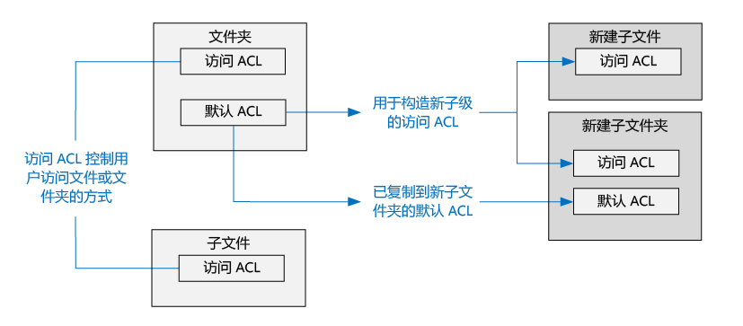

访问 ACL 和默认 ACL 具有相同的结构。

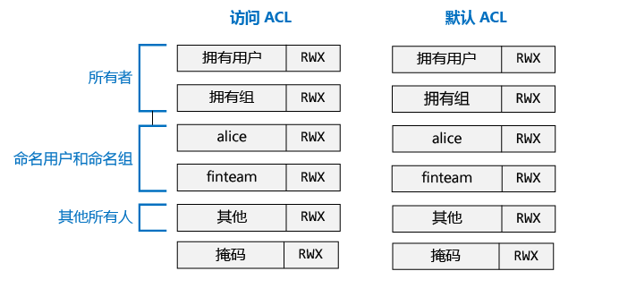

>[AZURE.NOTE] 更改父级的默认 ACL 不影响现有子项的访问 ACL 或默认 ACL。

## 用户和标识

每个文件和文件夹都有这些标识的不同权限：

* 文件的拥有用户
* 拥有组
* 命名用户
* 命名组
* 所有其他用户

用户和组的标识是 Azure Active Directory (AAD) 标识，因此除非另外指定“用户”，否则在 Data Lake Store 的上下文中可能表示 AAD 用户或 AAD 安全组。

## 权限

文件系统对象权限为“读取”、“写入”和“执行”，可对下表中所示的文件和文件夹使用这些权限。

| | 文件 | 文件夹 |
|------------|-------------|----------|
| **读取 (R)** | 可以读取文件内容 | 需有“读取”和“执行”权限才能列出文件夹内容。|
| **写入 (W)** | 可以在文件中写入或追加内容 | 需有“写入和执行”权限才能在文件夹中创建子项。 |
| **执行 (X)** | 不表示 Data Lake Store 上下文中的任何内容 | 需要遍历文件夹的子项。 |

### 权限的简短形式

**RWX** 用于表示“读取 + 写入 + 执行”。还有更精简的数字形式，“读取=4”，“写入=2”，“执行=1”，其总和表示各种不同的权限。下面是一些示例。

| 数字形式 | 简短形式 | 含义 |
|--------------|------------|------------------------|
| 7 | RWX | 读取 + 写入 + 执行 |
| 5 | R-X | 读取 + 执行 |
| 4 | R-- | 读取 |
| 0 | --- | 无权限 |

### 权限不继承

在 Data Lake Store 使用的 POSIX 样式模型中，项的权限存储在项本身中。换而言之，无法从父项继承项的权限。

## 与权限相关的常见方案

可以使用以下常见方案了解对 Data Lake Store 帐户执行特定操作所需的权限。

### 读取文件所需的权限

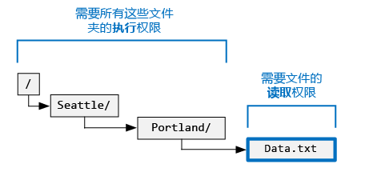

* 对于要读取的文件 - 调用方需要“读取”权限
* 对于文件夹结构中包含文件的所有文件夹 - 调用方需要“执行”权限

### 在文件中追加内容所需的权限

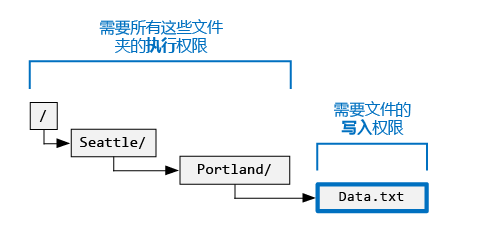

* 对于要追加内容的文件 - 调用方需要“写入”权限
* 对于包含文件的所有文件夹 - 调用方需要“执行”权限

### 删除文件所需的权限

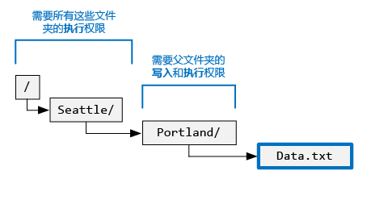

* 对于父文件夹 - 调用方需要“写入 + 执行”权限
* 对于文件路径中的所有其他文件夹 - 调用方需要“执行”权限

>[AZURE.NOTE] 只要以上两个条件成立，删除文件时就不需要文件的写入权限。

### 枚举文件夹所需的权限

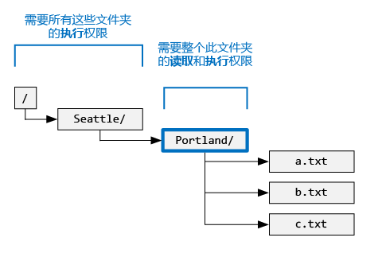

* 对于要枚举的文件夹 - 调用方需要“读取 + 执行”权限
* 对于所有上级文件夹 - 调用方需要“执行”权限

## 在 Azure 门户中查看权限

在 Data Lake Store 帐户的“数据资源管理器”边栏选项卡中，单击“访问”查看文件或文件夹的 ACL。在下面的屏幕截图中，单击“访问”查看 **mydatastore** 帐户下的 **catalog** 文件夹。

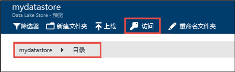

接下来，在“访问”边栏选项卡中，单击“简单视图”查看更简单的视图。

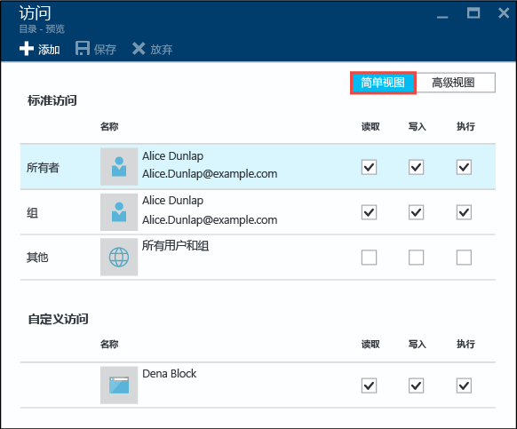

单击“高级视图”查看更高级的视图。

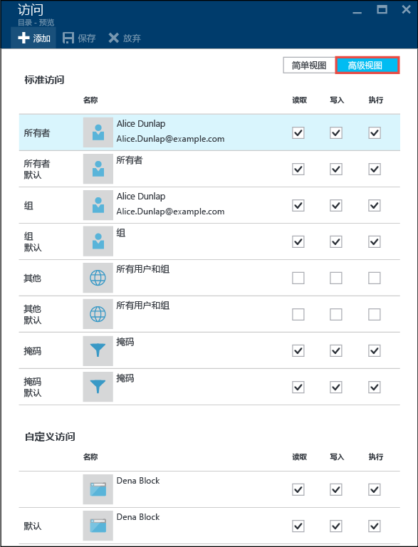

## 超级用户

超级用户拥有 Data Lake Store 中所有用户的大多数权限。超级用户：

* 拥有**所有**文件和文件夹的 RWX 权限
* 可以更改任何文件或文件夹的权限。
* 可以更改任何文件或文件夹的拥有用户或拥有组。

在 Azure 中，Data Lake Store 帐户具有多个 Azure 角色：

* 所有者
* 参与者
* 读取者
* 等等

具有 Data Lake Store 帐户“所有者”角色的每个人都自动成为该帐户的超级用户。有关 Azure 基于角色的访问控制 (RBAC) 的详细信息，请参阅 [Role-based access control](../active-directory/role-based-access-control-configure.md)（基于角色的访问控制）。

## 拥有用户

创建项的用户自动成为该项的拥有用户。拥有用户可以：

* 更改所拥有文件的权限
* 更改所拥有文件的拥有组，前提是该拥有用户也是目标组的成员。

>[AZURE.NOTE] 拥有用户**无法**更改另一个所拥有文件的拥有用户。只有超级用户可以更改文件或文件夹的拥有用户。

## 拥有组

在 POSIX ACL 中，每个用户都与“主组”关联。例如，用户“alice”可能属于“finance”组。Alice 可能属于多个组，但始终有一个组指定为她的主组。在 POSIX 中，当 Alice 创建文件时，该文件的拥有组设置为她的主组，在本例中为“finance”。
 
创建新的文件系统项时，Data Lake Store 将向拥有组赋值。

* **案例 1** - 根文件夹“/”。此文件夹是创建 Data Lake Store 帐户时创建的。在本例中，拥有组设置为创建帐户的用户。
* **案例 2**（任何其他案例）- 创建新项时，从父文件夹复制拥有组。

拥有组可由以下用户更改：
* 任何超级用户
* 拥有用户，前提是该拥有用户也是目标组的成员。

## 访问检查算法

下图显示了 Data Lake Store 帐户的访问检查算法。

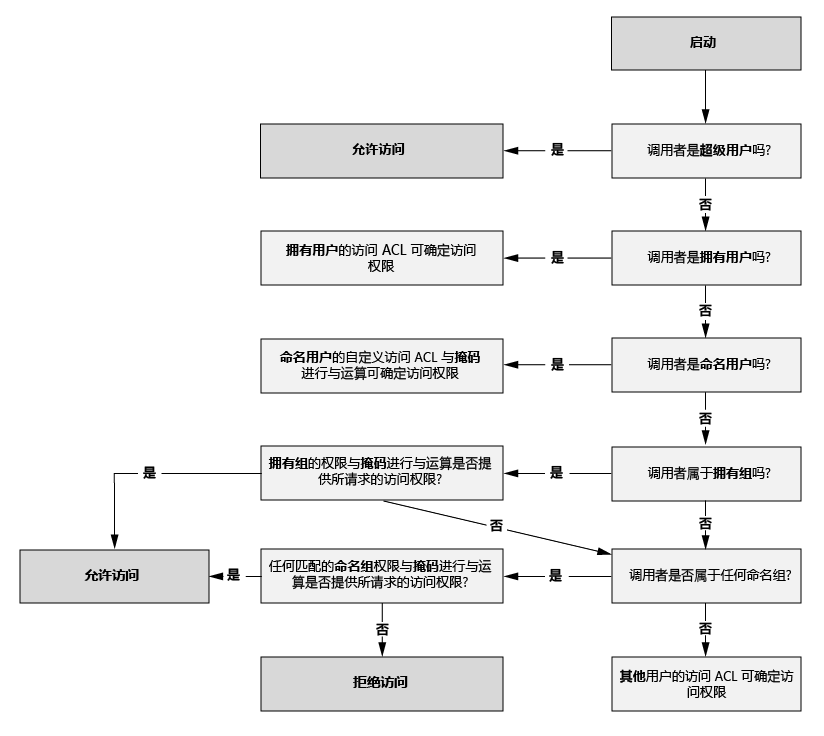

## 掩码和“有效权限”

**掩码**是一个 RWX 值，在执行访问检查算法时，用于限制**命名用户**、**拥有组**和**命名组**的访问权限。下面是掩码的重要概念。

* 掩码创建“有效权限”，即，执行访问检查时修改权限。
* 文件所有者和任何超级用户可以直接编辑掩码。
* 掩码可以删除权限，创建有效的权限。掩码**无法**将权限添加到有效权限。

让我们探讨一些示例。下面的掩码设置为 **RWX**，这意味着掩码不会删除任何权限。请注意，在执行访问检查期间，不会改变命名用户、拥有组和命名组的有效权限。

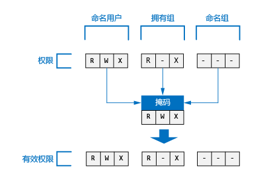

在以下示例中，掩码设置为 **R-X**。因此，它在执行访问检查时将**关闭****命名用户**、**拥有组**和**命名组**的“写入”权限。

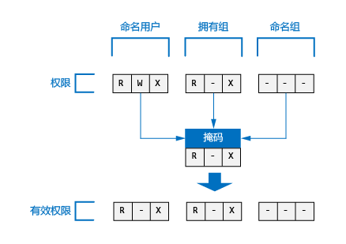

为提供参考，下面显示了文件或文件夹掩码在 Azure 门户中的位置。

>[AZURE.NOTE] 对于新 Data Lake Store 帐户，根文件夹（“/”）的访问 ACL 和默认 ACL 的掩码默认为 RWX。

## 新文件和文件夹权限

在现有文件夹下面创建新文件或文件夹时，父文件夹的默认 ACL 将会确定：

* 子文件夹的默认 ACL 和访问 ACL
* 子文件的访问 ACL（文件没有默认 ACL）

### 子文件或文件夹的访问 ACL

创建子文件或文件夹时，父项的默认 ACL 复制为子文件或文件夹的访问 ACL。此外，如果**其他**用户拥有父项默认 ACL 中的 RWX 权限，则从子项的访问 ACL 中完全删除该权限。

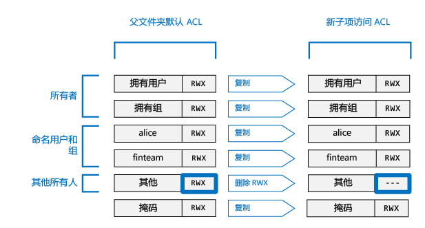

在大多数情况下，只需获得上述信息，即可知道如何确定子项的访问 ACL。但是，如果熟悉 POSIX 系统并且想要详细了解如何实现此转换，请参阅本文稍后的[为新文件和文件夹创建访问 ACL 时所用的 Umask 角色](#umasks-role-in-creating-the-access-acl-for-new-files-and-folders)部分。
 

### 子文件夹的默认 ACL

在父文件夹下面创建子文件夹时，父文件夹的默认 ACL 按原状复制到子文件夹的默认 ACL。

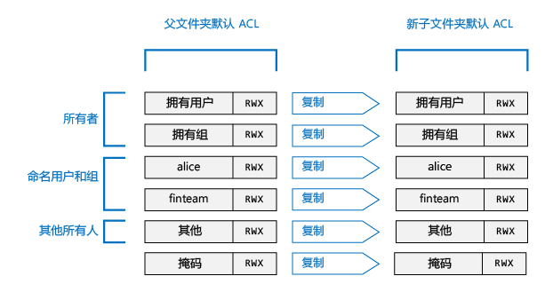

## 帮助了解 Data Lake Store 中 ACL 的高级主题

以下高级主题可帮助了解如何确定 Data Lake Store 文件或文件夹的 ACL。

### 为新文件和文件夹创建访问 ACL 时所用的 Umask 角色

在 POSIX 兼容的系统中，一般概念是 umask 是父文件夹上的一个 9 位值，用于转换**拥有用户**、**拥有组**和**其他**用户对新子文件或文件夹访问 ACL 的权限。umask 的位标识要在子项的访问 ACL 中关闭哪些位。因此，使用选择性地使用 umask 来防止传播拥有用户、拥有组和其他用户的权限。
  
在 HDFS 系统中，umask 通常是管理员控制的站点范围的配置选项。Data Lake Store 使用不可更改的**帐户范围的 umask**。下表显示了 Data Lake Store 的 umask。

| 用户组 | 设置 | 对新子项的访问 ACL 的影响 |
|------------ |---------|---------------------------------------|
| 拥有用户 | --- | 无影响 | | 拥有组| --- | 无影响 | | 其他 | RWX | 删除“读取 + 写入 + 执行”|

下图显示了此 umask 的工作原理。实质影响是删除**其他**用户的“读取 + 写入 + 执行”权限。由于 umask 未指定**拥有用户**和**拥有组**的位，因此不转换这些权限。

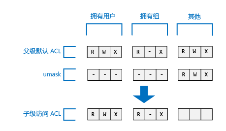

### 粘滞位

粘滞位是 POSIX 文件系统的更高级功能。在 Data Lake Store 的上下文中，不太可能需要粘滞位。

下表显示了粘滞位在 Data Lake Store 中的工作原理。

| 用户组 | 文件 | 文件夹 |
|--------------------|---------|-------------------------|
| 粘滞位 **OFF** | 无影响 | 无影响 |
| 粘滞位 **ON** | 无影响 | 防止任何人（子项的**超级用户**和**拥有用户**除外）删除或重命名该子项。 |

粘滞位不会显示在 Azure 门户中。

## Data Lake Store 中的 ACL 常见问题

下面是有关 Data Lake Store 中 ACL 的一些常见问题。

### 是否必须启用 ACL 的支持？

不是。Data Lake Store 帐户始终启用了通过 ACL 进行的访问控制。

### 以递归方式删除文件夹及其内容需要哪些权限？

* 父文件夹必须拥有“写入 + 执行”权限。
* 要删除的文件夹及其中的每个文件夹都需要“读取 + 写入 + 执行”权限。
>[AZURE.NOTE] 删除文件夹中的文件时不需要这些文件的写入权限。此外，**永远无法**删除根文件夹“/”。

### 谁设置为文件或文件夹的所有者？

文件或文件夹的创建者将成为所有者。

### 创建文件或文件夹时谁将设置为其拥有组？

拥有组是从新文件或文件夹创建所在的父文件夹的拥有组复制而来的。

### 文件的拥有用户没有所需的 RWX 权限，该怎么办？

拥有用户只需更改文件的权限，即可自动获得所需的任何 RWX 权限。

### Data Lake Store 是否支持 ACL 继承？

没有。

### 掩码与 umask 之间有何差异？

| 掩码 | umask|
|------|------|
| 每个文件和文件夹都提供**掩码**属性。 | **umask** 是 Data Lake Store 帐户的属性。因此，Data Lake Store 中只有一个 umask。 |
| 文件的拥有用户或拥有组或超级用户都可以改变文件或文件夹的掩码属性。 | 任何用户（甚至超级用户）都无法修改 umask 属性。它是一个无法更改的常量值。|
| 在运行时执行访问检查算法时，将使用掩码属性来确定用户是否拥有对文件或文件夹执行操作的权限。掩码的角色就是在执行访问检查时创建“有效权限”。 | 执行访问检查期间根本不使用 umask。umask 用于确定文件夹新子项的访问 ACL。 |
| 掩码是一个 3 位 RWX 值，在执行访问检查时应用到命名用户、命名组和拥有用户。| umask 是一个 9 位值，应用到新子级的拥有用户、拥有组和其他用户。| 

### 在哪里可以了解 POSIX 访问控制模型的详细信息？

* [http://www.vanemery.com/Linux/ACL/POSIX\_ACL\_on\_Linux.html](http://www.vanemery.com/Linux/ACL/POSIX_ACL_on_Linux.html)

* [HDFS Permission Guide](http://hadoop.apache.org/docs/current/hadoop-project-dist/hadoop-hdfs/HdfsPermissionsGuide.html)（HDFS 权限指南）

* [POSIX FAQ](http://www.opengroup.org/austin/papers/posix_faq.html)（POSIX 常见问题）

* [POSIX 1003.1 2008](http://standards.ieee.org/findstds/standard/1003.1-2008.html)

* [POSIX 1003.1e 1997](http://users.suse.com/~agruen/acl/posix/Posix_1003.1e-990310.pdf)

* [POSIX ACL on Linux](http://users.suse.com/~agruen/acl/linux-acls/online/)（Linux 上的 POSIX ACL）

* [ACL using Access Control Lists on Linux](http://bencane.com/2012/05/27/acl-using-access-control-lists-on-linux/)（在 Linux 上使用访问控制列表 (ACL)）

## 另请参阅

* [Overview of Azure Data Lake Store](data-lake-store-overview.md)（Azure Data Lake Store 概述）

* [Get Started with Azure Data Lake Analytics](../data-lake-analytics/data-lake-analytics-get-started-portal.md)（Azure Data Lake Analytics 入门）

<!---HONumber=AcomDC_0921_2016-->