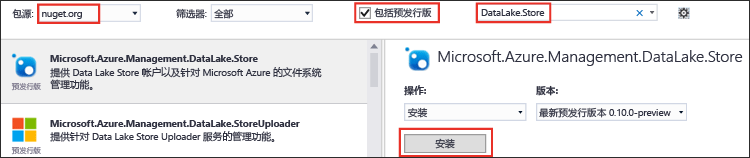

<properties
   pageTitle="使用 Data Lake Store .NET SDK 开发应用程序 | Microsoft Azure"
   description="使用 Azure Data Lake Store .NET SDK 开发应用程序"
   services="data-lake-store"
   documentationCenter=""
   authors="nitinme"
   manager="jhubbard"
   editor="cgronlun"/>

<tags
   ms.service="data-lake-store"
   ms.devlang="na"
   ms.topic="get-started-article"
   ms.tgt_pltfrm="na"
   ms.workload="big-data"
   ms.date="09/15/2016"
   ms.author="nitinme"/>

# 通过 .NET SDK 实现 Azure Data Lake Store 入门

> [AZURE.SELECTOR]
- [门户](data-lake-store-get-started-portal.md)
- [PowerShell](data-lake-store-get-started-powershell.md)
- [.NET SDK](data-lake-store-get-started-net-sdk.md)
- [Java SDK](data-lake-store-get-started-java-sdk.md)
- [REST API](data-lake-store-get-started-rest-api.md)
- [Azure CLI](data-lake-store-get-started-cli.md)
- [Node.js](data-lake-store-manage-use-nodejs.md)

了解如何使用 [Azure Data Lake Store .NET SDK](https://msdn.microsoft.com/library/mt581387.aspx) 执行基本操作，如创建文件夹、上传和下载数据文件等。有关 Data Lake 的详细信息，请参阅 [Azure Data Lake Store](data-lake-store-overview.md)。

## 先决条件

* **Visual Studio 2013 或 2015**。以下说明使用 Visual Studio 2015。

* **一个 Azure 订阅**。请参阅[获取 Azure 免费试用版](https://azure.microsoft.com/pricing/free-trial/)。

* **Azure Data Lake Store 帐户**。有关如何创建帐户的说明，请参阅 [Azure Data Lake Store 入门](data-lake-store-get-started-portal.md)

* 如果希望应用程序自动进行 Azure Active Directory 身份验证，请**创建 Azure Active Directory 应用程序**。

	* **非交互式服务主体身份验证** - 必须在 Azure Active Directory 中创建一个 **Web 应用程序**。创建应用程序后，检索以下与应用程序相关的值。
		- 为应用程序获取**客户端 ID** 和**客户端密码**
		- 将 Azure Active Directory 应用程序分配给一个角色。该角色可以在要对 Azure Active Directory 应用程序授予权限的范围级别。例如，可以将应用程序分配至订阅级别或资源组级别。

	有关如何检索这些值、设置权限以及分配角色的说明，请参阅[使用门户创建 Active Directory 应用程序和服务主体](../resource-group-create-service-principal-portal.md)。

## 创建 .NET 应用程序

1. 打开 Visual Studio，创建一个控制台应用程序。

2. 在“文件”菜单中，单击“新建”，然后单击“项目”。

3. 在“新建项目”中，键入或选择以下值：

	| 属性 | 值 |
	|----------|-----------------------------|
	| 类别 | 模板/Visual C#/Windows |
	| 模板 | 控制台应用程序 |
	| Name | CreateADLApplication |

4. 单击“确定”以创建该项目。

5. 将 NuGet 包添加到项目。

	1. 在解决方案资源管理器中右键单击项目名称，单击“管理 NuGet 包”。
	2. 在“NuGet 包管理器”选项卡上，确保“包源”设置为“nuget.org”，“包含预发行版”复选框处于选中状态。
	3. 搜索并安装以下 NuGet 包：

		* `Microsoft.Azure.Management.DataLake.Store` - 本教程使用 v0.12.5 预览版。
		* `Microsoft.Azure.Management.DataLake.StoreUploader` - 本教程使用 v0.10.6 预览版。
		* `Microsoft.Rest.ClientRuntime.Azure.Authentication` - 本教程使用 v2.2.8 预览版。

		

	4. 关闭“NuGet 包管理器”。

6. 打开“Program.cs”，删除现有代码，然后包含以下语句，添加对命名空间的引用。

        using System;
        using System.Threading;
        
        using Microsoft.Rest.Azure.Authentication;
        using Microsoft.Azure.Management.DataLake.Store;
        using Microsoft.Azure.Management.DataLake.StoreUploader;

7. 按如下所示声明变量，提供已存在的 Data Lake Store 名称和资源组名称的值。此外，确保计算机中必须存在此处提供的本地路径和文件名。在命名空间声明后，添加以下代码片段。

        namespace SdkSample
        {
            class Program
            {
                private static DataLakeStoreAccountManagementClient _adlsClient;
                private static DataLakeStoreFileSystemManagementClient _adlsFileSystemClient;
                
                private static string _adlsAccountName;
                private static string _resourceGroupName;
                private static string _location;
                
                private static void Main(string[] args)
                {
                    _adlsAccountName = "<DATA-LAKE-STORE-NAME>"; // TODO: Replace this value with the name of your existing Data Lake Store account.
                    _resourceGroupName = "<RESOURCE-GROUP-NAME>"; // TODO: Replace this value with the name of the resource group containing your Data Lake Store account.
                    _location = "East US 2";
                    
                    string localFolderPath = @"C:\local_path"; // TODO: Make sure this exists and can be overwritten.
                    string localFilePath = localFolderPath + "file.txt"; // TODO: Make sure this exists and can be overwritten.
                    string remoteFolderPath = "/data_lake_path/";
                    string remoteFilePath = remoteFolderPath + "file.txt";
                }
            }
        }

本文的剩余部分介绍如何使用现有的 .NET 方法来执行操作，例如身份验证和文件上传等。

## 身份验证

可以使用以下代码片段体验交互式登录。

    // User login via interactive popup
    //    Use the client ID of an existing AAD "Native Client" application.
    SynchronizationContext.SetSynchronizationContext(new SynchronizationContext());
    var domain = "common"; // Replace this string with the user's Azure Active Directory tenant ID or domain name, if needed.
    var nativeClientApp_clientId = "1950a258-227b-4e31-a9cf-717495945fc2";
    var activeDirectoryClientSettings = ActiveDirectoryClientSettings.UsePromptOnly(nativeClientApp_clientId, new Uri("urn:ietf:wg:oauth:2.0:oob"))
    var creds = UserTokenProvider.LoginWithPromptAsync(domain, activeDirectoryClientSettings).Result;

也可以使用以下代码片段通过客户端密码/应用程序密钥/服务主体对应用程序进行非交互式身份验证。

    // Service principal / appplication authentication with client secret / key
    //    Use the client ID and certificate of an existing AAD "Web App" application.
    SynchronizationContext.SetSynchronizationContext(new SynchronizationContext());
    var domain = "<AAD-directory-domain>";
    var webApp_clientId = "<AAD-application-clientid>";
    var clientSecret = "<AAD-application-clientid>";
    var clientCredential = new ClientCredential(webApp_clientId, clientSecret);
    var creds = ApplicationTokenProvider.LoginSilentAsync(domain, clientCredential).Result;

还可以使用以下代码片段通过应用程序证书/服务主体对应用程序进行非交互式身份验证。

    // Service principal / application authentication with certificate
    //    Use the client ID and certificate of an existing AAD "Web App" application.
    SynchronizationContext.SetSynchronizationContext(new SynchronizationContext());
    var domain = "<AAD-directory-domain>";
    var webApp_clientId = "<AAD-application-clientid>";
    System.Security.Cryptography.X509Certificates.X509Certificate2 clientCert = <AAD-application-client-certificate>
    var clientAssertionCertificate = new ClientAssertionCertificate(webApp_clientId, clientCert);
    var creds = ApplicationTokenProvider.LoginSilentWithCertificateAsync(domain, clientAssertionCertificate).Result;

## 创建客户端对象

以下代码片段创建了 Data Lake Store 帐户和 filesystem 客户端对象，用于向服务发出请求。

    // Create client objects
    var fileSystemClient = new DataLakeStoreFileSystemManagementClient(creds);

## 列出某个订阅中的所有 Data Lake Store 帐户

以下代码片段列出了给定 Azure 订阅中的所有 Data Lake Store 帐户。

    // List all ADLS accounts within the subscription
    public static List<DataLakeStoreAccount> ListAdlStoreAccounts()
    {
        var response = _adlsClient.Account.List(_adlsAccountName);
        var accounts = new List<DataLakeStoreAccount>(response);
        
        while (response.NextPageLink != null)
        {
            response = _adlsClient.Account.ListNext(response.NextPageLink);
            accounts.AddRange(response);
        }
        
        return accounts;
    }

## 创建目录

以下代码片段演示了 `CreateDirectory` 方法，使用该方法可以在 Data Lake Store 帐户中创建目录。

    // Create a directory
    public static void CreateDirectory(string path)
    {
        _adlsFileSystemClient.FileSystem.Mkdirs(_adlsAccountName, path);
    }

## 上载文件

以下代码片段演示了 `UploadFile` 方法，使用该方法可以将文件上传到 Data Lake Store 帐户。

    // Upload a file
    public static void UploadFile(string srcFilePath, string destFilePath, bool force = true)
    {
        var parameters = new UploadParameters(srcFilePath, destFilePath, _adlsAccountName, isOverwrite: force);
        var frontend = new DataLakeStoreFrontEndAdapter(_adlsAccountName, _adlsFileSystemClient);
        var uploader = new DataLakeStoreUploader(parameters, frontend);
        uploader.Execute();
    }

DataLakeStoreUploader 支持在本地文件（或文件夹）路径与 Data Lake Store 之间进行递归上传和下载。

## 获取文件或目录信息

以下代码片段演示了 `GetItemInfo` 方法，使用该方法可以检索有关 Data Lake Store 中文件和目录的信息。

    // Get file or directory info
    public static FileStatusProperties GetItemInfo(string path)
    {
        return _adlsFileSystemClient.FileSystem.GetFileStatus(_adlsAccountName, path).FileStatus;
    }

## 列出文件或目录

以下代码片段演示了 `ListItem` 方法，使用该方法可以列出 Data Lake Store 帐户中的文件或目录。

    // List files and directories
    public static List<FileStatusProperties> ListItems(string directoryPath)
    {
        return _adlsFileSystemClient.FileSystem.ListFileStatus(_adlsAccountName, directoryPath).FileStatuses.FileStatus.ToList();
    }

## 连接文件

以下代码片段演示了 `ConcatenateFiles` 方法，使用该方法可以连接文件。

    // Concatenate files
    public static void ConcatenateFiles(string[] srcFilePaths, string destFilePath)
    {
        _adlsFileSystemClient.FileSystem.Concat(_adlsAccountName, destFilePath, srcFilePaths);
    }

## 附加到文件

以下代片码段演示了 `AppendToFile` 方法，使用该方法可以将数据附加到已存储在 Data Lake Store 帐户中的文件。

    // Append to file
    public static void AppendToFile(string path, string content)
    {
        var stream = new MemoryStream(Encoding.UTF8.GetBytes(content));
        
        _adlsFileSystemClient.FileSystem.Append(_adlsAccountName, path, stream);
    }

## 下载文件

下面的代片码段演示了 `DownloadFile` 方法，使用该方法可以从 Data Lake Store 帐户下载文件。

    // Download file
    public static void DownloadFile(string srcPath, string destPath)
    {
        var stream = _adlsFileSystemClient.FileSystem.Open(_adlsAccountName, srcPath);
        var fileStream = new FileStream(destPath, FileMode.Create);
        
        stream.CopyTo(fileStream);
        fileStream.Close();
        stream.Close();
    }

## 后续步骤

- [保护 Data Lake Store 中的数据](data-lake-store-secure-data.md)
- [配合使用 Azure Data Lake Analytics 和 Data Lake Store](../data-lake-analytics/data-lake-analytics-get-started-portal.md)
- [配合使用 Azure HDInsight 和 Data Lake Store](data-lake-store-hdinsight-hadoop-use-portal.md)
- [Data Lake Store .NET SDK 参考](https://msdn.microsoft.com/library/mt581387.aspx)
- [Data Lake Store REST 参考](https://msdn.microsoft.com/library/mt693424.aspx)

<!---HONumber=AcomDC_0921_2016-->