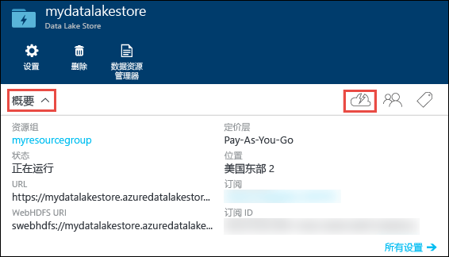
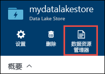
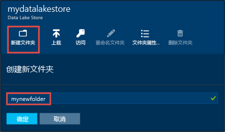
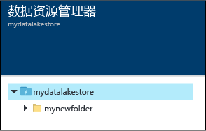
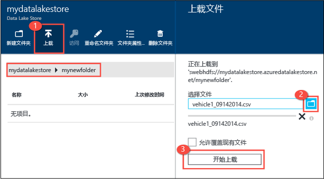
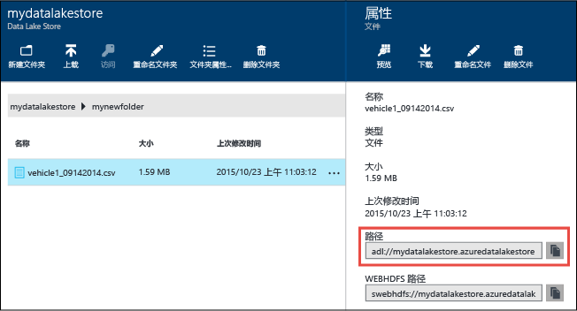
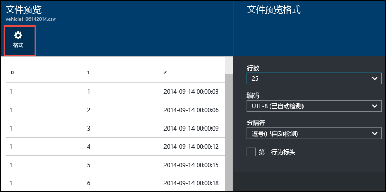
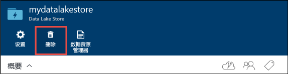

<properties 
   pageTitle="Data Lake Store 入门 | Azure" 
   description="使用门户创建 Data Lake Store 帐户，在 Data Lake Store 中执行基本操作" 
   services="data-lake-store" 
   documentationCenter="" 
   authors="nitinme" 
   manager="jhubbard" 
   editor="cgronlun"/>
 
<tags
   ms.service="data-lake-store"
   ms.devlang="na"
   ms.topic="hero-article"
   ms.tgt_pltfrm="na"
   ms.workload="big-data" 
   ms.date="09/13/2016"
   ms.author="nitinme"/>

# 通过 Azure 门户实现 Azure Data Lake Store 入门

> [AZURE.SELECTOR]
- [门户](data-lake-store-get-started-portal.md)
- [PowerShell](data-lake-store-get-started-powershell.md)
- [.NET SDK](data-lake-store-get-started-net-sdk.md)
- [Java SDK](data-lake-store-get-started-java-sdk.md)
- [REST API](data-lake-store-get-started-rest-api.md)
- [Azure CLI](data-lake-store-get-started-cli.md)
- [Node.js](data-lake-store-manage-use-nodejs.md)

了解如何使用 Azure 门户来创建 Azure Data Lake Store 帐户以及执行基本操作，如创建文件夹、上传和下载数据文件、删除帐户等。有关 Data Lake Store 的详细信息，请参阅 [Azure Data Lake Store 概述](data-lake-store-overview.md)。

## 先决条件

在开始阅读本教程前，你必须具有：

- **一个 Azure 订阅**。请参阅[获取 Azure 免费试用版](https://azure.microsoft.com/pricing/free-trial/)。

## 通过视频学得更快？

请观看下列视频实现 Data Lake Store 入门。

* [Create a Data Lake Store account](https://mix.office.com/watch/1k1cycy4l4gen)（创建 Data Lake Store 帐户）
* [Manage data in Data Lake Store using the Data Explorer](https://mix.office.com/watch/icletrxrh6pc)（使用数据资源管理器管理 Data Lake Store 中的数据）

## 创建 Azure Data Lake Store 帐户

1. 登录到新的 [Azure 门户](https://portal.azure.com)。

2. 依次单击“新建”、“数据 + 存储”、“Azure Data Lake Store”。阅读“Azure Data Lake Store”边栏选项卡中的信息，单击边栏选项卡左下角的“创建”。

3. 在“新建 Data Lake Store”边栏选项卡中，提供以下屏幕截图中所示的值：

	

	- **订阅**。选择要在其下创建新的 Data Lake Store 帐户的订阅。
	- **资源组**。选择现有资源组，或单击“创建资源组”创建一个。资源组是一个容器，包含应用程序的相关资源。有关详细信息，请参阅 [Azure 中的资源组](resource-group-overview.md#resource-groups)。
	- **位置**：选择要创建 Data Lake Store 帐户的位置。

4. 如果希望能从启动板访问 Data Lake Store 帐户，请选择“固定到启动板”。

5. 单击“创建”。如果选择将帐户固定到启动板，将返回启动板，在启动板中可以看到预配 Data Lake Store 帐户的进度。预配 Data Lake Store 帐户后，将显示帐户边栏选项卡。

6. 展开“概要”下拉列表，查看有关 Data Lake Store 帐户的信息，如其所属的资源组、所在位置等。单击“快速启动”图标，查看与 Data Lake Store 相关的其他资源链接。

	

## 在 Azure Data Lake Store 帐户中创建文件夹

可以在 Azure Data Lake Store 帐户下创建文件夹，用于管理和存储数据。

1. 打开刚刚创建的 Data Lake Store 帐户。从左窗格中，单击“浏览”，单击“Data Lake Store”，从 Data Lake Store 边栏选项卡中单击要在其下创建文件夹的帐户名。如果将帐户固定到了启动板，请单击该帐户磁贴。

2. 在 Data Lake Store 帐户边栏选项卡中，单击“数据资源管理器”。

	

3. 在 Data Lake Store 帐户边栏选项卡中，单击“新建文件夹”，输入新文件夹的名称，单击“确定”。
	
	
	
	新创建的文件夹将在“数据资源管理器”边栏选项卡中列出。可以创建任何级别的嵌套文件夹。

	

## 将数据上传到 Azure Data Lake Store 帐户

可以直接将数据上传到 Azure Data Lake Store 帐户的根级别，也可以上传到在帐户中创建的文件夹。请按照下面屏幕截图中的步骤，从“数据资源管理器”边栏选项卡上传文件到子文件夹。在此屏幕截图中，文件已上传到子文件夹，如痕迹导航栏（用红框标记）所示。

如果正在查找一些示例数据进行上传，可以从 [Azure Data Lake Git 存储库](https://github.com/MicrosoftBigData/usql/tree/master/Examples/Samples/Data/AmbulanceData)获取 **Ambulance Data** 文件夹。

## 存储数据的属性以及可执行的操作

单击新添加的文件，打开“属性”边栏选项卡。此边栏选项卡中将显示与文件相关的属性以及可对文件执行的操作。还可将文件的完整路径复制到 Azure Data Lake Store 帐户，如下面屏幕截图中的红框所示。

* 单击“预览”，直接从浏览器预览文件。还可以指定预览的格式。单击“预览”，在“文件预览”边栏选项卡中单击“格式”，在“文件预览格式”边栏选项卡中指定选项，如要显示的行数、要使用的编码以及要使用的分隔符等。

  

* 单击“下载”，将文件下载到计算机中。

* 单击“重命名文件”，对文件重命名。

* 单击“删除文件”，删除文件。

## 保护数据

可以通过 Azure Active Directory 和访问控制 (ACL) 来保护 Azure Data Lake Store 帐户中存储的数据。有关如何实现保护的说明，请参阅[保护 Azure Data Lake Store 中的数据](data-lake-store-secure-data.md)。

## 删除 Azure Data Lake Store 帐户

要删除 Azure Data Lake Store 帐户，请在 Data Lake Store 边栏选项卡中单击“删除”。系统将提示输入要删除的帐户的名称，确认该操作。输入帐户的名称，单击“删除”。

## 后续步骤

- [保护 Data Lake Store 中的数据](data-lake-store-secure-data.md)
- [配合使用 Azure Data Lake Analytics 和 Data Lake Store](../data-lake-analytics/data-lake-analytics-get-started-portal.md)
- [配合使用 Azure HDInsight 和 Data Lake Store](data-lake-store-hdinsight-hadoop-use-portal.md)
- [获取 Data Lake Store 的诊断日志](data-lake-store-diagnostic-logs.md)

<!---HONumber=AcomDC_0921_2016-->