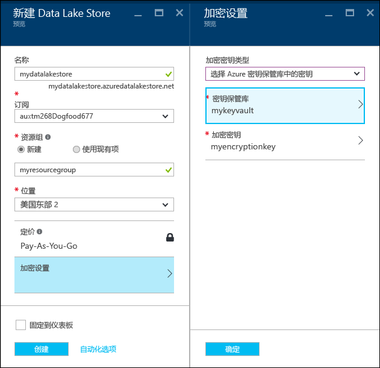
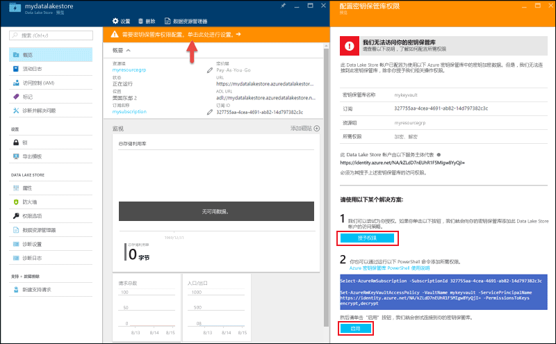

# Azure Data Lake Store 入门（使用 Azure 门户）
> [!div class="op_single_selector"]
> * [门户](data-lake-store-get-started-portal.md)
> * [PowerShell](data-lake-store-get-started-powershell.md)
> * [.NET SDK](data-lake-store-get-started-net-sdk.md)
> * [Java SDK](data-lake-store-get-started-java-sdk.md)
> * [REST API](data-lake-store-get-started-rest-api.md)
> * [Azure CLI 2.0](data-lake-store-get-started-cli-2.0.md)
> * [Node.js](data-lake-store-manage-use-nodejs.md)
> * [Python](data-lake-store-get-started-python.md)
>
> 

了解如何使用 Azure 门户来创建 Azure Data Lake Store 帐户以及执行基本操作，如创建文件夹、上传和下载数据文件、删除帐户等。有关详细信息，请参阅 [Azure Data Lake Store 概述](data-lake-store-overview.md)。

以下两个视频包含本文所述的信息：

* [Create a Data Lake Store account](https://mix.office.com/watch/1k1cycy4l4gen)
* [Manage data in Data Lake Store using the Data Explorer](https://mix.office.com/watch/icletrxrh6pc)

## 先决条件
开始学习本教程之前，必须做好以下准备：

* **一个 Azure 订阅**。 请参阅 [获取 Azure 免费试用版](https://azure.microsoft.com/pricing/free-trial/)。

## 创建 Azure Data Lake Store 帐户

1. 登录到新的 [Azure 门户](https://portal.azure.com)。
2. 依次单击“新建”、“数据 + 存储”、“Azure Data Lake Store”。 阅读“Azure Data Lake Store”边栏选项卡中的信息，并单击边栏选项卡左下角的“创建”。
3. 在“新建 Data Lake Store”边栏选项卡中，提供以下屏幕截图中所示的值：
   
    
   
   * **名称**。 输入 Data Lake Store 帐户的唯一名称。
   * **订阅**。 选择要在其下创建新的 Data Lake Store 帐户的订阅。
   * **资源组**。 选择现有资源组，或选择“新建”选项创建一个资源组。 资源组是一个容器，包含应用程序的相关资源。 有关详细信息，请参阅 [Azure 中的资源组](../azure-resource-manager/resource-group-overview.md#resource-groups)。
   * **位置**：选择要创建 Data Lake Store 帐户的位置。
   * **加密设置**。 有三个选项：
     
     * 不启用加密。
     * 使用由 Azure Data Lake 管理的密钥。  如果需要使用 Azure Data Lake Store 来管理加密密钥。
     * 从 Azure Key Vault 选择密钥。 可以选择现有的 Azure Key Vault，也可以创建新的 Key Vault。 若要使用 Key Vault 中的密钥，必须为 Azure Data Lake Store 帐户分配 Azure Key Vault 访问权限。 有关说明，请参阅[分配对 Azure Key Vault 的权限](#assign-permissions-to-azure-key-vault)。
       
        
       
        在“加密设置”边栏选项卡中单击“确定”。

        有关详细信息，请参阅 [Azure Data Lake Store 中的数据加密](./data-lake-store-encryption.md)。

4. 单击“创建” 。 如果选择将帐户固定到仪表板，将返回仪表板，在其中可以查看预配 Data Lake Store 帐户的进度。 预配 Data Lake Store 帐户后，会显示帐户边栏选项卡。

也可以使用 Azure 资源管理器模板创建 Data Lake Store 帐户。 可以从 [Azure 快速启动模板](https://azure.microsoft.com/resources/templates/?term=data+lake+store)访问这些模板：

- 不进行数据加密：[Deploy Azure Data Lake Store account with no data encryption](https://azure.microsoft.com/en-us/resources/templates/101-data-lake-store-no-encryption/)（在不进行数据加密的情况下部署 Azure Data Lake Store 帐户）。
- 使用 Data Lake Store 进行数据加密：[Deploy Data Lake Store account with encryption(Data Lake)](https://azure.microsoft.com/resources/templates/101-data-lake-store-encryption-adls/)（在进行加密 (Data Lake) 的情况下部署 Data Lake Store 帐户）。
- 使用 Azure Key Vault 进行数据加密：[Deploy Data Lake Store account with encryption(Key Vault)](https://azure.microsoft.com/resources/templates/101-data-lake-store-encryption-key-vault/)（在进行加密 (Key Vault) 的情况下部署 Data Lake Store 帐户）。

### 分配对 Azure Key Vault 的权限
如果使用 Azure 密钥保管库中的密钥为 Data Lake Store 帐户配置加密，必须配置 Azure Data Lake Store 帐户与 Azure 密钥保管库之间的访问权限。 为此，请执行以下步骤。

1. 如果使用了 Azure 密钥保管库中的密钥，Data Lake Store 帐户的边栏选项卡顶部会显示一条警告。 单击该警告会打开“配置密钥保管库权限”边栏选项卡。
   
    
2. 该边栏选项卡显示两个用于配置访问权限的选项。
   
   * 在第一个选项中，单击“授予权限”来配置访问权限。 仅当创建 Data Lake Store 帐户的用户也是 Azure 密钥保管库的管理员时，才启用第一个选项。
   * 另一个选项用于运行边栏选项卡中显示的 PowerShell cmdlet。 必须是 Azure 密钥保管库的所有者，或者能够授予对 Azure 密钥保管库的权限。 运行该 cmdlet 后，请返回上述边栏选项卡，并单击“启用”配置访问权限。

## 在 Azure Data Lake Store 帐户中创建文件夹
可以在 Azure Data Lake Store 帐户下创建文件夹，用于管理和存储数据。

1. 打开已创建的 Data Lake Store 帐户。 从左窗格中，单击“浏览”，单击“Data Lake Store”，从 Data Lake Store 边栏选项卡中单击要在其下创建文件夹的帐户名。 如果将帐户固定到了启动板，请单击该帐户磁贴。
2. 在 Data Lake Store 帐户边栏选项卡中，单击“数据资源管理器” 。
   
    
3. 在 Data Lake Store 帐户边栏选项卡中，单击“新建文件夹”，输入新文件夹的名称，并单击“确定”。
   
    
   
    新创建的文件夹在“数据资源管理器”边栏选项卡中列出。 可以创建任何级别的嵌套文件夹。
   
    

## 将数据上传到 Azure Data Lake Store 帐户
可以直接将数据上传到 Azure Data Lake Store 帐户的根级别，也可以上传到在帐户中创建的文件夹。 请按照以下屏幕截图中的步骤，从“数据资源管理器”边栏选项卡上传文件到子文件夹。 在此屏幕截图中，文件已上传到子文件夹，如痕迹导航栏（用红框标记）所示。

如果正在查找一些示例数据进行上传，可以从 **Azure Data Lake Git 存储库** 获取 [Ambulance Data](https://github.com/MicrosoftBigData/usql/tree/master/Examples/Samples/Data/AmbulanceData)文件夹。

## 适用于已存储数据的属性和操作
单击新添加的文件，打开“属性”  边栏选项卡。 此边栏选项卡中会显示与文件相关的属性以及可对文件执行的操作。 还可将文件的完整路径复制到 Azure Data Lake Store 帐户，如以下屏幕截图中的红框所示：

* 单击“预览”  ，直接从浏览器预览文件。 还可以指定预览的格式。 单击“预览”，在“文件预览”边栏选项卡中单击“格式”，在“文件预览格式”边栏选项卡中指定选项，例如，要显示的行数、要使用的编码以及要使用的分隔符，等等。
  
  
* 单击“下载”，将文件下载到计算机中。
* 单击“重命名文件”  ，对文件重命名。
* 单击“删除文件”  ，删除文件。

## 保护数据
可以通过 Azure Active Directory 和访问控制 (ACL) 来保护 Azure Data Lake Store 帐户中存储的数据。 有关如何实现保护的说明，请参阅 [保护 Azure Data Lake Store 中的数据](data-lake-store-secure-data.md)。

## 删除 Azure Data Lake Store 帐户
要删除 Azure Data Lake Store 帐户，请在 Data Lake Store 边栏选项卡中单击“删除” 。 系统会提示输入要删除的帐户的名称，确认该操作。 输入帐户的名称，单击“删除” 。

## 后续步骤
* [保护 Data Lake Store 中的数据](data-lake-store-secure-data.md)
* [配合使用 Azure Data Lake Analytic 和 Data Lake Store](../data-lake-analytics/data-lake-analytics-get-started-portal.md)
* [配合使用 Azure HDInsight 和 Data Lake Store](data-lake-store-hdinsight-hadoop-use-portal.md)
* [获取 Data Lake Store 的诊断日志](data-lake-store-diagnostic-logs.md)

