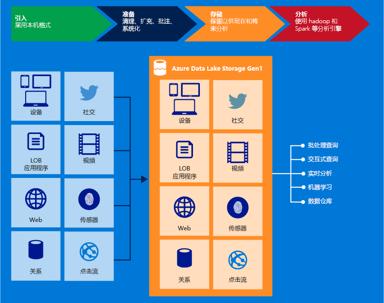

<properties
   pageTitle="Azure Data Lake Store 概述 | Azure"
   description="了解什么是 Azure Data Lake Store，及其与其他数据存储相比它有哪些优势"
   services="data-lake-store"
   documentationCenter=""
   authors="nitinme"
   manager="jhubbard"
   editor="cgronlun"/>

<tags
   ms.service="data-lake-store"
   ms.devlang="na"
   ms.topic="get-started-article"
   ms.tgt_pltfrm="na"
   ms.workload="big-data"
   ms.date="08/02/2016"
   ms.author="nitinme"/>

# Azure Data Lake Store 概述

Azure 数据湖存储是一个企业范围的超大规模存储库，适用于大数据分析工作负荷。使用 Azure Data Lake 可以在单个位置捕获任何大小、类型和引入速度的数据进行操作和探索分析。

> [AZURE.TIP] 使用 [Data Lake Store learning path](https://azure.microsoft.com/documentation/learning-paths/data-lake-store-self-guided-training/)（Data Lake Store 学习路径）开始探索 Azure Data Lake Store 服务。

使用与 WebHDFS 兼容的 REST API，可以从 Hadoop（HDInsight 群集提供）访问 Azure Data Lake Store。该服务专为存储数据分析而设计，并已针对数据分析方案优化了性能。它现成地包含了现实企业用例不可或缺的所有企业级功能：安全性、可管理性、可缩放性、可靠性和可用性。

下面介绍了 Azure Data Lake 的一些重要功能。

### 专为 Hadoop 而构建

Azure Data Lake Store 是一个 Apache Hadoop 文件系统，该系统与 Hadoop 分布式文件系统 (HDFS) 兼容并与 Hadoop 生态系统一起工作。采用 WebHDFS API 的现有 HDInsight 应用程序或服务可以轻松与 Data Lake Store 集成。Data Lake Store 还为应用程序公开了 WebHDFS 兼容的 REST 接口

使用 Hadoop 分析框架（例如 MapReduce 或 Hive），可以轻松分析 Data Lake Store 中存储的数据。可将 Microsoft Azure HDInsight 群集预配和配置为直接访问 Data Lake Store 中存储的数据。

### 无限存储空间，PB 量级的文件

Azure Data Lake Store 提供无限存储空间，适合用于存储各种分析数据。帐户大小、文件大小或 Data Lake 中可存储的数据量均无任何限制。支持 KB 到 PB 量级的单个文件大小，非常适合用于存储任何类型的数据。通过创建多个副本来长期存储数据，数据在 Data Lake 中的存储持续时间没有限制。

### 针对大数据分析优化了性能

Azure Data Lake Store 旨在运行需要利用超大吞吐量查询和分析海量数据的大规模分析系统。Data Lake 将文件的各个部分散在大量独立的存储服务器中。这可改善执行数据分析时并行读取文件的吞吐量。

### 随时可供企业使用：高度可用且安全

Azure Data Lake Store 提供符合行业标准的可用性和可靠性。数据资产可通过创建冗余副本来长期存储，防范任何意外的故障。企业可以在其解决方案中使用 Azure Data Lake 作为现有数据平台的重要组成部分。

Data Lake Store 还为存储的数据提供企业级安全性。有关详细信息，请参阅 [Securing data in Azure Data Lake Store](#DataLakeStoreSecurity)（保护 Azure Data Lake 中的数据）。

### 所有数据

Azure Data Lake Store 可按本机格式（原样）存储任何数据，不需要事先经过转换。加载数据之前，Data Lake Store 不需要定义架构，而是等待独立的分析框架在分析时解释数据和定义架构。Data Lake Store 能够存储任意大小和格式的文件，因此可以处理结构化、半结构化和非结构化数据。

Azure Data Lake Store 的数据容器本质上是文件夹和文件。可以使用 SDK、Azure 门户和 Azure Powershell 来处理存储的数据。只要使用这些接口和相应容器将数据放入存储，就能存储任何类型的数据。Data Lake Store 不会根据其存储的数据类型对数据执行任何特殊处理。

## 保护 Azure Data Lake Store 中的数据

Azure Data Lake Store 使用 Azure Active Directory 进行身份验证，使用访问控制列表 (ACL) 管理对数据的访问。

| 功能 | 说明 |
|-----------------------------------------|------------------------------------------|
| 身份验证 | Azure Data Lake Store 与 Azure Active Directory (AAD) 集成，可对 Azure Data Lake Store 中存储的所有数据进行标识与访问管理。因为这种集成，Azure Data Lake 可受益于所有 AAD 功能，包括多重身份验证、条件访问、基于角色的访问控制、应用程序使用情况监视、安全监视和警报等。Azure Data Lake Store 支持在 REST 接口中使用 OAuth 2.0 协议进行身份验证。 |
| 访问控制 | Azure Data Lake Store 通过支持 WebHDFS 协议公开的 POSIX 样式权限来提供访问控制。在当前版本中，可对根文件夹、子文件夹以及单个文件启用 ACL。应用到根文件夹的 ACL 也适用于所有子文件夹/文件。|

想要详细了解如何在 Data Lake Store 中保护数据，请访问以下链接。

* 有关如何保护 Data Lake Store 中的数据的说明，请参阅 [Securing data in Azure Data Lake Store](data-lake-store-secure-data.md)（保护 Azure Data Lake Store 中的数据）。
* 更喜欢视频？ [观看这段视频](https://mix.office.com/watch/1q2mgzh9nn5lx)，了解如何保护 Data Lake Store 中存储的数据。

## 与 Azure Data Lake Store 兼容的应用程序

Azure Data Lake Store 与 Hadoop 生态系统中的大多数开源组件兼容。此外，还与其他 Azure 服务完美集成。这就使得 Data Lake Store 成为解决数据存储需求的最佳选择。请访问以下链接，详细了解 Data Lake Store 如何配合开源组件及其他 Azure 服务。

* 有关可与 Data Lake Store 互操作的开源应用程序列表，请参阅 [Applications and services compatible with Azure Data Lake Store](data-lake-store-compatible-oss-other-applications.md)（与 Azure Data Lake Store 兼容的应用程序和服务）。
* 请参阅 [Integrating with other Azure services](data-lake-store-integrate-with-other-services.md)（与其他 Azure 服务集成），了解 Azure Data Lake Store 如何与其他 Azure 服务配合促成更广泛的方案。
* 请参阅 [Scenarios for using Data Lake Store](data-lake-store-data-scenarios.md)（使用 Data Lake Store 的方案），了解如何在引入数据、处理数据、下载数据和可视化数据等方案中使用 Data Lake Store。

## 什么是 Azure Data Lake Store 文件系统 (adl://)？

可以在 Hadoop 环境（在 HDInsight 群集上提供）中通过新文件系统 AzureDataLakeFilesystem (adl://) 访问 Data Lake Store。使用 adl:// 的应用程序和服务可以使用目前无法在 WebHDFS 中使用的其他性能优化功能。因此， Data Lake Store 可以提供更大的弹性：使用 adl:// 的建议选项获得最佳性能，或继续直接使用 WebHDFS API 维护现有代码。Azure HDInsight 充分使用 AzureDataLakeFilesystem 来提供 Data Lake Store 的最佳性能。

可以使用 `adl://<data_lake_store_name>.azuredatalakestore.net` 访问 Data Lake Store 中的数据。有关如何访问 Data Lake Store 中的数据的详细信息，请参阅 [View properties of the stored data](data-lake-store-get-started-portal.md#properties)（查看存储数据的属性）

## 如何开始使用 Azure Data Lake Store？

请参阅 [Get Started with Data Lake Store using the Azure Portal](data-lake-store-get-started-portal.md)（通过 Azure 门户开始使用 Data Lake Store），了解如何使用 Azure 门户预配 Data Lake Store。预配 Azure Data Lake Store 后，即可知道如何配合 Data Lake Store 使用大数据产品，例如 Azure Data Lake Analytics 或 Azure HDInsight。还可以创建 .NET 应用程序来建立 Azure Data Lake Store 帐户，以及执行数据上载、数据下载等操作。

- [Get Started with Azure Data Lake Analytics](../data-lake-analytics/data-lake-analytics-get-started-portal.md)（Azure Data Lake Analytics 入门）
- [Use Azure HDInsight with Data Lake Store](data-lake-store-hdinsight-hadoop-use-portal.md)（将 Azure HDInsight 与 Data Lake Store 配合使用）
- [Get started with Azure Data Lake Store using .NET SDK](data-lake-store-get-started-net-sdk.md)（通过 .NET SDK 开始使用 Azure Data Lake Store）

## Data Lake Store 视频

如果学习过程中更偏向于观看视频，Data Lake Store 提供了各种功能的视频。

* [Create an Azure Data Lake Store Account](https://mix.office.com/watch/1k1cycy4l4gen)（创建 Azure Data Lake Store 帐户。）
* [Use the Data Explorer to Manage Data in Azure Data Lake Store](https://mix.office.com/watch/icletrxrh6pc)（使用数据资源管理器管理 Azure Data Lake Store 中的数据）
* [Connect Azure Data Lake Analytics to Azure Data Lake Store](https://mix.office.com/watch/qwji0dc9rx9k)（将 Azure Data Lake Analytics 连接到 Azure Data Lake Store）
* [Access Azure Data Lake Store via Data Lake Analytics](https://mix.office.com/watch/1n0s45up381a8)（通过 Data Lake Analytics 访问 Azure Data Lake Store）
* [Connect Azure HDInsight to Azure Data Lake Store](https://mix.office.com/watch/l93xri2yhtp2)（将 Azure HDInsight 连接到 Azure Data Lake Store）
* [Access Azure Data Lake Store via Hive and Pig](https://mix.office.com/watch/1n9g5w0fiqv1q)（通过 Hive 和 Pig 访问 Azure Data Lake Store）
* [Use DistCp (Hadoop Distributed Copy) to copy data to and from Azure Data Lake Store](https://mix.office.com/watch/1liuojvdx6sie)（使用 DistCp（Hadoop 分布式复制）与 Azure Data Lake Store 双向复制数据）
* [Use Apache Sqoop to move data between relational sources and Azure Data Lake Store](https://mix.office.com/watch/1butcdjxmu114)（使用 Apache Sqoop 在关系源与 Azure Data Lake Store 之间移动数据）
* [Data Orchestration using Azure Data Factory for Azure Data Lake Store](https://mix.office.com/watch/1oa7le7t2u4ka)（使用 Azure 数据工厂协调 Azure Data Lake Store 的数据）
* [Securing Data in the Azure Data Lake Store](https://mix.office.com/watch/1q2mgzh9nn5lx)（保护 Azure Data Lake Store 中的数据）

<!---HONumber=AcomDC_0921_2016-->