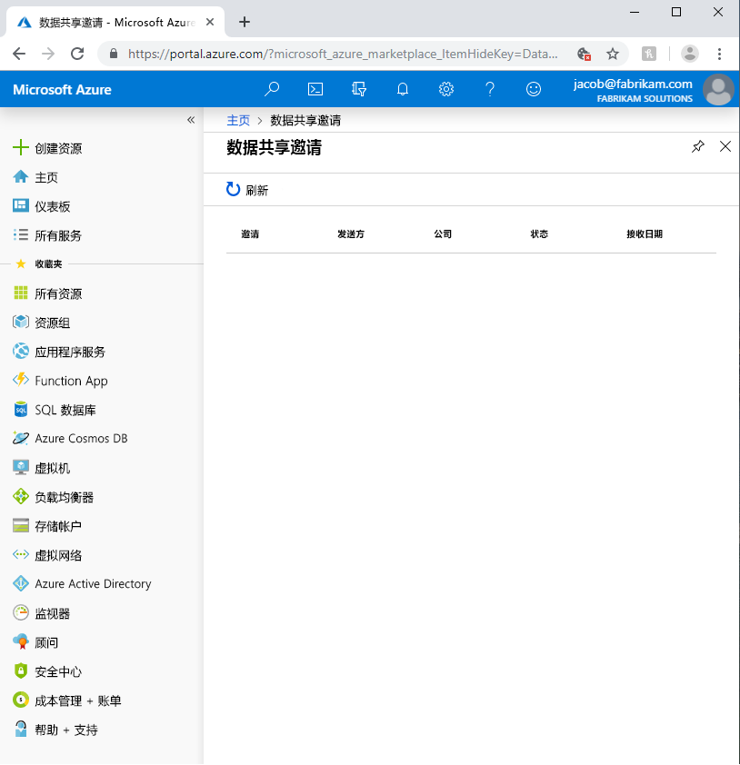

# 排查 Azure Data Share 预览版中的常见问题

本文介绍如何排查 Azure Data Share 预览版的常见问题。 

## Azure Data Share 邀请 

在某些情况下，当新用户单击他人发送的电子邮件邀请中的“接受邀请”时，会出现一个空的邀请列表。 

以上错误是此服务的一个已知问题，目前正在进行处理。 解决方法是执行以下步骤。 

1. 在 Azure 门户中，导航到“订阅”
1. 选择用于 Azure Data Share 的订阅
1. 单击“资源提供程序”
1. 搜索 Microsoft.DataShare
1. 单击“注册”

需要拥有 [Azure 参与者 RBAC 角色](https://docs.microsoft.com/azure/role-based-access-control/built-in-roles#contributor)才能完成这些步骤。 

如果仍无法查看数据共享邀请，请联系你的数据提供者，并确保他们已将邀请发送到你的 Azure 登录电子邮件地址而“不是”电子邮件别名。 

> [!IMPORTANT]
> 如果在配置存储之前已接受 Azure Data Share 邀请并退出此服务，请按[配置数据集映射](how-to-configure-mapping.md)操作方法指南中详述的说明操作，了解如何配置接收的数据共享并开始接收数据。 

## 创建或接收新的 Data Share 时出错

“错误:操作返回无效的状态代码 'BadRequest'”

“错误:AuthorizationFailed”

“错误: 角色分配到存储帐户”

如果在创建新数据共享或接收新数据共享时收到任何上述错误，则是因为没有足够的访问存储帐户的权限。 所需权限为“Microsoft.Authorization/role assignments/write”，它存在于存储所有者角色中，也可将其分配给自定义角色。 即使存储帐户是由你创建的，也并不意味着你会自动成为该存储帐户的所有者。 按照这些步骤操作，为你自己授予存储帐户所有者角色。 也可使用此权限来创建自定义角色，将自己添加到该角色中。  

1. 导航到 Azure 门户中的存储帐户
1. 选择“访问控制(标识和访问管理)”
1. 单击“添加”
1. 将自己添加为所有者。

## 后续步骤

若要了解如何开始共享数据，请继续阅读[共享数据](share-your-data.md)教程。

