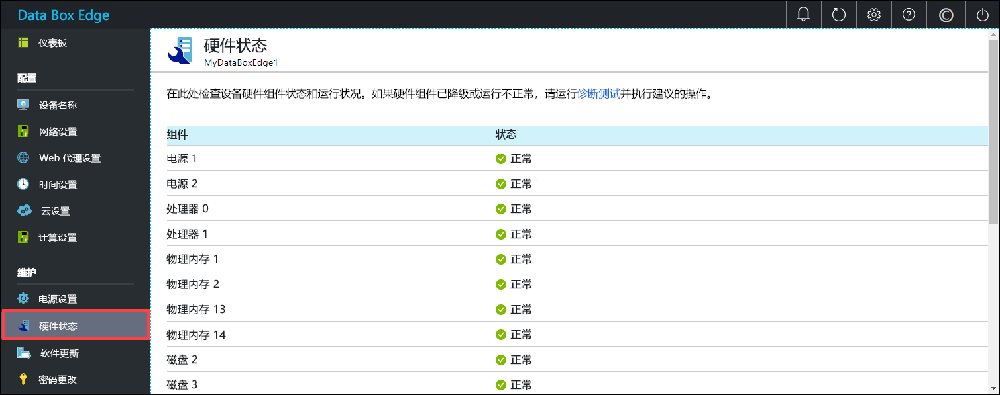

# 监视 Azure Data Box Edge

本文介绍如何监视 Azure Data Box Edge。 若要监视设备，可以使用 Azure 门户或本地 Web UI。 使用 Azure 门户查看设备事件、配置和管理警报，以及查看指标。 使用物理设备上的本地 Web UI 查看各种设备组件的硬件状态。

在本文中，学习如何：

> [!div class="checklist"]
> * 查看设备事件和相应的警报
> * 查看设备组件的硬件状态
> * 查看设备的容量和事务指标
> * 配置和管理警报

## 查看设备事件

[!INCLUDE [Supported OS for clients connected to device](../../includes/data-box-edge-gateway-view-device-events.md)]

## 查看硬件状态

在本地 Web UI 中执行以下步骤可查看设备组件的硬件状态。

1. 连接到设备的本地 Web UI。
2. 单击“维护”>“硬件状态”。 可查看各种设备组件的运行状况。

    

## 查看指标

[!INCLUDE [Supported OS for clients connected to device](../../includes/data-box-edge-gateway-view-metrics.md)]

## 管理警报

[!INCLUDE [Supported OS for clients connected to device](../../includes/data-box-edge-gateway-manage-alerts.md)]

## 后续步骤 

了解如何[管理带宽](data-box-edge-manage-bandwidth-schedules.md)。