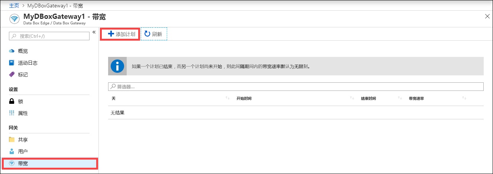
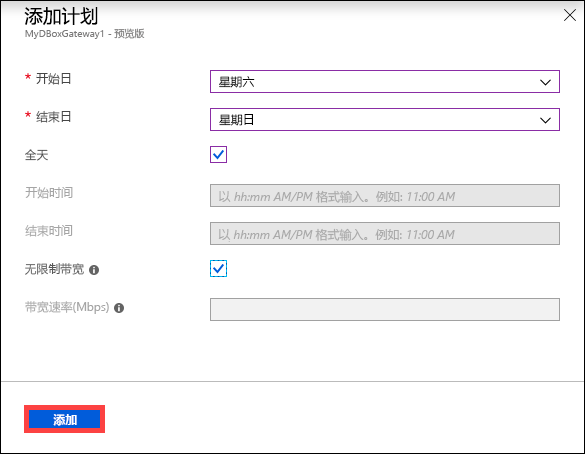
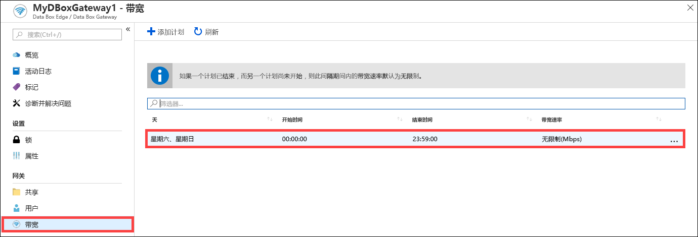
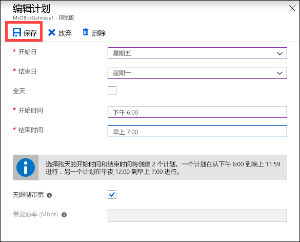
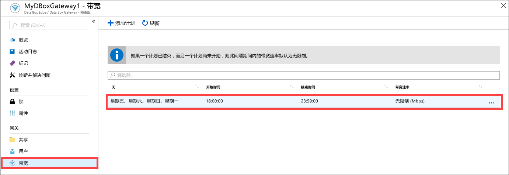
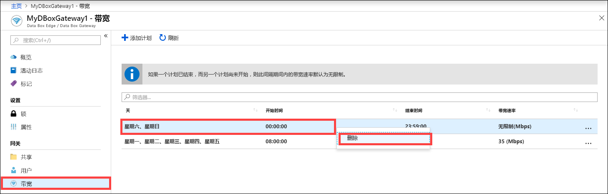

# 使用 Azure 门户管理 Azure Data Box Gateway 上的带宽计划  

本文介绍如何在 Azure Data Box Gateway 中管理用户。 使用带宽计划可以根据多个日期时间计划配置网络带宽用量。 可将这些计划应用到在设备与云之间执行的上传和下载操作。 

可以通过 Azure 门户添加、修改或删除 Data Box Gateway 的带宽计划。

在本文中，学习如何：

> [!div class="checklist"]
> * 添加计划
> * 修改计划
> * 删除计划 

## 添加计划

在 Azure 门户中执行以下步骤可以添加用户。

1. 在 Data Box Gateway 资源的 Azure 门户中，转到“带宽”。****
2. 在右窗格中，单击“+ 添加计划”****。

    

3. 在“添加计划”中：**** 

   1. 提供计划的“开始日期”、“结束日期”、“开始时间”和“结束时间”。**************** 
   2. 如果此计划全天运行，可以选中“全天”选项。**** 
   3. “带宽速率”是指设备在执行涉及到云的操作时使用的带宽，以每秒兆位数 (Mbps) 表示。**** 为此字段提供介于 1 和 1,000 之间的数字。 
   4. 如果不希望限制数据上传和下载带宽，请选中“无限制”。**** 
   5. 单击“添加”  。

      

3. 此时会使用指定的参数创建一个计划。 此计划随后会显示在门户中的带宽计划列表中。

## 编辑计划

执行以下步骤可以编辑带宽计划。 

1. 在 Azure 门户中，转到自己的 Data Box Gateway 资源，然后转到“带宽”。 
2. 在带宽计划列表中，选择并单击要修改的计划。
    

3. 进行所需的更改并保存更改。

    

4. 修改计划后，计划列表将会更新，以反映修改后的计划。

    

## 删除计划

执行以下步骤可以删除与 Data Box Gateway 设备关联的带宽计划。

1. 在 Azure 门户中，请切换到 Data Box Gateway 资源，然后再中转到 "**带宽**"。  

2. 在带宽计划列表中，选择要删除的计划。 单击右键以显示上下文菜单，然后单击“删除”。**** 

   

3.  删除计划后，计划列表将会更新。

## 后续步骤

- 了解如何[管理带宽](data-box-gateway-manage-bandwidth-schedules.md)。 
