# 使用 Azure 门户管理 Azure Data Box Gateway 上的共享 

本文介绍如何管理 Azure Data Box Gateway 上的共享。 可以通过 Azure 门户或本地 Web UI 管理 Azure Data Box Gateway。 使用 Azure 门户可以添加、删除和刷新共享，或者同步与共享相关联的存储帐户的存储密钥。

## 关于共享

若要将数据传输到 Azure，需在 Azure Data Box Gateway 上创建共享。 在 Data Box Gateway 设备上添加的共享是云共享。 这些共享中的数据会自动上传到云中。 所有云功能（例如刷新和同步存储密钥）都适用于这些共享。 想要将设备数据自动推送到云中的存储帐户时，请使用云共享。

在本文中，学习如何：

> [!div class="checklist"]
> * 添加共享
> * 删除共享
> * 刷新共享
> * 同步存储密钥

## 添加共享

在 Azure 门户中执行以下步骤，以创建共享。

1. 在 Azure 门户中，转到自己的 Data Box Gateway 资源，然后导航到“概述”。**** 单击命令栏上的“+ 添加共享”****。
2. 在“添加共享”中指定共享设置。**** 提供共享的唯一名称。 

    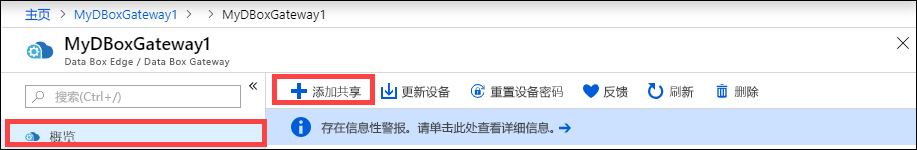

    共享名称只能包含数字、小写字母和连字符。 共享名称必须为 3 到 63 个字符长，并且必须以字母或数字开头。 每个连字符的前后必须为非连字符字符。

3. 选择共享的**类型**。 类型可以是“SMB”或“NFS”，默认为“SMB”。******** SMB 是 Windows 客户端的标准，NFS 用于 Linux 客户端。 根据你选择 SMB 共享还是 NFS 共享，显示的选项略有不同。

4. 提供共享所在的**存储帐户**。 如果还没有容器，则使用共享名称在存储帐户中创建一个容器。 如果该容器已存在，则使用现有容器。  

5. 从块 Blob、页 Blob 或文件中选择“存储服务”。**** 所选服务的类型取决于数据需要以何种格式驻留在 Azure 中。 例如，在此实例中，我们希望数据以 Blob 块的形式驻留在 Azure 中，因此选择“块 Blob”。**** 如果选择“页 Blob”，必须确保数据按 512 字节对齐。**** 例如，VHDX 始终按 512 字节对齐。

   > [!IMPORTANT]
   > 如果你使用的 Azure 存储帐户与 Azure Stack 边缘或 Data Box Gateway 设备一起使用，请确保该帐户不会对其设置永久性策略。 有关详细信息，请参阅[设置和管理 blob 存储的不可变性策略](https://docs.microsoft.com/azure/storage/blobs/storage-blob-immutability-policies-manage)。

6. 此步骤取决于你是创建 SMB 共享还是 NFS 共享。
    - **如果创建 SMB 共享** - 在“所有特权本地用户”字段中，选择“新建”或“使用现有”。************ 如果创建新的本地用户，请提供**用户名**、**密码**和确认密码。 这样就会为本地用户分配权限。 在此处分配权限以后，即可使用文件资源管理器修改这些权限。

        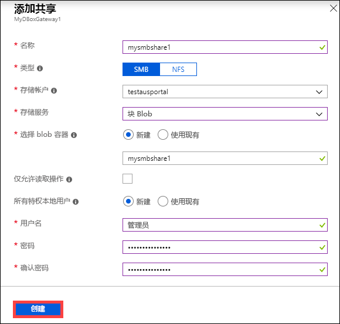

        如果针对此共享数据勾选“仅允许读取操作”，则可以指定只读用户。
    - **如果创建 NFS 共享** - 需要提供能够访问共享的**受允许客户端的 IP 地址**。

        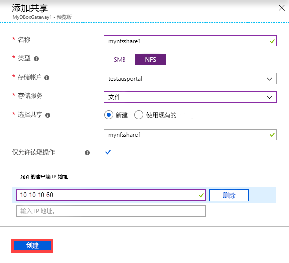

7. 单击“创建”**** 以创建共享。 将通知你“正在创建共享”。 使用指定的设置创建共享后，“共享”**** 边栏选项卡会更新以反映新共享。
 
## 删除共享

在 Azure 门户中执行以下步骤，以删除共享。

1. 在共享列表中，选择并单击要删除的共享。

    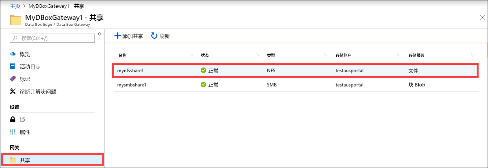

2. 单击 **“删除”** 。 

    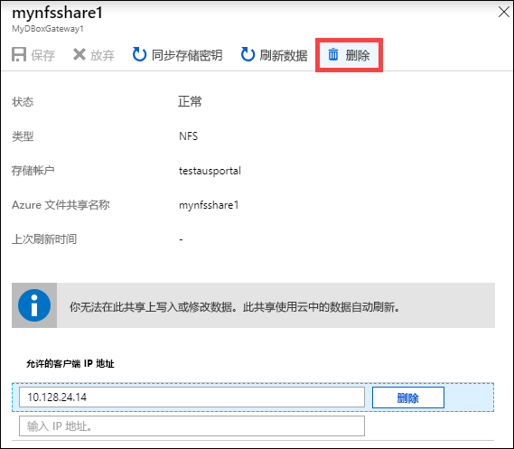

3. 当系统提示你进行确认时，单击 **“是”**。

    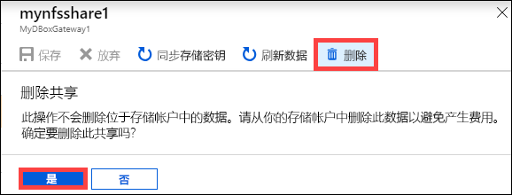

共享列表将会更新，以反映删除操作。

## 刷新共享

使用刷新功能可以刷新本地共享的内容。 刷新共享时，将启动搜索，以查找自上次刷新以来添加到云中的所有 Azure 对象，包括 Blob 和文件。 然后，这些附加的文件将用于刷新设备上本地共享的内容。 

> [!NOTE]
> 权限和访问控制列表 (ACL) 不会通过刷新操作保存。 

在 Azure 门户中执行以下步骤，以刷新共享。

1.   在 Azure 门户中转到“共享”。**** 选择并单击要刷新的共享。

    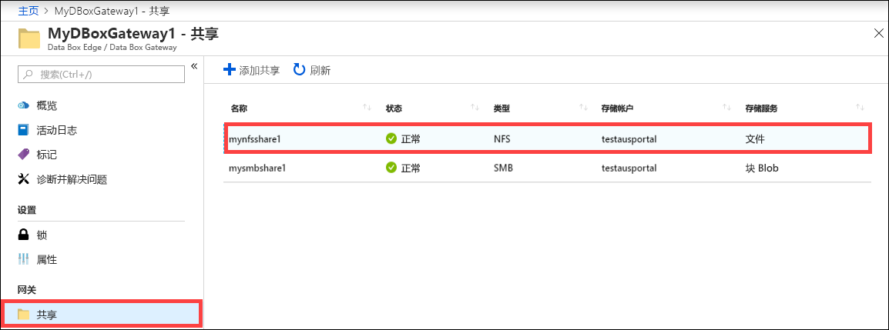

2.   单击“刷新”。**** 

    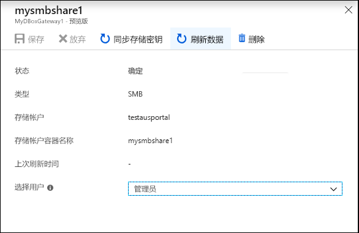
 
3.   当系统提示你进行确认时，单击 **“是”**。 此时会启动一个作业来刷新本地共享的内容。 

    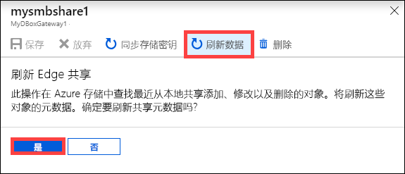
 
4.   刷新正在进行时，上下文菜单中的刷新选项会灰显。 单击作业通知以查看刷新作业的状态。

5.   刷新所需的时间取决于 Azure 容器中的文件数以及设备上的文件数。 成功完成刷新后，共享时间戳将会更新。 即使刷新已部分失败，刷新操作也被视为成功，并时间戳会更新。 

    
 
失败时会引发警报。 警报中详细描述了原因，以及问题的建议解决方法。 警报中还会提供某个文件的链接，该文件包含失败的完整摘要，其中指出了无法更新或删除哪些文件。

>[!IMPORTANT]
> 在此版本中，不要一次刷新多个共享。

## 同步存储密钥

如果已轮换存储帐户密钥，则需要同步存储访问密钥。 同步可帮助设备获取存储帐户的最新密钥。

在 Azure 门户中执行以下步骤，以同步存储访问密钥。

1. 在资源中转到“概述”。**** 
2. 在共享列表中，选择并单击与需要同步的存储帐户关联的共享。单击 "**同步存储密钥**"。 

     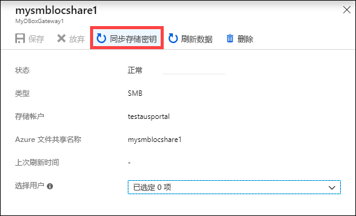

3. 当系统提示确认时，单击“是”****。 同步完成后，请退出对话框。

     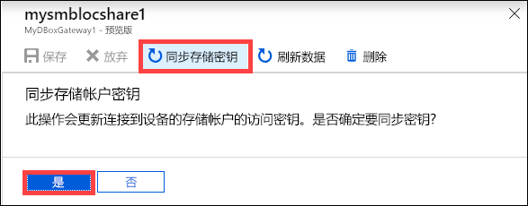

>[!NOTE]
> 只需针对给定的存储帐户执行此操作一次。 对于与同一存储帐户关联的所有共享，无需重复此操作。

## 后续步骤

- 了解如何[通过 Azure 门户管理用户](data-box-gateway-manage-users.md)。
